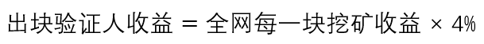
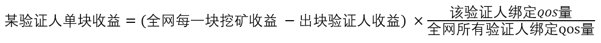

# QOS公链经济模型

QOS公链是基于[授权股权证明Delegated Proof-of-Stake](https://multicoin.capital/wp-content/uploads/2018/03/DPoS_-Features-and-Tradeoffs.pdf)和[拜占庭容错共识算法](https://en.wikipedia.org/wiki/Byzantine_fault_tolerance)的双层链机制的区块链基础设施。


## QOS公链节点的构成

### 轻节点客户端（light-client）

*未来的版本支持*

QOS轻节点可以执行QOScli支持的交易，不需要全部账本，仅验证少量头部信息及交易，需要较小资源，用于普通用户/手机客户端。

### 全节点（full-node）

和其他区块链网络相同，QOS公链全节点指包含全部账本的QOS节点。

QOS公链验证人，必须是QOS公链的全节点，但全节点需要发出[创建验证人交易](all_about_validators.md#create-validator)，并符合[一定条件](all_about_validators.md#如何成为QOS验证人)，才能成为验证人。

### 验证人（Validator）

QOS公链中有一个验证人节点的集合，验证人节点担当了BFT共识算法的具体实现——网络中的每一块都需要收集至少2/3的验证人节点签名。QOS公链中的每一块包含零到多条交易，验证人节点对块中的交易进行校验，对校验通过的块用自己的私钥签名，并广播到网络中去。

QOS公链验证人节点通过绑定一定的QOS，同时承担了DPOS算法的实现——依照其绑定的QOS数量，获得QOS网络挖矿的收益。详见[QOS公链挖矿机制](#QOS公链挖矿机制)

希望了解更多验证人节点的信息或希望成为QOS验证人，请查阅[验证人节点详解](all_about_validators.md)

### 委托人（Delegator）

对于自己没有能力或者意愿来自己运行一个验证节点，但希望得到挖矿收益的QOS持有者，可以选择一个验证人，通过委托（delegation）将QOS投入到该验证人的总绑定数中，增加验证人的投票权重，收到相应的挖矿收益作为回报。
关于委托收益的计算，详见[QOS公链代理机制](#QOS公链代理机制)

委托人可以不运行QOS全节点，通过轻节点来进行委托操作。

委托人分享验证人的收益，意味着他们也分担验证人的责任和义务。当验证人因宕机/作恶而受到惩罚，其委托人也会受到相应的惩罚。

在社区自治（待实现功能）中，委托人和验证人拥有同等的投票权。

因此即使没有运行全节点，占网络最大数量的委托人依然担任着主动且重要的角色，即他们要选择可信、稳定的验证人，来增加这些验证人的投票权重，并关注验证人的动向，以维护网络的安全和稳定。

## QOS公链挖矿机制

根据[白皮书](https://github.com/QOSGroup/whitepaper)，QOS公链的挖矿数额是按年度固定的，在主网上线的第一年内，每产生一个区块产生的QOS数量大体相同。

主网通胀计划：

时间|第一个四年|第二个四年|第三个四年|第四个四年|第五个四年|第六个四年|第七个四年
:--:|:--:|:--:|:--:|:--:|:--:|:--:|:--:
新铸币数量（亿）|25.5|12.75|6.375|3.1875|1.59375|0.796875|0.796875

我们将其中每个四年定义为一个inflation_phrase通胀阶段，由endtime和total_amount组成，applied_amount标识本阶段已经分发的QOS，一个阶段结束，即进入下一阶段。
测试网通胀依照测试目的另外制定，详情可见[测试网的genesis.json文件配置](https://github.com/QOSGroup/qos-testnets)中的"mint"-"params"-"inflation_phrases"，例如：

```
        "inflation_phrases": [
          {
            "endtime": "2023-01-01T00:00:00Z",
            "total_amount": "2500000000000",
            "applied_amount": "0"
          },
          {
            "endtime": "2027-01-01T00:00:00Z",
            "total_amount": "12750000000000",
            "applied_amount": "0"
          },
          {
            "endtime": "2031-01-01T00:00:00Z",
            "total_amount": "6375000000000",
            "applied_amount": "0"
          },
          {
            "endtime": "2035-01-01T00:00:00Z",
            "total_amount": "3185000000000",
            "applied_amount": "0"
          }
        ]
```

在后续版本中，可以通过社区投票来制定通胀策略，修改通胀计划。

每一块通胀的QOS数：


每一块都有一个验证人来进行打块（proposer），该验证人会有4%的额外收益：



验证人打块的机会是与其绑定QOS数成正比的，因此打块的额外收益不会改变每个验证人在网络中的投票权重。

## QOS公链代理机制

验证人所绑定的QOS由两部分组成：验证人自己绑定的（self-bond），委托人委托给验证人的(delegation-bond)

**验证人总绑定(投票权重)=验证人自绑定QOS数量 + ∑委托人委托给该验证人QOS数量**

QOS网络中的验证人可以依据其绑定的QOS数量占网络中总的绑定QOS的比例获得挖矿收益，每次验证一个块，都可从该块的通胀中依照所持有分得挖矿收益。



对于委托人，其委托的QOS可以从验证人的总收入中获得相应比例的收益。由于验证人付出了人力和物力，委托人的收益中会有一定比例的佣金，在genesis中以$validator_commission_rate定义


在社区自治投票中（待实现），委托人的QOS和验证人由同样的权益，每一个QOS都有相同的投票权重。但当委托人放弃投票时，验证人的投票意见将包含其委托的QOS权重。

