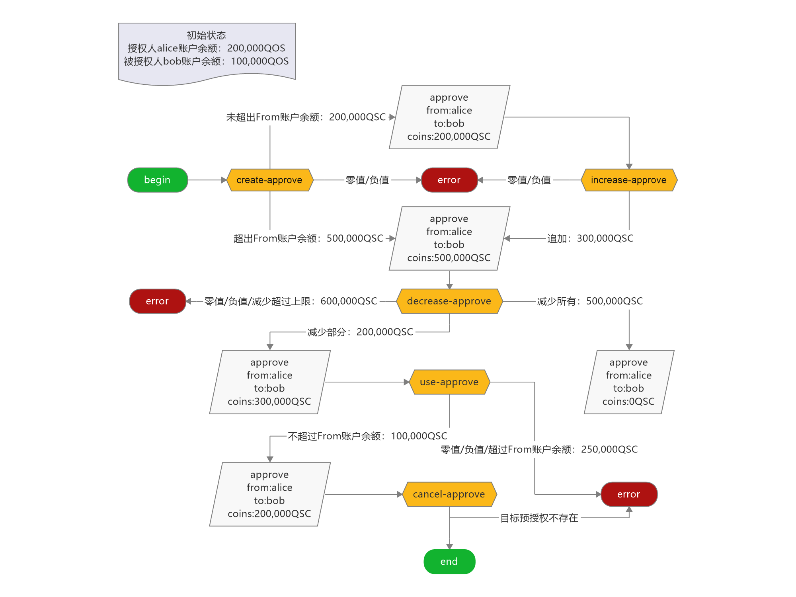

# qoscli approve 模块测试

## 测试准备

> 无

## 测试内容

#### 涉及到的写入命令 

| Command                      | Alias | Has-Subcommand | Description |
|:-----------------------------|:------|:---------------|:------------|
| `qoscli tx create-approve`   | -     | ✖              | 创建预授权       |
| `qoscli tx increase-approve` | -     | ✖              | 增加预授权       |
| `qoscli tx decrease-approve` | -     | ✖              | 减少预授权       |
| `qoscli tx use-approve`      | -     | ✖              | 使用预授权       |
| `qoscli tx cancel-approve`   | -     | ✖              | 取消预授权       |


#### 涉及到的查询命令 

| Command                | Alias              | Has-Subcommand | Description                    |
|:-----------------------|:-------------------|:---------------|:-------------------------------|
| `qoscli query approve` | `qoscli q approve` | ✖              | 按来源(from)和目标(to)查询预授权(approve) |
| `qoscli query account` | `qoscli q account` | ✖              | 按地址(address)或名称(name)查询帐户信息    |

#### 测试路径图



#### 测试路径

> 初始状态
> - 授权人`alice`账户余额：200,000QOS 
> - 被授权人`bob`账户余额：100,000QOS

1. 创建预授权: 授权人`alice`, 被授权人`bob`
   1. 创建的预授权: -200,000QSC (负数)
   2. 创建的预授权: 0QSC (零值)
   3. 创建的预授权: 200,000QSC (未超出授权人`alice`账户余额)
   4. 创建的预授权: 500,000QSC (超出授权人`alice`账户余额)

2. 增加预授权: 授权人`alice`, 被授权人`bob` 
   1. 增加的预授权: -100,000QSC (负数)
   2. 增加的预授权: 0QSC (零值)
   3. 增加的预授权: 100,000QSC (增加后, 预授权为200,000QSC,
      未超出授权人`alice`账户余额)
   4. 增加的预授权: 400,000QSC (增加后, 预授权为500,000QSC,
      超出授权人`alice`账户余额)

3. 减少预授权: 授权人`alice`, 被授权人`bob` 
   1. 减少的预授权: -100,000QSC (负数)
   2. 减少的预授权: 0QSC (零值)
   3. 减少的预授权: 100,000QSC (减少后, 预授权为400,000QSC,
      仍超出授权人`alice`账户余额)
   4. 减少的预授权: 400,000QSC (减少后, 预授权为100,000QSC,
      未超出授权人`alice`账户余额)
   5. 减少的预授权: 500,000QSC (减少后, 预授权为0QSC, 零值)
   6. 减少的预授权: 600,000QSC (减少后, 预授权为-100,000QSC, 负值)

4. 使用预授权: 授权人`alice`, 被授权人`bob`
   1. 使用的预授权: -100,000QSC (负数)
   2. 使用的预授权: 0QSC (零值)
   3. 使用的预授权: 100,000QSC (使用量未超出授权人`alice`账户余额, 使用后,
      剩余预授权为200,000QSC)
   4. 使用的预授权: 250,000QSC (使用量超出授权人`alice`账户余额, 使用后,
      剩余预授权为50,000QSC)
      
5. 取消预授权: 授权人`alice`, 被授权人`bob`
   1. 目标预授权存在(第一次调用)
   2. 目标预授权不存在(第二次调用)

## 测试过程

1. 创建预授权: 授权人`alice`, 被授权人`bob`
   1. 创建的预授权: -200,000QSC (负数)
      ```bash
      $ ./qoscli tx create-approve --from alice --to bob --coins -200000QOS --indent
        null
        ERROR: coins str: -200000QOS parse faild
      ```
   2. 创建的预授权: 0QSC (零值)
      ```bash
      $ ./qoscli tx create-approve --from alice --to bob --coins 0QOS --indent
        Password to sign with 'alice':<输入密码>
        {
          "check_tx": {
            "code": 1,
            "log": "{\"codespace\":\"sdk\",\"code\":1,\"message\":\"TxStd's ITx ValidateData error:  ERROR:\\nCodespace: approve\\nCode: 101\\nMessage: \\\"From、To is nil or coins is not positive\\\"\\n\"}",
            "gasWanted": "100000"
          },
          "deliver_tx": {},
          "hash": "AEBCCB231A6D3753EE18557E3854A94DE0D4F2CDC891067767D8641F6256FD6F",
          "height": "0"
        }
        ERROR: {"codespace":"sdk","code":1,"message":"TxStd's ITx ValidateData error:  ERROR:\nCodespace: approve\nCode: 101\nMessage: \"From、To is nil or coins is not positive\"\n"}
      ```
   3. 创建的预授权: 200,000QSC (未超出授权人`alice`账户余额)
      ```bash
      $ ./qoscli tx create-approve --from alice --to bob --coins 200000QOS --indent
        Password to sign with 'alice':<输入密码>
        {
          "check_tx": {
            "gasWanted": "100000",
            "gasUsed": "6418"
          },
          "deliver_tx": {
            "gasWanted": "100000",
            "gasUsed": "12310",
            "tags": [
              {
                "key": "YWN0aW9u",
                "value": "Y3JlYXRlLWFwcHJvdmU="
              },
              {
                "key": "YXBwcm92ZS1mcm9t",
                "value": "YWRkcmVzczE2cWd2YXVjMDBkOXl4NThqd3hzenk4NHBqZHZ5NnRuZHlqbWQ3cA=="
              },
              {
                "key": "YXBwcm92ZS10bw==",
                "value": "YWRkcmVzczFyOXd2MDg4YXlrdXcyanhobno3dHc3ZnJmZnAzcTVoaDcwbTVlYQ=="
              }
            ]
          },
          "hash": "E4BF9FA1423E6C06ED9A4CEA057A5302DA8330D63D6939FAA29DFA00CFFF035B",
          "height": "326"
        }
      ```
      创建的预授权如下:
      ```bash
      $ ./qoscli query approve --from alice --to bob --indent
        {
          "from": "address16qgvauc00d9yx58jwxszy84pjdvy6tndyjmd7p",
          "to": "address1r9wv088aykuw2jxhnz7tw7frffp3q5hh70m5ea",
          "qos": "200000",
          "qscs": null
        }
      ```
      此时授权人`alice`和被授权人`bob`的账户情况如下:
      ```bash
      $ ./qoscli query account alice --indent
        {
          "type": "qos/types/QOSAccount",
          "value": {
            "base_account": {
              "account_address": "address16qgvauc00d9yx58jwxszy84pjdvy6tndyjmd7p",
              "public_key": {
                "type": "tendermint/PubKeyEd25519",
                "value": "6wSAlScsvJpUqN7jRCjH9EeTsTgkGt+w99PnU06YHpU="
              },
              "nonce": "2"
            },
            "qos": "198000",
            "qscs": null
          }
        }
        
        $ ./qoscli query account bob --indent
        {
          "type": "qos/types/QOSAccount",
          "value": {
            "base_account": {
              "account_address": "address1r9wv088aykuw2jxhnz7tw7frffp3q5hh70m5ea",
              "public_key": null,
              "nonce": "0"
            },
            "qos": "100000",
            "qscs": null
          }
        }
      ```
   4. 创建的预授权: 500,000QSC (超出授权人`alice`账户余额)
      ```bash
      $ ./qoscli tx create-approve --from alice --to bob --coins 500000QOS --indent
        Password to sign with 'alice':<输入密码>
        {
          "check_tx": {
            "gasWanted": "100000",
            "gasUsed": "6541"
          },
          "deliver_tx": {
            "gasWanted": "100000",
            "gasUsed": "12440",
            "tags": [
              {
                "key": "YWN0aW9u",
                "value": "Y3JlYXRlLWFwcHJvdmU="
              },
              {
                "key": "YXBwcm92ZS1mcm9t",
                "value": "YWRkcmVzczE2cWd2YXVjMDBkOXl4NThqd3hzenk4NHBqZHZ5NnRuZHlqbWQ3cA=="
              },
              {
                "key": "YXBwcm92ZS10bw==",
                "value": "YWRkcmVzczFyOXd2MDg4YXlrdXcyanhobno3dHc3ZnJmZnAzcTVoaDcwbTVlYQ=="
              }
            ]
          },
          "hash": "8F3E2F16A0994BB142F2FBF0C8A6A290380E60A2B6660369DAA3F1F7C4527326",
          "height": "438"
        }
      ```
      创建的预授权如下:
      ```bash
      $ ./qoscli query approve --from alice --to bob --indent
        {
          "from": "address16qgvauc00d9yx58jwxszy84pjdvy6tndyjmd7p",
          "to": "address1r9wv088aykuw2jxhnz7tw7frffp3q5hh70m5ea",
          "qos": "500000",
          "qscs": null
        }
      ```
      此时授权人`alice`和被授权人`bob`的账户情况如下:
      ```bash
      $ ./qoscli query account alice --indent
        {
          "type": "qos/types/QOSAccount",
          "value": {
            "base_account": {
              "account_address": "address16qgvauc00d9yx58jwxszy84pjdvy6tndyjmd7p",
              "public_key": {
                "type": "tendermint/PubKeyEd25519",
                "value": "6wSAlScsvJpUqN7jRCjH9EeTsTgkGt+w99PnU06YHpU="
              },
              "nonce": "3"
            },
            "qos": "196756",
            "qscs": null
          }
        }

        $ ./qoscli query account bob --indent
        {
          "type": "qos/types/QOSAccount",
          "value": {
            "base_account": {
              "account_address": "address1r9wv088aykuw2jxhnz7tw7frffp3q5hh70m5ea",
              "public_key": null,
              "nonce": "0"
            },
            "qos": "100000",
            "qscs": null
          }
        }
      ```

2. 增加预授权: 授权人`alice`, 被授权人`bob` 
    > 已存在的预授权:
    > ```bash
    > $ ./qoscli query approve --from alice --to bob --indent
    > {
    >   "from": "address16qgvauc00d9yx58jwxszy84pjdvy6tndyjmd7p",
    >   "to": "address1r9wv088aykuw2jxhnz7tw7frffp3q5hh70m5ea",
    >   "qos": "100000",
    >   "qscs": null
    > }
    > ```
   1. 增加的预授权: -100,000QSC (负数)
      ```bash
      $ ./qoscli tx increase-approve --from alice --to bob --coins -100000QOS --indent
        null
        ERROR: coins str: -100000QOS parse faild
      ```
   2. 增加的预授权: 0QSC (零值)
      ```bash
      $ ./qoscli tx increase-approve --from alice --to bob --coins 0QOS --indent
        Password to sign with 'alice':<输入密码>
        {
          "check_tx": {
            "code": 1,
            "log": "{\"codespace\":\"sdk\",\"code\":1,\"message\":\"TxStd's ITx ValidateData error:  ERROR:\\nCodespace: approve\\nCode: 101\\nMessage: \\\"From、To is nil or coins is not positive\\\"\\n\"}",
            "gasWanted": "100000"
          },
          "deliver_tx": {},
          "hash": "09CBA560758606BFC259D2119622ADA15E4ADFBE684F585A74B1B72ADA3A918A",
          "height": "0"
        }
        ERROR: {"codespace":"sdk","code":1,"message":"TxStd's ITx ValidateData error:  ERROR:\nCodespace: approve\nCode: 101\nMessage: \"From、To is nil or coins is not positive\"\n"}
      ```
   3. 增加的预授权: 100,000QSC (增加后, 预授权为200,000QSC,
      未超出授权人`alice`账户余额)
      ```bash
      $ ./qoscli tx increase-approve --from alice --to bob --coins 100000QOS --indent
        Password to sign with 'alice':<输入密码>
        {
          "check_tx": {
            "gasWanted": "100000",
            "gasUsed": "6697"
          },
          "deliver_tx": {
            "gasWanted": "100000",
            "gasUsed": "11410",
            "tags": [
              {
                "key": "YWN0aW9u",
                "value": "aW5jcmVhc2UtYXBwcm92ZQ=="
              },
              {
                "key": "YXBwcm92ZS1mcm9t",
                "value": "YWRkcmVzczE2cWd2YXVjMDBkOXl4NThqd3hzenk4NHBqZHZ5NnRuZHlqbWQ3cA=="
              },
              {
                "key": "YXBwcm92ZS10bw==",
                "value": "YWRkcmVzczFyOXd2MDg4YXlrdXcyanhobno3dHc3ZnJmZnAzcTVoaDcwbTVlYQ=="
              }
            ]
          },
          "hash": "8C4963577853710BB8A25AB42340CF4083F6308EA732BEFB0009C0540BA44A7A",
          "height": "637"
        }
      ```
      此时的预授权如下:
      ```bash
      $ ./qoscli query approve --from alice --to bob --indent
        {
          "from": "address16qgvauc00d9yx58jwxszy84pjdvy6tndyjmd7p",
          "to": "address1r9wv088aykuw2jxhnz7tw7frffp3q5hh70m5ea",
          "qos": "200000",
          "qscs": null
        }
      ```
      此时授权人`alice`和被授权人`bob`的账户情况如下:
      ```bash
      $ ./qoscli query account alice --indent
        {
          "type": "qos/types/QOSAccount",
          "value": {
            "base_account": {
              "account_address": "address16qgvauc00d9yx58jwxszy84pjdvy6tndyjmd7p",
              "public_key": {
                "type": "tendermint/PubKeyEd25519",
                "value": "6wSAlScsvJpUqN7jRCjH9EeTsTgkGt+w99PnU06YHpU="
              },
              "nonce": "6"
            },
            "qos": "193602",
            "qscs": null
          }
        }


        $ ./qoscli query account bob --indent
        {
          "type": "qos/types/QOSAccount",
          "value": {
            "base_account": {
              "account_address": "address1r9wv088aykuw2jxhnz7tw7frffp3q5hh70m5ea",
              "public_key": null,
              "nonce": "0"
            },
            "qos": "100000",
            "qscs": null
          }
        }
      ```
   4. 增加的预授权: 400,000QSC (增加后, 预授权为500,000QSC,
      超出授权人`alice`账户余额)
      ```bash
      $ ./qoscli tx increase-approve --from alice --to bob --coins 400000QOS --indent
        Password to sign with 'alice':<输入密码>
        {
          "check_tx": {
            "gasWanted": "100000",
            "gasUsed": "6697"
          },
          "deliver_tx": {
            "gasWanted": "100000",
            "gasUsed": "11410",
            "tags": [
              {
                "key": "YWN0aW9u",
                "value": "aW5jcmVhc2UtYXBwcm92ZQ=="
              },
              {
                "key": "YXBwcm92ZS1mcm9t",
                "value": "YWRkcmVzczE2cWd2YXVjMDBkOXl4NThqd3hzenk4NHBqZHZ5NnRuZHlqbWQ3cA=="
              },
              {
                "key": "YXBwcm92ZS10bw==",
                "value": "YWRkcmVzczFyOXd2MDg4YXlrdXcyanhobno3dHc3ZnJmZnAzcTVoaDcwbTVlYQ=="
              }
            ]
          },
          "hash": "AA897A157F1D7E0C50826C8424FE8C3BAC98E1613FD3C088D304C3C086143BEE",
          "height": "672"
        }
      ```
      此时的预授权如下:
      ```bash
      $ ./qoscli query approve --from alice --to bob --indent
        {
          "from": "address16qgvauc00d9yx58jwxszy84pjdvy6tndyjmd7p",
          "to": "address1r9wv088aykuw2jxhnz7tw7frffp3q5hh70m5ea",
          "qos": "500000",
          "qscs": null
        }
      ```
      此时授权人`alice`和被授权人`bob`的账户情况如下:
      ```bash
      $ ./qoscli query account alice --indent
        {
          "type": "qos/types/QOSAccount",
          "value": {
            "base_account": {
              "account_address": "address16qgvauc00d9yx58jwxszy84pjdvy6tndyjmd7p",
              "public_key": {
                "type": "tendermint/PubKeyEd25519",
                "value": "6wSAlScsvJpUqN7jRCjH9EeTsTgkGt+w99PnU06YHpU="
              },
              "nonce": "7"
            },
            "qos": "192461",
            "qscs": null
          }
        }

        $ ./qoscli query account bob --indent
        {
          "type": "qos/types/QOSAccount",
          "value": {
            "base_account": {
              "account_address": "address1r9wv088aykuw2jxhnz7tw7frffp3q5hh70m5ea",
              "public_key": null,
              "nonce": "0"
            },
            "qos": "100000",
            "qscs": null
          }
        }
      ```

3. 减少预授权: 授权人`alice`, 被授权人`bob` 
    > 已存在的预授权:
    > ```bash
    > $ ./qoscli query approve --from alice --to bob --indent
    > {
    >   "from": "address16qgvauc00d9yx58jwxszy84pjdvy6tndyjmd7p",
    >   "to": "address1r9wv088aykuw2jxhnz7tw7frffp3q5hh70m5ea",
    >   "qos": "500000",
    >   "qscs": null
    > }
    > ```
   1. 减少的预授权: -100,000QSC (负数)
      ```bash
      $ ./qoscli tx decrease-approve --from alice --to bob --coins -100000QOS --indent
        null
        ERROR: coins str: -100000QOS parse faild
      ```
   2. 减少的预授权: 0QSC (零值)
      ```bash
      $ ./qoscli tx decrease-approve --from alice --to bob --coins 0QOS --indent
        Password to sign with 'alice':<输入密码>
        {
          "check_tx": {
            "code": 1,
            "log": "{\"codespace\":\"sdk\",\"code\":1,\"message\":\"TxStd's ITx ValidateData error:  ERROR:\\nCodespace: approve\\nCode: 101\\nMessage: \\\"From、To is nil or coins is not positive\\\"\\n\"}",
            "gasWanted": "100000"
          },
          "deliver_tx": {},
          "hash": "1FAFF556B6AC690B1871F0EF1F825104661C531D12A9BE27AB4DE3DC62D8CD13",
          "height": "0"
        }
        ERROR: {"codespace":"sdk","code":1,"message":"TxStd's ITx ValidateData error:  ERROR:\nCodespace: approve\nCode: 101\nMessage: \"From、To is nil or coins is not positive\"\n"}
      ```
   3. 减少的预授权: 100,000QSC (减少后, 预授权为400,000QSC,
      仍超出授权人`alice`账户余额)
      ```bash
      $ ./qoscli tx decrease-approve --from alice --to bob --coins 100000QOS --indent
        Password to sign with 'alice':<输入密码>
        {
          "check_tx": {
            "gasWanted": "100000",
            "gasUsed": "6697"
          },
          "deliver_tx": {
            "gasWanted": "100000",
            "gasUsed": "11410",
            "tags": [
              {
                "key": "YWN0aW9u",
                "value": "ZGVjcmVhc2UtYXBwcm92ZQ=="
              },
              {
                "key": "YXBwcm92ZS1mcm9t",
                "value": "YWRkcmVzczE2cWd2YXVjMDBkOXl4NThqd3hzenk4NHBqZHZ5NnRuZHlqbWQ3cA=="
              },
              {
                "key": "YXBwcm92ZS10bw==",
                "value": "YWRkcmVzczFyOXd2MDg4YXlrdXcyanhobno3dHc3ZnJmZnAzcTVoaDcwbTVlYQ=="
              }
            ]
          },
          "hash": "6AEEB9EECFA8BE3A7826CBA25B00836C06EA245CE65FB92CDCADBA81C7E83A33",
          "height": "1087"
        }
      ```
      此时的预授权如下:
      ```bash
      $ ./qoscli query approve --from alice --to bob --indent
        {
          "from": "address16qgvauc00d9yx58jwxszy84pjdvy6tndyjmd7p",
          "to": "address1r9wv088aykuw2jxhnz7tw7frffp3q5hh70m5ea",
          "qos": "400000",
          "qscs": null
        }
      ```
      此时授权人`alice`和被授权人`bob`的账户情况如下:
      ```bash
      $ ./qoscli query account alice --indent
        {
          "type": "qos/types/QOSAccount",
          "value": {
            "base_account": {
              "account_address": "address16qgvauc00d9yx58jwxszy84pjdvy6tndyjmd7p",
              "public_key": {
                "type": "tendermint/PubKeyEd25519",
                "value": "6wSAlScsvJpUqN7jRCjH9EeTsTgkGt+w99PnU06YHpU="
              },
              "nonce": "8"
            },
            "qos": "191320",
            "qscs": null
          }
        }

        $ ./qoscli query account bob --indent
        {
          "type": "qos/types/QOSAccount",
          "value": {
            "base_account": {
              "account_address": "address1r9wv088aykuw2jxhnz7tw7frffp3q5hh70m5ea",
              "public_key": null,
              "nonce": "0"
            },
            "qos": "100000",
            "qscs": null
          }
        }
      ```
   4. 减少的预授权: 400,000QSC (减少后, 预授权为100,000QSC,
      未超出授权人`alice`账户余额)
      ```bash
      $ ./qoscli tx decrease-approve --from alice --to bob --coins 400000QOS --indent
        Password to sign with 'alice':<输入密码>
        {
          "check_tx": {
            "gasWanted": "100000",
            "gasUsed": "6697"
          },
          "deliver_tx": {
            "gasWanted": "100000",
            "gasUsed": "11410",
            "tags": [
              {
                "key": "YWN0aW9u",
                "value": "ZGVjcmVhc2UtYXBwcm92ZQ=="
              },
              {
                "key": "YXBwcm92ZS1mcm9t",
                "value": "YWRkcmVzczE2cWd2YXVjMDBkOXl4NThqd3hzenk4NHBqZHZ5NnRuZHlqbWQ3cA=="
              },
              {
                "key": "YXBwcm92ZS10bw==",
                "value": "YWRkcmVzczFyOXd2MDg4YXlrdXcyanhobno3dHc3ZnJmZnAzcTVoaDcwbTVlYQ=="
              }
            ]
          },
          "hash": "6EBE6AE79F58E8A490CF4F7CAD1DA4263F23C79E986092908E627023271A2E3D",
          "height": "1125"
        }
      ```
      此时的预授权如下:
      ```bash
      $ ./qoscli query approve --from alice --to bob --indent
        {
          "from": "address16qgvauc00d9yx58jwxszy84pjdvy6tndyjmd7p",
          "to": "address1r9wv088aykuw2jxhnz7tw7frffp3q5hh70m5ea",
          "qos": "100000",
          "qscs": null
        }
      ```
      此时授权人`alice`和被授权人`bob`的账户情况如下:
      ```bash
      $ ./qoscli query account alice --indent
        {
          "type": "qos/types/QOSAccount",
          "value": {
            "base_account": {
              "account_address": "address16qgvauc00d9yx58jwxszy84pjdvy6tndyjmd7p",
              "public_key": {
                "type": "tendermint/PubKeyEd25519",
                "value": "6wSAlScsvJpUqN7jRCjH9EeTsTgkGt+w99PnU06YHpU="
              },
              "nonce": "9"
            },
            "qos": "190179",
            "qscs": null
          }
        }

        $ ./qoscli query account bob --indent
        {
          "type": "qos/types/QOSAccount",
          "value": {
            "base_account": {
              "account_address": "address1r9wv088aykuw2jxhnz7tw7frffp3q5hh70m5ea",
              "public_key": null,
              "nonce": "0"
            },
            "qos": "100000",
            "qscs": null
          }
        }
      ```
   5. 减少的预授权: 500,000QSC (减少后, 预授权为0QSC, 零值)
         ```bash
         $ ./qoscli tx decrease-approve --from alice --to bob --coins 500000QOS --indent
           Password to sign with 'alice':<输入密码>
            {
              "check_tx": {
                "gasWanted": "100000",
                "gasUsed": "6697"
              },
              "deliver_tx": {
                "gasWanted": "100000",
                "gasUsed": "11260",
                "tags": [
                  {
                    "key": "YWN0aW9u",
                    "value": "ZGVjcmVhc2UtYXBwcm92ZQ=="
                  },
                  {
                    "key": "YXBwcm92ZS1mcm9t",
                    "value": "YWRkcmVzczE2cWd2YXVjMDBkOXl4NThqd3hzenk4NHBqZHZ5NnRuZHlqbWQ3cA=="
                  },
                  {
                    "key": "YXBwcm92ZS10bw==",
                    "value": "YWRkcmVzczFyOXd2MDg4YXlrdXcyanhobno3dHc3ZnJmZnAzcTVoaDcwbTVlYQ=="
                  }
                ]
              },
              "hash": "6D1C522F9163544217CA21B615CBD1A904A70640328034B68930A62C4422CC22",
              "height": "1190"
            }
         ```
         此时的预授权如下:
         ```bash
         $ ./qoscli query approve --from alice --to bob --indent
           {
             "from": "address16qgvauc00d9yx58jwxszy84pjdvy6tndyjmd7p",
             "to": "address1r9wv088aykuw2jxhnz7tw7frffp3q5hh70m5ea",
             "qos": "0",
             "qscs": null
           }
         ```
         此时授权人`alice`和被授权人`bob`的账户情况如下:
         ```bash
         $ ./qoscli query account alice --indent
           {
             "type": "qos/types/QOSAccount",
             "value": {
               "base_account": {
                 "account_address": "address16qgvauc00d9yx58jwxszy84pjdvy6tndyjmd7p",
                 "public_key": {
                   "type": "tendermint/PubKeyEd25519",
                   "value": "6wSAlScsvJpUqN7jRCjH9EeTsTgkGt+w99PnU06YHpU="
                 },
                 "nonce": "10"
               },
               "qos": "189053",
               "qscs": null
             }
           }
   
           $ ./qoscli query account bob --indent
           {
             "type": "qos/types/QOSAccount",
             "value": {
               "base_account": {
                 "account_address": "address1r9wv088aykuw2jxhnz7tw7frffp3q5hh70m5ea",
                 "public_key": null,
                 "nonce": "0"
               },
               "qos": "100000",
               "qscs": null
             }
           }
         ```
   6. 减少的预授权: 600,000QSC (减少后, 预授权为-100,000QSC, 负值)
         ```bash
         $ ./qoscli tx decrease-approve --from alice --to bob --coins 600000QOS --indent
           Password to sign with 'alice':<输入密码>
            {
              "check_tx": {
                "code": 1,
                "log": "{\"codespace\":\"sdk\",\"code\":1,\"message\":\"TxStd's ITx ValidateData error:  ERROR:\\nCodespace: approve\\nCode: 106\\nMessage: \\\"approve not enough\\\"\\n\"}",
                "gasWanted": "100000",
                "gasUsed": "1141"
              },
              "deliver_tx": {},
              "hash": "3DF914791C873E05E7E1AD17E2D26C75EE6549C63AD883ADBDCCAD56B5DA003E",
              "height": "0"
            }
            ERROR: {"codespace":"sdk","code":1,"message":"TxStd's ITx ValidateData error:  ERROR:\nCodespace: approve\nCode: 106\nMessage: \"approve not enough\"\n"}
         ```

4. 使用预授权: 授权人`alice`, 被授权人`bob`
    > 已存在的预授权:
    > ```bash
    > $ ./qoscli query approve --from alice --to bob --indent
    > {
    >   "from": "address16qgvauc00d9yx58jwxszy84pjdvy6tndyjmd7p",
    >   "to": "address1r9wv088aykuw2jxhnz7tw7frffp3q5hh70m5ea",
    >   "qos": "300000",
    >   "qscs": null
    > }
    > ```
   1. 使用的预授权: -100,000QSC (负数)
      ```bash
      $ ./qoscli tx use-approve --from alice --to bob --coins -100000QOS --indent
        null
        ERROR: coins str: -100000QOS parse faild
      ```
   2. 使用的预授权: 0QSC (零值)
      ```bash
      $ ./qoscli tx use-approve --from alice --to bob --coins 0QOS --indent
        Password to sign with 'bob':<输入密码>
        {
          "check_tx": {
            "code": 1,
            "log": "{\"codespace\":\"sdk\",\"code\":1,\"message\":\"TxStd's ITx ValidateData error:  ERROR:\\nCodespace: approve\\nCode: 101\\nMessage: \\\"From、To is nil or coins is not positive\\\"\\n\"}",
            "gasWanted": "100000"
          },
          "deliver_tx": {},
          "hash": "81C67953527B9A1358348B1B187523273BD47DD5411B0C56F8FE39C49ECE2850",
          "height": "0"
        }
        ERROR: {"codespace":"sdk","code":1,"message":"TxStd's ITx ValidateData error:  ERROR:\nCodespace: approve\nCode: 101\nMessage: \"From、To is nil or coins is not positive\"\n"}
      ```
   3. 使用的预授权: 100,000QSC (使用量未超出授权人`alice`账户余额, 使用后,
      剩余预授权为200,000QSC)
      ```bash
      $ ./qoscli tx use-approve --from alice --to bob --coins 100000QOS --indent
        Password to sign with 'bob':<输入密码>
        {
          "check_tx": {
            "gasWanted": "100000",
            "gasUsed": "7805"
          },
          "deliver_tx": {
            "gasWanted": "100000",
            "gasUsed": "23570",
            "tags": [
              {
                "key": "YWN0aW9u",
                "value": "dXNlLWFwcHJvdmU="
              },
              {
                "key": "YXBwcm92ZS1mcm9t",
                "value": "YWRkcmVzczE2cWd2YXVjMDBkOXl4NThqd3hzenk4NHBqZHZ5NnRuZHlqbWQ3cA=="
              },
              {
                "key": "YXBwcm92ZS10bw==",
                "value": "YWRkcmVzczFyOXd2MDg4YXlrdXcyanhobno3dHc3ZnJmZnAzcTVoaDcwbTVlYQ=="
              }
            ]
          },
          "hash": "9746FC83E48A3FB924F761F0A8421A51446CFFAED5CB378C521C71E45F2CE2A7",
          "height": "1323"
        }
      ```
      此时的预授权如下:
      ```bash
      $ ./qoscli query approve --from alice --to bob --indent
        {
          "from": "address16qgvauc00d9yx58jwxszy84pjdvy6tndyjmd7p",
          "to": "address1r9wv088aykuw2jxhnz7tw7frffp3q5hh70m5ea",
          "qos": "200000",
          "qscs": null
        }
      ```
      此时授权人`alice`和被授权人`bob`的账户情况如下:
      ```bash
      $ ./qoscli query account alice --indent
        {
          "type": "qos/types/QOSAccount",
          "value": {
            "base_account": {
              "account_address": "address16qgvauc00d9yx58jwxszy84pjdvy6tndyjmd7p",
              "public_key": {
                "type": "tendermint/PubKeyEd25519",
                "value": "6wSAlScsvJpUqN7jRCjH9EeTsTgkGt+w99PnU06YHpU="
              },
              "nonce": "12"
            },
            "qos": "87041",
            "qscs": null
          }
        }

        $ ./qoscli query account bob --indent
        {
          "type": "qos/types/QOSAccount",
          "value": {
            "base_account": {
              "account_address": "address1r9wv088aykuw2jxhnz7tw7frffp3q5hh70m5ea",
              "public_key": {
                "type": "tendermint/PubKeyEd25519",
                "value": "uuKd4b0G3OghYitmqmOHUZAXjHK5y7aTd5j95JJG1ow="
              },
              "nonce": "1"
            },
            "qos": "197643",
            "qscs": null
          }
        }
      ```
   4. 使用的预授权: 250,000QSC (使用量超出授权人`alice`账户余额, 使用后,
      剩余预授权为50,000QSC)
      ```bash
      $ ./qoscli tx use-approve --from alice --to bob --coins 250000QOS --indent
        Password to sign with 'bob':<输入密码>
        {
          "check_tx": {
            "code": 1,
            "log": "{\"codespace\":\"sdk\",\"code\":1,\"message\":\"TxStd's ITx ValidateData error:  ERROR:\\nCodespace: approve\\nCode: 107\\nMessage: \\\"from account has no enough coins\\\"\\n\"}",
            "gasWanted": "100000",
            "gasUsed": "2384"
          },
          "deliver_tx": {},
          "hash": "FF0BD7C7679FC56BF63D0A46FD56E0F26ED5873750DB63478C27823B1A0B0E3D",
          "height": "0"
        }
        ERROR: {"codespace":"sdk","code":1,"message":"TxStd's ITx ValidateData error:  ERROR:\nCodespace: approve\nCode: 107\nMessage: \"from account has no enough coins\"\n"}
      ```
      
5. 取消预授权: 授权人`alice`, 被授权人`bob`
    > 已存在的预授权:
    > ```bash
    > $ ./qoscli query approve --from alice --to bob --indent
    > {
    >   "from": "address16qgvauc00d9yx58jwxszy84pjdvy6tndyjmd7p",
    >   "to": "address1r9wv088aykuw2jxhnz7tw7frffp3q5hh70m5ea",
    >   "qos": "100000",
    >   "qscs": null
    > }
    > ```
   1. 目标预授权存在(第一次调用)
      ```bash
      $ ./qoscli tx cancel-approve --from alice --to bob --indent
        Password to sign with 'alice':<输入密码>
        {
          "check_tx": {
            "gasWanted": "100000",
            "gasUsed": "6664"
          },
          "deliver_tx": {
            "gasWanted": "100000",
            "gasUsed": "7660",
            "tags": [
              {
                "key": "YWN0aW9u",
                "value": "Y2FuY2VsLWFwcHJvdmU="
              },
              {
                "key": "YXBwcm92ZS1mcm9t",
                "value": "YWRkcmVzczE2cWd2YXVjMDBkOXl4NThqd3hzenk4NHBqZHZ5NnRuZHlqbWQ3cA=="
              },
              {
                "key": "YXBwcm92ZS10bw==",
                "value": "YWRkcmVzczFyOXd2MDg4YXlrdXcyanhobno3dHc3ZnJmZnAzcTVoaDcwbTVlYQ=="
              }
            ]
          },
          "hash": "21130A6FE8142C39B9D7FDD41D1FBAF9E18B8DE5DAC977A15D955D6A96A62443",
          "height": "1399"
        }
      ```
   2. 目标预授权不存在(第二次调用)
      ```bash
      $ ./qoscli tx cancel-approve --from alice --to bob --indent
        Password to sign with 'alice':<输入密码>
        {
          "check_tx": {
            "code": 1,
            "log": "{\"codespace\":\"sdk\",\"code\":1,\"message\":\"TxStd's ITx ValidateData error:  ERROR:\\nCodespace: approve\\nCode: 104\\nMessage: \\\"approve not exists\\\"\\n\"}",
            "gasWanted": "100000",
            "gasUsed": "1000"
          },
          "deliver_tx": {},
          "hash": "4AE5E2A9EDCC50E2DD8EEC946EB9198F9725CB918E6DD6964EA436BD645C81D0",
          "height": "0"
        }
        ERROR: {"codespace":"sdk","code":1,"message":"TxStd's ITx ValidateData error:  ERROR:\nCodespace: approve\nCode: 104\nMessage: \"approve not exists\"\n"}
      ```