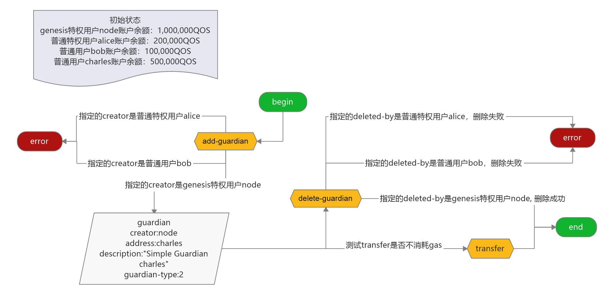

# qoscli guardian 模块测试

## 测试准备

1. 使`alice`成为普通特权用户
```bash
$ ./qoscli tx add-guardian --address alice --creator node --description "Simple Guardian alice" --indent
Password to sign with 'node':<输入密码>
{
  "check_tx": {
    "gasWanted": "100000",
    "gasUsed": "7682"
  },
  "deliver_tx": {
    "gasWanted": "100000",
    "gasUsed": "11752",
    "tags": [
      {
        "key": "YWN0aW9u",
        "value": "YWRkLWd1YXJkaWFu"
      },
      {
        "key": "Y3JlYXRvcg==",
        "value": "YWRkcmVzczFxZ3dnbXBzcmQ2YW5qM3FqdmpzcXp0ajN4dDl2MjRjNG1oNzd4Mw=="
      },
      {
        "key": "Z3VhcmRpYW4=",
        "value": "YWRkcmVzczFlcXFuYXBzMDRsNmh0OXhhaHRyZmdnNTlrc2xsY3E5cXI4NjMwcQ=="
      }
    ]
  },
  "hash": "F5CCB470C3C29C6602A1D72BDA70593968A5096ECB45DA792477E3B7E1479EEA",
  "height": "62"
}
```
此时的特权用户列表:
```bash
$ ./qoscli query guardians --indent
[
  {
    "description": "Genesis Guardian node",
    "guardian_type": 1,
    "address": "address1qgwgmpsrd6anj3qjvjsqztj3xt9v24c4mh77x3",
    "creator": "address1ah9uz0"
  },
  {
    "description": "Simple Guardian alice",
    "guardian_type": 2,
    "address": "address1eqqnaps04l6ht9xahtrfgg59ksllcq9qr8630q",
    "creator": "address1qgwgmpsrd6anj3qjvjsqztj3xt9v24c4mh77x3"
  }
]
```

## 测试内容

#### 涉及到的写入命令 

| Command                     | Alias | Has-Subcommand | Description      |
|:----------------------------|:------|:---------------|:-----------------|
| `qoscli tx add-guardian`    | -     | ✖              | 添加特权用户(guardian) |
| `qoscli tx delete-guardian` | -     | ✖              | 删除特权用户(guardian) |
| `qoscli tx transfer`        | -     | ✖              | 转账QOS和QSC        |

#### 涉及到的查询命令 

| Command                  | Alias                | Has-Subcommand | Description                 |
|:-------------------------|:---------------------|:---------------|:----------------------------|
| `qoscli query guardian`  | `qoscli q guardian`  | ✖              | 查询特权用户(guardian)            |
| `qoscli query guardians` | `qoscli q guardians` | ✖              | 查询特权用户(guardian)列表          |
| `qoscli query account`   | `qoscli q account`   | ✖              | 按地址(address)或名称(name)查询帐户信息 |

#### 测试路径图



#### 测试路径

> 初始状态
> - genesis特权用户`node`账户余额: 500,000QOS
> - 普通用户`alice`账户余额: 200,000QOS
> - 普通用户`bob`账户余额: 100,000QOS
> - 普通用户`charles`账户余额: 500,000QOS

1. 新增特权用户`charles`
    1. 指定的creator是Genesis特权用户`node`
    2. 指定的creator是普通特权用户`alice`
    3. 指定的creator是普通用户`bob`

2. 删除特权用户`charles`
    1. 指定的creator是Genesis特权用户`node`
    2. 指定的creator是普通特权用户`alice`
    3. 指定的creator是普通用户`bob`

3. 测试特权用户交易是否消耗Gas
    1. 测试Genesis特权用户`node`交易是否消耗Gas
    2. 测试普通特权用户`alice`交易是否消耗Gas

## 测试过程

1. 新增特权用户`charles`
    > 新增之前的特权用户列表: 
    > ```bash
    > $ ./qoscli query guardians --indent
    > [
    >   {
    >     "description": "Genesis Guardian node",
    >     "guardian_type": 1,
    >     "address": "address1qgwgmpsrd6anj3qjvjsqztj3xt9v24c4mh77x3",
    >     "creator": "address1ah9uz0"
    >   },
    >   {
    >     "description": "Simple Guardian alice",
    >     "guardian_type": 2,
    >     "address": "address1eqqnaps04l6ht9xahtrfgg59ksllcq9qr8630q",
    >     "creator": "address1qgwgmpsrd6anj3qjvjsqztj3xt9v24c4mh77x3"
    >   }
    > ]
    > ```
    1. 指定的creator是Genesis特权用户`node`
    ```bash
    $ ./qoscli tx add-guardian --address charles --creator node --description "Simple Guardian charles" --indent
    Password to sign with 'node':<输入密码>
    {
      "check_tx": {
        "gasWanted": "100000",
        "gasUsed": "7682"
      },
      "deliver_tx": {
        "gasWanted": "100000",
        "gasUsed": "11812",
        "tags": [
          {
            "key": "YWN0aW9u",
            "value": "YWRkLWd1YXJkaWFu"
          },
          {
            "key": "Y3JlYXRvcg==",
            "value": "YWRkcmVzczFxZ3dnbXBzcmQ2YW5qM3FqdmpzcXp0ajN4dDl2MjRjNG1oNzd4Mw=="
          },
          {
            "key": "Z3VhcmRpYW4=",
            "value": "YWRkcmVzczFmMzdqdm5laHJma3B3enF0cXR1NXE5ang1NzAzNGd2djBsejc4cw=="
          }
        ]
      },
      "hash": "664B58FEFD2C58610DF0F21F6BBA8E2DCCB1D0B84034959FF84786942E8DA010",
      "height": "120"
    }
    ```
    新增特权用户`charles`之后的特权用户列表:
    ```bash
    $ ./qoscli query guardians --indent
    [
      {
        "description": "Genesis Guardian node",
        "guardian_type": 1,
        "address": "address1qgwgmpsrd6anj3qjvjsqztj3xt9v24c4mh77x3",
        "creator": "address1ah9uz0"
      },
      {
        "description": "Simple Guardian charles",
        "guardian_type": 2,
        "address": "address1f37jvnehrfkpwzqtqtu5q9jx57034gvv0lz78s",
        "creator": "address1qgwgmpsrd6anj3qjvjsqztj3xt9v24c4mh77x3"
      },
      {
        "description": "Simple Guardian alice",
        "guardian_type": 2,
        "address": "address1eqqnaps04l6ht9xahtrfgg59ksllcq9qr8630q",
        "creator": "address1qgwgmpsrd6anj3qjvjsqztj3xt9v24c4mh77x3"
      }
    ]
    ```
    2. 指定的creator是普通特权用户`alice`
    ```bash
    $ ./qoscli tx add-guardian --address charles --creator alice --description "Simple Guardian charles" --indent
    Password to sign with 'alice':<输入密码>
    {
      "check_tx": {
        "code": 1,
        "log": "{\"codespace\":\"sdk\",\"code\":1,\"message\":\"TxStd's ITx ValidateData error:  ERROR:\\nCodespace: guardian\\nCode: 602\\nMessage: \\\"Creator not exists or not init from genesis\\\"\\n\"}",
        "gasWanted": "100000",
        "gasUsed": "2207"
      },
      "deliver_tx": {},
      "hash": "148B4CEC564DC243F3BC061B9A7C527858051C126217E046E7350F5B2268A13D",
      "height": "0"
    }
    ERROR: {"codespace":"sdk","code":1,"message":"TxStd's ITx ValidateData error:  ERROR:\nCodespace: guardian\nCode: 602\nMessage: \"Creator not exists or not init from genesis\"\n"}
    ```
    3. 指定的creator是普通用户`bob`
    ```bash
    $ ./qoscli tx add-guardian --address charles --creator bob --description "Simple Guardian charles" --indent
    Password to sign with 'bob':<输入密码>
    {
      "check_tx": {
        "code": 1,
        "log": "{\"codespace\":\"sdk\",\"code\":1,\"message\":\"TxStd's ITx ValidateData error:  ERROR:\\nCodespace: guardian\\nCode: 602\\nMessage: \\\"Creator not exists or not init from genesis\\\"\\n\"}",
        "gasWanted": "100000",
        "gasUsed": "2000"
      },
      "deliver_tx": {},
      "hash": "3F2E29BA06368837003B7A6F1F24A62586A6761507FB5A810F0168473CBDBE3E",
      "height": "0"
    }
    ERROR: {"codespace":"sdk","code":1,"message":"TxStd's ITx ValidateData error:  ERROR:\nCodespace: guardian\nCode: 602\nMessage: \"Creator not exists or not init from genesis\"\n"}
    ```

2. 删除特权用户`charles`
    > 删除之前的特权用户列表: 
    > ```bash
    > $ ./qoscli query guardians --indent
    > [
    >   {
    >     "description": "Genesis Guardian node",
    >     "guardian_type": 1,
    >     "address": "address1qgwgmpsrd6anj3qjvjsqztj3xt9v24c4mh77x3",
    >     "creator": "address1ah9uz0"
    >   },
    >   {
    >     "description": "Simple Guardian charles",
    >     "guardian_type": 2,
    >     "address": "address1f37jvnehrfkpwzqtqtu5q9jx57034gvv0lz78s",
    >     "creator": "address1qgwgmpsrd6anj3qjvjsqztj3xt9v24c4mh77x3"
    >   },
    >   {
    >     "description": "Simple Guardian alice",
    >     "guardian_type": 2,
    >     "address": "address1eqqnaps04l6ht9xahtrfgg59ksllcq9qr8630q",
    >     "creator": "address1qgwgmpsrd6anj3qjvjsqztj3xt9v24c4mh77x3"
    >   }
    > ]
    > ```
    1. 指定的creator是Genesis特权用户`node`
    ```bash
    $ ./qoscli tx delete-guardian --address charles --deleted-by node --indent
    Password to sign with 'node':<输入密码>
    {
      "check_tx": {
        "gasWanted": "100000",
        "gasUsed": "7895"
      },
      "deliver_tx": {
        "gasWanted": "100000",
        "gasUsed": "8895",
        "tags": [
          {
            "key": "YWN0aW9u",
            "value": "ZGVsZXRlLWd1YXJkaWFu"
          },
          {
            "key": "ZGVsZXRlLWJ5",
            "value": "YWRkcmVzczFxZ3dnbXBzcmQ2YW5qM3FqdmpzcXp0ajN4dDl2MjRjNG1oNzd4Mw=="
          },
          {
            "key": "Z3VhcmRpYW4=",
            "value": "YWRkcmVzczFmMzdqdm5laHJma3B3enF0cXR1NXE5ang1NzAzNGd2djBsejc4cw=="
          }
        ]
      },
      "hash": "EE483FA821194A788B9F972C13F891AC9F660D6E3BD5EE636ED37E57C344159C",
      "height": "212"
    }
    ```
    删除特权用户`charles`之后的特权用户列表:
    ```bash
    $ ./qoscli query guardians --indent
    [
      {
        "description": "Genesis Guardian node",
        "guardian_type": 1,
        "address": "address1qgwgmpsrd6anj3qjvjsqztj3xt9v24c4mh77x3",
        "creator": "address1ah9uz0"
      },
      {
        "description": "Simple Guardian alice",
        "guardian_type": 2,
        "address": "address1eqqnaps04l6ht9xahtrfgg59ksllcq9qr8630q",
        "creator": "address1qgwgmpsrd6anj3qjvjsqztj3xt9v24c4mh77x3"
      }
    ]
    ```
    2. 指定的creator是普通特权用户`alice`
    ```bash
    $ ./qoscli tx delete-guardian --address charles --deleted-by alice --indent
    Password to sign with 'alice':<输入密码>
    {
      "check_tx": {
        "code": 1,
        "log": "{\"codespace\":\"sdk\",\"code\":1,\"message\":\"TxStd's ITx ValidateData error:  ERROR:\\nCodespace: guardian\\nCode: 602\\nMessage: \\\"DeletedBy not exists or not init from genesis\\\"\\n\"}",
        "gasWanted": "100000",
        "gasUsed": "2420"
      },
      "deliver_tx": {},
      "hash": "21D5825C006441E0C719CC3825F9B3C014AFBC4BB62D0B8B3ECE98FFD11F6084",
      "height": "0"
    }
    ERROR: {"codespace":"sdk","code":1,"message":"TxStd's ITx ValidateData error:  ERROR:\nCodespace: guardian\nCode: 602\nMessage: \"DeletedBy not exists or not init from genesis\"\n"}
    ```
    3. 指定的creator是普通用户`bob`
    ```bash
    $ ./qoscli tx delete-guardian --address charles --deleted-by bob --indent
    Password to sign with 'bob':<输入密码>
    {
      "check_tx": {
        "code": 1,
        "log": "{\"codespace\":\"sdk\",\"code\":1,\"message\":\"TxStd's ITx ValidateData error:  ERROR:\\nCodespace: guardian\\nCode: 602\\nMessage: \\\"DeletedBy not exists or not init from genesis\\\"\\n\"}",
        "gasWanted": "100000",
        "gasUsed": "2213"
      },
      "deliver_tx": {},
      "hash": "D7354F85D603EF431BA7D9221BCD0CE0105BAB1431ABF91F1337B74D8ADE3D95",
      "height": "0"
    }
    ERROR: {"codespace":"sdk","code":1,"message":"TxStd's ITx ValidateData error:  ERROR:\nCodespace: guardian\nCode: 602\nMessage: \"DeletedBy not exists or not init from genesis\"\n"}
    ```

3. 测试特权用户交易是否消耗Gas
    1. 测试Genesis特权用户`node`交易是否消耗Gas
        1. 交易之前，`node`账户余额情况:
        ```bash
        $ ./qoscli query account node --indent
        {
          "type": "qos/types/QOSAccount",
          "value": {
            "base_account": {
              "account_address": "address1qgwgmpsrd6anj3qjvjsqztj3xt9v24c4mh77x3",
              "public_key": {
                "type": "tendermint/PubKeyEd25519",
                "value": "6ScYtz+2p/y1GZDe0XuibF0w1NPE6yY2o9GNgjUYFqo="
              },
              "nonce": "4"
            },
            "qos": "500000",
            "qscs": null
          }
        }
        ```
        2. 发起交易:
        ```bash
        $ ./qoscli tx transfer --senders node,10000QOS --receivers charles,10000QOS --indent
        Password to sign with 'node':
        {
          "check_tx": {
            "gasWanted": "100000",
            "gasUsed": "6772"
          },
          "deliver_tx": {
            "gasWanted": "100000",
            "gasUsed": "16501",
            "tags": [
              {
                "key": "c2VuZGVy",
                "value": "YWRkcmVzczFxZ3dnbXBzcmQ2YW5qM3FqdmpzcXp0ajN4dDl2MjRjNG1oNzd4Mw=="
              },
              {
                "key": "cmVjZWl2ZXI=",
                "value": "YWRkcmVzczFmMzdqdm5laHJma3B3enF0cXR1NXE5ang1NzAzNGd2djBsejc4cw=="
              }
            ]
          },
          "hash": "4CD661CDD27E067DBAAE481CF8066D165BF48BD3FD9B1A1585CC7897F8EDE4C7",
          "height": "270"
        }
        ```
        3. 交易之后，`node`账户余额情况:
        ```bash
        $ ./qoscli query account node --indent
        {
          "type": "qos/types/QOSAccount",
          "value": {
            "base_account": {
              "account_address": "address1qgwgmpsrd6anj3qjvjsqztj3xt9v24c4mh77x3",
              "public_key": {
                "type": "tendermint/PubKeyEd25519",
                "value": "6ScYtz+2p/y1GZDe0XuibF0w1NPE6yY2o9GNgjUYFqo="
              },
              "nonce": "5"
            },
            "qos": "490000",
            "qscs": null
          }
        }
        ```
        4. 可以看到: Genesis特权用户`node`交易不消耗Gas
    2. 测试普通特权用户`alice`交易是否消耗Gas
        1. 交易之前，`alice`账户余额情况:
        ```bash
        $ ./qoscli query account alice --indent
        {
          "type": "qos/types/QOSAccount",
          "value": {
            "base_account": {
              "account_address": "address1eqqnaps04l6ht9xahtrfgg59ksllcq9qr8630q",
              "public_key": null,
              "nonce": "0"
            },
            "qos": "200000",
            "qscs": null
          }
        }
        ```
        2. 发起交易:
        ```bash
        $ ./qoscli tx transfer --senders alice,10000QOS --receivers charles,10000QOS --indent
        Password to sign with 'alice':
        {
          "check_tx": {
            "gasWanted": "100000",
            "gasUsed": "6526"
          },
          "deliver_tx": {
            "gasWanted": "100000",
            "gasUsed": "16255",
            "tags": [
              {
                "key": "c2VuZGVy",
                "value": "YWRkcmVzczFlcXFuYXBzMDRsNmh0OXhhaHRyZmdnNTlrc2xsY3E5cXI4NjMwcQ=="
              },
              {
                "key": "cmVjZWl2ZXI=",
                "value": "YWRkcmVzczFmMzdqdm5laHJma3B3enF0cXR1NXE5ang1NzAzNGd2djBsejc4cw=="
              }
            ]
          },
          "hash": "455CBC6502EC3C0128E360C3686B9AC9B8805331B7F0E3EC149F32859083FA47",
          "height": "334"
        }
        ```
        3. 交易之后，`alice`账户余额情况:
        ```bash
        $ ./qoscli query account alice --indent
        {
          "type": "qos/types/QOSAccount",
          "value": {
            "base_account": {
              "account_address": "address1eqqnaps04l6ht9xahtrfgg59ksllcq9qr8630q",
              "public_key": {
                "type": "tendermint/PubKeyEd25519",
                "value": "EbIqepd8q2+8XnTjvlqjnWb1aptxLEkjiSuvX05nuBg="
              },
              "nonce": "1"
            },
            "qos": "190000",
            "qscs": null
          }
        }
        ```
        4. 可以看到: 普通特权用户`alice`交易不消耗Gas