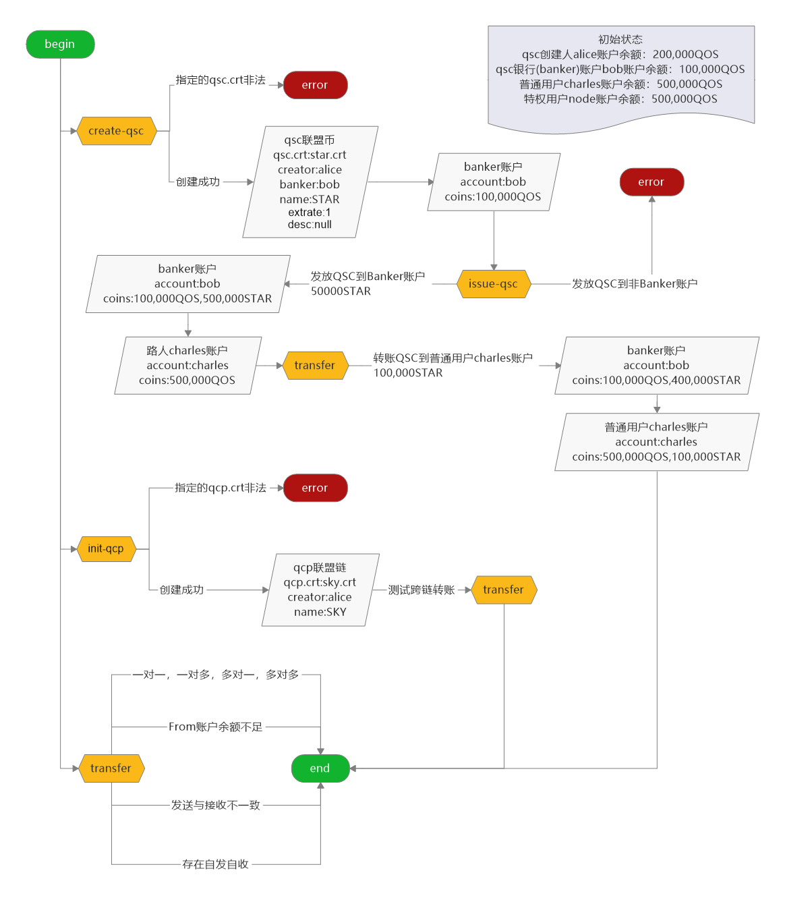

# qoscli qcp-qsc-transfer 模块测试

## 测试准备

1. 本地使用kepler签发证书
    1. 创建root证书
        ```shell script
        #!/bin/bash
        # 1.生成密钥"root", 私钥保存到"root.pri", 公钥保存到"root.pub"
        kepler genkey --out-private-key root.pri --out-public-key root.pub
        # 2.对公钥"root.pub"添加信任, 将该公钥保存到"trust.crts"
        kepler trust --in-public-key root.pub --out-trust-crts trust.crts
        # 3.使用公钥"root.pub"发起证书签名请求, 请求类型指定为根证书, 请求保存为"root.csr"
        kepler req --is-ca true --in-public-key root.pub --out-sign-req root.csr
        # 4.使用公钥"root.pub"和私钥"root.pri"对证书签名请求"root.csr"进行签名, 得到签名后的CA证书文件"root.crt"
        kepler sign --in-key-pri root.pri --in-key-pub root.pub --in-sign-req root.csr --out-signed-ca root.crt
        # 5.使用信任证书列表"trust.crts"验证CA证书"root.crt"的签名是否正确合法
        kepler verify --in-trust-crts trust.crts --in-signed-ca root.crt
        # 6.打印证书签名请求文件"root.csr"和CA证书"root.crt"的内容
        kepler show --in-csr-file root.csr --in-crt-file root.crt
        ```
        - 生成的密钥`root`
            - 公钥`root.pub`
                ```json
                {"type":"tendermint/PubKeyEd25519","value":"YqnR96cSkDR4Hxb/Dk4KpJVA5fQRprzFNRd+EEsajPg="}
                ```
            - 私钥`root.pri`
                ```json
                {"type":"tendermint/PrivKeyEd25519","value":"WbHRr4KFcvjSyCDvwj37D0Qgr6BhDgG1loWpjFhY2qBiqdH3pxKQNHgfFv8OTgqklUDl9BGmvMU1F34QSxqM+A=="}
                ```
        - 生成的证书签名请求`root.csr`
            ```json
            {
                "subj": {
                    "type": "certificate/CommonSubject", 
                    "value": {
                        "cn": "CA"
                    }
                }, 
                "is_ca": true, 
                "not_before": "0001-01-01T00:00:00Z", 
                "not_after": "0001-01-01T00:00:00Z", 
                "public_key": {
                    "type": "tendermint/PubKeyEd25519", 
                    "value": "YqnR96cSkDR4Hxb/Dk4KpJVA5fQRprzFNRd+EEsajPg="
                }
            }
            ```
        - 生成的CA证书`root.crt`
            ```json
            {
                "csr": {
                    "subj": {
                        "type": "certificate/CommonSubject", 
                        "value": {
                            "cn": "CA"
                        }
                    }, 
                    "is_ca": true, 
                    "not_before": "2019-08-22T09:17:11.8021314Z", 
                    "not_after": "2020-08-22T09:17:11.8021314Z", 
                    "public_key": {
                        "type": "tendermint/PubKeyEd25519", 
                        "value": "YqnR96cSkDR4Hxb/Dk4KpJVA5fQRprzFNRd+EEsajPg="
                    }
                }, 
                "ca": {
                    "subj": null, 
                    "public_key": {
                        "type": "tendermint/PubKeyEd25519", 
                        "value": "YqnR96cSkDR4Hxb/Dk4KpJVA5fQRprzFNRd+EEsajPg="
                    }
                }, 
                "signature": "EjMpeFNyJgpuP+1H4EfIhhF0Y/OW2xoeYy3NebNWVX9HS4PbyouVz95IZdC8Dho7AeW1YLxtSPpIspVrQoYUDQ=="
            }
            ```
    2. 创建QCP联盟链证书
        ```shell script
        #!/bin/bash
        # 1.生成密钥"qcp", 私钥保存到"qcp.pri", 公钥保存到"qcp.pub"
        kepler genkey --out-private-key qcp.pri --out-public-key qcp.pub
        # 2.使用公钥"qcp.pub"发起证书签名请求, 公链ID指定为"test-chain", QCP联盟链ID指定为"test-qcp-chain", 请求保存为"qcp.csr"
        kepler req-qcp --in-public-key qcp.pub --chain-id test-chain --qcp-chain test-qcp-chain --out-sign-req qcp.csr
        # 4.使用公钥"root.pub"和私钥"root.pri"对证书签名请求"qcp.csr"进行签名, 得到签名后的CA证书文件"qcp.crt"
        kepler sign --in-key-pri root.pri --in-key-pub root.pub --in-sign-req qcp.csr --out-signed-ca qcp.crt
        # 5.使用信任证书列表"trust.crts"验证CA证书"qcp.crt"的签名是否正确合法
        kepler verify --in-trust-crts trust.crts --in-signed-ca qcp.crt
        # 6.打印证书签名请求文件"qcp.csr"和CA证书"qcp.crt"的内容
        kepler show --in-csr-file qcp.csr --in-crt-file qcp.crt
        ```
        - 生成的密钥`qcp`
            - 公钥`qcp.pub`
                ```json
                {"type":"tendermint/PubKeyEd25519","value":"IbSMya3iR2zH1wW5wtHbmWpuxRLIB7wnFNADC4H/Psw="}
                ```
            - 私钥`qcp.pri`
                ```json
                {"type":"tendermint/PrivKeyEd25519","value":"eRwYKN/jB1AtVAXmFJxGQcnQ1UqMWH5kcQSsPf/IgW0htIzJreJHbMfXBbnC0duZam7FEsgHvCcU0AMLgf8+zA=="}
                ```
        - 生成的证书签名请求`qcp.csr`
            ```json
            {
                "subj": {
                    "type": "certificate/QCPSubject", 
                    "value": {
                        "chain_id": "test-chain", 
                        "qcp_chain": "test-qcp-chain"
                    }
                }, 
                "is_ca": false, 
                "not_before": "0001-01-01T00:00:00Z", 
                "not_after": "0001-01-01T00:00:00Z", 
                "public_key": {
                    "type": "tendermint/PubKeyEd25519", 
                    "value": "IbSMya3iR2zH1wW5wtHbmWpuxRLIB7wnFNADC4H/Psw="
                }
            }
            ```
        - 生成的CA证书`qcp.crt`
            ```json
            {
                "csr": {
                    "subj": {
                        "type": "certificate/QCPSubject", 
                        "value": {
                            "chain_id": "test-chain", 
                            "qcp_chain": "test-qcp-chain"
                        }
                    }, 
                    "is_ca": false, 
                    "not_before": "2019-08-22T09:23:33.7951131Z", 
                    "not_after": "2020-08-22T09:23:33.7951131Z", 
                    "public_key": {
                        "type": "tendermint/PubKeyEd25519", 
                        "value": "IbSMya3iR2zH1wW5wtHbmWpuxRLIB7wnFNADC4H/Psw="
                    }
                }, 
                "ca": {
                    "subj": null, 
                    "public_key": {
                        "type": "tendermint/PubKeyEd25519", 
                        "value": "YqnR96cSkDR4Hxb/Dk4KpJVA5fQRprzFNRd+EEsajPg="
                    }
                }, 
                "signature": "UDZ+ke04JkyzeoMMVWbzGRu6UIiCrOb6l8W0wVxDfT5OfSaRaqSFU3rK8UxDv6EwlYkD1r7bAjgEaaKRVg/nAA=="
            }
            ```
    3. 创建QSC联盟币证书
        ```shell script
        #!/bin/bash
        # 1.生成密钥"qsc", 私钥保存到"qsc.pri", 公钥保存到"qsc.pub"
        kepler genkey --out-private-key qsc.pri --out-public-key qsc.pub
        # 1.生成密钥"banker", 私钥保存到"banker.pri", 公钥保存到"banker.pub"
        kepler genkey --out-private-key banker.pri --out-public-key banker.pub
        # 2.使用公钥"qsc.pub"发起证书签名请求, 公链ID指定为"test-chain", QSC联盟币名称指定为"star", 指定公钥"banker.pub"成为QSC联盟币的Banker用户, 请求保存为"qsc.csr"
        kepler req-qsc --in-public-key qsc.pub --chain-id test-chain --name star --banker banker.pub --out-sign-req qsc.csr
        # 4.使用公钥"root.pub"和私钥"root.pri"对证书签名请求"qsc.csr"进行签名, 得到签名后的CA证书文件"qsc.crt"
        kepler sign --in-key-pri root.pri --in-key-pub root.pub --in-sign-req qsc.csr --out-signed-ca qsc.crt
        # 5.使用信任证书列表"trust.crts"验证CA证书"qsc.crt"的签名是否正确合法
        kepler verify --in-trust-crts trust.crts --in-signed-ca qsc.crt
        # 6.打印证书签名请求文件"qsc.csr"和CA证书"qsc.crt"的内容
        kepler show --in-csr-file qsc.csr --in-crt-file qsc.crt
        ```
        - 生成的密钥`qsc`
            - 公钥`qcp.pub`
                ```json
                {"type":"tendermint/PubKeyEd25519","value":"l+eMt8Pnw2YoYvQXHhR12s0WQ/BrUBbxZKr/Ip1bXq8="}
                ```
            - 私钥`qcp.pri`
                ```json
                {"type":"tendermint/PrivKeyEd25519","value":"4w+iAp5ioyXQwd+P927sEmmSwM4FytLQOJPYo9JpdD+X54y3w+fDZihi9BceFHXazRZD8GtQFvFkqv8inVterw=="}
                ```
        - 生成的密钥`banker`
            - 公钥`qcp.pub`
                ```json
                {"type":"tendermint/PubKeyEd25519","value":"8a4nlAju0jjkHwiIrATiLU6peok5nnhd76DIauTybB8="}
                ```
            - 私钥`qcp.pri`
                ```json
                {"type":"tendermint/PrivKeyEd25519","value":"ZO0OMPF4OSy0N5AWQ3rFqftmAT3IM7d7OLgef+VatLbxrieUCO7SOOQfCIisBOItTql6iTmeeF3voMhq5PJsHw=="}
                ```
        - 生成的证书签名请求`qsc.csr`
            ```json
            {
                "subj": {
                    "type": "certificate/QSCSubject", 
                    "value": {
                        "chain_id": "test-chain", 
                        "name": "star", 
                        "banker": {
                            "type": "tendermint/PubKeyEd25519", 
                            "value": "8a4nlAju0jjkHwiIrATiLU6peok5nnhd76DIauTybB8="
                        }
                    }
                }, 
                "is_ca": false, 
                "not_before": "0001-01-01T00:00:00Z", 
                "not_after": "0001-01-01T00:00:00Z", 
                "public_key": {
                    "type": "tendermint/PubKeyEd25519", 
                    "value": "l+eMt8Pnw2YoYvQXHhR12s0WQ/BrUBbxZKr/Ip1bXq8="
                }
            }
            ```
        - 生成的CA证书`qsc.crt`
            ```json
            {
                "csr": {
                    "subj": {
                        "type": "certificate/QSCSubject", 
                        "value": {
                            "chain_id": "test-chain", 
                            "name": "star", 
                            "banker": {
                                "type": "tendermint/PubKeyEd25519", 
                                "value": "8a4nlAju0jjkHwiIrATiLU6peok5nnhd76DIauTybB8="
                            }
                        }
                    }, 
                    "is_ca": false, 
                    "not_before": "2019-08-22T09:31:04.5992784Z", 
                    "not_after": "2020-08-22T09:31:04.5992784Z", 
                    "public_key": {
                        "type": "tendermint/PubKeyEd25519", 
                        "value": "l+eMt8Pnw2YoYvQXHhR12s0WQ/BrUBbxZKr/Ip1bXq8="
                    }
                }, 
                "ca": {
                    "subj": null, 
                    "public_key": {
                        "type": "tendermint/PubKeyEd25519", 
                        "value": "YqnR96cSkDR4Hxb/Dk4KpJVA5fQRprzFNRd+EEsajPg="
                    }
                }, 
                "signature": "mwH6ssS/sUgly/QmQIvjZEB4KxYjsRZBAhatOEgSKKj+QYfDYNIhDAxkpIVP8pk/OspCZegBOFjDbxZLkX7TBA=="
            }
            ```
2. 将kepler生成的密钥`root`, `qcp`, `qsc`, `banker`导入到本地密钥库
    ```shell script
    #!/bin/bash
    echo "1. 导入密钥root"
    expect -c "
    set timeout 1
    spawn ~/qoscli keys import root
    send \"WbHRr4KFcvjSyCDvwj37D0Qgr6BhDgG1loWpjFhY2qBiqdH3pxKQNHgfFv8OTgqklUDl9BGmvMU1F34QSxqM+A==\r\"
    expect \"*key:\" {send \"12345678\r\"}
    expect \"*passphrase:\" {send \"12345678\r\"}
    interact
    "
    echo "2. 导入密钥qcp"
    expect -c "
    set timeout 1
    spawn ~/qoscli keys import qcp
    send \"eRwYKN/jB1AtVAXmFJxGQcnQ1UqMWH5kcQSsPf/IgW0htIzJreJHbMfXBbnC0duZam7FEsgHvCcU0AMLgf8+zA==\r\"
    expect \"*key:\" {send \"12345678\r\"}
    expect \"*passphrase:\" {send \"12345678\r\"}
    interact
    "
    echo "3. 导入密钥qsc"
    expect -c "
    set timeout 1
    spawn ~/qoscli keys import qsc
    send \"4w+iAp5ioyXQwd+P927sEmmSwM4FytLQOJPYo9JpdD+X54y3w+fDZihi9BceFHXazRZD8GtQFvFkqv8inVterw==\r\"
    expect \"*key:\" {send \"12345678\r\"}
    expect \"*passphrase:\" {send \"12345678\r\"}
    interact
    "
    echo "4. 导入密钥banker"
    expect -c "
    set timeout 1
    spawn ~/qoscli keys import banker
    send \"ZO0OMPF4OSy0N5AWQ3rFqftmAT3IM7d7OLgef+VatLbxrieUCO7SOOQfCIisBOItTql6iTmeeF3voMhq5PJsHw==\r\"
    expect \"*key:\" {send \"12345678\r\"}
    expect \"*passphrase:\" {send \"12345678\r\"}
    interact
    "
    ```
3. 从用户`node`账户分别向账户`root`, `qcp`, `qsc`, `banker`转账`100,000QOS`, 使其开户上链
    ```shell script
    #!/bin/bash
    echo "5. 从用户node账户分别向账户root, qcp, qsc, banker转账100,000QOS, 使其开户上链"
    expect -c "
    set timeout 1
    spawn ~/qoscli tx transfer --senders 'node,400000QOS' --receivers 'root,100000QOS;qcp,100000QOS;qsc,100000QOS;banker,100000QOS' --indent
    expect \"Password to sign with 'node':\" {send \"12345678\r\"}
    interact
    "
    ```
4. 在本地密钥库中新增密钥: `david`
    ```bash
    $ ./qoscli keys add david
    Enter a passphrase for your key:
    Repeat the passphrase:
    NAME:	TYPE:	ADDRESS:						PUBKEY:
    david	local	address17ntagxcqhyk83hpgkfawwmlrt7fz5c9fut3qsv	3Cx/ssj0qnuGJ/Eg244/rQpRUXIUd+qcpIrvDbxuRT4=
    **Important** write this seed phrase in a safe place.
    It is the only way to recover your account if you ever forget your password.
    
    estate enemy month sleep stand ozone satoshi attract own learn range tray weather armor mosquito buddy hip margin brain ocean region awful mountain year
    ```

- 以下脚本`transfer.sh`用于监控转账交易前后各账户余额的变化
```shell script
#!/bin/bash
# 定义函数: 用于将null转为0
function null2zero(){
  if test -z "$1"
  then
    echo "0"
  else
    echo $1
  fi
}

# 检查入参
if [ $# -lt "2" -o $# -gt "3" ]; then
  echo -e "Usage: \"bash transfer.sh [senders] [receivers] <qcp-blockheight>\""
  echo -e "Example(链内转账): \n\t\"bash transfer.sh 'alice,5000QOS;bob,5000QOS' 'charles,5000QOS;node,5000QOS'\""
  echo -e "Example(跨链转账): \n\t\"bash transfer.sh 'alice,5000QOS;bob,5000QOS' 'charles,5000QOS;node,5000QOS' 1\""
  exit
fi

# 准备参数
qcp_chain_id="test-qcp-chain"
qcp_signer="qcp"
senders=$1
receivers=$2
qcp_block_height=$3

# 构建转账命令
senders_cmd="--senders '$senders'"
receivers_cmd="--receivers '$receivers'"
qcp_cmd="--qcp --qcp-from $qcp_chain_id --qcp-signer $qcp_signer --qcp-blockheight $qcp_block_height"
cmd="~/qoscli tx transfer --indent $senders_cmd $receivers_cmd"
if [ $# == 3 ]; then
  cmd="$cmd $qcp_cmd"
fi

# 转账之前，用户账户余额情况
account_node_old=$(~/qoscli query account node)
account_alice_old=$(~/qoscli query account alice)
account_bob_old=$(~/qoscli query account bob)
account_charles_old=$(~/qoscli query account charles)

# 解析数据
node_qos_old=$(echo $account_node_old | grep -o '"qos":"[0-9]*"' | grep -o '[0-9]*')
node_star_old=$(echo $account_node_old | grep -o '"coin_name":"star","amount":"[0-9]*"' | grep -o '[0-9]*')
alice_qos_old=$(echo $account_alice_old | grep -o '"qos":"[0-9]*"' | grep -o '[0-9]*')
alice_star_old=$(echo $account_alice_old | grep -o '"coin_name":"star","amount":"[0-9]*"' | grep -o '[0-9]*')
bob_qos_old=$(echo $account_bob_old | grep -o '"qos":"[0-9]*"' | grep -o '[0-9]*')
bob_star_old=$(echo $account_bob_old | grep -o '"coin_name":"star","amount":"[0-9]*"' | grep -o '[0-9]*')
charles_qos_old=$(echo $account_charles_old | grep -o '"qos":"[0-9]*"' | grep -o '[0-9]*')
charles_star_old=$(echo $account_charles_old | grep -o '"coin_name":"star","amount":"[0-9]*"' | grep -o '[0-9]*')

# 处理null值
node_qos_old=$(null2zero $node_qos_old)
node_star_old=$(null2zero $node_star_old)
alice_qos_old=$(null2zero $alice_qos_old)
alice_star_old=$(null2zero $alice_star_old)
bob_qos_old=$(null2zero $bob_qos_old)
bob_star_old=$(null2zero $bob_star_old)
charles_qos_old=$(null2zero $charles_qos_old)
charles_star_old=$(null2zero $charles_star_old)

# 打印
printf "# 交易之前\n"
printf "## 账户余额情况\n"
printf "| key | qos | star |\n"
printf "| --: | --: | ---: |\n"
printf "| %s | %s | %s |\n" "node"    $node_qos_old    $node_star_old
printf "| %s | %s | %s |\n" "alice"   $alice_qos_old   $alice_star_old
printf "| %s | %s | %s |\n" "bob"     $bob_qos_old     $bob_star_old
printf "| %s | %s | %s |\n" "charles" $charles_qos_old $charles_star_old

# 社区费池
community_fee_old=$(~/qoscli query community-fee-pool | sed 's/\"//g')
printf "## 社区费池情况\n"
printf "| community_fee   | Δcommunity_fee |\n"
printf "| --------------: | --------------: |\n"
printf "| %s | %s |\n" $community_fee_old "0"

# 执行转账
printf "# 执行交易\n"
expect << EOF
set timeout 10
log_user 0
spawn bash -c "$cmd > ~/temp.log"
expect {
  "Password to sign with '*':" {send "12345678\r";exp_continue;}
  eof
}
EOF

# 读取~/temp.log文件, 提取交易哈希, 并根据哈希查询交易详情
log=$(cat ~/temp.log)
printf "## 交易结果\n"
echo -e "\`\`\`bash"
echo "$log"
echo -e "\`\`\`"
tx_hash=$(echo $log | grep -o '"hash": "[0-9A-Z]*"' | grep -o '[0-9A-Z]*')
printf "## 交易哈希\n"
echo -e "\`$tx_hash\`"
tx=$(~/qoscli query tx $tx_hash --indent)
printf "## 交易详情\n"
echo -e "\`\`\`bash"
echo "$tx"
echo -e "\`\`\`"

# 等待转账生效
printf "# 交易生效过程\n"
count="0"
latest_status=$(~/qoscli query status)
saved_block_height=$(echo $latest_status | grep -o '"latest_block_height":"[0-9]*"' | grep -o '[0-9]*')
while [ $count != "2" ]
do
  latest_status=$(~/qoscli query status)
  latest_block_height=$(echo $latest_status | grep -o '"latest_block_height":"[0-9]*"' | grep -o '[0-9]*')
  if [ $latest_block_height != $saved_block_height ];then
    printf "## 到达新块: [%s] ==> [%s]\n" $saved_block_height $latest_block_height
    saved_block_height=$latest_block_height
    count=$(expr $count + 1)

    # 转账之后，用户账户余额情况
    account_node_new=$(~/qoscli query account node)
    account_alice_new=$(~/qoscli query account alice)
    account_bob_new=$(~/qoscli query account bob)
    account_charles_new=$(~/qoscli query account charles)
    
    # 解析数据
    node_qos_new=$(echo $account_node_new | grep -o '"qos":"[0-9]*"' | grep -o '[0-9]*')
    node_star_new=$(echo $account_node_new | grep -o '"coin_name":"star","amount":"[0-9]*"' | grep -o '[0-9]*')
    alice_qos_new=$(echo $account_alice_new | grep -o '"qos":"[0-9]*"' | grep -o '[0-9]*')
    alice_star_new=$(echo $account_alice_new | grep -o '"coin_name":"star","amount":"[0-9]*"' | grep -o '[0-9]*')
    bob_qos_new=$(echo $account_bob_new | grep -o '"qos":"[0-9]*"' | grep -o '[0-9]*')
    bob_star_new=$(echo $account_bob_new | grep -o '"coin_name":"star","amount":"[0-9]*"' | grep -o '[0-9]*')
    charles_qos_new=$(echo $account_charles_new | grep -o '"qos":"[0-9]*"' | grep -o '[0-9]*')
    charles_star_new=$(echo $account_charles_new | grep -o '"coin_name":"star","amount":"[0-9]*"' | grep -o '[0-9]*')

    # 处理null值
    node_qos_new=$(null2zero $node_qos_new)
    node_star_new=$(null2zero $node_star_new)
    alice_qos_new=$(null2zero $alice_qos_new)
    alice_star_new=$(null2zero $alice_star_new)
    bob_qos_new=$(null2zero $bob_qos_new)
    bob_star_new=$(null2zero $bob_star_new)
    charles_qos_new=$(null2zero $charles_qos_new)
    charles_star_new=$(null2zero $charles_star_new)

    # 打印
    printf "### 账户余额情况\n"
    printf "| key | qos | star |\n"
    printf "| --: | --: | ---: |\n"
    printf "| %s | %s | %s |\n" "node"    $node_qos_new    $node_star_new
    printf "| %s | %s | %s |\n" "alice"   $alice_qos_new   $alice_star_new
    printf "| %s | %s | %s |\n" "bob"     $bob_qos_new     $bob_star_new
    printf "| %s | %s | %s |\n" "charles" $charles_qos_new $charles_star_new

    # 账户余额QOS变动情况
    node_qos_diff=$(expr $node_qos_new - $node_qos_old)
    alice_qos_diff=$(expr $alice_qos_new - $alice_qos_old)
    bob_qos_diff=$(expr $bob_qos_new - $bob_qos_old)
    charles_qos_diff=$(expr $charles_qos_new - $charles_qos_old)

    # 账户余额QSC变动情况
    node_star_diff=$(expr $node_star_new - $node_star_old)
    alice_star_diff=$(expr $alice_star_new - $alice_star_old)
    bob_star_diff=$(expr $bob_star_new - $bob_star_old)
    charles_star_diff=$(expr $charles_star_new - $charles_star_old)

    # 打印
    printf "### 账户余额变动情况\n"
    printf "| key   | Δqos | Δstar |\n"
    printf "| ----: | ----: | -----: |\n"
    printf "| %s | %s | %s |\n" "node"    $node_qos_diff    $node_star_diff
    printf "| %s | %s | %s |\n" "alice"   $alice_qos_diff   $alice_star_diff
    printf "| %s | %s | %s |\n" "bob"     $bob_qos_diff     $bob_star_diff
    printf "| %s | %s | %s |\n" "charles" $charles_qos_diff $charles_star_diff
 
     # 社区费池
    community_fee_new=$(~/qoscli query community-fee-pool | sed 's/\"//g')
    community_fee_diff=$(expr $community_fee_new - $community_fee_old)
    community_fee_old=$community_fee_new
    printf "### 社区费池情况\n"
    printf "| community_fee   | Δcommunity_fee |\n"
    printf "| --------------: | --------------: |\n"
    printf "| %s | %s |\n" $community_fee_new $community_fee_diff
    
    # 更新缓存
    node_qos_old=$node_qos_new
    node_star_old=$node_star_new
    alice_qos_old=$alice_qos_new
    alice_star_old=$alice_star_new
    bob_qos_old=$bob_qos_new
    bob_star_old=$bob_star_new
    charles_qos_old=$charles_qos_new
    charles_star_old=$charles_star_new
  fi
  sleep 0.1s
done
```

- 以下脚本`batch_test_transfer.sh`用于批量测试转账交易，本脚本调用了上述脚本`transfer.sh`
```shell script
#!/bin/bash
# 准备输出文件夹 详情
dir=~/batch_test_output/transfer
rm -rf $dir
mkdir -p $dir
# 1. 公链转账
#     1. 公链QOS转账: `10,000QOS`
#         1. 公链QOS一对一转账: `alice,10000QOS` ➟ `bob,10000QOS`
ts=$(date +"%Y-%m-%d %H:%M:%S")
file_name="1.1.1.公链QOS一对一转账.md"
echo "[ $ts ] 正在生成: $dir/$file_name"
bash transfer.sh 'alice,10000QOS' 'bob,10000QOS' > $dir/$file_name
#         2. 公链QOS一对多转账: `alice,10000QOS` ➟ `bob,5000QOS;charles,5000QOS`
ts=$(date +"%Y-%m-%d %H:%M:%S")
file_name="1.1.2.公链QOS一对多转账.md"
echo "[ $ts ] 正在生成: $dir/$file_name"
bash transfer.sh 'alice,10000QOS' 'bob,5000QOS;charles,5000QOS' > $dir/$file_name
#         3. 公链QOS多对一转账: `alice,5000QOS;bob,5000QOS` ➟ `charles,10000QOS`
ts=$(date +"%Y-%m-%d %H:%M:%S")
file_name="1.1.3.公链QOS多对一转账.md"
echo "[ $ts ] 正在生成: $dir/$file_name"
bash transfer.sh 'alice,5000QOS;bob,5000QOS' 'charles,10000QOS' > $dir/$file_name
#         4. 公链QOS多对多转账: `alice,5000QOS;bob,5000QOS` ➟ `charles,5000QOS;node,5000QOS`
ts=$(date +"%Y-%m-%d %H:%M:%S")
file_name="1.1.4.公链QOS多对多转账.md"
echo "[ $ts ] 正在生成: $dir/$file_name"
bash transfer.sh 'alice,5000QOS;bob,5000QOS' 'charles,5000QOS;node,5000QOS' > $dir/$file_name
#     2. 公链QSC转账: `10,000star`
#         1. 公链QSC一对一转账: `alice,10000star` ➟ `bob,10000star`
ts=$(date +"%Y-%m-%d %H:%M:%S")
file_name="1.2.1.公链QSC一对一转账.md"
echo "[ $ts ] 正在生成: $dir/$file_name"
bash transfer.sh 'alice,10000star' 'bob,10000star' > $dir/$file_name
#         2. 公链QSC一对多转账: `alice,10000star` ➟ `bob,5000star;charles,5000star`
ts=$(date +"%Y-%m-%d %H:%M:%S")
file_name="1.2.2.公链QSC一对多转账.md"
echo "[ $ts ] 正在生成: $dir/$file_name"
bash transfer.sh 'alice,10000star' 'bob,5000star;charles,5000star' > $dir/$file_name
#         3. 公链QSC多对一转账: `alice,5000star;bob,5000star` ➟ `charles,10000star`
ts=$(date +"%Y-%m-%d %H:%M:%S")
file_name="1.2.3.公链QSC多对一转账.md"
echo "[ $ts ] 正在生成: $dir/$file_name"
bash transfer.sh 'alice,5000star;bob,5000star' 'charles,10000star' > $dir/$file_name
#         4. 公链QSC多对多转账: `alice,5000star;bob,5000star` ➟ `charles,5000star;node,5000star`
ts=$(date +"%Y-%m-%d %H:%M:%S")
file_name="1.2.4.公链QSC多对多转账.md"
echo "[ $ts ] 正在生成: $dir/$file_name"
bash transfer.sh 'alice,5000star;bob,5000star' 'charles,5000star;node,5000star' > $dir/$file_name
#     3. 公链QOS-QSC混合转账: `10,000QOS,10,000star`
#         1. 公链QOS-QSC混合一对一转账: `alice,10000QOS,10000star` ➟ `bob,10000QOS,10000star`
ts=$(date +"%Y-%m-%d %H:%M:%S")
file_name="1.3.1.公链QOS-QSC混合一对一转账.md"
echo "[ $ts ] 正在生成: $dir/$file_name"
bash transfer.sh 'alice,10000QOS,10000star' 'bob,10000QOS,10000star' > $dir/$file_name
#         2. 公链QOS-QSC混合一对多转账: `alice,10000QOS,10000star` ➟ `bob,5000QOS,5000star;charles,5000QOS,5000star`
ts=$(date +"%Y-%m-%d %H:%M:%S")
file_name="1.3.2.公链QOS-QSC混合一对多转账.md"
echo "[ $ts ] 正在生成: $dir/$file_name"
bash transfer.sh 'alice,10000QOS,10000star' 'bob,5000QOS,5000star;charles,5000QOS,5000star' > $dir/$file_name
#         3. 公链QOS-QSC混合多对一转账: `alice,5000QOS,5000star;bob,5000QOS,5000star` ➟ `charles,10000QOS,10000star`
ts=$(date +"%Y-%m-%d %H:%M:%S")
file_name="1.3.3.公链QOS-QSC混合多对一转账.md"
echo "[ $ts ] 正在生成: $dir/$file_name"
bash transfer.sh 'alice,5000QOS,5000star;bob,5000QOS,5000star' 'charles,10000QOS,10000star' > $dir/$file_name
#         4. 公链QOS-QSC混合多对多转账: `alice,5000QOS,5000star;bob,5000QOS,5000star` ➟ `charles,5000QOS,5000star;node,5000QOS,5000star`
ts=$(date +"%Y-%m-%d %H:%M:%S")
file_name="1.3.4.公链QOS-QSC混合多对多转账.md"
echo "[ $ts ] 正在生成: $dir/$file_name"
bash transfer.sh 'alice,5000QOS,5000star;bob,5000QOS,5000star' 'charles,5000QOS,5000star;node,5000QOS,5000star' > $dir/$file_name
# 2. 跨链转账
#     1. 跨链QOS转账: `10,000QOS`
#         1. 跨链QOS一对一转账: `alice,10000QOS` ➟ `bob,10000QOS`
ts=$(date +"%Y-%m-%d %H:%M:%S")
file_name="2.1.1.跨链QOS一对一转账.md"
echo "[ $ts ] 正在生成: $dir/$file_name"
bash transfer.sh 'alice,10000QOS' 'bob,10000QOS' 1 > $dir/$file_name
#         2. 跨链QOS一对多转账: `alice,10000QOS` ➟ `bob,5000QOS;charles,5000QOS`
ts=$(date +"%Y-%m-%d %H:%M:%S")
file_name="2.1.2.跨链QOS一对多转账.md"
echo "[ $ts ] 正在生成: $dir/$file_name"
bash transfer.sh 'alice,10000QOS' 'bob,5000QOS;charles,5000QOS' 2 > $dir/$file_name
#         3. 跨链QOS多对一转账: `alice,5000QOS;bob,5000QOS` ➟ `charles,10000QOS`
ts=$(date +"%Y-%m-%d %H:%M:%S")
file_name="2.1.3.跨链QOS多对一转账.md"
echo "[ $ts ] 正在生成: $dir/$file_name"
bash transfer.sh 'alice,5000QOS;bob,5000QOS' 'charles,10000QOS' 3 > $dir/$file_name
#         4. 跨链QOS多对多转账: `alice,5000QOS;bob,5000QOS` ➟ `charles,5000QOS;node,5000QOS`
ts=$(date +"%Y-%m-%d %H:%M:%S")
file_name="2.1.4.跨链QOS多对多转账.md"
echo "[ $ts ] 正在生成: $dir/$file_name"
bash transfer.sh 'alice,5000QOS;bob,5000QOS' 'charles,5000QOS;node,5000QOS' 4 > $dir/$file_name
#     2. 跨链QSC转账: `10,000star`
#         1. 跨链QSC一对一转账: `alice,10000star` ➟ `bob,10000star`
ts=$(date +"%Y-%m-%d %H:%M:%S")
file_name="2.2.1.跨链QSC一对一转账.md"
echo "[ $ts ] 正在生成: $dir/$file_name"
bash transfer.sh 'alice,10000star' 'bob,10000star' 5 > $dir/$file_name
#         2. 跨链QSC一对多转账: `alice,10000star` ➟ `bob,5000star;charles,5000star`
ts=$(date +"%Y-%m-%d %H:%M:%S")
file_name="2.2.2.跨链QSC一对多转账.md"
echo "[ $ts ] 正在生成: $dir/$file_name"
bash transfer.sh 'alice,10000star' 'bob,5000star;charles,5000star' 6 > $dir/$file_name
#         3. 跨链QSC多对一转账: `alice,5000star;bob,5000star` ➟ `charles,10000star`
ts=$(date +"%Y-%m-%d %H:%M:%S")
file_name="2.2.3.跨链QSC多对一转账.md"
echo "[ $ts ] 正在生成: $dir/$file_name"
bash transfer.sh 'alice,5000star;bob,5000star' 'charles,10000star' 7 > $dir/$file_name
#         4. 跨链QSC多对多转账: `alice,5000star;bob,5000star` ➟ `charles,5000star;node,5000star`
ts=$(date +"%Y-%m-%d %H:%M:%S")
file_name="2.2.4.跨链QSC多对多转账.md"
echo "[ $ts ] 正在生成: $dir/$file_name"
bash transfer.sh 'alice,5000star;bob,5000star' 'charles,5000star;node,5000star' 8 > $dir/$file_name
#     3. 跨链QOS-QSC混合转账: `10,000QOS,10,000star`
#         1. 跨链QOS-QSC混合一对一转账: `alice,10000QOS,10000star` ➟ `bob,10000QOS,10000star`
ts=$(date +"%Y-%m-%d %H:%M:%S")
file_name="2.3.1.跨链QOS-QSC混合一对一转账.md"
echo "[ $ts ] 正在生成: $dir/$file_name"
bash transfer.sh 'alice,10000QOS,10000star' 'bob,10000QOS,10000star' 9 > $dir/$file_name
#         2. 跨链QOS-QSC混合一对多转账: `alice,10000QOS,10000star` ➟ `bob,5000QOS,5000star;charles,5000QOS,5000star`
ts=$(date +"%Y-%m-%d %H:%M:%S")
file_name="2.3.2.跨链QOS-QSC混合一对多转账.md"
echo "[ $ts ] 正在生成: $dir/$file_name"
bash transfer.sh 'alice,10000QOS,10000star' 'bob,5000QOS,5000star;charles,5000QOS,5000star' 10 > $dir/$file_name
#         3. 跨链QOS-QSC混合多对一转账: `alice,5000QOS,5000star;bob,5000QOS,5000star` ➟ `charles,10000QOS,10000star`
ts=$(date +"%Y-%m-%d %H:%M:%S")
file_name="2.3.3.跨链QOS-QSC混合多对一转账.md"
echo "[ $ts ] 正在生成: $dir/$file_name"
bash transfer.sh 'alice,5000QOS,5000star;bob,5000QOS,5000star' 'charles,10000QOS,10000star' 11 > $dir/$file_name
#         4. 跨链QOS-QSC混合多对多转账: `alice,5000QOS,5000star;bob,5000QOS,5000star` ➟ `charles,5000QOS,5000star;node,5000QOS,5000star`
ts=$(date +"%Y-%m-%d %H:%M:%S")
file_name="2.3.4.跨链QOS-QSC混合多对多转账.md"
echo "[ $ts ] 正在生成: $dir/$file_name"
bash transfer.sh 'alice,5000QOS,5000star;bob,5000QOS,5000star' 'charles,5000QOS,5000star;node,5000QOS,5000star' 12 > $dir/$file_name
```

## 测试内容

#### 涉及到的写入命令 

| Command                | Alias | Has-Subcommand | Description |
|:-----------------------|:------|:---------------|:------------|
| `qoscli tx init-qcp`   | -     | ✖              | 初始化QCP      |
| `qoscli tx create-qsc` | -     | ✖              | 创建QSC联盟币    |
| `qoscli tx issue-qsc`  | -     | ✖              | 发布QSC联盟币    |
| `qoscli tx transfer`   | -     | ✖              | 转账QOS和QSC   |

#### 涉及到的查询命令 

| Command                 | Alias               | Has-Subcommand | Description                 |
|:------------------------|:--------------------|:---------------|:----------------------------|
| `qoscli query qcp list` | `qoscli q qcp list` | ✖              | 列出所有CrossQCP链的序列信息          |
| `qoscli query qcp out`  | `qoscli q qcp out`  | ✖              | 获取到OutChain的最大序列            |
| `qoscli query qcp in`   | `qoscli q qcp in`   | ✖              | 获取从InChain接收的最大序列           |
| `qoscli query qcp tx`   | `qoscli q qcp tx`   | ✖              | 查询QCP Out Tx                |
| `qoscli query qsc`      | `qoscli q qsc`      | ✖              | 按名称(name)查询QSC联盟币信息         |
| `qoscli query account`  | `qoscli q account`  | ✖              | 按地址(address)或名称(name)查询帐户信息 |
| `qoscli query tx`       | `qoscli q tx`       | ✖              | 在提交的块中按哈希查询交易               |

#### 测试路径图



#### 测试路径

> 初始状态
> - Genesis特权用户`node`账户余额: 100,000QOS
> - 普通用户`alice`账户余额: 200,000QOS
> - 普通用户`bob`账户余额: 100,000QOS
> - 普通用户`charles`账户余额: 500,000QOS
> - Kepler Root CA根证书用户`root`账户余额: 100,000QOS
> - QCP联盟链CA证书用户`qcp`账户余额: 100,000QOS
> - QSC联盟币CA证书用户`qsc`账户余额: 100,000QOS
> - QSC联盟币Banker用户`banker`账户余额: 100,000QOS

1. QCP联盟链
    1. 创建联盟链
        1. 使用签名被修改过的CA证书`~/qcp-modified.crt`
        2. 使用正确的CA证书`~/qcp.crt`
            > CA证书`~/qcp.crt`申请时使用了用户`qcp`的公钥
            1. 指定的creator不是CA证书申请人`qcp`
            2. 指定的creator是CA证书申请人`qcp`
    2. 查询联盟链
        1. 获取从InChain接收的最大序列
            - QCP搭建完成后
            - Transfer跨链转账测试结束后
        2. 获取到OutChain的最大序列
            - QCP搭建完成后
            - Transfer跨链转账测试结束后
        3. 列出所有CrossQCP链的序列信息
            - QCP搭建完成后
            - Transfer跨链转账测试结束后
        4. 根据chainID和sequence查询QCP Out Tx
            - QCP搭建完成后
            - Transfer跨链转账测试结束后

2. QSC联盟币
    1. 创建联盟币
        1. 使用签名被修改过的CA证书`~/qsc-modified.crt`
        2. 使用正确的CA证书`~/qsc.crt`
            > CA证书`~/qsc.crt`申请时使用了用户`qsc`的公钥
            1. 指定的creator不是CA证书申请人`qsc`
            2. 指定的creator是CA证书申请人`qsc`
                1. 仅指定必选参数
                2. 指定可选参数: 描述`--desc`
                3. 指定可选参数: 汇率`--extrate`
                    1. 指定的汇率`--extrate`非数字
                    2. 指定的汇率`--extrate`是数字
                        1. 指定的汇率`--extrate`是负值
                        2. 指定的汇率`--extrate`是零值
                        3. 指定的汇率`--extrate`是正值
                            1. 指定的汇率`--extrate`是整数
                            2. 指定的汇率`--extrate`是小数
                4. 指定可选参数: 初始账户`--accounts`
    2. 发行联盟币
        1. 指定的`--qsc-name`不存在
        2. 指定的`--qsc-name`存在
            1. 指定的`--banker`不是QSC的Banker用户
            2. 指定的`--banker`是QSC的Banker用户
                1. 指定的`--amount`非数字: `100000star`
                2. 指定的`--amount`是数字
                    1. 指定的`--amount`是小数
                    2. 指定的`--amount`是整数
                        1. 指定的`--amount`是负值: `-100000`
                        2. 指定的`--amount`是零值: `0`
                        3. 指定的`--amount`是正值: `100000`
    3. 查询联盟币信息
        1. 查询的QSC不存在
        2. 查询的QSC存在

3. Transfer转账
    1. 转账用户错误
        1. Sender与Receiver存在缺失: 未指定发送人/接收人
            1. 未指定发送人
                ```bash
                $ ./qoscli tx transfer --senders '' --receivers 'bob,10000QOS' --indent
                {
                  "check_tx": {
                    "code": 1,
                    "log": "{\"codespace\":\"sdk\",\"code\":1,\"message\":\"TxStd's ITx ValidateData error:  ERROR:\\nCodespace: transfer\\nCode: 201\\nMessage: \\\"TransItems empty\\\"\\n\"}",
                    "gasWanted": "100000"
                  },
                  "deliver_tx": {},
                  "hash": "00ABDD643465B257E4AF103F098CCDD00C4C141DD4A984644E7E3469CF7B5AB0",
                  "height": "0"
                }
                ERROR: {"codespace":"sdk","code":1,"message":"TxStd's ITx ValidateData error:  ERROR:\nCodespace: transfer\nCode: 201\nMessage: \"TransItems empty\"\n"}
                ```
            2. 未指定接收人
                ```bash
                $ ./qoscli tx transfer --senders 'alice,10000QOS' --receivers '' --indent
                Password to sign with 'alice':
                {
                  "check_tx": {
                    "code": 1,
                    "log": "{\"codespace\":\"sdk\",\"code\":1,\"message\":\"TxStd's ITx ValidateData error:  ERROR:\\nCodespace: transfer\\nCode: 201\\nMessage: \\\"TransItems empty\\\"\\n\"}",
                    "gasWanted": "100000"
                  },
                  "deliver_tx": {},
                  "hash": "599080542FCB5D4D046A1A2F74924F05874144337FC7E926568721EA3D343C7F",
                  "height": "0"
                }
                ERROR: {"codespace":"sdk","code":1,"message":"TxStd's ITx ValidateData error:  ERROR:\nCodespace: transfer\nCode: 201\nMessage: \"TransItems empty\"\n"}
                ```
            3. 未指定发送人和接收人
                ```bash
                $ ./qoscli tx transfer --senders '' --receivers '' --indent
                {
                  "check_tx": {
                    "code": 1,
                    "log": "{\"codespace\":\"sdk\",\"code\":1,\"message\":\"TxStd's ITx ValidateData error:  ERROR:\\nCodespace: transfer\\nCode: 201\\nMessage: \\\"TransItems empty\\\"\\n\"}",
                    "gasWanted": "100000"
                  },
                  "deliver_tx": {},
                  "hash": "ACFC86CC47E025C190488DADCECAE38AD91E9208B5084342594C0652353D01FB",
                  "height": "0"
                }
                ERROR: {"codespace":"sdk","code":1,"message":"TxStd's ITx ValidateData error:  ERROR:\nCodespace: transfer\nCode: 201\nMessage: \"TransItems empty\"\n"}
                ```
        2. Sender与Receiver存在问题: 发送人/接收人账户不存在
            1. 发送人账户不存在
                - 转账之前, 用户`david`账户余额
                    ```bash
                    $ ./qoscli query account david --indent
                    ERROR: account not exists
                    ```
                - 转账
                    ```bash
                    $ ./qoscli tx transfer --senders 'david,10000QOS' --receivers 'alice,10000QOS' --indent
                    Password to sign with 'david':
                    {
                      "check_tx": {
                        "code": 1,
                        "log": "{\"codespace\":\"sdk\",\"code\":1,\"message\":\"TxStd's ITx ValidateData error:  ERROR:\\nCodespace: transfer\\nCode: 202\\nMessage: \\\"sender account not exists\\\"\\n\"}",
                        "gasWanted": "100000",
                        "gasUsed": "1000"
                      },
                      "deliver_tx": {},
                      "hash": "6079D0F21A3A867420E63E7F2B836C6CCD100864A0E599EB1981E9654EEF24D5",
                      "height": "0"
                    }
                    ERROR: {"codespace":"sdk","code":1,"message":"TxStd's ITx ValidateData error:  ERROR:\nCodespace: transfer\nCode: 202\nMessage: \"sender account not exists\"\n"}
                    ```
            2. 接收人账户不存在
                - 转账之前, 用户`david`账户余额
                    ```bash
                    $ ./qoscli query account david --indent
                    ERROR: account not exists
                    ```
                - 转账
                    ```bash
                    $ ./qoscli tx transfer --senders 'alice,10000QOS' --receivers 'david,10000QOS' --indent
                    Password to sign with 'alice':
                    {
                      "check_tx": {
                        "gasWanted": "100000",
                        "gasUsed": "6772"
                      },
                      "deliver_tx": {
                        "gasWanted": "100000",
                        "gasUsed": "16360",
                        "tags": [
                          {
                            "key": "c2VuZGVy",
                            "value": "YWRkcmVzczFlcXFuYXBzMDRsNmh0OXhhaHRyZmdnNTlrc2xsY3E5cXI4NjMwcQ=="
                          },
                          {
                            "key": "cmVjZWl2ZXI=",
                            "value": "YWRkcmVzczE3bnRhZ3hjcWh5azgzaHBna2Zhd3dtbHJ0N2Z6NWM5ZnV0M3Fzdg=="
                          }
                        ]
                      },
                      "hash": "EFF9387F3B8E8A812D49340FAF10D0D58CCF82C2D94ABF9C6D292502202700CD",
                      "height": "2642"
                    }
                    ```
                - 转账之后, 用户`david`账户余额
                    ```bash
                    $ ./qoscli query account david --indent
                    {
                      "type": "qos/types/QOSAccount",
                      "value": {
                        "base_account": {
                          "account_address": "address17ntagxcqhyk83hpgkfawwmlrt7fz5c9fut3qsv",
                          "public_key": null,
                          "nonce": "0"
                        },
                        "qos": "10000",
                        "qscs": null
                      }
                    }
                    ```
                - 可以看到，向不存在的接收人账户转账，会导致该账户开户上链
        3. Sender与Receiver存在重复: 自发自收
            - 转账之前， 用户`alice`账户余额
                ```bash
                $ ./qoscli query account alice --indent
                {
                  "type": "qos/types/QOSAccount",
                  "value": {
                    "base_account": {
                      "account_address": "address1eqqnaps04l6ht9xahtrfgg59ksllcq9qr8630q",
                      "public_key": {
                        "type": "tendermint/PubKeyEd25519",
                        "value": "EbIqepd8q2+8XnTjvlqjnWb1aptxLEkjiSuvX05nuBg="
                      },
                      "nonce": "1"
                    },
                    "qos": "698240",
                    "qscs": null
                  }
                }
                ```
            - 转账
                ```bash
                $ ./qoscli tx transfer --senders 'alice,10000QOS' --receivers 'alice,10000QOS' --indent
                Password to sign with 'alice':
                {
                  "check_tx": {
                    "gasWanted": "100000",
                    "gasUsed": "6772"
                  },
                  "deliver_tx": {
                    "gasWanted": "100000",
                    "gasUsed": "17850",
                    "tags": [
                      {
                        "key": "c2VuZGVy",
                        "value": "YWRkcmVzczFlcXFuYXBzMDRsNmh0OXhhaHRyZmdnNTlrc2xsY3E5cXI4NjMwcQ=="
                      },
                      {
                        "key": "cmVjZWl2ZXI=",
                        "value": "YWRkcmVzczFlcXFuYXBzMDRsNmh0OXhhaHRyZmdnNTlrc2xsY3E5cXI4NjMwcQ=="
                      }
                    ]
                  },
                  "hash": "8A0AEB0CBFF50FC0776CA8A764F00B2588C1C7D51B3ADEC727C5FF39DB6D193E",
                  "height": "537"
                }
                ```
            - 转账之后， 用户`alice`账户余额
                ```bash
                $ ./qoscli query account alice --indent
                {
                  "type": "qos/types/QOSAccount",
                  "value": {
                    "base_account": {
                      "account_address": "address1eqqnaps04l6ht9xahtrfgg59ksllcq9qr8630q",
                      "public_key": {
                        "type": "tendermint/PubKeyEd25519",
                        "value": "EbIqepd8q2+8XnTjvlqjnWb1aptxLEkjiSuvX05nuBg="
                      },
                      "nonce": "2"
                    },
                    "qos": "696455",
                    "qscs": null
                  }
                }
                ```
            - 根据hash查询转账tx
                ```bash
                $ ./qoscli query tx 8A0AEB0CBFF50FC0776CA8A764F00B2588C1C7D51B3ADEC727C5FF39DB6D193E --indent
                {
                  "hash": "8a0aeb0cbff50fc0776ca8a764f00b2588c1c7d51b3adec727c5ff39db6d193e",
                  "height": "537",
                  "tx": {
                    "type": "qbase/txs/stdtx",
                    "value": {
                      "itx": [
                        {
                          "type": "transfer/txs/TxTransfer",
                          "value": {
                            "senders": [
                              {
                                "addr": "address1eqqnaps04l6ht9xahtrfgg59ksllcq9qr8630q",
                                "qos": "10000",
                                "qscs": null
                              }
                            ],
                            "receivers": [
                              {
                                "addr": "address1eqqnaps04l6ht9xahtrfgg59ksllcq9qr8630q",
                                "qos": "10000",
                                "qscs": null
                              }
                            ]
                          }
                        }
                      ],
                      "sigature": [
                        {
                          "pubkey": {
                            "type": "tendermint/PubKeyEd25519",
                            "value": "EbIqepd8q2+8XnTjvlqjnWb1aptxLEkjiSuvX05nuBg="
                          },
                          "signature": "9ahRZGwslo+sfLa8CJ6wfpgzzDRN9lT6AKTafD1pXryLjdQnIkaKWZQWxTHz8BR5+Cy+9KS4UnZqLCkW36ahAA==",
                          "nonce": "2"
                        }
                      ],
                      "chainid": "test-chain",
                      "maxgas": "100000"
                    }
                  },
                  "result": {
                    "gas_wanted": "100000",
                    "gas_used": "17850",
                    "tags": [
                      {
                        "key": "c2VuZGVy",
                        "value": "YWRkcmVzczFlcXFuYXBzMDRsNmh0OXhhaHRyZmdnNTlrc2xsY3E5cXI4NjMwcQ=="
                      },
                      {
                        "key": "cmVjZWl2ZXI=",
                        "value": "YWRkcmVzczFlcXFuYXBzMDRsNmh0OXhhaHRyZmdnNTlrc2xsY3E5cXI4NjMwcQ=="
                      }
                    ]
                  }
                }
                ```
            - 可以看到，转账交易成功了，消耗的gas费用由用户`alice`支付
    2. 转账金额错误
        1. 转账金额无单位
            ```bash
            $ ./qoscli tx transfer --senders 'alice,10000' --receivers 'bob,10000' --indent
            null
            ERROR: coins str: 10000 parse faild
            ```
        2. 转账金额为负值
            ```bash
            $ ./qoscli tx transfer --senders 'alice,-10000QOS' --receivers 'bob,-10000QOS' --indent
            null
            ERROR: coins str: -10000QOS parse faild
            ```
        3. 转账金额为零值
            ```bash
            $ ./qoscli tx transfer --senders 'alice,0QOS' --receivers 'bob,0QOS' --indent
            Password to sign with 'alice':
            {
              "check_tx": {
                "code": 1,
                "log": "{\"codespace\":\"sdk\",\"code\":1,\"message\":\"TxStd's ITx ValidateData error:  ERROR:\\nCodespace: transfer\\nCode: 201\\nMessage: \\\"QOS and QSCs in address1eqqnaps04l6ht9xahtrfgg59ksllcq9qr8630q are zero\\\"\\n\"}",
                "gasWanted": "100000"
              },
              "deliver_tx": {},
              "hash": "31E5CBF0D10BAA5A7BB34A1A420CF15964B04356695357B11CC10641C71CE0D4",
              "height": "0"
            }
            ERROR: {"codespace":"sdk","code":1,"message":"TxStd's ITx ValidateData error:  ERROR:\nCodespace: transfer\nCode: 201\nMessage: \"QOS and QSCs in address1eqqnaps04l6ht9xahtrfgg59ksllcq9qr8630q are zero\"\n"}
            ```
        4. 转账金额超过Sender余额
            ```bash
            $ ./qoscli tx transfer --senders 'alice,9999999999QOS' --receivers 'bob,9999999999QOS' --indent
            Password to sign with 'alice':
            {
              "check_tx": {
                "code": 1,
                "log": "{\"codespace\":\"sdk\",\"code\":1,\"message\":\"TxStd's ITx ValidateData error:  ERROR:\\nCodespace: transfer\\nCode: 203\\nMessage: \\\"sender account has no enough coins\\\"\\n\"}",
                "gasWanted": "100000",
                "gasUsed": "1231"
              },
              "deliver_tx": {},
              "hash": "81C1AC5E71FFBD6AA9AD995E5D41698D3F201DA590578D9348E6DCD272CC14DE",
              "height": "0"
            }
            ERROR: {"codespace":"sdk","code":1,"message":"TxStd's ITx ValidateData error:  ERROR:\nCodespace: transfer\nCode: 203\nMessage: \"sender account has no enough coins\"\n"}
            ```
        5. 转账金额不一致
            ```bash
            $ ./qoscli tx transfer --senders 'alice,10000QOS' --receivers 'bob,9999QOS' --indent
            Password to sign with 'alice':
            {
              "check_tx": {
                "code": 1,
                "log": "{\"codespace\":\"sdk\",\"code\":1,\"message\":\"TxStd's ITx ValidateData error:  ERROR:\\nCodespace: transfer\\nCode: 201\\nMessage: \\\"QOS、QSCs not equal in Senders and Receivers\\\"\\n\"}",
                "gasWanted": "100000"
              },
              "deliver_tx": {},
              "hash": "9318F5FC25C2AA2EE2046E2BB2B968D0E4F12C22A71F303B7B45586CF72D02C7",
              "height": "0"
            }
            ERROR: {"codespace":"sdk","code":1,"message":"TxStd's ITx ValidateData error:  ERROR:\nCodespace: transfer\nCode: 201\nMessage: \"QOS、QSCs not equal in Senders and Receivers\"\n"}
            ```
    3. 正常情况 2x3x4=24
        1. 公链转账
            1. 公链QOS转账: `10,000QOS`
                1. 公链QOS一对一转账: `alice,10000QOS` ➟ `bob,10000QOS`
                2. 公链QOS一对多转账: `alice,10000QOS` ➟ `bob,5000QOS;charles,5000QOS`
                3. 公链QOS多对一转账: `alice,5000QOS;bob,5000QOS` ➟ `charles,10000QOS`
                4. 公链QOS多对多转账: `alice,5000QOS;bob,5000QOS` ➟ `charles,5000QOS;node,5000QOS`
            2. 公链QSC转账: `10,000star`
                1. 公链QSC一对一转账: `alice,10000star` ➟ `bob,10000star`
                2. 公链QSC一对多转账: `alice,10000star` ➟ `bob,5000star;charles,5000star`
                3. 公链QSC多对一转账: `alice,5000star;bob,5000star` ➟ `charles,10000star`
                4. 公链QSC多对多转账: `alice,5000star;bob,5000star` ➟ `charles,5000star;node,5000star`
            3. 公链QOS-QSC混合转账: `10,000QOS,10,000star`
                1. 公链QOS-QSC混合一对一转账: `alice,10000QOS,10000star` ➟ `bob,10000QOS,10000star`
                2. 公链QOS-QSC混合一对多转账: `alice,10000QOS,10000star` ➟ `bob,5000QOS,5000star;charles,5000QOS,5000star`
                3. 公链QOS-QSC混合多对一转账: `alice,5000QOS,5000star;bob,5000QOS,5000star` ➟ `charles,10000QOS,10000star`
                4. 公链QOS-QSC混合多对多转账: `alice,5000QOS,5000star;bob,5000QOS,5000star` ➟ `charles,5000QOS,5000star;node,5000QOS,5000star`
        2. 跨链转账
            1. 跨链QOS转账: `10,000QOS`
                1. 跨链QOS一对一转账: `alice,10000QOS` ➟ `bob,10000QOS`
                2. 跨链QOS一对多转账: `alice,10000QOS` ➟ `bob,5000QOS;charles,5000QOS`
                3. 跨链QOS多对一转账: `alice,5000QOS;bob,5000QOS` ➟ `charles,10000QOS`
                4. 跨链QOS多对多转账: `alice,5000QOS;bob,5000QOS` ➟ `charles,5000QOS;node,5000QOS`
            2. 跨链QSC转账: `10,000star`
                1. 跨链QSC一对一转账: `alice,10000star` ➟ `bob,10000star`
                2. 跨链QSC一对多转账: `alice,10000star` ➟ `bob,5000star;charles,5000star`
                3. 跨链QSC多对一转账: `alice,5000star;bob,5000star` ➟ `charles,10000star`
                4. 跨链QSC多对多转账: `alice,5000star;bob,5000star` ➟ `charles,5000star;node,5000star`
            3. 跨链QOS-QSC混合转账: `10,000QOS,10,000star`
                1. 跨链QOS-QSC混合一对一转账: `alice,10000QOS,10000star` ➟ `bob,10000QOS,10000star`
                2. 跨链QOS-QSC混合一对多转账: `alice,10000QOS,10000star` ➟ `bob,5000QOS,5000star;charles,5000QOS,5000star`
                3. 跨链QOS-QSC混合多对一转账: `alice,5000QOS,5000star;bob,5000QOS,5000star` ➟ `charles,10000QOS,10000star`
                4. 跨链QOS-QSC混合多对多转账: `alice,5000QOS,5000star;bob,5000QOS,5000star` ➟ `charles,5000QOS,5000star;node,5000QOS,5000star`

## 测试过程

1. QCP联盟链
    1. 创建联盟链
        1. 使用签名被修改过的CA证书`~/qcp-modified.crt`
            ```bash
            $ ./qoscli tx init-qcp --creator qcp --qcp.crt ~/qcp-modified.crt --indent
            Password to sign with 'qcp':
            {
              "check_tx": {
                "code": 1,
                "log": "{\"codespace\":\"sdk\",\"code\":1,\"message\":\"TxStd's ITx ValidateData error:  ERROR:\\nCodespace: qcp\\nCode: 403\\nMessage: \\\"wrong qcp ca\\\"\\n\"}",
                "gasWanted": "100000",
                "gasUsed": "2339"
              },
              "deliver_tx": {},
              "hash": "38FB885B3A32F75E17404FCFBD0B0FE3FB6CD8BF7E2638A28EEC55D72C54F690",
              "height": "0"
            }
            ERROR: {"codespace":"sdk","code":1,"message":"TxStd's ITx ValidateData error:  ERROR:\nCodespace: qcp\nCode: 403\nMessage: \"wrong qcp ca\"\n"}
            ```
        2. 使用正确的CA证书`~/qcp.crt`
            > CA证书`~/qcp.crt`申请时使用了用户`qcp`的公钥
            1. 指定的creator不是CA证书申请人`qcp`
                - 指定creator为普通用户`alice`
                ```bash
                $ ./qoscli tx init-qcp --creator alice --qcp.crt ~/qcp.crt --indent
                Password to sign with 'alice':
                {
                  "check_tx": {
                    "gasWanted": "100000",
                    "gasUsed": "8637"
                  },
                  "deliver_tx": {
                    "gasWanted": "100000",
                    "gasUsed": "15800",
                    "tags": [
                      {
                        "key": "YWN0aW9u",
                        "value": "aW5pdC1xY3A="
                      },
                      {
                        "key": "cWNw",
                        "value": "dGVzdC1xY3AtY2hhaW4="
                      },
                      {
                        "key": "Y3JlYXRvcg==",
                        "value": "YWRkcmVzczFlcXFuYXBzMDRsNmh0OXhhaHRyZmdnNTlrc2xsY3E5cXI4NjMwcQ=="
                      }
                    ]
                  },
                  "hash": "40F0A41A9E50CA6B4B876074C5AA184E2DC45AF502986C4330DA64ABA2AD4AB8",
                  "height": "25"
                }
                ```
                - 可以看到，QCP申请成功，即creator不必非得是CA证书申请人`qcp`
            2. 指定的creator是CA证书申请人`qcp`
                ```bash
                $ ./qoscli tx init-qcp --creator qcp --qcp.crt ~/qcp.crt --indent
                Password to sign with 'qcp':
                {
                  "check_tx": {
                    "gasWanted": "100000",
                    "gasUsed": "8637"
                  },
                  "deliver_tx": {
                    "gasWanted": "100000",
                    "gasUsed": "15800",
                    "tags": [
                      {
                        "key": "YWN0aW9u",
                        "value": "aW5pdC1xY3A="
                      },
                      {
                        "key": "cWNw",
                        "value": "dGVzdC1xY3AtY2hhaW4="
                      },
                      {
                        "key": "Y3JlYXRvcg==",
                        "value": "YWRkcmVzczFka2NkczAycncybndtZTM0d3ZxNHV5bTgzbmg4cnowNW5mc2E5Zg=="
                      }
                    ]
                  },
                  "hash": "129F66ACCCD8AE651BEEC2C7EF9FDBDC35776DD408E1BF652AE13757B9764035",
                  "height": "28"
                }
                ```
    2. 查询联盟链
        1. 获取从InChain接收的最大序列
            - QCP搭建完成后
                ```bash
                $ ./qoscli query qcp in test-qcp-chain --indent
                0
                ```
            - Transfer跨链转账测试结束后
                ```bash
                $ ./qoscli query qcp in test-qcp-chain --indent
                24
                ```
        2. 获取到OutChain的最大序列
            - QCP搭建完成后
                ```bash
                $ ./qoscli query qcp out test-qcp-chain --indent
                0
                ```
            - Transfer跨链转账测试结束后
                ```bash
                $ ./qoscli query qcp out test-qcp-chain --indent
                24
                ```
        3. 列出所有CrossQCP链的序列信息
            - QCP搭建完成后
                ```bash
                $ ./qoscli query qcp list --indent
                |Chain          |Type |MaxSequence |
                |-----          |---- |----------- |
                |test-qcp-chain |in   |0           |
                |test-qcp-chain |out  |0           |
                ```
            - Transfer跨链转账测试结束后
                ```bash
                $ ./qoscli query qcp list --indent
                |Chain          |Type |MaxSequence |
                |-----          |---- |----------- |
                |test-qcp-chain |in   |24          |
                |test-qcp-chain |out  |24          |
                ```
        4. 根据chainID和sequence查询QCP Out Tx
            - QCP搭建完成后
                ```bash
                $ ./qoscli query qcp tx test-qcp-chain --seq 1 --indent
                ERROR: GetGetOutChainTx return empty. there is not exists test-qcp-chain/1 out tx
                ```
            - Transfer跨链转账测试结束后
                ```bash
                $ ./qoscli query qcp tx test-qcp-chain --seq 1 --indent
                {
                  "type": "qbase/txs/qcptx",
                  "value": {
                    "txstd": {
                      "itx": [
                        {
                          "type": "qbase/txs/qcpresult",
                          "value": {
                            "result": {
                              "Code": 0,
                              "Codespace": "",
                              "Data": null,
                              "Log": "",
                              "GasWanted": "100000",
                              "GasUsed": "23760",
                              "FeeAmount": "0",
                              "FeeDenom": "",
                              "Tags": [
                                {
                                  "key": "c2VuZGVy",
                                  "value": "YWRkcmVzczFlcXFuYXBzMDRsNmh0OXhhaHRyZmdnNTlrc2xsY3E5cXI4NjMwcQ=="
                                },
                                {
                                  "key": "cmVjZWl2ZXI=",
                                  "value": "YWRkcmVzczE1ZmMyNnN3dmd1enk5d2tzaGE5NTA2c21qMmduZTVyM2s3bmEzcg=="
                                },
                                {
                                  "key": "cWNwLmZyb20=",
                                  "value": "dGVzdC1jaGFpbg=="
                                },
                                {
                                  "key": "cWNwLnRv",
                                  "value": "dGVzdC1xY3AtY2hhaW4="
                                }
                              ]
                            },
                            "qcporiginalsequence": "1",
                            "qcpextends": "",
                            "info": ""
                          }
                        }
                      ],
                      "sigature": null,
                      "chainid": "test-qcp-chain",
                      "maxgas": "0"
                    },
                    "from": "test-chain",
                    "to": "test-qcp-chain",
                    "sequence": "1",
                    "sig": {
                      "pubkey": null,
                      "signature": null,
                      "nonce": "0"
                    },
                    "blockheight": "255",
                    "txindex": "0",
                    "isresult": true,
                    "extends": ""
                  }
                }
                ```

2. QSC联盟币
    1. 创建联盟币
        1. 使用签名被修改过的CA证书`~/qsc-modified.crt`
            ```bash
            $ ./qoscli tx create-qsc --creator qsc --qsc.crt ~/qsc-modified.crt --indent
            Password to sign with 'qsc':
            {
              "check_tx": {
                "code": 1,
                "log": "{\"codespace\":\"sdk\",\"code\":1,\"message\":\"TxStd's ITx ValidateData error:  ERROR:\\nCodespace: qsc\\nCode: 303\\nMessage: \\\"wrong qsc ca\\\"\\n\"}",
                "gasWanted": "100000",
                "gasUsed": "1111"
              },
              "deliver_tx": {},
              "hash": "6CC5B0B3597C0C77C0880D09127218A18CD25EE42A32144236981DEEAD9CE21E",
              "height": "0"
            }
            ERROR: {"codespace":"sdk","code":1,"message":"TxStd's ITx ValidateData error:  ERROR:\nCodespace: qsc\nCode: 303\nMessage: \"wrong qsc ca\"\n"}
            ```
        2. 使用正确的CA证书`~/qsc.crt`
            > CA证书`~/qsc.crt`申请时使用了用户`qsc`的公钥
            1. 指定的creator不是CA证书申请人`qsc`
                - 指定creator为普通用户`alice`
                    ```bash
                    $ ./qoscli tx create-qsc --creator alice --qsc.crt ~/qsc.crt --indent
                    Password to sign with 'alice':
                    {
                      "check_tx": {
                        "gasWanted": "100000",
                        "gasUsed": "8637"
                      },
                      "deliver_tx": {
                        "gasWanted": "100000",
                        "gasUsed": "13030",
                        "tags": [
                          {
                            "key": "YWN0aW9u",
                            "value": "Y3JlYXRlLXFzYw=="
                          },
                          {
                            "key": "cXNj",
                            "value": "c3Rhcg=="
                          },
                          {
                            "key": "Y3JlYXRvcg==",
                            "value": "YWRkcmVzczFlcXFuYXBzMDRsNmh0OXhhaHRyZmdnNTlrc2xsY3E5cXI4NjMwcQ=="
                          }
                        ]
                      },
                      "hash": "3CA888D14CBA207B9A5B748C767A162CAC23E0A0F6A87331F5E947C8CEA51021",
                      "height": "35"
                    }
                    ```
                - 可以看到，QSC申请成功，即creator不必非得是CA证书申请人`qsc`
            2. 指定的creator是CA证书申请人`qsc`
                1. 仅指定必选参数
                    ```bash
                    $ ./qoscli tx create-qsc --creator qsc --qsc.crt ~/qsc.crt --indent
                    ```
                    创建的QSC:
                    ```bash
                    $ ./qoscli query qsc star --indent
                    {
                      "name": "star",
                      "chain_id": "test-chain",
                      "extrate": "1",
                      "description": "",
                      "banker": "address1xhlsragqdn0cp7a2dcf45fy8j0nej9jl8lgh83"
                    }
                    ```
                2. 指定可选参数: 描述`--desc`
                    ```bash
                    $ ./qoscli tx create-qsc --creator qsc --qsc.crt ~/qsc.crt --desc 'module test' --indent
                    ```
                    创建的QSC:
                    ```bash
                    $ ./qoscli query qsc star --indent
                    {
                      "name": "star",
                      "chain_id": "test-chain",
                      "extrate": "1",
                      "description": "module test",
                      "banker": "address1xhlsragqdn0cp7a2dcf45fy8j0nej9jl8lgh83"
                    }
                    ```
                3. 指定可选参数: 汇率`--extrate`
                    1. 指定的汇率`--extrate`非数字
                        ```bash
                        $ ./qoscli tx create-qsc --creator qsc --qsc.crt ~/qsc.crt --extrate 'qos:qsc=3' --indent
                        Password to sign with 'qsc':
                        {
                          "check_tx": {
                            "code": 1,
                            "log": "{\"codespace\":\"sdk\",\"code\":1,\"message\":\"TxStd's ITx ValidateData error:  ERROR:\\nCodespace: qsc\\nCode: 301\\nMessage: \\\"invalid tx msg\\\"\\n\"}",
                            "gasWanted": "100000"
                          },
                          "deliver_tx": {},
                          "hash": "3E913DE07110F8FC558E41FF4DAA60DF718CF2A8A1B71E035C1B4266D6F6598A",
                          "height": "0"
                        }
                        ERROR: {"codespace":"sdk","code":1,"message":"TxStd's ITx ValidateData error:  ERROR:\nCodespace: qsc\nCode: 301\nMessage: \"invalid tx msg\"\n"}
                        ```
                    2. 指定的汇率`--extrate`是数字
                        1. 指定的汇率`--extrate`是负值
                            ```bash
                            $ ./qoscli tx create-qsc --creator qsc --qsc.crt ~/qsc.crt --extrate '-3' --indent
                            Password to sign with 'qsc':
                            {
                              "check_tx": {
                                "gasWanted": "100000",
                                "gasUsed": "8637"
                              },
                              "deliver_tx": {
                                "gasWanted": "100000",
                                "gasUsed": "22370",
                                "tags": [
                                  {
                                    "key": "YWN0aW9u",
                                    "value": "Y3JlYXRlLXFzYw=="
                                  },
                                  {
                                    "key": "cXNj",
                                    "value": "c3Rhcg=="
                                  },
                                  {
                                    "key": "Y3JlYXRvcg==",
                                    "value": "YWRkcmVzczEwcGh0dmpxMnRzcmRsMmZ3NXE5bGxnamdmY3pmMG5zZTc2djM4bg=="
                                  }
                                ]
                              },
                              "hash": "D1E4442A0B1009380D5F1178AD76E7162E00ED71E19916A4F35C2CA941BD73AA",
                              "height": "37"
                            }
                            ```
                            创建的QSC:
                            ```bash
                            $ ./qoscli query qsc star --indent
                            {
                              "name": "star",
                              "chain_id": "test-chain",
                              "extrate": "-3",
                              "description": "",
                              "banker": "address1xhlsragqdn0cp7a2dcf45fy8j0nej9jl8lgh83"
                            }
                            ```
                        2. 指定的汇率`--extrate`是零值
                            ```bash
                            $ ./qoscli tx create-qsc --creator qsc --qsc.crt ~/qsc.crt --extrate '0' --indent                                Password to sign with 'qsc':
                            {
                              "check_tx": {
                                "gasWanted": "100000",
                                "gasUsed": "8637"
                              },
                              "deliver_tx": {
                                "gasWanted": "100000",
                                "gasUsed": "22370",
                                "tags": [
                                  {
                                    "key": "YWN0aW9u",
                                    "value": "Y3JlYXRlLXFzYw=="
                                  },
                                  {
                                    "key": "cXNj",
                                    "value": "c3Rhcg=="
                                  },
                                  {
                                    "key": "Y3JlYXRvcg==",
                                    "value": "YWRkcmVzczEwcGh0dmpxMnRzcmRsMmZ3NXE5bGxnamdmY3pmMG5zZTc2djM4bg=="
                                  }
                                ]
                              },
                              "hash": "D1E4442A0B1009380D5F1178AD76E7162E00ED71E19916A4F35C2CA941BD73AA",
                              "height": "37"
                            }
                            ```
                            创建的QSC:
                            ```bash
                            $ ./qoscli query qsc star --indent
                            {
                              "name": "star",
                              "chain_id": "test-chain",
                              "extrate": "0",
                              "description": "",
                              "banker": "address1xhlsragqdn0cp7a2dcf45fy8j0nej9jl8lgh83"
                            }
                            ```
                        3. 指定的汇率`--extrate`是正值
                            1. 指定的汇率`--extrate`是整数
                                ```bash
                                $ ./qoscli tx create-qsc --creator qsc --qsc.crt ~/qsc.crt --extrate '3' --indent
                                Password to sign with 'qsc':
                                {
                                  "check_tx": {
                                    "gasWanted": "100000",
                                    "gasUsed": "8637"
                                  },
                                  "deliver_tx": {
                                    "gasWanted": "100000",
                                    "gasUsed": "22370",
                                    "tags": [
                                      {
                                        "key": "YWN0aW9u",
                                        "value": "Y3JlYXRlLXFzYw=="
                                      },
                                      {
                                        "key": "cXNj",
                                        "value": "c3Rhcg=="
                                      },
                                      {
                                        "key": "Y3JlYXRvcg==",
                                        "value": "YWRkcmVzczEwcGh0dmpxMnRzcmRsMmZ3NXE5bGxnamdmY3pmMG5zZTc2djM4bg=="
                                      }
                                    ]
                                  },
                                  "hash": "D1E4442A0B1009380D5F1178AD76E7162E00ED71E19916A4F35C2CA941BD73AA",
                                  "height": "37"
                                }
                                ```
                                创建的QSC:
                                ```bash
                                $ ./qoscli query qsc star --indent
                                {
                                  "name": "star",
                                  "chain_id": "test-chain",
                                  "extrate": "3",
                                  "description": "",
                                  "banker": "address1xhlsragqdn0cp7a2dcf45fy8j0nej9jl8lgh83"
                                }
                                ```
                            2. 指定的汇率`--extrate`是小数
                                ```bash
                                $ ./qoscli tx create-qsc --creator qsc --qsc.crt ~/qsc.crt --extrate '3.141592653' --indent
                                Password to sign with 'qsc':
                                {
                                  "check_tx": {
                                    "gasWanted": "100000",
                                    "gasUsed": "8637"
                                  },
                                  "deliver_tx": {
                                    "gasWanted": "100000",
                                    "gasUsed": "22370",
                                    "tags": [
                                      {
                                        "key": "YWN0aW9u",
                                        "value": "Y3JlYXRlLXFzYw=="
                                      },
                                      {
                                        "key": "cXNj",
                                        "value": "c3Rhcg=="
                                      },
                                      {
                                        "key": "Y3JlYXRvcg==",
                                        "value": "YWRkcmVzczEwcGh0dmpxMnRzcmRsMmZ3NXE5bGxnamdmY3pmMG5zZTc2djM4bg=="
                                      }
                                    ]
                                  },
                                  "hash": "D1E4442A0B1009380D5F1178AD76E7162E00ED71E19916A4F35C2CA941BD73AA",
                                  "height": "37"
                                }
                                ```
                                创建的QSC:
                                ```bash
                                $ ./qoscli query qsc star --indent
                                {
                                  "name": "star",
                                  "chain_id": "test-chain",
                                  "extrate": "3.141592653",
                                  "description": "",
                                  "banker": "address1xhlsragqdn0cp7a2dcf45fy8j0nej9jl8lgh83"
                                }
                                ```
                4. 指定可选参数: 初始账户`--accounts`
                    - QSC创建完成前，初始账户状态
                        - 初始账户`alice`
                            ```bash
                            $ ./qoscli query account alice --indent
                            {
                              "type": "qos/types/QOSAccount",
                              "value": {
                                "base_account": {
                                  "account_address": "address1eqqnaps04l6ht9xahtrfgg59ksllcq9qr8630q",
                                  "public_key": null,
                                  "nonce": "0"
                                },
                                "qos": "700000",
                                "qscs": null
                              }
                            }
                            ```
                        - 初始账户`bob`
                            ```bash
                            $ ./qoscli query account bob --indent
                            {
                              "type": "qos/types/QOSAccount",
                              "value": {
                                "base_account": {
                                  "account_address": "address15fc26swvguzy9wksha9506smj2gne5r3k7na3r",
                                  "public_key": null,
                                  "nonce": "0"
                                },
                                "qos": "600000",
                                "qscs": null
                              }
                            }
                            ```
                    - 创建QSC
                        ```bash
                        $ ./qoscli tx create-qsc --creator qsc --qsc.crt ~/qsc.crt --accounts 'alice,100000;bob,200000' --indent
                        Password to sign with 'qsc':
                        {
                          "check_tx": {
                            "gasWanted": "100000",
                            "gasUsed": "8637"
                          },
                          "deliver_tx": {
                            "gasWanted": "100000",
                            "gasUsed": "22370",
                            "tags": [
                              {
                                "key": "YWN0aW9u",
                                "value": "Y3JlYXRlLXFzYw=="
                              },
                              {
                                "key": "cXNj",
                                "value": "c3Rhcg=="
                              },
                              {
                                "key": "Y3JlYXRvcg==",
                                "value": "YWRkcmVzczEwcGh0dmpxMnRzcmRsMmZ3NXE5bGxnamdmY3pmMG5zZTc2djM4bg=="
                              }
                            ]
                          },
                          "hash": "D1E4442A0B1009380D5F1178AD76E7162E00ED71E19916A4F35C2CA941BD73AA",
                          "height": "37"
                        }
                        ```
                    - QSC创建完成后，初始账户状态
                        - 初始账户`alice`
                            ```bash
                            $ ./qoscli query account alice --indent
                            {
                              "type": "qos/types/QOSAccount",
                              "value": {
                                "base_account": {
                                  "account_address": "address1eqqnaps04l6ht9xahtrfgg59ksllcq9qr8630q",
                                  "public_key": null,
                                  "nonce": "0"
                                },
                                "qos": "700000",
                                "qscs": [
                                  {
                                    "coin_name": "star",
                                    "amount": "100000"
                                  }
                                ]
                              }
                            }
                            ```
                        - 初始账户`bob`
                            ```bash
                            $ ./qoscli query account bob --indent
                            {
                              "type": "qos/types/QOSAccount",
                              "value": {
                                "base_account": {
                                  "account_address": "address15fc26swvguzy9wksha9506smj2gne5r3k7na3r",
                                  "public_key": null,
                                  "nonce": "0"
                                },
                                "qos": "600000",
                                "qscs": [
                                  {
                                    "coin_name": "star",
                                    "amount": "200000"
                                  }
                                ]
                              }
                            }
                            ```
    2. 发行联盟币
        1. 指定的`--qsc-name`不存在
            ```bash
            $ ./qoscli tx issue-qsc --qsc-name STAR --banker banker --amount '100000' --indent
            Password to sign with 'banker':
            {
              "check_tx": {
                "code": 1,
                "log": "{\"codespace\":\"sdk\",\"code\":1,\"message\":\"TxStd's ITx ValidateData error:  ERROR:\\nCodespace: qsc\\nCode: 307\\nMessage: \\\"qsc not exists\\\"\\n\"}",
                "gasWanted": "100000",
                "gasUsed": "1000"
              },
              "deliver_tx": {},
              "hash": "0658A89BB54AF3609D63D5A8C308353ADF39973A9128813354C0E7C73E7A1DDE",
              "height": "0"
            }
            ERROR: {"codespace":"sdk","code":1,"message":"TxStd's ITx ValidateData error:  ERROR:\nCodespace: qsc\nCode: 307\nMessage: \"qsc not exists\"\n"}
            ```
        2. 指定的`--qsc-name`存在
            1. 指定的`--banker`不是QSC的Banker用户
                ```bash
                $ ./qoscli tx issue-qsc --qsc-name star --banker alice --amount '100000' --indent
                Password to sign with 'alice':
                {
                  "check_tx": {
                    "code": 1,
                    "log": "{\"codespace\":\"sdk\",\"code\":1,\"message\":\"TxStd's ITx ValidateData error:  ERROR:\\nCodespace: qsc\\nCode: 301\\nMessage: \\\"invalid tx msg\\\"\\n\"}",
                    "gasWanted": "100000",
                    "gasUsed": "1129"
                  },
                  "deliver_tx": {},
                  "hash": "DB3A684102B3F335062492EE3D4A63A79AEB5584D9E008510DC2151ED3F7EAF8",
                  "height": "0"
                }
                ERROR: {"codespace":"sdk","code":1,"message":"TxStd's ITx ValidateData error:  ERROR:\nCodespace: qsc\nCode: 301\nMessage: \"invalid tx msg\"\n"}
                ```
            2. 指定的`--banker`是QSC的Banker用户
                1. 指定的`--amount`非数字: `100000star`
                    ```bash
                    $ ./qoscli tx issue-qsc --qsc-name star --banker banker --amount '100000star' --indent
                    ERROR: invalid argument "100000star" for "--amount" flag: strconv.ParseInt: parsing "100000star": invalid syntax
                    ```
                2. 指定的`--amount`是数字
                    1. 指定的`--amount`是小数
                        ```bash
                        $ ./qoscli tx issue-qsc --qsc-name star --banker banker --amount '3.1415' --indent
                        ERROR: invalid argument "3.1415" for "--amount" flag: strconv.ParseInt: parsing "3.1415": invalid syntax
                        ```
                    2. 指定的`--amount`是整数
                        1. 指定的`--amount`是负值: `-100000`
                            ```bash
                            $ ./qoscli tx issue-qsc --qsc-name star --banker banker --amount '-100000' --indent
                            Password to sign with 'banker':
                            {
                              "check_tx": {
                                "code": 1,
                                "log": "{\"codespace\":\"sdk\",\"code\":1,\"message\":\"TxStd's ITx ValidateData error:  ERROR:\\nCodespace: qsc\\nCode: 301\\nMessage: \\\"invalid tx msg\\\"\\n\"}",
                                "gasWanted": "100000"
                              },
                              "deliver_tx": {},
                              "hash": "327F8A781E07CEFB6F0DEA1C233B18D2A4BE7CE30BB932A5BBC08CCD0E16FDB5",
                              "height": "0"
                            }
                            ERROR: {"codespace":"sdk","code":1,"message":"TxStd's ITx ValidateData error:  ERROR:\nCodespace: qsc\nCode: 301\nMessage: \"invalid tx msg\"\n"}
                            ```
                        2. 指定的`--amount`是零值: `0`
                            ```bash
                            $ ./qoscli tx issue-qsc --qsc-name star --banker banker --amount '0' --indent
                            Password to sign with 'banker':
                            {
                              "check_tx": {
                                "code": 1,
                                "log": "{\"codespace\":\"sdk\",\"code\":1,\"message\":\"TxStd's ITx ValidateData error:  ERROR:\\nCodespace: qsc\\nCode: 301\\nMessage: \\\"invalid tx msg\\\"\\n\"}",
                                "gasWanted": "100000"
                              },
                              "deliver_tx": {},
                              "hash": "3FE14870E06FC39CF689AC17284A4F4E5494E62465DFEAAA6626EB4BA9D24C65",
                              "height": "0"
                            }
                            ERROR: {"codespace":"sdk","code":1,"message":"TxStd's ITx ValidateData error:  ERROR:\nCodespace: qsc\nCode: 301\nMessage: \"invalid tx msg\"\n"}
                            ```
                        3. 指定的`--amount`是正值: `100000`
                            - 发币之前，Banker用户`banker`的账户余额
                                ```bash
                                $ ./qoscli query account banker --indent
                                {
                                  "type": "qos/types/QOSAccount",
                                  "value": {
                                    "base_account": {
                                      "account_address": "address1xhlsragqdn0cp7a2dcf45fy8j0nej9jl8lgh83",
                                      "public_key": null,
                                      "nonce": "0"
                                    },
                                    "qos": "100000",
                                    "qscs": null
                                  }
                                }
                                ```
                            - 发币
                                ```bash
                                $ ./qoscli tx issue-qsc --qsc-name star --banker banker --amount '100000' --indent
                                Password to sign with 'banker':
                                {
                                  "check_tx": {
                                    "gasWanted": "100000",
                                    "gasUsed": "6547"
                                  },
                                  "deliver_tx": {
                                    "gasWanted": "100000",
                                    "gasUsed": "12560",
                                    "tags": [
                                      {
                                        "key": "YWN0aW9u",
                                        "value": "aXNzdWUtcXNj"
                                      },
                                      {
                                        "key": "cXNj",
                                        "value": "c3Rhcg=="
                                      },
                                      {
                                        "key": "YmFua2Vy",
                                        "value": "YWRkcmVzczF4aGxzcmFncWRuMGNwN2EyZGNmNDVmeThqMG5lajlqbDhsZ2g4Mw=="
                                      }
                                    ]
                                  },
                                  "hash": "B917C63DCDEFDDEBB0ADC972A01523106BB13036B88D21A10E934F4ADC7C07F7",
                                  "height": "277"
                                }
                                ```
                            - 发币之后，Banker用户`banker`的账户余额
                                ```bash
                                $ ./qoscli query account banker --indent
                                {
                                  "type": "qos/types/QOSAccount",
                                  "value": {
                                    "base_account": {
                                      "account_address": "address1xhlsragqdn0cp7a2dcf45fy8j0nej9jl8lgh83",
                                      "public_key": {
                                        "type": "tendermint/PubKeyEd25519",
                                        "value": "8a4nlAju0jjkHwiIrATiLU6peok5nnhd76DIauTybB8="
                                      },
                                      "nonce": "1"
                                    },
                                    "qos": "98744",
                                    "qscs": [
                                      {
                                        "coin_name": "star",
                                        "amount": "100000"
                                      }
                                    ]
                                  }
                                }
                                ```
                            - 可以看到，发币的gas费用是由Banker用户`banker`支付的
    3. 查询联盟币信息
        1. 查询的QSC不存在
            ```bash
            $ $ ./qoscli query qsc STAR --indent
            ERROR: STAR not exists.
            ```
        2. 查询的QSC存在
            ```bash
            $ ./qoscli query qsc star --indent
            {
              "name": "star",
              "chain_id": "test-chain",
              "extrate": "1",
              "description": "",
              "banker": "address1xhlsragqdn0cp7a2dcf45fy8j0nej9jl8lgh83"
            }
            ```

3. Transfer转账
    1. 转账用户错误
        1. Sender与Receiver存在缺失: 未指定发送人/接收人
            1. 未指定发送人
                ```bash
                $ ./qoscli tx transfer --senders '' --receivers 'bob,10000QOS' --indent
                {
                  "check_tx": {
                    "code": 1,
                    "log": "{\"codespace\":\"sdk\",\"code\":1,\"message\":\"TxStd's ITx ValidateData error:  ERROR:\\nCodespace: transfer\\nCode: 201\\nMessage: \\\"TransItems empty\\\"\\n\"}",
                    "gasWanted": "100000"
                  },
                  "deliver_tx": {},
                  "hash": "00ABDD643465B257E4AF103F098CCDD00C4C141DD4A984644E7E3469CF7B5AB0",
                  "height": "0"
                }
                ERROR: {"codespace":"sdk","code":1,"message":"TxStd's ITx ValidateData error:  ERROR:\nCodespace: transfer\nCode: 201\nMessage: \"TransItems empty\"\n"}
                ```
            2. 未指定接收人
                ```bash
                $ ./qoscli tx transfer --senders 'alice,10000QOS' --receivers '' --indent
                Password to sign with 'alice':
                {
                  "check_tx": {
                    "code": 1,
                    "log": "{\"codespace\":\"sdk\",\"code\":1,\"message\":\"TxStd's ITx ValidateData error:  ERROR:\\nCodespace: transfer\\nCode: 201\\nMessage: \\\"TransItems empty\\\"\\n\"}",
                    "gasWanted": "100000"
                  },
                  "deliver_tx": {},
                  "hash": "599080542FCB5D4D046A1A2F74924F05874144337FC7E926568721EA3D343C7F",
                  "height": "0"
                }
                ERROR: {"codespace":"sdk","code":1,"message":"TxStd's ITx ValidateData error:  ERROR:\nCodespace: transfer\nCode: 201\nMessage: \"TransItems empty\"\n"}
                ```
            3. 未指定发送人和接收人
                ```bash
                $ ./qoscli tx transfer --senders '' --receivers '' --indent
                {
                  "check_tx": {
                    "code": 1,
                    "log": "{\"codespace\":\"sdk\",\"code\":1,\"message\":\"TxStd's ITx ValidateData error:  ERROR:\\nCodespace: transfer\\nCode: 201\\nMessage: \\\"TransItems empty\\\"\\n\"}",
                    "gasWanted": "100000"
                  },
                  "deliver_tx": {},
                  "hash": "ACFC86CC47E025C190488DADCECAE38AD91E9208B5084342594C0652353D01FB",
                  "height": "0"
                }
                ERROR: {"codespace":"sdk","code":1,"message":"TxStd's ITx ValidateData error:  ERROR:\nCodespace: transfer\nCode: 201\nMessage: \"TransItems empty\"\n"}
                ```
        2. Sender与Receiver存在问题: 发送人/接收人账户不存在
            1. 发送人账户不存在
                - 转账之前, 用户`david`账户余额
                    ```bash
                    $ ./qoscli query account david --indent
                    ERROR: account not exists
                    ```
                - 转账
                    ```bash
                    $ ./qoscli tx transfer --senders 'david,10000QOS' --receivers 'alice,10000QOS' --indent
                    Password to sign with 'david':
                    {
                      "check_tx": {
                        "code": 1,
                        "log": "{\"codespace\":\"sdk\",\"code\":1,\"message\":\"TxStd's ITx ValidateData error:  ERROR:\\nCodespace: transfer\\nCode: 202\\nMessage: \\\"sender account not exists\\\"\\n\"}",
                        "gasWanted": "100000",
                        "gasUsed": "1000"
                      },
                      "deliver_tx": {},
                      "hash": "6079D0F21A3A867420E63E7F2B836C6CCD100864A0E599EB1981E9654EEF24D5",
                      "height": "0"
                    }
                    ERROR: {"codespace":"sdk","code":1,"message":"TxStd's ITx ValidateData error:  ERROR:\nCodespace: transfer\nCode: 202\nMessage: \"sender account not exists\"\n"}
                    ```
            2. 接收人账户不存在
                - 转账之前, 用户`david`账户余额
                    ```bash
                    $ ./qoscli query account david --indent
                    ERROR: account not exists
                    ```
                - 转账
                    ```bash
                    $ ./qoscli tx transfer --senders 'alice,10000QOS' --receivers 'david,10000QOS' --indent
                    Password to sign with 'alice':
                    {
                      "check_tx": {
                        "gasWanted": "100000",
                        "gasUsed": "6772"
                      },
                      "deliver_tx": {
                        "gasWanted": "100000",
                        "gasUsed": "16360",
                        "tags": [
                          {
                            "key": "c2VuZGVy",
                            "value": "YWRkcmVzczFlcXFuYXBzMDRsNmh0OXhhaHRyZmdnNTlrc2xsY3E5cXI4NjMwcQ=="
                          },
                          {
                            "key": "cmVjZWl2ZXI=",
                            "value": "YWRkcmVzczE3bnRhZ3hjcWh5azgzaHBna2Zhd3dtbHJ0N2Z6NWM5ZnV0M3Fzdg=="
                          }
                        ]
                      },
                      "hash": "EFF9387F3B8E8A812D49340FAF10D0D58CCF82C2D94ABF9C6D292502202700CD",
                      "height": "2642"
                    }
                    ```
                - 转账之后, 用户`david`账户余额
                    ```bash
                    $ ./qoscli query account david --indent
                    {
                      "type": "qos/types/QOSAccount",
                      "value": {
                        "base_account": {
                          "account_address": "address17ntagxcqhyk83hpgkfawwmlrt7fz5c9fut3qsv",
                          "public_key": null,
                          "nonce": "0"
                        },
                        "qos": "10000",
                        "qscs": null
                      }
                    }
                    ```
                - 可以看到，向不存在的接收人账户转账，会导致该账户开户上链
        3. Sender与Receiver存在重复: 自发自收
            - 转账之前， 用户`alice`账户余额
                ```bash
                $ ./qoscli query account alice --indent
                {
                  "type": "qos/types/QOSAccount",
                  "value": {
                    "base_account": {
                      "account_address": "address1eqqnaps04l6ht9xahtrfgg59ksllcq9qr8630q",
                      "public_key": {
                        "type": "tendermint/PubKeyEd25519",
                        "value": "EbIqepd8q2+8XnTjvlqjnWb1aptxLEkjiSuvX05nuBg="
                      },
                      "nonce": "1"
                    },
                    "qos": "698240",
                    "qscs": null
                  }
                }
                ```
            - 转账
                ```bash
                $ ./qoscli tx transfer --senders 'alice,10000QOS' --receivers 'alice,10000QOS' --indent
                Password to sign with 'alice':
                {
                  "check_tx": {
                    "gasWanted": "100000",
                    "gasUsed": "6772"
                  },
                  "deliver_tx": {
                    "gasWanted": "100000",
                    "gasUsed": "17850",
                    "tags": [
                      {
                        "key": "c2VuZGVy",
                        "value": "YWRkcmVzczFlcXFuYXBzMDRsNmh0OXhhaHRyZmdnNTlrc2xsY3E5cXI4NjMwcQ=="
                      },
                      {
                        "key": "cmVjZWl2ZXI=",
                        "value": "YWRkcmVzczFlcXFuYXBzMDRsNmh0OXhhaHRyZmdnNTlrc2xsY3E5cXI4NjMwcQ=="
                      }
                    ]
                  },
                  "hash": "8A0AEB0CBFF50FC0776CA8A764F00B2588C1C7D51B3ADEC727C5FF39DB6D193E",
                  "height": "537"
                }
                ```
            - 转账之后， 用户`alice`账户余额
                ```bash
                $ ./qoscli query account alice --indent
                {
                  "type": "qos/types/QOSAccount",
                  "value": {
                    "base_account": {
                      "account_address": "address1eqqnaps04l6ht9xahtrfgg59ksllcq9qr8630q",
                      "public_key": {
                        "type": "tendermint/PubKeyEd25519",
                        "value": "EbIqepd8q2+8XnTjvlqjnWb1aptxLEkjiSuvX05nuBg="
                      },
                      "nonce": "2"
                    },
                    "qos": "696455",
                    "qscs": null
                  }
                }
                ```
            - 根据hash查询转账tx
                ```bash
                $ ./qoscli query tx 8A0AEB0CBFF50FC0776CA8A764F00B2588C1C7D51B3ADEC727C5FF39DB6D193E --indent
                {
                  "hash": "8a0aeb0cbff50fc0776ca8a764f00b2588c1c7d51b3adec727c5ff39db6d193e",
                  "height": "537",
                  "tx": {
                    "type": "qbase/txs/stdtx",
                    "value": {
                      "itx": [
                        {
                          "type": "transfer/txs/TxTransfer",
                          "value": {
                            "senders": [
                              {
                                "addr": "address1eqqnaps04l6ht9xahtrfgg59ksllcq9qr8630q",
                                "qos": "10000",
                                "qscs": null
                              }
                            ],
                            "receivers": [
                              {
                                "addr": "address1eqqnaps04l6ht9xahtrfgg59ksllcq9qr8630q",
                                "qos": "10000",
                                "qscs": null
                              }
                            ]
                          }
                        }
                      ],
                      "sigature": [
                        {
                          "pubkey": {
                            "type": "tendermint/PubKeyEd25519",
                            "value": "EbIqepd8q2+8XnTjvlqjnWb1aptxLEkjiSuvX05nuBg="
                          },
                          "signature": "9ahRZGwslo+sfLa8CJ6wfpgzzDRN9lT6AKTafD1pXryLjdQnIkaKWZQWxTHz8BR5+Cy+9KS4UnZqLCkW36ahAA==",
                          "nonce": "2"
                        }
                      ],
                      "chainid": "test-chain",
                      "maxgas": "100000"
                    }
                  },
                  "result": {
                    "gas_wanted": "100000",
                    "gas_used": "17850",
                    "tags": [
                      {
                        "key": "c2VuZGVy",
                        "value": "YWRkcmVzczFlcXFuYXBzMDRsNmh0OXhhaHRyZmdnNTlrc2xsY3E5cXI4NjMwcQ=="
                      },
                      {
                        "key": "cmVjZWl2ZXI=",
                        "value": "YWRkcmVzczFlcXFuYXBzMDRsNmh0OXhhaHRyZmdnNTlrc2xsY3E5cXI4NjMwcQ=="
                      }
                    ]
                  }
                }
                ```
            - 可以看到，转账交易成功了，消耗的gas费用由用户`alice`支付
    2. 转账金额错误
        1. 转账金额无单位
            ```bash
            $ ./qoscli tx transfer --senders 'alice,10000' --receivers 'bob,10000' --indent
            null
            ERROR: coins str: 10000 parse faild
            ```
        2. 转账金额为负值
            ```bash
            $ ./qoscli tx transfer --senders 'alice,-10000QOS' --receivers 'bob,-10000QOS' --indent
            null
            ERROR: coins str: -10000QOS parse faild
            ```
        3. 转账金额为零值
            ```bash
            $ ./qoscli tx transfer --senders 'alice,0QOS' --receivers 'bob,0QOS' --indent
            Password to sign with 'alice':
            {
              "check_tx": {
                "code": 1,
                "log": "{\"codespace\":\"sdk\",\"code\":1,\"message\":\"TxStd's ITx ValidateData error:  ERROR:\\nCodespace: transfer\\nCode: 201\\nMessage: \\\"QOS and QSCs in address1eqqnaps04l6ht9xahtrfgg59ksllcq9qr8630q are zero\\\"\\n\"}",
                "gasWanted": "100000"
              },
              "deliver_tx": {},
              "hash": "31E5CBF0D10BAA5A7BB34A1A420CF15964B04356695357B11CC10641C71CE0D4",
              "height": "0"
            }
            ERROR: {"codespace":"sdk","code":1,"message":"TxStd's ITx ValidateData error:  ERROR:\nCodespace: transfer\nCode: 201\nMessage: \"QOS and QSCs in address1eqqnaps04l6ht9xahtrfgg59ksllcq9qr8630q are zero\"\n"}
            ```
        4. 转账金额超过Sender余额
            ```bash
            $ ./qoscli tx transfer --senders 'alice,9999999999QOS' --receivers 'bob,9999999999QOS' --indent
            Password to sign with 'alice':
            {
              "check_tx": {
                "code": 1,
                "log": "{\"codespace\":\"sdk\",\"code\":1,\"message\":\"TxStd's ITx ValidateData error:  ERROR:\\nCodespace: transfer\\nCode: 203\\nMessage: \\\"sender account has no enough coins\\\"\\n\"}",
                "gasWanted": "100000",
                "gasUsed": "1231"
              },
              "deliver_tx": {},
              "hash": "81C1AC5E71FFBD6AA9AD995E5D41698D3F201DA590578D9348E6DCD272CC14DE",
              "height": "0"
            }
            ERROR: {"codespace":"sdk","code":1,"message":"TxStd's ITx ValidateData error:  ERROR:\nCodespace: transfer\nCode: 203\nMessage: \"sender account has no enough coins\"\n"}
            ```
        5. 转账金额不一致
            ```bash
            $ ./qoscli tx transfer --senders 'alice,10000QOS' --receivers 'bob,9999QOS' --indent
            Password to sign with 'alice':
            {
              "check_tx": {
                "code": 1,
                "log": "{\"codespace\":\"sdk\",\"code\":1,\"message\":\"TxStd's ITx ValidateData error:  ERROR:\\nCodespace: transfer\\nCode: 201\\nMessage: \\\"QOS、QSCs not equal in Senders and Receivers\\\"\\n\"}",
                "gasWanted": "100000"
              },
              "deliver_tx": {},
              "hash": "9318F5FC25C2AA2EE2046E2BB2B968D0E4F12C22A71F303B7B45586CF72D02C7",
              "height": "0"
            }
            ERROR: {"codespace":"sdk","code":1,"message":"TxStd's ITx ValidateData error:  ERROR:\nCodespace: transfer\nCode: 201\nMessage: \"QOS、QSCs not equal in Senders and Receivers\"\n"}
            ```
    3. 正常情况 2x3x4=24
        > - 首先向QSC Banker用户`banker`账户发币`5,000,000star`
        >   ```
        >   $ ./qoscli tx issue-qsc --qsc-name star --banker banker --amount '5000000' --indent
        >   ```
        > - 然后令用户`banker`分别向用户`alice`, `bob`, `charles`, `node`转账`1,000,000star`
        >   ```
        >   $ ./qoscli tx transfer --senders 'banker,4000000star' --receivers 'alice,1000000star;bob,1000000star;charles,1000000star;node,1000000star' --indent
        >   ```
        > - 交易完成后，用户`alice`, `bob`, `charles`, `node`分别持有`1,000,000star`
        1. 公链转账
            1. 公链QOS转账: `10,000QOS`
                1. 公链QOS一对一转账: `alice,10000QOS` ➟ `bob,10000QOS`
                    - 详情见 [1.1.1.公链QOS一对一转账.md](./batch_test_output/transfer/1.1.1.公链QOS一对一转账.md)
                2. 公链QOS一对多转账: `alice,10000QOS` ➟ `bob,5000QOS;charles,5000QOS`
                    - 详情见 [1.1.2.公链QOS一对多转账.md](./batch_test_output/transfer/1.1.2.公链QOS一对多转账.md)
                3. 公链QOS多对一转账: `alice,5000QOS;bob,5000QOS` ➟ `charles,10000QOS`
                    - 详情见 [1.1.3.公链QOS多对一转账.md](./batch_test_output/transfer/1.1.3.公链QOS多对一转账.md)
                4. 公链QOS多对多转账: `alice,5000QOS;bob,5000QOS` ➟ `charles,5000QOS;node,5000QOS`
                    - 详情见 [1.1.4.公链QOS多对多转账.md](./batch_test_output/transfer/1.1.4.公链QOS多对多转账.md)
            2. 公链QSC转账: `10,000star`
                1. 公链QSC一对一转账: `alice,10000star` ➟ `bob,10000star`
                    - 详情见 [1.2.1.公链QSC一对一转账.md](./batch_test_output/transfer/1.2.1.公链QSC一对一转账.md)
                2. 公链QSC一对多转账: `alice,10000star` ➟ `bob,5000star;charles,5000star`
                    - 详情见 [1.2.2.公链QSC一对多转账.md](./batch_test_output/transfer/1.2.2.公链QSC一对多转账.md)
                3. 公链QSC多对一转账: `alice,5000star;bob,5000star` ➟ `charles,10000star`
                    - 详情见 [1.2.3.公链QSC多对一转账.md](./batch_test_output/transfer/1.2.3.公链QSC多对一转账.md)
                4. 公链QSC多对多转账: `alice,5000star;bob,5000star` ➟ `charles,5000star;node,5000star`
                    - 详情见 [1.2.4.公链QSC多对多转账.md](./batch_test_output/transfer/1.2.4.公链QSC多对多转账.md)
            3. 公链QOS-QSC混合转账: `10,000QOS,10,000star`
                1. 公链QOS-QSC混合一对一转账: `alice,10000QOS,10000star` ➟ `bob,10000QOS,10000star`
                    - 详情见 [1.3.1.公链QOS-QSC混合一对一转账](./batch_test_output/transfer/1.3.1.公链QOS-QSC混合一对一转账.md)
                2. 公链QOS-QSC混合一对多转账: `alice,10000QOS,10000star` ➟ `bob,5000QOS,5000star;charles,5000QOS,5000star`
                    - 详情见 [1.3.2.公链QOS-QSC混合一对多转账.md](./batch_test_output/transfer/1.3.2.公链QOS-QSC混合一对多转账.md)
                3. 公链QOS-QSC混合多对一转账: `alice,5000QOS,5000star;bob,5000QOS,5000star` ➟ `charles,10000QOS,10000star`
                    - 详情见 [1.3.3.公链QOS-QSC混合多对一转账.md](./batch_test_output/transfer/1.3.3.公链QOS-QSC混合多对一转账.md)
                4. 公链QOS-QSC混合多对多转账: `alice,5000QOS,5000star;bob,5000QOS,5000star` ➟ `charles,5000QOS,5000star;node,5000QOS,5000star`
                    - 详情见 [1.3.4.公链QOS-QSC混合多对多转账.md](./batch_test_output/transfer/1.3.4.公链QOS-QSC混合多对多转账.md)
        2. 跨链转账
            1. 跨链QOS转账: `10,000QOS`
                1. 跨链QOS一对一转账: `alice,10000QOS` ➟ `bob,10000QOS`
                    - 详情见 [2.1.1.跨链QOS一对一转账.md](./batch_test_output/transfer/2.1.1.跨链QOS一对一转账.md)
                2. 跨链QOS一对多转账: `alice,10000QOS` ➟ `bob,5000QOS;charles,5000QOS`
                    - 详情见 [2.1.2.跨链QOS一对多转账.md](./batch_test_output/transfer/2.1.2.跨链QOS一对多转账.md)
                3. 跨链QOS多对一转账: `alice,5000QOS;bob,5000QOS` ➟ `charles,10000QOS`
                    - 详情见 [2.1.3.跨链QOS多对一转账.md](./batch_test_output/transfer/2.1.3.跨链QOS多对一转账.md)
                4. 跨链QOS多对多转账: `alice,5000QOS;bob,5000QOS` ➟ `charles,5000QOS;node,5000QOS`
                    - 详情见 [2.1.4.跨链QOS多对多转账.md](./batch_test_output/transfer/2.1.4.跨链QOS多对多转账.md)
            2. 跨链QSC转账: `10,000star`
                1. 跨链QSC一对一转账: `alice,10000star` ➟ `bob,10000star`
                    - 详情见 [2.2.1.跨链QSC一对一转账.md](./batch_test_output/transfer/2.2.1.跨链QSC一对一转账.md)
                2. 跨链QSC一对多转账: `alice,10000star` ➟ `bob,5000star;charles,5000star`
                    - 详情见 [2.2.2.跨链QSC一对多转账.md](./batch_test_output/transfer/2.2.2.跨链QSC一对多转账.md)
                3. 跨链QSC多对一转账: `alice,5000star;bob,5000star` ➟ `charles,10000star`
                    - 详情见 [2.2.3.跨链QSC多对一转账.md](./batch_test_output/transfer/2.2.3.跨链QSC多对一转账.md)
                4. 跨链QSC多对多转账: `alice,5000star;bob,5000star` ➟ `charles,5000star;node,5000star`
                    - 详情见 [2.2.4.跨链QSC多对多转账.md](./batch_test_output/transfer/2.2.4.跨链QSC多对多转账.md)
            3. 跨链QOS-QSC混合转账: `10,000QOS,10,000star`
                1. 跨链QOS-QSC混合一对一转账: `alice,10000QOS,10000star` ➟ `bob,10000QOS,10000star`
                    - 详情见 [2.3.1.跨链QOS-QSC混合一对一转账.md](./batch_test_output/transfer/2.3.1.跨链QOS-QSC混合一对一转账.md)
                2. 跨链QOS-QSC混合一对多转账: `alice,10000QOS,10000star` ➟ `bob,5000QOS,5000star;charles,5000QOS,5000star`
                    - 详情见 [2.3.2.跨链QOS-QSC混合一对多转账.md](./batch_test_output/transfer/2.3.2.跨链QOS-QSC混合一对多转账.md)
                3. 跨链QOS-QSC混合多对一转账: `alice,5000QOS,5000star;bob,5000QOS,5000star` ➟ `charles,10000QOS,10000star`
                    - 详情见 [2.3.3.跨链QOS-QSC混合多对一转账.md](./batch_test_output/transfer/2.3.3.跨链QOS-QSC混合多对一转账.md)
                4. 跨链QOS-QSC混合多对多转账: `alice,5000QOS,5000star;bob,5000QOS,5000star` ➟ `charles,5000QOS,5000star;node,5000QOS,5000star`
                    - 详情见 [2.3.4.跨链QOS-QSC混合多对多转账.md](./batch_test_output/transfer/2.3.4.跨链QOS-QSC混合多对多转账.md)
