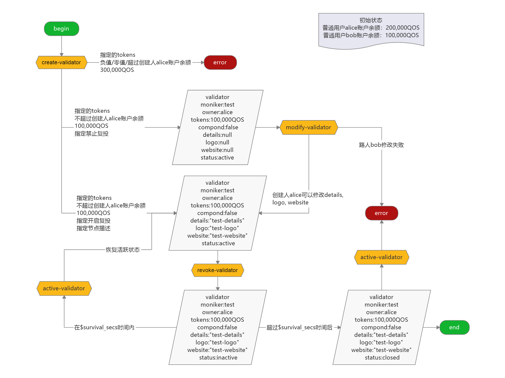

# qoscli validator 模块测试

## 测试准备

> 无

## 测试内容

#### 涉及到的写入命令 

| Command                      | Alias | Has-Subcommand | Description    |
|:-----------------------------|:------|:---------------|:---------------|
| `qoscli tx active-validator` | -     | ✖              | 激活(Active)验证人  |
| `qoscli tx create-validator` | -     | ✖              | 创建用自委托初始化的新验证人 |
| `qoscli tx modify-validator` | -     | ✖              | 修改已存在的验证人账户    |
| `qoscli tx revoke-validator` | -     | ✖              | 撤销(Revoke)验证人  |

#### 涉及到的查询命令 

| Command                              | Alias                            | Has-Subcommand | Description                 |
|:-------------------------------------|:---------------------------------|:---------------|:----------------------------|
| `qoscli query tendermint-validators` | `qoscli q tendermint-validators` | ✖              | 获取给定高度的tendermint验证人集合      |
| `qoscli query validator`             | `qoscli q validator`             | ✖              | 查询验证人的信息                    |
| `qoscli query validator-miss-vote`   | `qoscli q validator-miss-vote`   | ✖              | 查询最近投票窗口中的验证人漏块(错过投票)信息     |
| `qoscli query validator-period`      | `qoscli q validator-period`      | ✖              | 查询分发(distribution)验证人周期信息   |
| `qoscli query validators`            | `qoscli q validators`            | ✖              | 查询所有验证人的信息                  |
| `qoscli query account`               | `qoscli q account`               | ✖              | 按地址(address)或名称(name)查询帐户信息 |

#### 测试路径图



#### 测试路径

> 初始状态
> - Genesis验证人用户`node`账户余额: 500,000QOS
> - 普通用户`alice`账户余额: 200,000QOS
> - 普通用户`bob`账户余额: 100,000QOS
> - 普通用户`charles`账户余额: 500,000QOS

1. 创建验证人节点: 令普通用户`alice`成为验证人Owner
    1. 绑定的Tokens为负值: -100,000QOS
    2. 绑定的Tokens为零值: 0QOS
    3. 绑定的Tokens不超过`alice`账户余额: 100,000QOS
        1. 禁止复投, 不指定节点描述(details, logo, website)
        2. 禁止复投, 指定节点描述(details, logo, website)
        3. 开启复投, 不指定节点描述(details, logo, website)
        4. 开启复投, 指定节点描述(details, logo, website)
    4. 绑定的Tokens超过`alice`账户余额: 300,000QOS
    
2. 修改验证人节点描述(details, logo, website): 验证人Owner`alice`
    1. 验证人节点处于`active`状态
        1. 修改人为验证人Owner`alice`
        2. 修改人为普通用户`bob`
    2. 验证人节点处于`inactive`状态(关停`$survival_secs`时间以内, 本测试网中为600秒以内)
    3. 验证人节点处于`closed`状态(关停`$survival_secs`时间以上, 本测试网中为600秒以上)

3. 关停(revoke)验证人节点: 验证人Owner`alice`
    1. 验证人节点处于`active`状态
        1. 操作人为验证人Owner`alice`
        2. 操作人为普通用户`bob`
    2. 验证人节点处于`inactive`状态(关停`$survival_secs`时间以内, 本测试网中为600秒以内)
    3. 验证人节点处于`closed`状态(关停`$survival_secs`时间以上, 本测试网中为600秒以上)
    
4. 激活验证人节点: 验证人Owner`alice`
    1. 验证人节点处于`active`状态
    2. 验证人节点处于`inactive`状态(关停`$survival_secs`时间以内, 本测试网中为600秒以内)
    3. 验证人节点处于`closed`状态(关停`$survival_secs`时间以上, 本测试网中为600秒以上)

## 测试过程

1. 创建验证人节点: 令普通用户`alice`成为验证人Owner
    > 创建验证人节点`alice`之前的验证人节点列表:
    > ```bash
    > $ ./qoscli query validators --indent
    > [
    >   {
    >     "owner": "address1qgwgmpsrd6anj3qjvjsqztj3xt9v24c4mh77x3",
    >     "validatorAddress": "71A8FBB1E4A854A360613199F5970F64F8F30A59",
    >     "validatorPubkey": {
    >       "type": "tendermint/PubKeyEd25519",
    >       "value": "6k8y++Pgbgz0rppLFYsV4tW6vLgKvhmn93FJFu7R7GU="
    >     },
    >     "bondTokens": "405173114",
    >     "description": {
    >       "moniker": "central",
    >       "logo": "",
    >       "website": "",
    >       "details": ""
    >     },
    >     "status": "active",
    >     "InactiveDesc": "",
    >     "inactiveTime": "0001-01-01T00:00:00Z",
    >     "inactiveHeight": "0",
    >     "bondHeight": "0"
    >   }
    > ]
    > ```
    1. 绑定的Tokens为负值: -100,000QOS
    ```bash
    $ ./qoscli tx create-validator --moniker test --owner alice --tokens -100000 --indent
    Password to sign with 'alice':<输入密码>
    null
    ERROR: broadcast_tx_commit: Response error: RPC error -32603 - Internal error: Timed out waiting for tx to be included in a block
    ```
    2. 绑定的Tokens为零值: 0QOS
    ```bash
    $ ./qoscli tx create-validator --moniker test --owner alice --tokens 0 --indent
    null
    ERROR: tokens lte zero
    ```
    3. 绑定的Tokens不超过`alice`账户余额: 100,000QOS
        1. 禁止复投, 不指定节点描述(details, logo, website)
        ```bash
        $ ./qoscli tx create-validator --moniker test --owner alice --tokens 100000 --indent
        Password to sign with 'alice':<输入密码>
        {
          "check_tx": {
            "gasWanted": "100000",
            "gasUsed": "8526"
          },
          "deliver_tx": {
            "gasWanted": "100000",
            "gasUsed": "44870",
            "tags": [
              {
                "key": "YWN0aW9u",
                "value": "Y3JlYXRlLXZhbGlkYXRvcg=="
              },
              {
                "key": "dmFsaWRhdG9y",
                "value": "YWRkcmVzczEwYzZzZDVxcTBkcWtyNGZwMGFyMnpseW1xOTdtNHoyZmV1aDlldQ=="
              },
              {
                "key": "b3duZXI=",
                "value": "YWRkcmVzczFlcXFuYXBzMDRsNmh0OXhhaHRyZmdnNTlrc2xsY3E5cXI4NjMwcQ=="
              },
              {
                "key": "ZGVsZWdhdG9y",
                "value": "YWRkcmVzczFlcXFuYXBzMDRsNmh0OXhhaHRyZmdnNTlrc2xsY3E5cXI4NjMwcQ=="
              }
            ]
          },
          "hash": "9C53A88CFEBB5AF0BD4B5D2CCFF04746C0832DA475A7999D1D85FB1BE176FCEE",
          "height": "107"
        }
        ```
        创建验证人节点`alice`之后的验证人节点列表:
        ```bash
        $ ./qoscli query validators --indent
        [
          {
            "owner": "address1qgwgmpsrd6anj3qjvjsqztj3xt9v24c4mh77x3",
            "validatorAddress": "71A8FBB1E4A854A360613199F5970F64F8F30A59",
            "validatorPubkey": {
              "type": "tendermint/PubKeyEd25519",
              "value": "6k8y++Pgbgz0rppLFYsV4tW6vLgKvhmn93FJFu7R7GU="
            },
            "bondTokens": "724973476",
            "description": {
              "moniker": "central",
              "logo": "",
              "website": "",
              "details": ""
            },
            "status": "active",
            "InactiveDesc": "",
            "inactiveTime": "0001-01-01T00:00:00Z",
            "inactiveHeight": "0",
            "bondHeight": "0"
          },
          {
            "owner": "address1eqqnaps04l6ht9xahtrfgg59ksllcq9qr8630q",
            "validatorAddress": "7E3506D0007B4161D5217F46A17C9B017DBA8949",
            "validatorPubkey": {
              "type": "tendermint/PubKeyEd25519",
              "value": "KA2fA/q04VaMrCda9gMyp+mCdFBV33bHxfrmr2LC4g8="
            },
            "bondTokens": "100000",
            "description": {
              "moniker": "test",
              "logo": "",
              "website": "",
              "details": ""
            },
            "status": "active",
            "InactiveDesc": "",
            "inactiveTime": "0001-01-01T00:00:00Z",
            "inactiveHeight": "0",
            "bondHeight": "107"
          }
        ]
        ```
        2. 禁止复投, 指定节点描述(details, logo, website)
        ```bash
        $ ./qoscli tx create-validator --moniker test --owner alice --tokens 100000 --details "test-details" --logo "test-logo" --website "test-website" --indent
        Password to sign with 'alice':<输入密码>
        {
          "check_tx": {
            "gasWanted": "100000",
            "gasUsed": "8526"
          },
          "deliver_tx": {
            "gasWanted": "100000",
            "gasUsed": "46040",
            "tags": [
              {
                "key": "YWN0aW9u",
                "value": "Y3JlYXRlLXZhbGlkYXRvcg=="
              },
              {
                "key": "dmFsaWRhdG9y",
                "value": "YWRkcmVzczEwYzZzZDVxcTBkcWtyNGZwMGFyMnpseW1xOTdtNHoyZmV1aDlldQ=="
              },
              {
                "key": "b3duZXI=",
                "value": "YWRkcmVzczFlcXFuYXBzMDRsNmh0OXhhaHRyZmdnNTlrc2xsY3E5cXI4NjMwcQ=="
              },
              {
                "key": "ZGVsZWdhdG9y",
                "value": "YWRkcmVzczFlcXFuYXBzMDRsNmh0OXhhaHRyZmdnNTlrc2xsY3E5cXI4NjMwcQ=="
              }
            ]
          },
          "hash": "33A83373136D4C739DE0CAF2C024BC81746BB7C7EC3C5C3E8C4FD23F7C22E244",
          "height": "57"
        }
        ```
        创建验证人节点`alice`之后的验证人节点列表:
        ```bash
        $ ./qoscli query validators --indent
        [
          {
            "owner": "address1qgwgmpsrd6anj3qjvjsqztj3xt9v24c4mh77x3",
            "validatorAddress": "71A8FBB1E4A854A360613199F5970F64F8F30A59",
            "validatorPubkey": {
              "type": "tendermint/PubKeyEd25519",
              "value": "6k8y++Pgbgz0rppLFYsV4tW6vLgKvhmn93FJFu7R7GU="
            },
            "bondTokens": "459793473",
            "description": {
              "moniker": "central",
              "logo": "",
              "website": "",
              "details": ""
            },
            "status": "active",
            "InactiveDesc": "",
            "inactiveTime": "0001-01-01T00:00:00Z",
            "inactiveHeight": "0",
            "bondHeight": "0"
          },
          {
            "owner": "address1eqqnaps04l6ht9xahtrfgg59ksllcq9qr8630q",
            "validatorAddress": "7E3506D0007B4161D5217F46A17C9B017DBA8949",
            "validatorPubkey": {
              "type": "tendermint/PubKeyEd25519",
              "value": "KA2fA/q04VaMrCda9gMyp+mCdFBV33bHxfrmr2LC4g8="
            },
            "bondTokens": "100000",
            "description": {
              "moniker": "test",
              "logo": "test-logo",
              "website": "test-website",
              "details": "test-details"
            },
            "status": "active",
            "InactiveDesc": "",
            "inactiveTime": "0001-01-01T00:00:00Z",
            "inactiveHeight": "0",
            "bondHeight": "57"
          }
        ]
        ```
        3. 开启复投, 不指定节点描述(details, logo, website)
        ```bash
        $ ./qoscli tx create-validator --moniker test --owner alice --tokens 100000 --compound --indent
        Password to sign with 'alice':<输入密码>
        {
          "check_tx": {
            "gasWanted": "100000",
            "gasUsed": "8526"
          },
          "deliver_tx": {
            "gasWanted": "100000",
            "gasUsed": "44930",
            "tags": [
              {
                "key": "YWN0aW9u",
                "value": "Y3JlYXRlLXZhbGlkYXRvcg=="
              },
              {
                "key": "dmFsaWRhdG9y",
                "value": "YWRkcmVzczEwYzZzZDVxcTBkcWtyNGZwMGFyMnpseW1xOTdtNHoyZmV1aDlldQ=="
              },
              {
                "key": "b3duZXI=",
                "value": "YWRkcmVzczFlcXFuYXBzMDRsNmh0OXhhaHRyZmdnNTlrc2xsY3E5cXI4NjMwcQ=="
              },
              {
                "key": "ZGVsZWdhdG9y",
                "value": "YWRkcmVzczFlcXFuYXBzMDRsNmh0OXhhaHRyZmdnNTlrc2xsY3E5cXI4NjMwcQ=="
              }
            ]
          },
          "hash": "2284886FE69DDAE6024268ACA8B1E42BEBFB02B79D7FA26D917A1149CBF5A6EB",
          "height": "57"
        }
        ```
        创建验证人节点`alice`之后的验证人节点列表:
        ```bash
        $ ./qoscli query validators --indent
        [
          {
            "owner": "address1qgwgmpsrd6anj3qjvjsqztj3xt9v24c4mh77x3",
            "validatorAddress": "71A8FBB1E4A854A360613199F5970F64F8F30A59",
            "validatorPubkey": {
              "type": "tendermint/PubKeyEd25519",
              "value": "6k8y++Pgbgz0rppLFYsV4tW6vLgKvhmn93FJFu7R7GU="
            },
            "bondTokens": "460142767",
            "description": {
              "moniker": "central",
              "logo": "",
              "website": "",
              "details": ""
            },
            "status": "active",
            "InactiveDesc": "",
            "inactiveTime": "0001-01-01T00:00:00Z",
            "inactiveHeight": "0",
            "bondHeight": "0"
          },
          {
            "owner": "address1eqqnaps04l6ht9xahtrfgg59ksllcq9qr8630q",
            "validatorAddress": "7E3506D0007B4161D5217F46A17C9B017DBA8949",
            "validatorPubkey": {
              "type": "tendermint/PubKeyEd25519",
              "value": "KA2fA/q04VaMrCda9gMyp+mCdFBV33bHxfrmr2LC4g8="
            },
            "bondTokens": "112204",
            "description": {
              "moniker": "test",
              "logo": "",
              "website": "",
              "details": ""
            },
            "status": "active",
            "InactiveDesc": "",
            "inactiveTime": "0001-01-01T00:00:00Z",
            "inactiveHeight": "0",
            "bondHeight": "57"
          }
        ]
        ```
        4. 开启复投, 指定节点描述(details, logo, website)
        ```bash
        $ ./qoscli tx create-validator --moniker test --owner alice --tokens 100000 --compound --details "test-details" --logo "test-logo" --website "test-website" --indent
        Password to sign with 'alice':<输入密码>
        {
          "check_tx": {
            "gasWanted": "100000",
            "gasUsed": "8526"
          },
          "deliver_tx": {
            "gasWanted": "100000",
            "gasUsed": "46100",
            "tags": [
              {
                "key": "YWN0aW9u",
                "value": "Y3JlYXRlLXZhbGlkYXRvcg=="
              },
              {
                "key": "dmFsaWRhdG9y",
                "value": "YWRkcmVzczEwYzZzZDVxcTBkcWtyNGZwMGFyMnpseW1xOTdtNHoyZmV1aDlldQ=="
              },
              {
                "key": "b3duZXI=",
                "value": "YWRkcmVzczFlcXFuYXBzMDRsNmh0OXhhaHRyZmdnNTlrc2xsY3E5cXI4NjMwcQ=="
              },
              {
                "key": "ZGVsZWdhdG9y",
                "value": "YWRkcmVzczFlcXFuYXBzMDRsNmh0OXhhaHRyZmdnNTlrc2xsY3E5cXI4NjMwcQ=="
              }
            ]
          },
          "hash": "67D9AF2BA1ECCC187CF1E4BCF3D3A2B99FF88E2A479FAB18C96A6104183C385D",
          "height": "57"
        }
        ```
        创建验证人节点`alice`之后的验证人节点列表:
        ```bash
        $ ./qoscli query validators --indent
        [
          {
            "owner": "address1qgwgmpsrd6anj3qjvjsqztj3xt9v24c4mh77x3",
            "validatorAddress": "71A8FBB1E4A854A360613199F5970F64F8F30A59",
            "validatorPubkey": {
              "type": "tendermint/PubKeyEd25519",
              "value": "6k8y++Pgbgz0rppLFYsV4tW6vLgKvhmn93FJFu7R7GU="
            },
            "bondTokens": "460515603",
            "description": {
              "moniker": "central",
              "logo": "",
              "website": "",
              "details": ""
            },
            "status": "active",
            "InactiveDesc": "",
            "inactiveTime": "0001-01-01T00:00:00Z",
            "inactiveHeight": "0",
            "bondHeight": "0"
          },
          {
            "owner": "address1eqqnaps04l6ht9xahtrfgg59ksllcq9qr8630q",
            "validatorAddress": "7E3506D0007B4161D5217F46A17C9B017DBA8949",
            "validatorPubkey": {
              "type": "tendermint/PubKeyEd25519",
              "value": "KA2fA/q04VaMrCda9gMyp+mCdFBV33bHxfrmr2LC4g8="
            },
            "bondTokens": "112282",
            "description": {
              "moniker": "test",
              "logo": "test-logo",
              "website": "test-website",
              "details": "test-details"
            },
            "status": "active",
            "InactiveDesc": "",
            "inactiveTime": "0001-01-01T00:00:00Z",
            "inactiveHeight": "0",
            "bondHeight": "57"
          }
        ]
        ```
    4. 绑定的Tokens超过`alice`账户余额: 300,000QOS
    ```bash
    $ ./qoscli tx create-validator --moniker test --owner alice --tokens 300000 --indent
    Password to sign with 'alice':<输入密码>
    {
      "check_tx": {
        "code": 1,
        "log": "{\"codespace\":\"sdk\",\"code\":1,\"message\":\"TxStd's ITx ValidateData error:  ERROR:\\nCodespace: stake\\nCode: 503\\nMessage: \\\"No enough QOS in account: address1eqqnaps04l6ht9xahtrfgg59ksllcq9qr8630q\\\"\\n\"}",
        "gasWanted": "100000",
        "gasUsed": "1108"
      },
      "deliver_tx": {},
      "hash": "41C6C4CCA9952792BFB69C7513CBFD8761099BA9E1F0032EC3B25301F5871F44",
      "height": "0"
    }
    ERROR: {"codespace":"sdk","code":1,"message":"TxStd's ITx ValidateData error:  ERROR:\nCodespace: stake\nCode: 503\nMessage: \"No enough QOS in account: address1eqqnaps04l6ht9xahtrfgg59ksllcq9qr8630q\"\n"}
    ```
    
2. 修改验证人节点描述(moniker, details, logo, website): 验证人Owner`alice`
    1. 验证人节点处于`active`状态
        1. 修改人为验证人Owner`alice`
        ```bash
        $ ./qoscli tx modify-validator --owner alice --moniker test1  --details "test-details-modified" --logo "test-logo-modified" --website "test-website-modified" --indent
        Password to sign with 'alice':<输入密码>
        {
          "check_tx": {
            "gasWanted": "100000",
            "gasUsed": "6571"
          },
          "deliver_tx": {
            "gasWanted": "100000",
            "gasUsed": "15660",
            "tags": [
              {
                "key": "YWN0aW9u",
                "value": "bW9kaWZ5LXZhbGlkYXRvcg=="
              },
              {
                "key": "b3duZXI=",
                "value": "YWRkcmVzczFlcXFuYXBzMDRsNmh0OXhhaHRyZmdnNTlrc2xsY3E5cXI4NjMwcQ=="
              },
              {
                "key": "ZGVsZWdhdG9y",
                "value": "YWRkcmVzczFlcXFuYXBzMDRsNmh0OXhhaHRyZmdnNTlrc2xsY3E5cXI4NjMwcQ=="
              }
            ]
          },
          "hash": "ADB0A0E0079F382B5D0609794726FBC531EF164A3D288D1E7CD4C0233FE6C28C",
          "height": "140"
        }
        ```
        修改之后的验证人节点`alice`:
        ```bash
        $ ./qoscli query validator alice --indent
        {
          "owner": "address1eqqnaps04l6ht9xahtrfgg59ksllcq9qr8630q",
          "validatorAddress": "7E3506D0007B4161D5217F46A17C9B017DBA8949",
          "validatorPubkey": {
            "type": "tendermint/PubKeyEd25519",
            "value": "KA2fA/q04VaMrCda9gMyp+mCdFBV33bHxfrmr2LC4g8="
          },
          "bondTokens": "187853",
          "description": {
            "moniker": "test1",
            "logo": "test-logo-modified",
            "website": "test-website-modified",
            "details": "test-details-modified"
          },
          "status": "active",
          "InactiveDesc": "",
          "inactiveTime": "0001-01-01T00:00:00Z",
          "inactiveHeight": "0",
          "bondHeight": "57"
        }
        ```
        2. 修改人为普通用户`bob`
        ```bash
        $ ./qoscli tx modify-validator --owner bob --moniker test1  --details "test-details-modified" --logo "test-logo-modified" --website "test-website-modified" --indent
        Password to sign with 'bob':<输入密码>
        {
          "check_tx": {
            "code": 1,
            "log": "{\"codespace\":\"sdk\",\"code\":1,\"message\":\"TxStd's ITx ValidateData error:  ERROR:\\nCodespace: stake\\nCode: 505\\nMessage: \\\"address15fc26swvguzy9wksha9506smj2gne5r3k7na3r has no validator\\\"\\n\"}",
            "gasWanted": "100000",
            "gasUsed": "1000"
          },
          "deliver_tx": {},
          "hash": "0C74CC6CDD034E6185057215F3570F15A1503B1FB85544438F4E849D05E12202",
          "height": "0"
        }
        ERROR: {"codespace":"sdk","code":1,"message":"TxStd's ITx ValidateData error:  ERROR:\nCodespace: stake\nCode: 505\nMessage: \"address15fc26swvguzy9wksha9506smj2gne5r3k7na3r has no validator\"\n"}
        ```
    2. 验证人节点处于`inactive`状态(关停`$survival_secs`时间以内, 本测试网中为600秒以内)
    ```bash
    $ ./qoscli tx modify-validator --owner alice --moniker test2  --details "test-details-modified2" --logo "test-logo-modified2" --website "test-website-modified2" --indent
    Password to sign with 'alice':<输入密码>
    {
      "check_tx": {
        "gasWanted": "100000",
        "gasUsed": "6571"
      },
      "deliver_tx": {
        "gasWanted": "100000",
        "gasUsed": "16100",
        "tags": [
          {
            "key": "YWN0aW9u",
            "value": "bW9kaWZ5LXZhbGlkYXRvcg=="
          },
          {
            "key": "b3duZXI=",
            "value": "YWRkcmVzczFlcXFuYXBzMDRsNmh0OXhhaHRyZmdnNTlrc2xsY3E5cXI4NjMwcQ=="
          },
          {
            "key": "ZGVsZWdhdG9y",
            "value": "YWRkcmVzczFlcXFuYXBzMDRsNmh0OXhhaHRyZmdnNTlrc2xsY3E5cXI4NjMwcQ=="
          }
        ]
      },
      "hash": "305B3EB3E3EC577A403D6B2A9D8F35A95FA48873583F96A43DD5A2B79423A2FE",
      "height": "298"
    }
    ```
    修改之后的验证人节点`alice`:
    ```bash
    $ ./qoscli query validator alice --indent
    {
      "owner": "address1eqqnaps04l6ht9xahtrfgg59ksllcq9qr8630q",
      "validatorAddress": "7E3506D0007B4161D5217F46A17C9B017DBA8949",
      "validatorPubkey": {
        "type": "tendermint/PubKeyEd25519",
        "value": "KA2fA/q04VaMrCda9gMyp+mCdFBV33bHxfrmr2LC4g8="
      },
      "bondTokens": "241950",
      "description": {
        "moniker": "test2",
        "logo": "test-logo-modified2",
        "website": "test-website-modified2",
        "details": "test-details-modified2"
      },
      "status": "inactive",
      "InactiveDesc": "Revoked",
      "inactiveTime": "2019-08-20T08:15:40.279031658Z",
      "inactiveHeight": "258",
      "bondHeight": "57"
    }
    ```
    3. 验证人节点处于`closed`状态(关停`$survival_secs`时间以上, 本测试网中为600秒以上)
    ```bash
    $ ./qoscli tx modify-validator --owner alice --moniker test3 --details "test-details-modified3" --logo "test-logo-modified3" --website "test-website-modified3" --indent
    Password to sign with 'alice':<输入密码>
    {
      "check_tx": {
        "code": 1,
        "log": "{\"codespace\":\"sdk\",\"code\":1,\"message\":\"TxStd's ITx ValidateData error:  ERROR:\\nCodespace: stake\\nCode: 505\\nMessage: \\\"address1eqqnaps04l6ht9xahtrfgg59ksllcq9qr8630q has no validator\\\"\\n\"}",
        "gasWanted": "100000",
        "gasUsed": "1000"
      },
      "deliver_tx": {},
      "hash": "A6F694E43B32204031F9CD8EC37841957BDD3C13A7F86BE500D7E9EC92E200FA",
      "height": "0"
    }
    ERROR: {"codespace":"sdk","code":1,"message":"TxStd's ITx ValidateData error:  ERROR:\nCodespace: stake\nCode: 505\nMessage: \"address1eqqnaps04l6ht9xahtrfgg59ksllcq9qr8630q has no validator\"\n"}
    ```
    
3. 关停(revoke)验证人节点: 验证人Owner`alice`
    1. 验证人节点处于`active`状态
        1. 操作人为验证人Owner`alice`
        ```bash
        $ ./qoscli tx revoke-validator --owner alice --indent
        Password to sign with 'alice':<输入密码>
        {
          "check_tx": {
            "gasWanted": "100000",
            "gasUsed": "8036"
          },
          "deliver_tx": {
            "gasWanted": "100000",
            "gasUsed": "22060",
            "tags": [
              {
                "key": "YWN0aW9u",
                "value": "cmV2b2tlLXZhbGlkYXRvcg=="
              },
              {
                "key": "dmFsaWRhdG9y",
                "value": "YWRkcmVzczEwYzZzZDVxcTBkcWtyNGZwMGFyMnpseW1xOTdtNHoyZmV1aDlldQ=="
              },
              {
                "key": "b3duZXI=",
                "value": "YWRkcmVzczFlcXFuYXBzMDRsNmh0OXhhaHRyZmdnNTlrc2xsY3E5cXI4NjMwcQ=="
              }
            ]
          },
          "hash": "8134089512217A38B5E3F0F69E84A9EF5AE293925CD0E0A3988503E54C5C651D",
          "height": "258"
        }
        ```
        关停之后的验证人`alice`:
        ```bash
        $ ./qoscli query validator alice --indent
        {
          "owner": "address1eqqnaps04l6ht9xahtrfgg59ksllcq9qr8630q",
          "validatorAddress": "7E3506D0007B4161D5217F46A17C9B017DBA8949",
          "validatorPubkey": {
            "type": "tendermint/PubKeyEd25519",
            "value": "KA2fA/q04VaMrCda9gMyp+mCdFBV33bHxfrmr2LC4g8="
          },
          "bondTokens": "241569",
          "description": {
            "moniker": "test1",
            "logo": "test-logo-modified",
            "website": "test-website-modified",
            "details": "test-details-modified"
          },
          "status": "inactive",
          "InactiveDesc": "Revoked",
          "inactiveTime": "2019-08-20T08:15:40.279031658Z",
          "inactiveHeight": "258",
          "bondHeight": "57"
        }
        ```
        2. 操作人为普通用户`bob`
        ```bash
        $ ./qoscli tx revoke-validator --owner bob --indent
        Password to sign with 'bob':<输入密码>
        {
          "check_tx": {
            "code": 1,
            "log": "{\"codespace\":\"sdk\",\"code\":1,\"message\":\"TxStd's ITx ValidateData error:  ERROR:\\nCodespace: stake\\nCode: 506\\nMessage: \\\"address15fc26swvguzy9wksha9506smj2gne5r3k7na3r does't have validator.\\\"\\n\"}",
            "gasWanted": "100000",
            "gasUsed": "1000"
          },
          "deliver_tx": {},
          "hash": "803386FC083BA39B54C39E34663D2E511A2782B154AF28C745BE58DF625FD9CD",
          "height": "0"
        }
        ERROR: {"codespace":"sdk","code":1,"message":"TxStd's ITx ValidateData error:  ERROR:\nCodespace: stake\nCode: 506\nMessage: \"address15fc26swvguzy9wksha9506smj2gne5r3k7na3r does't have validator.\"\n"}
        ```
    2. 验证人节点处于`inactive`状态(关停`$survival_secs`时间以内, 本测试网中为600秒以内)
    ```bash
    $ ./qoscli tx revoke-validator --owner alice --indent
    Password to sign with 'alice':<输入密码>
    {
      "check_tx": {
        "code": 1,
        "log": "{\"codespace\":\"sdk\",\"code\":1,\"message\":\"TxStd's ITx ValidateData error:  validator status not match. except: 0, actual:1\"}",
        "gasWanted": "100000",
        "gasUsed": "2552"
      },
      "deliver_tx": {},
      "hash": "89D8F34DDE898E743401B3E8B01874A20F76AB95F9FE0257FF907A784F13D6FD",
      "height": "0"
    }
    ERROR: {"codespace":"sdk","code":1,"message":"TxStd's ITx ValidateData error:  validator status not match. except: 0, actual:1"}
    ```
    3. 验证人节点处于`closed`状态(关停`$survival_secs`时间以上, 本测试网中为600秒以上)
    ```bash
    $ ./qoscli tx revoke-validator --owner alice --indent
    Password to sign with 'alice':<输入密码>
    {
      "check_tx": {
        "code": 1,
        "log": "{\"codespace\":\"sdk\",\"code\":1,\"message\":\"TxStd's ITx ValidateData error:  ERROR:\\nCodespace: stake\\nCode: 506\\nMessage: \\\"address1eqqnaps04l6ht9xahtrfgg59ksllcq9qr8630q does't have validator.\\\"\\n\"}",
        "gasWanted": "100000",
        "gasUsed": "1000"
      },
      "deliver_tx": {},
      "hash": "7EEEE2116175A115F02F378BF2CF197166D43897C6B03FCF2B28A41DE602DB76",
      "height": "0"
    }
    ERROR: {"codespace":"sdk","code":1,"message":"TxStd's ITx ValidateData error:  ERROR:\nCodespace: stake\nCode: 506\nMessage: \"address1eqqnaps04l6ht9xahtrfgg59ksllcq9qr8630q does't have validator.\"\n"}
    ```
    
4. 激活验证人节点: 验证人Owner`alice`
    1. 验证人节点处于`active`状态
    ```bash
    $ ./qoscli tx active-validator --owner alice --indent
    Password to sign with 'alice':<输入密码>
    {
      "check_tx": {
        "code": 1,
        "log": "{\"codespace\":\"sdk\",\"code\":1,\"message\":\"TxStd's ITx ValidateData error:  validator status not match. except: 1, actual:0\"}",
        "gasWanted": "100000",
        "gasUsed": "2555"
      },
      "deliver_tx": {},
      "hash": "960E301CDBE742B0BCBDE0DCF0CD7B83E61196B5A66F934E1B286D2C0D03C4F2",
      "height": "0"
    }
    ERROR: {"codespace":"sdk","code":1,"message":"TxStd's ITx ValidateData error:  validator status not match. except: 1, actual:0"}
    ```
    2. 验证人节点处于`inactive`状态(关停`$survival_secs`时间以内, 本测试网中为600秒以内)
    ```bash
    $ ./qoscli tx active-validator --owner alice --indent
    Password to sign with 'alice':<输入密码>
    {
      "check_tx": {
        "gasWanted": "100000",
        "gasUsed": "8069"
      },
      "deliver_tx": {
        "gasWanted": "100000",
        "gasUsed": "23070",
        "tags": [
          {
            "key": "YWN0aW9u",
            "value": "YWN0aXZlLXZhbGlkYXRvcg=="
          },
          {
            "key": "dmFsaWRhdG9y",
            "value": "YWRkcmVzczEwYzZzZDVxcTBkcWtyNGZwMGFyMnpseW1xOTdtNHoyZmV1aDlldQ=="
          },
          {
            "key": "b3duZXI=",
            "value": "YWRkcmVzczFlcXFuYXBzMDRsNmh0OXhhaHRyZmdnNTlrc2xsY3E5cXI4NjMwcQ=="
          }
        ]
      },
      "hash": "8ED395C1B8751E3200102A77C30EEE64D45C68270E7F843F07DF4FB556E79860",
      "height": "339"
    }
    ```
    3. 验证人节点处于`closed`状态(关停`$survival_secs`时间以上, 本测试网中为600秒以上)
    ```bash
    $ ./qoscli tx active-validator --owner alice --indent
    Password to sign with 'alice':<输入密码>
    {
      "check_tx": {
        "code": 1,
        "log": "{\"codespace\":\"sdk\",\"code\":1,\"message\":\"TxStd's ITx ValidateData error:  ERROR:\\nCodespace: stake\\nCode: 506\\nMessage: \\\"address1eqqnaps04l6ht9xahtrfgg59ksllcq9qr8630q does't have validator.\\\"\\n\"}",
        "gasWanted": "100000",
        "gasUsed": "1000"
      },
      "deliver_tx": {},
      "hash": "05EE391AE1A3F1762D9218242BABDFE52E33A3357A47607C33061FE5A5C0F5D8",
      "height": "0"
    }
    ERROR: {"codespace":"sdk","code":1,"message":"TxStd's ITx ValidateData error:  ERROR:\nCodespace: stake\nCode: 506\nMessage: \"address1eqqnaps04l6ht9xahtrfgg59ksllcq9qr8630q does't have validator.\"\n"}
    ```
    