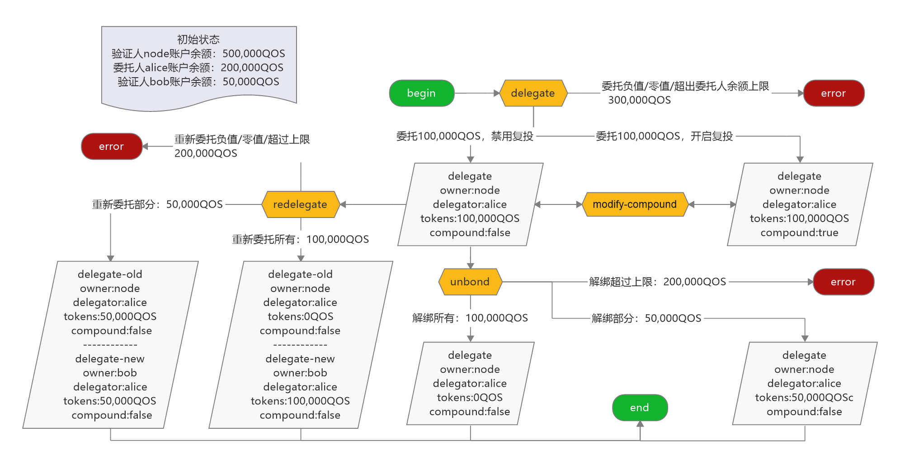

# qoscli delegation 模块测试

## 测试准备

1. 使`bob`成为验证人, 绑定`50,000QOS`

```bash
$ ./qoscli tx create-validator --moniker bob --owner bob --tokens 50000 --compound --indent
Password to sign with 'bob':<输入密码>
{
  "check_tx": {
    "gasWanted": "100000",
    "gasUsed": "8526"
  },
  "deliver_tx": {
    "gasWanted": "100000",
    "gasUsed": "44870",
    "tags": [
      {
        "key": "YWN0aW9u",
        "value": "Y3JlYXRlLXZhbGlkYXRvcg=="
      },
      {
        "key": "dmFsaWRhdG9y",
        "value": "YWRkcmVzczEwYzZzZDVxcTBkcWtyNGZwMGFyMnpseW1xOTdtNHoyZmV1aDlldQ=="
      },
      {
        "key": "b3duZXI=",
        "value": "YWRkcmVzczE1ZmMyNnN3dmd1enk5d2tzaGE5NTA2c21qMmduZTVyM2s3bmEzcg=="
      },
      {
        "key": "ZGVsZWdhdG9y",
        "value": "YWRkcmVzczE1ZmMyNnN3dmd1enk5d2tzaGE5NTA2c21qMmduZTVyM2s3bmEzcg=="
      }
    ]
  },
  "hash": "9CACE98E4D3C395F900E3D8562BE3BB61BFC3B9921EB3E9007675D130BAFC4D4",
  "height": "67"
}
```

## 测试内容

#### 涉及到的写入命令 

| Command                     | Alias | Has-Subcommand | Description           |
|:----------------------------|:------|:---------------|:----------------------|
| `qoscli tx delegate`        | -     | ✖              | 向验证人委托QOS             |
| `qoscli tx modify-compound` | -     | ✖              | 修改一个委托的复投信息           |
| `qoscli tx redelegate`      | -     | ✖              | 将QOS从一个验证人重新委托到另一个验证人 |
| `qoscli tx unbond`          | -     | ✖              | 从验证人解除QOS委托           |


#### 涉及到的查询命令 

| Command                         | Alias                       | Has-Subcommand | Description                    |
|:--------------------------------|:----------------------------|:---------------|:-------------------------------|
| `qoscli query delegation`       | `qoscli q delegation`       | ✖              | 查询委托信息                         |
| `qoscli query delegations`      | `qoscli q delegations`      | ✖              | 查询一个委托人的所有委托                   |
| `qoscli query delegations-to`   | `qoscli q delegations-to`   | ✖              | 查询一个验证人所接收的所有委托                |
| `qoscli query delegator-income` | `qoscli q delegator-income` | ✖              | 查询分发(distribution)委托人收入信息      |
| `qoscli query redelegations`    | `qoscli q redelegations`    | ✖              | 查询一个委托人的所有重委托请求(redelegations) |
| `qoscli query unbondings`       | `qoscli q unbondings`       | ✖              | 查询一个委托人的所有正在解除绑定(unbonding)的委托 |
| `qoscli query account`          | `qoscli q account`          | ✖              | 按地址(address)或名称(name)查询帐户信息    |

#### 测试路径图



#### 测试路径

> 初始状态
> - 验证人`node`账户余额：500,000QOS
> - 验证人`bob`账户余额：50,000QOS
> - 委托人`alice`账户余额：200,000QOS

1. 发起委托: 委托人`alice`，验证人`node`
    1. 委托金额为负数: -100,000QOS
    2. 委托金额为零值: 0QOS
    3. 委托金额未超出委托人`alice`余额上限: 100,000QOS
        1. 开启复投(compound=true)
        2. 禁用复投(compound=false)
    4. 委托金额超出委托人`alice`余额上限: 300,000QOS

2. 修改复投方式: 委托人`alice`，验证人`node`
    > 已存在的委托: `禁用复投`
    > ```bash
    > $ ./qoscli query delegation --owner node --delegator alice --indent
    > {
    >   "delegator_address": "address1eqqnaps04l6ht9xahtrfgg59ksllcq9qr8630q",
    >   "owner_address": "address1qgwgmpsrd6anj3qjvjsqztj3xt9v24c4mh77x3",
    >   "validator_pub_key": {
    >     "type": "tendermint/PubKeyEd25519",
    >     "value": "6k8y++Pgbgz0rppLFYsV4tW6vLgKvhmn93FJFu7R7GU="
    >   },
    >   "delegate_amount": "100000",
    >   "is_compound": false
    > }
    > ```
    1. 由`禁用复投`修改为`禁用复投`
    2. 由`禁用复投`修改为`启用复投`
    3. 由`启用复投`修改为`启用复投`
    4. 由`启用复投`修改为`禁用复投`

3. 解除绑定: 委托人`alice`，验证人`node`
    > 已存在的委托: `禁用复投`
    > ```bash
    > $ ./qoscli query delegation --owner node --delegator alice --indent
    > {
    >   "delegator_address": "address1eqqnaps04l6ht9xahtrfgg59ksllcq9qr8630q",
    >   "owner_address": "address1qgwgmpsrd6anj3qjvjsqztj3xt9v24c4mh77x3",
    >   "validator_pub_key": {
    >     "type": "tendermint/PubKeyEd25519",
    >     "value": "6k8y++Pgbgz0rppLFYsV4tW6vLgKvhmn93FJFu7R7GU="
    >   },
    >   "delegate_amount": "100000",
    >   "is_compound": false
    > }
    > ```
    1. 解绑金额为负数: -100,000QOS
    2. 解绑金额为零值: 0QOS
    3. 解绑金额未超出绑定总额(解绑部分): 50,000QOS
    4. 解绑金额等于绑定总额(解绑所有): 100,000QOS
    5. 解绑金额超过绑定总额(解绑超出上限): 200,000QOS

4. 重新委托: 委托人`alice`，原验证人`node`，新验证人`bob`
    > 已存在的委托: `禁用复投`
    > ```bash
    > $ ./qoscli query delegation --owner node --delegator alice --indent
    > {
    >   "delegator_address": "address1eqqnaps04l6ht9xahtrfgg59ksllcq9qr8630q",
    >   "owner_address": "address1qgwgmpsrd6anj3qjvjsqztj3xt9v24c4mh77x3",
    >   "validator_pub_key": {
    >     "type": "tendermint/PubKeyEd25519",
    >     "value": "6k8y++Pgbgz0rppLFYsV4tW6vLgKvhmn93FJFu7R7GU="
    >   },
    >   "delegate_amount": "50000",
    >   "is_compound": false
    > }
    > ```
    1. 重委托金额为负数: -100,000QOS
    2. 重委托金额为零值: 0QOS
    3. 重委托金额未超出原验证人处绑定总额(转移部分): 50,000QOS
    4. 重委托金额等于原验证人处绑定总额(转移所有): 100,000QOS
    5. 重委托金额超过原验证人处绑定总额(转移超出上限): 200,000QOS
    
## 测试过程

1. 发起委托: 委托人`alice`，验证人`node`
    1. 委托金额为负数: -100,000QOS
    ```bash
    $ ./qoscli tx delegate --owner node --delegator alice --tokens -100000 --indent
    null
    ERROR: delegate QOS amount must gt 0
    ```
    2. 委托金额为零值: 0QOS
    ```bash
    $ ./qoscli tx delegate --owner node --delegator alice --tokens 0 --indent
    null
    ERROR: delegate QOS amount must gt 0
    ```
    3. 委托金额未超出委托人`alice`余额上限: 100,000QOS
        1. 开启复投(compound=true)
        ```bash
        $ ./qoscli tx delegate --owner node --delegator alice --tokens 100000 --compound --indent
        Password to sign with 'alice':<输入密码>
        {
          "check_tx": {
            "gasWanted": "100000",
            "gasUsed": "8862"
          },
          "deliver_tx": {
            "gasWanted": "100000",
            "gasUsed": "55880",
            "tags": [
              {
                "key": "YWN0aW9u",
                "value": "Y3JlYXRlLWRlbGVnYXRpb24="
              },
              {
                "key": "dmFsaWRhdG9y",
                "value": "YWRkcmVzczF3eDUwaHYweTRwMjJ4Y3JweHh2bHQ5YzB2bnUweHpqZTJuaGt6Mw=="
              },
              {
                "key": "ZGVsZWdhdG9y",
                "value": "YWRkcmVzczFlcXFuYXBzMDRsNmh0OXhhaHRyZmdnNTlrc2xsY3E5cXI4NjMwcQ=="
              }
            ]
          },
          "hash": "DBB42018DBEEBE22062EBE7B9D7F765AFC2E91ED065AE02524F801B4A85FE252",
          "height": "75"
        }
        ```
        创建的委托如下:
        ```bash
        $ ./qoscli query delegation --owner node --delegator alice --indent
        {
          "delegator_address": "address1eqqnaps04l6ht9xahtrfgg59ksllcq9qr8630q",
          "owner_address": "address1qgwgmpsrd6anj3qjvjsqztj3xt9v24c4mh77x3",
          "validator_pub_key": {
            "type": "tendermint/PubKeyEd25519",
            "value": "6k8y++Pgbgz0rppLFYsV4tW6vLgKvhmn93FJFu7R7GU="
          },
          "delegate_amount": "100000",
          "is_compound": true
        }
        ```
        2. 禁用复投(compound=false)
        ```bash
        $ ./qoscli tx delegate --owner node --delegator alice --tokens 100000 --indent
        Password to sign with 'alice':<输入密码>
        {
          "check_tx": {
            "gasWanted": "100000",
            "gasUsed": "8862"
          },
          "deliver_tx": {
            "gasWanted": "100000",
            "gasUsed": "55820",
            "tags": [
              {
                "key": "YWN0aW9u",
                "value": "Y3JlYXRlLWRlbGVnYXRpb24="
              },
              {
                "key": "dmFsaWRhdG9y",
                "value": "YWRkcmVzczF3eDUwaHYweTRwMjJ4Y3JweHh2bHQ5YzB2bnUweHpqZTJuaGt6Mw=="
              },
              {
                "key": "ZGVsZWdhdG9y",
                "value": "YWRkcmVzczFlcXFuYXBzMDRsNmh0OXhhaHRyZmdnNTlrc2xsY3E5cXI4NjMwcQ=="
              }
            ]
          },
          "hash": "2618D39DBFA5613E20859505C41297DAE7F163335F7CBE68FC9B8C1166C31C72",
          "height": "62"
        }
        ```
        创建的委托如下:
        ```bash
        $ ./qoscli query delegation --owner node --delegator alice --indent
        {
          "delegator_address": "address1eqqnaps04l6ht9xahtrfgg59ksllcq9qr8630q",
          "owner_address": "address1qgwgmpsrd6anj3qjvjsqztj3xt9v24c4mh77x3",
          "validator_pub_key": {
            "type": "tendermint/PubKeyEd25519",
            "value": "6k8y++Pgbgz0rppLFYsV4tW6vLgKvhmn93FJFu7R7GU="
          },
          "delegate_amount": "100000",
          "is_compound": false
        }
        ```
    4. 委托金额超出委托人`alice`余额上限: 300,000QOS
    ```bash
    $ ./qoscli tx delegate --owner node --delegator alice --tokens 300000 --indent
    Password to sign with 'alice':<输入密码>
    {
      "check_tx": {
        "code": 1,
        "log": "{\"codespace\":\"sdk\",\"code\":1,\"message\":\"TxStd's ITx ValidateData error:  ERROR:\\nCodespace: stake\\nCode: 503\\nMessage: \\\"No enough QOS in account: address1eqqnaps04l6ht9xahtrfgg59ksllcq9qr8630q\\\"\\n\"}",
        "gasWanted": "100000",
        "gasUsed": "3567"
      },
      "deliver_tx": {},
      "hash": "774623C1BA79476C1B2503F525DBBD6FD4C6607B37135B97484776E97F3E46FB",
      "height": "0"
    }
    ERROR: {"codespace":"sdk","code":1,"message":"TxStd's ITx ValidateData error:  ERROR:\nCodespace: stake\nCode: 503\nMessage: \"No enough QOS in account: address1eqqnaps04l6ht9xahtrfgg59ksllcq9qr8630q\"\n"}
    ```

2. 修改复投方式: 委托人`alice`，验证人`node`
    > 已存在的委托: `禁用复投`
    > ```bash
    > $ ./qoscli query delegation --owner node --delegator alice --indent
    > {
    >   "delegator_address": "address1eqqnaps04l6ht9xahtrfgg59ksllcq9qr8630q",
    >   "owner_address": "address1qgwgmpsrd6anj3qjvjsqztj3xt9v24c4mh77x3",
    >   "validator_pub_key": {
    >     "type": "tendermint/PubKeyEd25519",
    >     "value": "6k8y++Pgbgz0rppLFYsV4tW6vLgKvhmn93FJFu7R7GU="
    >   },
    >   "delegate_amount": "100000",
    >   "is_compound": false
    > }
    > ```
    1. 由`禁用复投`修改为`禁用复投`
    ```bash
    $ ./qoscli tx modify-compound --owner node --delegator alice --indent
    Password to sign with 'alice':<输入密码>
    {
      "check_tx": {
        "code": 1,
        "log": "{\"codespace\":\"sdk\",\"code\":1,\"message\":\"TxStd's ITx ValidateData error:  ERROR:\\nCodespace: stake\\nCode: 501\\nMessage: \\\"delegator's compound not change\\\"\\n\"}",
        "gasWanted": "100000",
        "gasUsed": "3480"
      },
      "deliver_tx": {},
      "hash": "3E20A7E6129902B6F729BBA56AB26DD3CFD5E01FC541048DF472F9CBDB325A53",
      "height": "0"
    }
    ERROR: {"codespace":"sdk","code":1,"message":"TxStd's ITx ValidateData error:  ERROR:\nCodespace: stake\nCode: 501\nMessage: \"delegator's compound not change\"\n"}
    ```
    2. 由`禁用复投`修改为`启用复投`
    ```bash
    $ ./qoscli tx modify-compound --owner node --delegator alice --compound --indent
    Password to sign with 'alice':<输入密码>
    {
      "check_tx": {
        "gasWanted": "100000",
        "gasUsed": "9021"
      },
      "deliver_tx": {
        "gasWanted": "100000",
        "gasUsed": "18030",
        "tags": [
          {
            "key": "YWN0aW9u",
            "value": "bW9kaWZ5LWNvbXBvdW5k"
          },
          {
            "key": "dmFsaWRhdG9y",
            "value": "YWRkcmVzczF3eDUwaHYweTRwMjJ4Y3JweHh2bHQ5YzB2bnUweHpqZTJuaGt6Mw=="
          },
          {
            "key": "ZGVsZWdhdG9y",
            "value": "YWRkcmVzczFlcXFuYXBzMDRsNmh0OXhhaHRyZmdnNTlrc2xsY3E5cXI4NjMwcQ=="
          }
        ]
      },
      "hash": "9FF9DEF15811FD717C1D063F33BDAD656801132FEC2380968E2871CF3A18E2DB",
      "height": "167"
    }
    ```
    修改后的委托如下:
    ```bash
    $ ./qoscli query delegation --owner node --delegator alice --indent
    {
      "delegator_address": "address1eqqnaps04l6ht9xahtrfgg59ksllcq9qr8630q",
      "owner_address": "address1qgwgmpsrd6anj3qjvjsqztj3xt9v24c4mh77x3",
      "validator_pub_key": {
        "type": "tendermint/PubKeyEd25519",
        "value": "6k8y++Pgbgz0rppLFYsV4tW6vLgKvhmn93FJFu7R7GU="
      },
      "delegate_amount": "101445",
      "is_compound": true
    }
    ```
    3. 由`启用复投`修改为`启用复投`
    ```bash
    $ ./qoscli tx modify-compound --owner node --delegator alice --compound --indent
    Password to sign with 'alice':<输入密码>
    {
      "check_tx": {
        "code": 1,
        "log": "{\"codespace\":\"sdk\",\"code\":1,\"message\":\"TxStd's ITx ValidateData error:  ERROR:\\nCodespace: stake\\nCode: 501\\nMessage: \\\"delegator's compound not change\\\"\\n\"}",
        "gasWanted": "100000",
        "gasUsed": "3486"
      },
      "deliver_tx": {},
      "hash": "7E497096BD2408770487440B4054A69C17DA0F6DD2002FE9A5F912FFBA078D21",
      "height": "0"
    }
    ERROR: {"codespace":"sdk","code":1,"message":"TxStd's ITx ValidateData error:  ERROR:\nCodespace: stake\nCode: 501\nMessage: \"delegator's compound not change\"\n"}
    ```
    4. 由`启用复投`修改为`禁用复投`
    ```bash
    $ ./qoscli tx modify-compound --owner node --delegator alice --indent
    Password to sign with 'alice':<输入密码>
    {
      "check_tx": {
        "gasWanted": "100000",
        "gasUsed": "9027"
      },
      "deliver_tx": {
        "gasWanted": "100000",
        "gasUsed": "17980",
        "tags": [
          {
            "key": "YWN0aW9u",
            "value": "bW9kaWZ5LWNvbXBvdW5k"
          },
          {
            "key": "dmFsaWRhdG9y",
            "value": "YWRkcmVzczF3eDUwaHYweTRwMjJ4Y3JweHh2bHQ5YzB2bnUweHpqZTJuaGt6Mw=="
          },
          {
            "key": "ZGVsZWdhdG9y",
            "value": "YWRkcmVzczFlcXFuYXBzMDRsNmh0OXhhaHRyZmdnNTlrc2xsY3E5cXI4NjMwcQ=="
          }
        ]
      },
      "hash": "9CA5D1543DC2DAF48B9763C84DD56807FE1E9B7C282FE44EB476B5021A17E030",
      "height": "195"
    }
    ```
    修改后的委托如下:
    ```bash
    $ ./qoscli query delegation --owner node --delegator alice --indent
    {
      "delegator_address": "address1eqqnaps04l6ht9xahtrfgg59ksllcq9qr8630q",
      "owner_address": "address1qgwgmpsrd6anj3qjvjsqztj3xt9v24c4mh77x3",
      "validator_pub_key": {
        "type": "tendermint/PubKeyEd25519",
        "value": "6k8y++Pgbgz0rppLFYsV4tW6vLgKvhmn93FJFu7R7GU="
      },
      "delegate_amount": "104123",
      "is_compound": false
    }
    ```
    
3. 解除绑定: 委托人`alice`，验证人`node`
    > 已存在的委托: `禁用复投`
    > ```bash
    > $ ./qoscli query delegation --owner node --delegator alice --indent
    > {
    >   "delegator_address": "address1eqqnaps04l6ht9xahtrfgg59ksllcq9qr8630q",
    >   "owner_address": "address1qgwgmpsrd6anj3qjvjsqztj3xt9v24c4mh77x3",
    >   "validator_pub_key": {
    >     "type": "tendermint/PubKeyEd25519",
    >     "value": "6k8y++Pgbgz0rppLFYsV4tW6vLgKvhmn93FJFu7R7GU="
    >   },
    >   "delegate_amount": "100000",
    >   "is_compound": false
    > }
    > ```
    1. 解绑金额为负数: -100,000QOS
    ```bash
    $ ./qoscli tx unbond --owner node --delegator alice --tokens -100000 --indent
    null
    ERROR: unbond QOS amount must gte 0
    ```
    2. 解绑金额为零值: 0QOS
    ```bash
    $ ./qoscli tx unbond --owner node --delegator alice --tokens 0 --indent
    null
    ERROR: unbond QOS amount must gte 0
    ```
    3. 解绑金额未超出绑定总额(解绑部分): 50,000QOS
    ```bash
    $ ./qoscli tx unbond --owner node --delegator alice --tokens 50000 --indent
    Password to sign with 'alice':<输入密码>
    {
      "check_tx": {
        "gasWanted": "100000",
        "gasUsed": "9021"
      },
      "deliver_tx": {
        "gasWanted": "100000",
        "gasUsed": "49520",
        "tags": [
          {
            "key": "YWN0aW9u",
            "value": "dW5ib25kLWRlbGVnYXRpb24="
          },
          {
            "key": "dmFsaWRhdG9y",
            "value": "YWRkcmVzczF3eDUwaHYweTRwMjJ4Y3JweHh2bHQ5YzB2bnUweHpqZTJuaGt6Mw=="
          },
          {
            "key": "ZGVsZWdhdG9y",
            "value": "YWRkcmVzczFlcXFuYXBzMDRsNmh0OXhhaHRyZmdnNTlrc2xsY3E5cXI4NjMwcQ=="
          }
        ]
      },
      "hash": "16D823C319F0FF76306086BD7162BD93C8E6920D8F163154872AA11C1A5D4D84",
      "height": "137"
    }
    ```
    解绑后的委托如下:
    ```bash
    $ ./qoscli query delegation --owner node --delegator alice --indent
    {
      "delegator_address": "address1eqqnaps04l6ht9xahtrfgg59ksllcq9qr8630q",
      "owner_address": "address1qgwgmpsrd6anj3qjvjsqztj3xt9v24c4mh77x3",
      "validator_pub_key": {
        "type": "tendermint/PubKeyEd25519",
        "value": "6k8y++Pgbgz0rppLFYsV4tW6vLgKvhmn93FJFu7R7GU="
      },
      "delegate_amount": "50000",
      "is_compound": false
    }
    ```
    4. 解绑金额等于绑定总额(解绑所有): 100,000QOS
    ```bash
    $ ./qoscli tx unbond --owner node --delegator alice --tokens 100000 --indent
    Password to sign with 'alice':<输入密码>
    {
      "check_tx": {
        "gasWanted": "100000",
        "gasUsed": "8988"
      },
      "deliver_tx": {
        "gasWanted": "100000",
        "gasUsed": "49050",
        "tags": [
          {
            "key": "YWN0aW9u",
            "value": "dW5ib25kLWRlbGVnYXRpb24="
          },
          {
            "key": "dmFsaWRhdG9y",
            "value": "YWRkcmVzczF3eDUwaHYweTRwMjJ4Y3JweHh2bHQ5YzB2bnUweHpqZTJuaGt6Mw=="
          },
          {
            "key": "ZGVsZWdhdG9y",
            "value": "YWRkcmVzczFlcXFuYXBzMDRsNmh0OXhhaHRyZmdnNTlrc2xsY3E5cXI4NjMwcQ=="
          }
        ]
      },
      "hash": "DFBB49C8FEA19B658E8747FC68D5F45D32100853E936CF9ABCACCB184938BC42",
      "height": "70"
    }
    ```
    解绑后的委托如下:
    ```bash
    $ ./qoscli query delegation --owner node --delegator alice --indent
    ERROR: {"codespace":"sdk","code":1,"message":"delegationInfo not exsits. owner: address1qgwgmpsrd6anj3qjvjsqztj3xt9v24c4mh77x3 , deleAddr: address1eqqnaps04l6ht9xahtrfgg59ksllcq9qr8630q"}
    ```
    5. 解绑金额超过绑定总额(解绑超出上限): 200,000QOS
    ```bash
    $ ./qoscli tx unbond --owner node --delegator alice --tokens 200000 --indent
    Password to sign with 'alice':<输入密码>
    {
      "check_tx": {
        "code": 1,
        "log": "{\"codespace\":\"sdk\",\"code\":1,\"message\":\"TxStd's ITx ValidateData error:  ERROR:\\nCodespace: stake\\nCode: 501\\nMessage: \\\"delegator does't have enough amount of QOS\\\"\\n\"}",
        "gasWanted": "100000",
        "gasUsed": "3480"
      },
      "deliver_tx": {},
      "hash": "7CE712825C47C77BDC63DD4B0328F94CB6CA4D373F30AB42AFA19BB9591AD88F",
      "height": "0"
    }
    ERROR: {"codespace":"sdk","code":1,"message":"TxStd's ITx ValidateData error:  ERROR:\nCodespace: stake\nCode: 501\nMessage: \"delegator does't have enough amount of QOS\"\n"}
    ```

4. 重新委托: 委托人`alice`，原验证人`node`，新验证人`bob`
    > 已存在的委托: `禁用复投`
    > ```bash
    > $ ./qoscli query delegation --owner node --delegator alice --indent
    > {
    >   "delegator_address": "address1eqqnaps04l6ht9xahtrfgg59ksllcq9qr8630q",
    >   "owner_address": "address1qgwgmpsrd6anj3qjvjsqztj3xt9v24c4mh77x3",
    >   "validator_pub_key": {
    >     "type": "tendermint/PubKeyEd25519",
    >     "value": "6k8y++Pgbgz0rppLFYsV4tW6vLgKvhmn93FJFu7R7GU="
    >   },
    >   "delegate_amount": "100000",
    >   "is_compound": false
    > }
    > ```
    1. 重委托金额为负数: -100,000QOS
    ```bash
    $ ./qoscli tx redelegate --from-owner node --to-owner bob --delegator alice --tokens -100000 --indent
    null
    ERROR: unbond QOS amount must gt 0
    ```
    2. 重委托金额为零值: 0QOS
    ```bash
    $ ./qoscli tx redelegate --from-owner node --to-owner bob --delegator alice --tokens 0 --indent
    null
    ERROR: unbond QOS amount must gt 0
    ```
    3. 重委托金额未超出原验证人处绑定总额(转移部分): 50,000QOS
    ```bash
    $ ./qoscli tx redelegate --from-owner node --to-owner bob --delegator alice --tokens 50000 --max-gas 200000 --indent
    Password to sign with 'alice':<输入密码>
    {
      "check_tx": {
        "gasWanted": "200000",
        "gasUsed": "11345"
      },
      "deliver_tx": {
        "gasWanted": "200000",
        "gasUsed": "86140",
        "tags": [
          {
            "key": "YWN0aW9u",
            "value": "Y3JlYXRlLXJlZGVsZWdhdGlvbg=="
          },
          {
            "key": "dmFsaWRhdG9y",
            "value": "YWRkcmVzczF3eDUwaHYweTRwMjJ4Y3JweHh2bHQ5YzB2bnUweHpqZTJuaGt6Mw=="
          },
          {
            "key": "bmV3LXZhbGlkYXRvcg==",
            "value": "YWRkcmVzczEwYzZzZDVxcTBkcWtyNGZwMGFyMnpseW1xOTdtNHoyZmV1aDlldQ=="
          },
          {
            "key": "ZGVsZWdhdG9y",
            "value": "YWRkcmVzczFlcXFuYXBzMDRsNmh0OXhhaHRyZmdnNTlrc2xsY3E5cXI4NjMwcQ=="
          }
        ]
      },
      "hash": "57EBADD90276279ABC74E98AD38328A5EB35E2DFAF1159D143D79E87D5CD1B0E",
      "height": "282"
    }
    ```
    转移后原验证人`node`处的委托如下:
    ```bash
    $ ./qoscli query delegation --owner node --delegator alice --indent
    {
      "delegator_address": "address1eqqnaps04l6ht9xahtrfgg59ksllcq9qr8630q",
      "owner_address": "address1qgwgmpsrd6anj3qjvjsqztj3xt9v24c4mh77x3",
      "validator_pub_key": {
        "type": "tendermint/PubKeyEd25519",
        "value": "6k8y++Pgbgz0rppLFYsV4tW6vLgKvhmn93FJFu7R7GU="
      },
      "delegate_amount": "50000",
      "is_compound": false
    }
    ```
    转移后新验证人`bob`处的委托如下:
    ```bash
    $ ./qoscli query delegation --owner bob --delegator alice --indent
    {
      "delegator_address": "address1eqqnaps04l6ht9xahtrfgg59ksllcq9qr8630q",
      "owner_address": "address15fc26swvguzy9wksha9506smj2gne5r3k7na3r",
      "validator_pub_key": {
        "type": "tendermint/PubKeyEd25519",
        "value": "KA2fA/q04VaMrCda9gMyp+mCdFBV33bHxfrmr2LC4g8="
      },
      "delegate_amount": "50000",
      "is_compound": false
    }
    ```
    4. 重委托金额等于原验证人处绑定总额(转移所有): 100,000QOS
    ```bash
    $ ./qoscli tx redelegate --from-owner node --to-owner bob --delegator alice --tokens 100000 --max-gas 200000 --indent
    Password to sign with 'alice':<输入密码>
    {
      "check_tx": {
        "gasWanted": "200000",
        "gasUsed": "11345"
      },
      "deliver_tx": {
        "gasWanted": "200000",
        "gasUsed": "85780",
        "tags": [
          {
            "key": "YWN0aW9u",
            "value": "Y3JlYXRlLXJlZGVsZWdhdGlvbg=="
          },
          {
            "key": "dmFsaWRhdG9y",
            "value": "YWRkcmVzczF3eDUwaHYweTRwMjJ4Y3JweHh2bHQ5YzB2bnUweHpqZTJuaGt6Mw=="
          },
          {
            "key": "bmV3LXZhbGlkYXRvcg==",
            "value": "YWRkcmVzczEwYzZzZDVxcTBkcWtyNGZwMGFyMnpseW1xOTdtNHoyZmV1aDlldQ=="
          },
          {
            "key": "ZGVsZWdhdG9y",
            "value": "YWRkcmVzczFlcXFuYXBzMDRsNmh0OXhhaHRyZmdnNTlrc2xsY3E5cXI4NjMwcQ=="
          }
        ]
      },
      "hash": "6182005B32BF1815F0F9E4CDD6DED128BE133836CFD4B9A7E84ECC4441A049EF",
      "height": "82"
    }
    ```
    转移后原验证人`node`处的委托如下:
    ```bash
    $ ./qoscli query delegation --owner node --delegator alice --indent
    ERROR: {"codespace":"sdk","code":1,"message":"delegationInfo not exsits. owner: address1qgwgmpsrd6anj3qjvjsqztj3xt9v24c4mh77x3 , deleAddr: address1eqqnaps04l6ht9xahtrfgg59ksllcq9qr8630q"}
    ```
    转移后新验证人`bob`处的委托如下:
    ```bash
    $ ./qoscli query delegation --owner bob --delegator alice --indent
    {
      "delegator_address": "address1eqqnaps04l6ht9xahtrfgg59ksllcq9qr8630q",
      "owner_address": "address15fc26swvguzy9wksha9506smj2gne5r3k7na3r",
      "validator_pub_key": {
        "type": "tendermint/PubKeyEd25519",
        "value": "KA2fA/q04VaMrCda9gMyp+mCdFBV33bHxfrmr2LC4g8="
      },
      "delegate_amount": "100000",
      "is_compound": false
    }
    ```
    5. 重委托金额超过原验证人处绑定总额(转移超出上限): 200,000QOS
    ```bash
    $ ./qoscli tx redelegate --from-owner node --to-owner bob --delegator alice --tokens 200000 --indent
    Password to sign with 'alice':<输入密码>
    {
      "check_tx": {
        "code": 1,
        "log": "{\"codespace\":\"sdk\",\"code\":1,\"message\":\"TxStd's ITx ValidateData error:  ERROR:\\nCodespace: stake\\nCode: 501\\nMessage: \\\"delegator does't have enough amount of QOS\\\"\\n\"}",
        "gasWanted": "100000",
        "gasUsed": "5804"
      },
      "deliver_tx": {},
      "hash": "9FE37A46D3BC82041921191E332CC3B8294C8FE295CF5A9106533AC9726F3EA9",
      "height": "0"
    }
    ERROR: {"codespace":"sdk","code":1,"message":"TxStd's ITx ValidateData error:  ERROR:\nCodespace: stake\nCode: 501\nMessage: \"delegator does't have enough amount of QOS\"\n"}
    ```