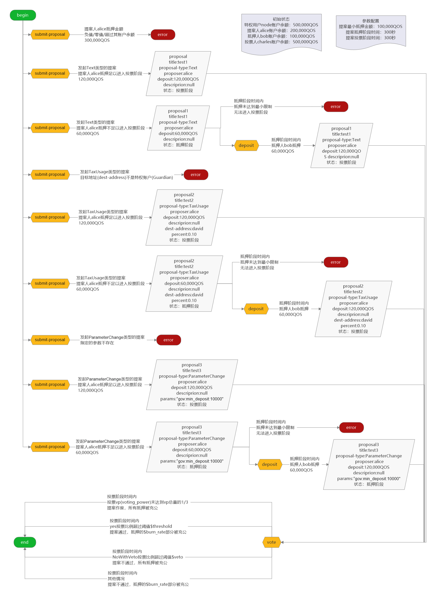

# qoscli governance 模块测试

## 测试准备

> 下列准备操作使得用户`node`, `alice`, `bob`, `charles`分别持有全网Voting Power的25%，这使得以下情况得以实现: 
> 1. 投票的Voting Power占全体Voting Power的比例小于`$quorum`(这里是`33.4%`), 提案作废
>    > - 任意一个用户投票或所有人不投票
> 2. 投票的Voting Power占全体Voting Power的比例达到`$quorum`(这里是`33.4%`)
>    > - 任意两个或以上的用户投票
>    1. 投赞成`Yes`的比例达到`$threshold`(这里是`50.0%`), 提案通过，提案的抵押按照`$burn_rate`(这里是`50.0%`)的比例充公
>       > - 任意两个或以上的用户投赞成票`Yes`
>    2. 投强烈反对`NoWithVeto`的比例达到`$veto`(这里是`33.4%`), 提案不通过，提案的抵押全部充公
>       > - 任意两个或以上的用户投强烈反对票`NoWithVeto`
>    3. 其他情况，提案不通过，提案的抵押按照`$burn_rate`(这里是`50.0%`)的比例充公
>       > - 没有两个或以上的用户投赞成票`Yes`
>       > - 没有两个或以上的用户投强烈反对票`NoWithVeto`

1. 禁止验证人`node`复投
2. 解绑验证人`node`的绑定Token，令验证人`node`的绑定Token固定为`500,000QOS`
3. 令验证人`node`向用户`alice`, `bob`, `charles`分别转账`500,000QOS`
4. 令用户`alice`, `bob`, `charles`分别委托`500,000QOS`给验证人`node`

- 使用以下脚本实现上述准备操作1~4:
    ```shell script
    #!/bin/bash
    echo "1. 禁止验证人node复投"
    expect -c "
    set timeout 1
    spawn ~/qoscli tx modify-compound --owner node --delegator node --indent
    expect \"Password to sign with 'node':\" {send \"12345678\r\"}
    interact
    "
    echo "2. 解绑验证人node的绑定Token，令验证人node的绑定Token固定为500,000QOS"
    tokens=$(echo $(~/qoscli query delegation --owner node --delegator node) | grep -o '"delegate_amount":"[0-9]*"' | grep -o '[0-9]*')
    echo " - 已绑定的Tokens: "$tokens
    withdraw=$(expr $tokens - 500000)
    echo " - 要解绑的Tokens: "$withdraw
    expect -c "
    set timeout 1
    spawn ~/qoscli tx unbond --owner node --delegator node --tokens "$withdraw" --indent
    expect \"Password to sign with 'node':\" {send \"12345678\r\"}
    interact
    "
    echo "睡眠1分钟，等待解绑的Tokens到账..."
    sleep 1m
    echo "3. 令验证人node向用户alice, bob, charles分别转账500,000QOS"
    expect -c "
    set timeout 1
    spawn ~/qoscli tx transfer --senders 'node,1500000QOS' --receivers 'alice,500000QOS;bob,500000QOS;charles,500000QOS' --indent
    expect \"Password to sign with 'node':\" {send \"12345678\r\"}
    interact
    "
    echo "4. 令用户alice, bob, charles分别委托500,000QOS给验证人node"
    expect -c "
    set timeout 1
    spawn ~/qoscli tx delegate --owner node --delegator alice --tokens 500000 --indent
    expect \"Password to sign with 'alice':\" {send \"12345678\r\"}
    interact
    "
    expect -c "
    set timeout 1
    spawn ~/qoscli tx delegate --owner node --delegator bob --tokens 500000 --indent
    expect \"Password to sign with 'bob':\" {send \"12345678\r\"}
    interact
    "
    expect -c "
    set timeout 1
    spawn ~/qoscli tx delegate --owner node --delegator charles --tokens 500000 --indent
    expect \"Password to sign with 'charles':\" {send \"12345678\r\"}
    interact
    "
    ```

- 使用以下脚本`vote.sh`进行投票:
    ```shell script
    #!/bin/bash
    
    # check param num
    if [ $# != 5 ];then
      echo "Usage: \"bash vote.sh <proposal-id> <opt_node> <opt_alice> <opt_bob> <opt_charles>\""
      echo "Avaliable options: Yes, Abstain, No, NoWithVeto"
      echo "Example: \"bash vote.sh 1 Abstain Yes Yes No\""
      exit 1
    fi
    
    # proposal-id
    pid=$1
    
    # option settings
    opt_node=$2
    opt_alice=$3
    opt_bob=$4
    opt_charles=$5
    
    # voting
    echo "==== node >> "$opt_node" ===="
    expect -c "
    set timeout 1
    spawn ~/qoscli tx vote --proposal-id "$pid" --voter node --option "$opt_node" --indent
    expect \"Password to sign with 'node':\" {send \"12345678\r\"}
    interact
    "
    echo "==== alice >> "$opt_alice" ===="
    expect -c "
    set timeout 1
    spawn ~/qoscli tx vote --proposal-id "$pid" --voter alice --option "$opt_alice" --indent
    expect \"Password to sign with 'alice':\" {send \"12345678\r\"}
    interact
    "
    echo "==== bob >> "$opt_bob" ===="
    expect -c "
    set timeout 1
    spawn ~/qoscli tx vote --proposal-id "$pid" --voter bob --option "$opt_bob" --indent
    expect \"Password to sign with 'bob':\" {send \"12345678\r\"}
    interact
    "
    echo "==== charles >> "$opt_charles" ===="
    expect -c "
    set timeout 1
    spawn ~/qoscli tx vote --proposal-id "$pid" --voter charles --option "$opt_charles" --indent
    expect \"Password to sign with 'charles':\" {send \"12345678\r\"}
    interact
    "
    echo "======== tally ========"
    ~/qoscli query tally $pid --indent
    ```

- 使用以下脚本`monitor.sh`发起投票(调用脚本`vote.sh`)，然后监听提案状态改变前后的变化量: 社区费池，用户node账户余额等
    ```shell script
    #!/bin/bash
    
    # 检查参数
    if [ $# != 5 ];then
      echo "Usage: \"bash monitor.sh <proposal-id> <opt_node> <opt_alice> <opt_bob> <opt_charles>\""
      echo "Avaliable options: Yes, Abstain, No, NoWithVeto"
      echo "Example: \"bash monitor.sh 1 Abstain Yes Yes No\""
      exit 1
    fi
    
    # 执行投票
    source ~/vote.sh $1 $2 $3 $4 $5
    
    # 初始化
    pid=$1
    saved_proposal_status=$(echo $(~/qoscli query proposal $pid) | grep -o '"proposal_status":"[a-zA-Z]*"' | grep -o '"[a-zA-Z]*"')
    saved_block_height="0"
    saved_node_qos="0"
    
    # 开始循环
    latest_proposal_status=$(echo $(~/qoscli query proposal $pid) | grep -o '"proposal_status":"[a-zA-Z]*"' | grep -o '"[a-zA-Z]*"')
    while [ $latest_proposal_status == $saved_proposal_status ]
    do
      latest_status=$(~/qoscli query status)
      latest_block_height=$(echo $latest_status | grep -o '"latest_block_height":"[0-9]*"' | grep -o '[0-9]*')
      if [ $latest_block_height != $saved_block_height ];then
        # 到达新块高度
        echo "---- 到达新块高度 ----"
        saved_block_height=$latest_block_height
        latest_block_time=$(echo $latest_status | grep -o '"latest_block_time":".*T.*Z"' | awk -F ':' '{print $2":"$3":"$4}')
        echo "块高度="$latest_block_height"  块时间="$latest_block_time"  提案状态="$latest_proposal_status
        latest_community_fee=$(~/qoscli query community-fee-pool)
        node_qos=$(echo $(~/qoscli query account node) | grep -o '"qos":"[0-9]*"' | grep -o '[0-9]*')
        node_qos_change=$(expr $node_qos - $saved_node_qos)
        saved_node_qos=$node_qos
        echo "社区费池="$latest_community_fee"  用户node余额="$node_qos"  用户node余额变化="$node_qos_change
        ~/qoscli query delegator-income --owner node --delegator node --indent
      fi
      sleep 1s
      latest_proposal_status=$(echo $(~/qoscli query proposal $pid) | grep -o '"proposal_status":"[a-zA-Z]*"' | grep -o '"[a-zA-Z]*"')
    done
    
    # 监听提案状态变化之后的3块
    echo "==== 提案状态发生变化 ===="
    count="0"
    while [ $count != "3" ]
    do
      latest_status=$(~/qoscli query status)
      latest_block_height=$(echo $latest_status | grep -o '"latest_block_height":"[0-9]*"' | grep -o '[0-9]*')
      if [ $latest_block_height != $saved_block_height ];then
        # 到达新块高度
        echo "---- 到达新块高度 ----"
        saved_block_height=$latest_block_height
        latest_block_time=$(echo $latest_status | grep -o '"latest_block_time":".*T.*Z"' | awk -F ':' '{print $2":"$3":"$4}')
        echo "块高度="$latest_block_height"  块时间="$latest_block_time"  提案状态="$latest_proposal_status
        latest_community_fee=$(~/qoscli query community-fee-pool)
        node_qos=$(echo $(~/qoscli query account node) | grep -o '"qos":"[0-9]*"' | grep -o '[0-9]*')
        node_qos_change=$(expr $node_qos - $saved_node_qos)
        saved_node_qos=$node_qos
        echo "社区费池="$latest_community_fee"  用户node余额="$node_qos"  用户node余额变化="$node_qos_change
        ~/qoscli query delegator-income --owner node --delegator node --indent
        count=$(expr $count + 1)
      fi
      sleep 1s
    done
    ```

## 测试内容

#### 涉及到的写入命令 

| Command                     | Alias | Has-Subcommand | Description |
|:----------------------------|:------|:---------------|:------------|
| `qoscli tx submit-proposal` | -     | ✖              | 发起提案        |
| `qoscli tx deposit`         | -     | ✖              | 向提案抵押存款     |
| `qoscli tx vote`            | -     | ✖              | 向提案投票       |

#### 涉及到的查询命令 

| Command                  | Alias                | Has-Subcommand | Description                     |
|:-------------------------|:---------------------|:---------------|:--------------------------------|
| `qoscli query proposal`  | `qoscli q proposal`  | ✖              | 查询单个提案(proposal)的详细信息           |
| `qoscli query proposals` | `qoscli q proposals` | ✖              | 使用可选的筛选器查询提案(proposal)          |
| `qoscli query vote`      | `qoscli q vote`      | ✖              | 查询单个投票(vote)的详细信息               |
| `qoscli query votes`     | `qoscli q votes`     | ✖              | 查询对指定提案(proposal)的投票(vote)      |
| `qoscli query deposit`   | `qoscli q deposit`   | ✖              | 查询单个抵押存款(deposit)的详细信息          |
| `qoscli query deposits`  | `qoscli q deposits`  | ✖              | 查询对指定提案(proposal)的抵押存款(deposit) |
| `qoscli query tally`     | `qoscli q tally`     | ✖              | 获得提案投票的计票结果                     |
| `qoscli query params`    | `qoscli q params`    | ✖              | 查询治理过程的参数                       |
| `qoscli query account`   | `qoscli q account`   | ✖              | 按地址(address)或名称(name)查询帐户信息     |

#### 测试路径图



#### 测试路径

> 初始状态
>   - genesis特权用户`node`账户余额: 500,000QOS
>   - 提案人`alice`账户余额: 200,000QOS
>   - 抵押人`bob`账户余额: 100,000QOS
>   - 投票人`charles`账户余额: 500,000QOS

> 治理参数
> ```bash
> $ ./qoscli query params --module gov --indent
> {
>   "type": "gov/params",
>   "value": {
>     "min_deposit": "100000",
>     "min_proposer_deposit_rate": "0.334000000000000000",
>     "max_deposit_period": "300000000000",
>     "voting_period": "300000000000",
>     "quorum": "0.334000000000000000",
>     "threshold": "0.500000000000000000",
>     "veto": "0.334000000000000000",
>     "penalty": "0.000000000000000000",
>     "burn_rate": "0.500000000000000000"
>   }
> }
> ```

> 提案人发起提案时抵押金额的最小要求为`$min_deposit`*`$min_proposer_deposit_rate`, 这里是`33,400QOS`

1. 发起提案: 提案人`alice`
    1. 发起类型为`Text`的提案
        1. 提案人`alice`抵押金额为负数，错误: -100,000QOS
        2. 提案人`alice`抵押金额为零值，错误: 0QOS
        3. 提案人`alice`抵押金额未超过其账户余额`200,000QOS`
            1. 提案人`alice`抵押金额未达到最小要求`33,400QOS`，错误: 30,000QOS
            2. 提案人`alice`抵押金额达到最小要求`33,400QOS`, 但未达到`$min_deposit`: 60,000QOS
            3. 提案人`alice`抵押金额达到`$min_deposit`，提案进入投票阶段: 120,000QOS
        4. 提案人`alice`抵押金额超过其账户余额`200,000QOS`: 300,000QOS
    2. 发起类型为`TaxUsage`的提案
        1. 提案人`alice`抵押金额为负数，错误: -100,000QOS
        2. 提案人`alice`抵押金额为零值，错误: 0QOS
        3. 提案人`alice`抵押金额未超过其账户余额`200,000QOS`
            1. 提案人`alice`抵押金额未达到最小要求`33,400QOS`，错误: 30,000QOS
            2. 提案人`alice`抵押金额达到最小要求`33,400QOS`, 但未达到`$min_deposit`: 60,000QOS
                1. 目标地址(dest-address)不是特权账户(Guardian)，错误
                2. 目标地址(dest-address)是特权账户(Guardian)
                    1. 提取比例(percent)为负值，错误: -0.5
                    2. 提取比例(percent)为零值: 0
                    3. 提取比例(percent)为(0,1)之间的值: 0.5
                    4. 提取比例(percent)为百分之百: 1
                    5. 提取比例(percent)超过百分之百: 2
            3. 提案人`alice`抵押金额达到`$min_deposit`: 120,000QOS
                1. 目标地址(dest-address)不是特权账户(Guardian)，错误
                2. 目标地址(dest-address)是特权账户(Guardian)
                    1. 提取比例(percent)为负值: -0.5
                    2. 提取比例(percent)为零值: 0
                    3. 提取比例(percent)为(0,1)之间的值: 0.5
                    4. 提取比例(percent)为百分之百: 1
                    5. 提取比例(percent)超过百分之百: 2
        4. 提案人`alice`抵押金额超过其账户余额`200,000QOS`: 300,000QOS
    3. 发起类型为`ParameterChange`的提案
        1. 提案人`alice`抵押金额为负数，错误: -100,000QOS
        2. 提案人`alice`抵押金额为零值，错误: 0QOS
        3. 提案人`alice`抵押金额未超过其账户余额`200,000QOS`
            1. 指定的参数不存在，错误
            2. 指定的参数存在
                1. 提案人`alice`抵押金额未达到最小要求`33,400QOS`，错误: 30,000QOS
                2. 提案人`alice`抵押金额达到最小要求`33,400QOS`, 但未达到`$min_deposit`: 60,000QOS
                3. 提案人`alice`抵押金额达到`$min_deposit`: 120,000QOS
        4. 提案人`alice`抵押金额超过其账户余额`200,000QOS`: 300,000QOS

2. 对提案进行抵押: 抵押人`bob`
    1. 提案处于抵押阶段(抵押金额未达到`$min_deposit`)
        1. 类型为`Text`的提案
            1. 在`max_deposit_period`时间内进行抵押
                1. 在`max_deposit_period`时间内，提案抵押金额未达到`$min_deposit`，提案作废
                2. 在`max_deposit_period`时间内，提案抵押金额达到`$min_deposit`，提案进入投票阶段
            2. 在`max_deposit_period`时间后进行抵押, 错误, 此时提案已经不存在
        2. 类型为`TaxUsage`的提案
            1. 在`max_deposit_period`时间内进行抵押
                1. 在`max_deposit_period`时间内，提案抵押金额未达到`$min_deposit`，提案作废
                2. 在`max_deposit_period`时间内，提案抵押金额达到`$min_deposit`，提案进入投票阶段
            2. 在`max_deposit_period`时间后进行抵押, 错误, 此时提案已经不存在
        3. 类型为`ParameterChange`的提案
            1. 在`max_deposit_period`时间内进行抵押
                1. 在`max_deposit_period`时间内，提案抵押金额未达到`$min_deposit`，提案作废
                2. 在`max_deposit_period`时间内，提案抵押金额达到`$min_deposit`，提案进入投票阶段
            2. 在`max_deposit_period`时间后进行抵押, 错误, 此时提案已经不存在
    2. 提案处于投票阶段(抵押金额已达到`$min_deposit`)
        1. 类型为`Text`的提案
        2. 类型为`TaxUsage`的提案
        3. 类型为`ParameterChange`的提案
    3. 提案投票阶段已经结束(投票时间`$voting_period`过后)
        
3. 对提案进行投票: 投票人`charles`
    1. 提案处于抵押阶段(抵押金额未达到`$min_deposit`)
        1. 类型为`Text`的提案
        2. 类型为`TaxUsage`的提案
        3. 类型为`ParameterChange`的提案
    2. 提案处于投票阶段(抵押金额已达到`$min_deposit`)
        1. 类型为`Text`的提案
            1. 投票的Voting Power占全体Voting Power的比例小于`$quorum`(这里是`33.4%`), 提案作废
                > - 任意一个用户投票或所有人不投票
                - 所有人都不投票
            2. 投票的Voting Power占全体Voting Power的比例达到`$quorum`(这里是`33.4%`)
                > - 任意两个或以上的用户投票
                1. 投赞成`Yes`的比例达到`$threshold`(这里是`50.0%`), 提案通过，提案的抵押按照`$burn_rate`(这里是`50.0%`)的比例充公
                    > - 任意两个或以上的用户投赞成票`Yes`
                    - `node`投弃权票`Abstain`; `alice`, `bob`投赞成票`Yes`; `charles`投反对票`No`
                2. 投强烈反对`NoWithVeto`的比例达到`$veto`(这里是`33.4%`), 提案不通过，提案的抵押全部充公
                    > - 任意两个或以上的用户投强烈反对票`NoWithVeto`
                    - `node`投弃权票`Abstain`; `alice`, `bob`投强烈反对票`NoWithVeto`; `charles`投赞成票`Yes`
                3. 其他情况，提案不通过，提案的抵押按照`$burn_rate`(这里是`50.0%`)的比例充公
                    > - 没有两个或以上的用户投赞成票`Yes`
                    > - 没有两个或以上的用户投强烈反对票`NoWithVeto`
                    - `node`投弃权票`Abstain`; `alice`投赞成票`Yes`; `bob`投反对票`No`; `charles`投强烈反对票`NoWithVeto`
        2. 类型为`TaxUsage`的提案
            1. 投票的Voting Power占全体Voting Power的比例小于`$quorum`(这里是`33.4%`), 提案作废
                > - 任意一个用户投票或所有人不投票
                - 所有人都不投票
            2. 投票的Voting Power占全体Voting Power的比例达到`$quorum`(这里是`33.4%`)
                > - 任意两个或以上的用户投票
                1. 投赞成`Yes`的比例达到`$threshold`(这里是`50.0%`), 提案通过，提案的抵押按照`$burn_rate`(这里是`50.0%`)的比例充公
                    > - 任意两个或以上的用户投赞成票`Yes`
                    - `node`投弃权票`Abstain`; `alice`, `bob`投赞成票`Yes`; `charles`投反对票`No`
                2. 投强烈反对`NoWithVeto`的比例达到`$veto`(这里是`33.4%`), 提案不通过，提案的抵押全部充公
                    > - 任意两个或以上的用户投强烈反对票`NoWithVeto`
                    - `node`投弃权票`Abstain`; `alice`, `bob`投强烈反对票`NoWithVeto`; `charles`投赞成票`Yes`
                3. 其他情况，提案不通过，提案的抵押按照`$burn_rate`(这里是`50.0%`)的比例充公
                    > - 没有两个或以上的用户投赞成票`Yes`
                    > - 没有两个或以上的用户投强烈反对票`NoWithVeto`
                    - `node`投弃权票`Abstain`; `alice`投赞成票`Yes`; `bob`投反对票`No`; `charles`投强烈反对票`NoWithVeto`
        3. 类型为`ParameterChange`的提案
            1. 投票的Voting Power占全体Voting Power的比例小于`$quorum`(这里是`33.4%`), 提案作废
                > - 任意一个用户投票或所有人不投票
                - 所有人都不投票
            2. 投票的Voting Power占全体Voting Power的比例达到`$quorum`(这里是`33.4%`)
                > - 任意两个或以上的用户投票
                1. 投赞成`Yes`的比例达到`$threshold`(这里是`50.0%`), 提案通过，提案的抵押按照`$burn_rate`(这里是`50.0%`)的比例充公
                    > - 任意两个或以上的用户投赞成票`Yes`
                    - `node`投弃权票`Abstain`; `alice`, `bob`投赞成票`Yes`; `charles`投反对票`No`
                2. 投强烈反对`NoWithVeto`的比例达到`$veto`(这里是`33.4%`), 提案不通过，提案的抵押全部充公
                    > - 任意两个或以上的用户投强烈反对票`NoWithVeto`
                    - `node`投弃权票`Abstain`; `alice`, `bob`投强烈反对票`NoWithVeto`; `charles`投赞成票`Yes`
                3. 其他情况，提案不通过，提案的抵押按照`$burn_rate`(这里是`50.0%`)的比例充公
                    > - 没有两个或以上的用户投赞成票`Yes`
                    > - 没有两个或以上的用户投强烈反对票`NoWithVeto`
                    - `node`投弃权票`Abstain`; `alice`投赞成票`Yes`; `bob`投反对票`No`; `charles`投强烈反对票`NoWithVeto`
    3. 提案投票阶段已经结束(投票时间`$voting_period`过后)

## 测试过程

1. 发起提案: 提案人`alice`
    1. 发起类型为`Text`的提案
        1. 提案人`alice`抵押金额为负数，错误: -100,000QOS
            ```bash
            $ ./qoscli tx submit-proposal --proposal-type Text --title 'test1' --description 'null' --proposer alice --deposit -100000 --indent
            ERROR: invalid argument "-100000" for "--deposit" flag: strconv.ParseUint: parsing "-100000": invalid syntax
            ```
        2. 提案人`alice`抵押金额为零值，错误: 0QOS
            ```bash
            $ ./qoscli tx submit-proposal --proposal-type Text --title 'test1' --description 'null' --proposer alice --deposit 0 --indent
            null
            ERROR: deposit must be positive
            ```
        3. 提案人`alice`抵押金额未超过其账户余额`200,000QOS`
            1. 提案人`alice`抵押金额未达到最小要求`33,400QOS`，错误: 30,000QOS
                ```bash
                $ ./qoscli tx submit-proposal --proposal-type Text --title 'test1' --description 'null' --proposer alice --deposit 30000 --indent
                Password to sign with 'alice':
                {
                  "check_tx": {
                    "code": 1,
                    "log": "{\"codespace\":\"sdk\",\"code\":1,\"message\":\"TxStd's ITx ValidateData error:  ERROR:\\nCodespace: gov\\nCode: 601\\nMessage: \\\"initial deposit is too small\\\"\\n\"}",
                    "gasWanted": "100000",
                    "gasUsed": "9408"
                  },
                  "deliver_tx": {},
                  "hash": "56EAE9316B8EE948F1D8137EE87A4BA3C8CA7C257AB650DDE304C2B8D01EB48A",
                  "height": "0"
                }
                ERROR: {"codespace":"sdk","code":1,"message":"TxStd's ITx ValidateData error:  ERROR:\nCodespace: gov\nCode: 601\nMessage: \"initial deposit is too small\"\n"}
                ```
            2. 提案人`alice`抵押金额达到最小要求`33,400QOS`, 但未达到`$min_deposit`: 60,000QOS
                ```bash
                $ ./qoscli tx submit-proposal --proposal-type Text --title 'test1' --description 'null' --proposer alice --deposit 60000 --indent
                Password to sign with 'alice':
                {
                  "check_tx": {
                    "gasWanted": "100000",
                    "gasUsed": "15934"
                  },
                  "deliver_tx": {
                    "gasWanted": "100000",
                    "gasUsed": "59290",
                    "tags": [
                      {
                        "key": "YWN0aW9u",
                        "value": "c3VibWl0LXByb3Bvc2Fs"
                      },
                      {
                        "key": "cHJvcG9zYWwtaWQ=",
                        "value": "MQ=="
                      },
                      {
                        "key": "cHJvcG9zZXI=",
                        "value": "YWRkcmVzczFlcXFuYXBzMDRsNmh0OXhhaHRyZmdnNTlrc2xsY3E5cXI4NjMwcQ=="
                      },
                      {
                        "key": "cHJvcG9zYWwtdHlwZQ==",
                        "value": "VGV4dA=="
                      }
                    ]
                  },
                  "hash": "FA57F22E1225FB61CB6D5A9269BDE31E768647F0ED90C184988EFD6BB256D726",
                  "height": "12"
                }
                ```
                生成的提案如下:
                ```bash
                $ ./qoscli query proposals --indent
                [
                  {
                    "proposal_content": {
                      "type": "gov/TextProposal",
                      "value": {
                        "title": "test1",
                        "description": "null",
                        "deposit": "60000"
                      }
                    },
                    "proposal_id": "1",
                    "proposal_status": "Deposit",
                    "final_tally_result": {
                      "yes": "0",
                      "abstain": "0",
                      "no": "0",
                      "no_with_veto": "0"
                    },
                    "submit_time": "2019-08-21T02:54:07.134759148Z",
                    "deposit_end_time": "2019-08-21T02:59:07.134759148Z",
                    "total_deposit": "60000",
                    "voting_start_time": "0001-01-01T00:00:00Z",
                    "voting_start_height": "0",
                    "voting_end_time": "0001-01-01T00:00:00Z"
                  }
                ]
                ```
            3. 提案人`alice`抵押金额达到`$min_deposit`，提案进入投票阶段: 120,000QOS
                ```bash
                $ ./qoscli tx submit-proposal --proposal-type Text --title 'test1' --description 'null' --proposer alice --deposit 120000 --indent
                Password to sign with 'alice':
                {
                  "check_tx": {
                    "gasWanted": "100000",
                    "gasUsed": "15934"
                  },
                  "deliver_tx": {
                    "gasWanted": "100000",
                    "gasUsed": "80240",
                    "tags": [
                      {
                        "key": "YWN0aW9u",
                        "value": "c3VibWl0LXByb3Bvc2Fs"
                      },
                      {
                        "key": "cHJvcG9zYWwtaWQ=",
                        "value": "MQ=="
                      },
                      {
                        "key": "cHJvcG9zZXI=",
                        "value": "YWRkcmVzczFlcXFuYXBzMDRsNmh0OXhhaHRyZmdnNTlrc2xsY3E5cXI4NjMwcQ=="
                      },
                      {
                        "key": "cHJvcG9zYWwtdHlwZQ==",
                        "value": "VGV4dA=="
                      }
                    ]
                  },
                  "hash": "09F98F2E663E80EBFA190218B09057129BDF901895D547E7DB26437A21CF5DA8",
                  "height": "10"
                }
                ```
                生成的提案如下:
                ```bash
                $ ./qoscli query proposals --indent
                [
                  {
                    "proposal_content": {
                      "type": "gov/TextProposal",
                      "value": {
                        "title": "test1",
                        "description": "null",
                        "deposit": "120000"
                      }
                    },
                    "proposal_id": "1",
                    "proposal_status": "Voting",
                    "final_tally_result": {
                      "yes": "0",
                      "abstain": "0",
                      "no": "0",
                      "no_with_veto": "0"
                    },
                    "submit_time": "2019-08-21T02:53:57.111208889Z",
                    "deposit_end_time": "2019-08-21T02:58:57.111208889Z",
                    "total_deposit": "120000",
                    "voting_start_time": "2019-08-21T02:53:57.111208889Z",
                    "voting_start_height": "10",
                    "voting_end_time": "2019-08-21T02:58:57.111208889Z"
                  }
                ]
                ```
        4. 提案人`alice`抵押金额超过其账户余额`200,000QOS`: 300,000QOS
            ```bash
            $ ./qoscli tx submit-proposal --proposal-type Text --title 'test1' --description 'null' --proposer alice --deposit 300000 --indent
            Password to sign with 'alice':
            {
              "check_tx": {
                "code": 1,
                "log": "{\"codespace\":\"sdk\",\"code\":1,\"message\":\"TxStd's ITx ValidateData error:  ERROR:\\nCodespace: gov\\nCode: 601\\nMessage: \\\"proposer has no enough qos\\\"\\n\"}",
                "gasWanted": "100000",
                "gasUsed": "10516"
              },
              "deliver_tx": {},
              "hash": "816A6EC7F5343476C539BD4ECB5CB05F2D72EE8C48D37624A290B943BB621572",
              "height": "0"
            }
            ERROR: {"codespace":"sdk","code":1,"message":"TxStd's ITx ValidateData error:  ERROR:\nCodespace: gov\nCode: 601\nMessage: \"proposer has no enough qos\"\n"}
            ```
    2. 发起类型为`TaxUsage`的提案
        1. 提案人`alice`抵押金额为负数，错误: -100,000QOS
            ```bash
            $ ./qoscli tx submit-proposal --proposal-type TaxUsage --title 'test2' --description 'null' --proposer alice --deposit -100000 --dest-address node --percent 0.5 --indent
            ERROR: invalid argument "-100000" for "--deposit" flag: strconv.ParseUint: parsing "-100000": invalid syntax
            ```
        2. 提案人`alice`抵押金额为零值，错误: 0QOS
            ```bash
            $ ./qoscli tx submit-proposal --proposal-type TaxUsage --title 'test2' --description 'null' --proposer alice --deposit 0 --dest-address node --percent 0.5 --indent
            null
            ERROR: deposit must be positive
            ```
        3. 提案人`alice`抵押金额未超过其账户余额`200,000QOS`
            1. 提案人`alice`抵押金额未达到最小要求`33,400QOS`，错误: 30,000QOS
                ```bash
                $ ./qoscli tx submit-proposal --proposal-type TaxUsage --title 'test2' --description 'null' --proposer alice --deposit 30000 --dest-address node --percent 0.5 --indent
                Password to sign with 'alice':
                {
                  "check_tx": {
                    "code": 1,
                    "log": "{\"codespace\":\"sdk\",\"code\":1,\"message\":\"TxStd's ITx ValidateData error:  ERROR:\\nCodespace: gov\\nCode: 601\\nMessage: \\\"initial deposit is too small\\\"\\n\"}",
                    "gasWanted": "100000",
                    "gasUsed": "9408"
                  },
                  "deliver_tx": {},
                  "hash": "FBC8DD42880F8C6A7E64DCAF2A99A0212E0BC2529632C2B8DFAED82FB1EFCA3B",
                  "height": "0"
                }
                ERROR: {"codespace":"sdk","code":1,"message":"TxStd's ITx ValidateData error:  ERROR:\nCodespace: gov\nCode: 601\nMessage: \"initial deposit is too small\"\n"}
                ```
            2. 提案人`alice`抵押金额达到最小要求`33,400QOS`, 但未达到`$min_deposit`: 60,000QOS
                1. 目标地址(dest-address)不是特权账户(Guardian)，错误
                    ```bash
                    $ ./qoscli tx submit-proposal --proposal-type TaxUsage --title 'test2' --description 'null' --proposer alice --deposit 60000 --dest-address bob --percent 0.5 --indent
                    Password to sign with 'alice':
                    {
                      "check_tx": {
                        "code": 1,
                        "log": "{\"codespace\":\"sdk\",\"code\":1,\"message\":\"TxStd's ITx ValidateData error:  ERROR:\\nCodespace: gov\\nCode: 601\\nMessage: \\\"DestAddress must be guardian\\\"\\n\"}",
                        "gasWanted": "100000",
                        "gasUsed": "11516"
                      },
                      "deliver_tx": {},
                      "hash": "4F94C00305C1428EA6FB20152A5CB0B2D48B5F26FAE60D83CA1CEBF7E57E0EE2",
                      "height": "0"
                    }
                    ERROR: {"codespace":"sdk","code":1,"message":"TxStd's ITx ValidateData error:  ERROR:\nCodespace: gov\nCode: 601\nMessage: \"DestAddress must be guardian\"\n"}
                    ```
                2. 目标地址(dest-address)是特权账户(Guardian)
                    1. 提取比例(percent)为负值，错误: -0.5
                        ```bash
                        $ ./qoscli tx submit-proposal --proposal-type TaxUsage --title 'test2' --description 'null' --proposer alice --deposit 60000 --dest-address node --percent -0.5 --indent
                        null
                        ERROR: deposit must be positive
                        ```
                    2. 提取比例(percent)为零值: 0
                        ```bash
                        $ ./qoscli tx submit-proposal --proposal-type TaxUsage --title 'test2' --description 'null' --proposer alice --deposit 60000 --dest-address node --percent 0 --indent
                        null
                        ERROR: deposit must be positive
                        ```
                    3. 提取比例(percent)为(0,1)之间的值: 0.5
                        ```bash
                        $ ./qoscli tx submit-proposal --proposal-type TaxUsage --title 'test2' --description 'null' --proposer alice --deposit 60000 --dest-address node --percent 0.5 --indent
                        Password to sign with 'alice':
                        {
                          "check_tx": {
                            "gasWanted": "100000",
                            "gasUsed": "17075"
                          },
                          "deliver_tx": {
                            "gasWanted": "100000",
                            "gasUsed": "63200",
                            "tags": [
                              {
                                "key": "YWN0aW9u",
                                "value": "c3VibWl0LXByb3Bvc2Fs"
                              },
                              {
                                "key": "cHJvcG9zYWwtaWQ=",
                                "value": "MQ=="
                              },
                              {
                                "key": "cHJvcG9zZXI=",
                                "value": "YWRkcmVzczFlcXFuYXBzMDRsNmh0OXhhaHRyZmdnNTlrc2xsY3E5cXI4NjMwcQ=="
                              },
                              {
                                "key": "cHJvcG9zYWwtdHlwZQ==",
                                "value": "VGF4VXNhZ2U="
                              }
                            ]
                          },
                          "hash": "8D436822D25C816CE92CFB56F6CB44A347D3BBE2F284B78CCD88222D32CCB0FB",
                          "height": "30"
                        }
                        ```
                        生成的提案如下:
                        ```bash
                        $ ./qoscli query proposals --indent
                        [
                          {
                            "proposal_content": {
                              "type": "gov/TaxUsageProposal",
                              "value": {
                                "TextProposal": {
                                  "title": "test2",
                                  "description": "null",
                                  "deposit": "60000"
                                },
                                "dest_address": "address1qgwgmpsrd6anj3qjvjsqztj3xt9v24c4mh77x3",
                                "percent": "0.500000000000000000"
                              }
                            },
                            "proposal_id": "1",
                            "proposal_status": "Deposit",
                            "final_tally_result": {
                              "yes": "0",
                              "abstain": "0",
                              "no": "0",
                              "no_with_veto": "0"
                            },
                            "submit_time": "2019-08-21T02:55:37.2613795Z",
                            "deposit_end_time": "2019-08-21T03:00:37.2613795Z",
                            "total_deposit": "60000",
                            "voting_start_time": "0001-01-01T00:00:00Z",
                            "voting_start_height": "0",
                            "voting_end_time": "0001-01-01T00:00:00Z"
                          }
                        ]
                        ```
                    4. 提取比例(percent)为百分之百: 1
                        ```bash
                        $ ./qoscli tx submit-proposal --proposal-type TaxUsage --title 'test2' --description 'null' --proposer alice --deposit 60000 --dest-address node --percent 1 --indent
                        Password to sign with 'alice':
                        {
                          "check_tx": {
                            "gasWanted": "100000",
                            "gasUsed": "17075"
                          },
                          "deliver_tx": {
                            "gasWanted": "100000",
                            "gasUsed": "63260",
                            "tags": [
                              {
                                "key": "YWN0aW9u",
                                "value": "c3VibWl0LXByb3Bvc2Fs"
                              },
                              {
                                "key": "cHJvcG9zYWwtaWQ=",
                                "value": "MQ=="
                              },
                              {
                                "key": "cHJvcG9zZXI=",
                                "value": "YWRkcmVzczFlcXFuYXBzMDRsNmh0OXhhaHRyZmdnNTlrc2xsY3E5cXI4NjMwcQ=="
                              },
                              {
                                "key": "cHJvcG9zYWwtdHlwZQ==",
                                "value": "VGF4VXNhZ2U="
                              }
                            ]
                          },
                          "hash": "D141DBCB0256FC63E541EEAD35BB36512D4428C29286D30C40FA3F61FAB06083",
                          "height": "11"
                        }
                        ```
                        生成的提案如下:
                        ```bash
                        $ ./qoscli query proposals --indent
                        [
                          {
                            "proposal_content": {
                              "type": "gov/TaxUsageProposal",
                              "value": {
                                "TextProposal": {
                                  "title": "test2",
                                  "description": "null",
                                  "deposit": "60000"
                                },
                                "dest_address": "address1qgwgmpsrd6anj3qjvjsqztj3xt9v24c4mh77x3",
                                "percent": "1.000000000000000000"
                              }
                            },
                            "proposal_id": "1",
                            "proposal_status": "Deposit",
                            "final_tally_result": {
                              "yes": "0",
                              "abstain": "0",
                              "no": "0",
                              "no_with_veto": "0"
                            },
                            "submit_time": "2019-08-21T02:54:02.142903139Z",
                            "deposit_end_time": "2019-08-21T02:59:02.142903139Z",
                            "total_deposit": "60000",
                            "voting_start_time": "0001-01-01T00:00:00Z",
                            "voting_start_height": "0",
                            "voting_end_time": "0001-01-01T00:00:00Z"
                          }
                        ]
                        ```
                    5. 提取比例(percent)超过百分之百: 2
                        ```bash
                        $ ./qoscli tx submit-proposal --proposal-type TaxUsage --title 'test2' --description 'null' --proposer alice --deposit 60000 --dest-address node --percent 2 --indent
                        Password to sign with 'alice':
                        {
                          "check_tx": {
                            "gasWanted": "100000",
                            "gasUsed": "17075"
                          },
                          "deliver_tx": {
                            "gasWanted": "100000",
                            "gasUsed": "63390",
                            "tags": [
                              {
                                "key": "YWN0aW9u",
                                "value": "c3VibWl0LXByb3Bvc2Fs"
                              },
                              {
                                "key": "cHJvcG9zYWwtaWQ=",
                                "value": "MQ=="
                              },
                              {
                                "key": "cHJvcG9zZXI=",
                                "value": "YWRkcmVzczFlcXFuYXBzMDRsNmh0OXhhaHRyZmdnNTlrc2xsY3E5cXI4NjMwcQ=="
                              },
                              {
                                "key": "cHJvcG9zYWwtdHlwZQ==",
                                "value": "VGF4VXNhZ2U="
                              }
                            ]
                          },
                          "hash": "B035880399FF94ECBD542BAE04FFA0CC6E5E924BC22BCDAC7B127CD061F441AD",
                          "height": "379"
                        }
    
                        ```
                        生成的提案如下:
                        ```bash
                        $ ./qoscli query proposals --indent
                        [
                          {
                            "proposal_content": {
                              "type": "gov/TaxUsageProposal",
                              "value": {
                                "TextProposal": {
                                  "title": "test2",
                                  "description": "null",
                                  "deposit": "60000"
                                },
                                "dest_address": "address1qgwgmpsrd6anj3qjvjsqztj3xt9v24c4mh77x3",
                                "percent": "2.000000000000000000"
                              }
                            },
                            "proposal_id": "1",
                            "proposal_status": "Deposit",
                            "final_tally_result": {
                              "yes": "0",
                              "abstain": "0",
                              "no": "0",
                              "no_with_veto": "0"
                            },
                            "submit_time": "2019-08-21T03:24:45.532150018Z",
                            "deposit_end_time": "2019-08-21T03:29:45.532150018Z",
                            "total_deposit": "60000",
                            "voting_start_time": "0001-01-01T00:00:00Z",
                            "voting_start_height": "0",
                            "voting_end_time": "0001-01-01T00:00:00Z"
                          }
                        ]
                        ```
            3. 提案人`alice`抵押金额达到`$min_deposit`: 120,000QOS
                1. 目标地址(dest-address)不是特权账户(Guardian)，错误
                    ```bash
                    $ ./qoscli tx submit-proposal --proposal-type TaxUsage --title 'test2' --description 'null' --proposer alice --deposit 120000 --dest-address bob --percent 0.5 --indent
                    Password to sign with 'alice':
                    {
                      "check_tx": {
                        "code": 1,
                        "log": "{\"codespace\":\"sdk\",\"code\":1,\"message\":\"TxStd's ITx ValidateData error:  ERROR:\\nCodespace: gov\\nCode: 601\\nMessage: \\\"DestAddress must be guardian\\\"\\n\"}",
                        "gasWanted": "100000",
                        "gasUsed": "11639"
                      },
                      "deliver_tx": {},
                      "hash": "07AFE750182ACEDCA35D00680363DBDEB053A75A041352080DD0438A15693B02",
                      "height": "0"
                    }
                    ERROR: {"codespace":"sdk","code":1,"message":"TxStd's ITx ValidateData error:  ERROR:\nCodespace: gov\nCode: 601\nMessage: \"DestAddress must be guardian\"\n"}
                    ```
                2. 目标地址(dest-address)是特权账户(Guardian)
                    1. 提取比例(percent)为负值: -0.5
                        ```bash
                        $ ./qoscli tx submit-proposal --proposal-type TaxUsage --title 'test2' --description 'null' --proposer alice --deposit 120000 --dest-address node --percent -0.5 --indent
                        null
                        ERROR: deposit must be positive
                        ```
                    2. 提取比例(percent)为零值: 0
                        ```bash
                        $ ./qoscli tx submit-proposal --proposal-type TaxUsage --title 'test2' --description 'null' --proposer alice --deposit 120000 --dest-address node --percent 0 --indent
                        null
                        ERROR: deposit must be positive
                        ```
                    3. 提取比例(percent)为(0,1)之间的值: 0.5
                        ```bash
                        $ ./qoscli tx submit-proposal --proposal-type TaxUsage --title 'test2' --description 'null' --proposer alice --deposit 120000 --dest-address node --percent 0.5 --max-gas 200000 --indent
                        Password to sign with 'alice':
                        {
                          "check_tx": {
                            "gasWanted": "200000",
                            "gasUsed": "17321"
                          },
                          "deliver_tx": {
                            "gasWanted": "200000",
                            "gasUsed": "85720",
                            "tags": [
                              {
                                "key": "YWN0aW9u",
                                "value": "c3VibWl0LXByb3Bvc2Fs"
                              },
                              {
                                "key": "cHJvcG9zYWwtaWQ=",
                                "value": "MQ=="
                              },
                              {
                                "key": "cHJvcG9zZXI=",
                                "value": "YWRkcmVzczFlcXFuYXBzMDRsNmh0OXhhaHRyZmdnNTlrc2xsY3E5cXI4NjMwcQ=="
                              },
                              {
                                "key": "cHJvcG9zYWwtdHlwZQ==",
                                "value": "VGF4VXNhZ2U="
                              }
                            ]
                          },
                          "hash": "9919A8ED041A5A7061D466EB42E8F51BFD7C728EE7DEA34D715CC714EDFF098A",
                          "height": "18"
                        }
                        ```
                        生成的提案如下:
                        ```bash
                        $ ./qoscli query proposals --indent
                        [
                          {
                            "proposal_content": {
                              "type": "gov/TaxUsageProposal",
                              "value": {
                                "TextProposal": {
                                  "title": "test2",
                                  "description": "null",
                                  "deposit": "120000"
                                },
                                "dest_address": "address1qgwgmpsrd6anj3qjvjsqztj3xt9v24c4mh77x3",
                                "percent": "0.500000000000000000"
                              }
                            },
                            "proposal_id": "1",
                            "proposal_status": "Voting",
                            "final_tally_result": {
                              "yes": "0",
                              "abstain": "0",
                              "no": "0",
                              "no_with_veto": "0"
                            },
                            "submit_time": "2019-08-21T02:54:37.219325723Z",
                            "deposit_end_time": "2019-08-21T02:59:37.219325723Z",
                            "total_deposit": "120000",
                            "voting_start_time": "2019-08-21T02:54:37.219325723Z",
                            "voting_start_height": "18",
                            "voting_end_time": "2019-08-21T02:59:37.219325723Z"
                          }
                        ]
                        ```
                    4. 提取比例(percent)为百分之百: 1
                        ```bash
                        $ ./qoscli tx submit-proposal --proposal-type TaxUsage --title 'test2' --description 'null' --proposer alice --deposit 120000 --dest-address node --percent 1 --max-gas 200000 --indent
                        Password to sign with 'alice':
                        {
                          "check_tx": {
                            "gasWanted": "200000",
                            "gasUsed": "17321"
                          },
                          "deliver_tx": {
                            "gasWanted": "200000",
                            "gasUsed": "85810",
                            "tags": [
                              {
                                "key": "YWN0aW9u",
                                "value": "c3VibWl0LXByb3Bvc2Fs"
                              },
                              {
                                "key": "cHJvcG9zYWwtaWQ=",
                                "value": "MQ=="
                              },
                              {
                                "key": "cHJvcG9zZXI=",
                                "value": "YWRkcmVzczFlcXFuYXBzMDRsNmh0OXhhaHRyZmdnNTlrc2xsY3E5cXI4NjMwcQ=="
                              },
                              {
                                "key": "cHJvcG9zYWwtdHlwZQ==",
                                "value": "VGF4VXNhZ2U="
                              }
                            ]
                          },
                          "hash": "FD6C5F941D3E0CAF9842CC2F717C9D04C99796118EFAEA1B76C367D6A1B8B23B",
                          "height": "18"
                        }
                        ```
                        生成的提案如下:
                        ```bash
                        $ ./qoscli query proposals --indent
                        [
                          {
                            "proposal_content": {
                              "type": "gov/TaxUsageProposal",
                              "value": {
                                "TextProposal": {
                                  "title": "test2",
                                  "description": "null",
                                  "deposit": "120000"
                                },
                                "dest_address": "address1qgwgmpsrd6anj3qjvjsqztj3xt9v24c4mh77x3",
                                "percent": "1.000000000000000000"
                              }
                            },
                            "proposal_id": "1",
                            "proposal_status": "Voting",
                            "final_tally_result": {
                              "yes": "0",
                              "abstain": "0",
                              "no": "0",
                              "no_with_veto": "0"
                            },
                            "submit_time": "2019-08-21T02:54:37.170401261Z",
                            "deposit_end_time": "2019-08-21T02:59:37.170401261Z",
                            "total_deposit": "120000",
                            "voting_start_time": "2019-08-21T02:54:37.170401261Z",
                            "voting_start_height": "18",
                            "voting_end_time": "2019-08-21T02:59:37.170401261Z"
                          }
                        ]
                        ```
                    5. 提取比例(percent)超过百分之百: 2
                        ```bash
                        $ ./qoscli tx submit-proposal --proposal-type TaxUsage --title 'test2' --description 'null' --proposer alice --deposit 120000 --dest-address node --percent 2 --max-gas 200000 --indent
                        Password to sign with 'alice':
                        {
                          "check_tx": {
                            "gasWanted": "200000",
                            "gasUsed": "17075"
                          },
                          "deliver_tx": {
                            "gasWanted": "200000",
                            "gasUsed": "85570",
                            "tags": [
                              {
                                "key": "YWN0aW9u",
                                "value": "c3VibWl0LXByb3Bvc2Fs"
                              },
                              {
                                "key": "cHJvcG9zYWwtaWQ=",
                                "value": "MQ=="
                              },
                              {
                                "key": "cHJvcG9zZXI=",
                                "value": "YWRkcmVzczFlcXFuYXBzMDRsNmh0OXhhaHRyZmdnNTlrc2xsY3E5cXI4NjMwcQ=="
                              },
                              {
                                "key": "cHJvcG9zYWwtdHlwZQ==",
                                "value": "VGF4VXNhZ2U="
                              }
                            ]
                          },
                          "hash": "8D7CB378D7B1A1C198BFE4A03F049C4AB5D537EBB01ABA5221AF349AAB35963F",
                          "height": "12"
                        }
                        ```
                        生成的提案如下:
                        ```bash
                        $ ./qoscli query proposals --indent
                        [
                          {
                            "proposal_content": {
                              "type": "gov/TaxUsageProposal",
                              "value": {
                                "TextProposal": {
                                  "title": "test2",
                                  "description": "null",
                                  "deposit": "120000"
                                },
                                "dest_address": "address1qgwgmpsrd6anj3qjvjsqztj3xt9v24c4mh77x3",
                                "percent": "2.000000000000000000"
                              }
                            },
                            "proposal_id": "1",
                            "proposal_status": "Voting",
                            "final_tally_result": {
                              "yes": "0",
                              "abstain": "0",
                              "no": "0",
                              "no_with_veto": "0"
                            },
                            "submit_time": "2019-08-21T02:54:07.185939302Z",
                            "deposit_end_time": "2019-08-21T02:59:07.185939302Z",
                            "total_deposit": "120000",
                            "voting_start_time": "2019-08-21T02:54:07.185939302Z",
                            "voting_start_height": "12",
                            "voting_end_time": "2019-08-21T02:59:07.185939302Z"
                          }
                        ]
                        ```
        4. 提案人`alice`抵押金额超过其账户余额`200,000QOS`: 300,000QOS
            ```bash
            $ ./qoscli tx submit-proposal --proposal-type TaxUsage --title 'test2' --description 'null' --proposer alice --deposit 300000 --dest-address node --percent 0.5 --indent
            Password to sign with 'alice':
            {
              "check_tx": {
                "code": 1,
                "log": "{\"codespace\":\"sdk\",\"code\":1,\"message\":\"TxStd's ITx ValidateData error:  ERROR:\\nCodespace: gov\\nCode: 601\\nMessage: \\\"proposer has no enough qos\\\"\\n\"}",
                "gasWanted": "100000",
                "gasUsed": "10516"
              },
              "deliver_tx": {},
              "hash": "C38E1E95DD026B5808B4BDD25EC390A5BB31432ACEA2BCE519F6C80C5B210160",
              "height": "0"
            }
            ERROR: {"codespace":"sdk","code":1,"message":"TxStd's ITx ValidateData error:  ERROR:\nCodespace: gov\nCode: 601\nMessage: \"proposer has no enough qos\"\n"}
            ```
    3. 发起类型为`ParameterChange`的提案
        1. 提案人`alice`抵押金额为负数，错误: -100,000QOS
            ```bash
            $ ./qoscli tx submit-proposal --proposal-type ParameterChange --title 'test3' --description 'null' --proposer alice --deposit -100000 --params 'gov:min_deposit:10000' --indent
            ERROR: invalid argument "-100000" for "--deposit" flag: strconv.ParseUint: parsing "-100000": invalid syntax
            ```
        2. 提案人`alice`抵押金额为零值，错误: 0QOS
            ```bash
            $ ./qoscli tx submit-proposal --proposal-type ParameterChange --title 'test3' --description 'null' --proposer alice --deposit 0 --params 'gov:min_deposit:10000' --indent
            null
            ERROR: deposit must be positive
            ```
        3. 提案人`alice`抵押金额未超过其账户余额`200,000QOS`
            1. 指定的参数不存在，错误
                ```bash
                $ ./qoscli tx submit-proposal --proposal-type ParameterChange --title 'test3' --description 'null' --proposer alice --deposit 60000 --params 'gov:min_deposit2:10000' --indent
                Password to sign with 'alice':
                {
                  "check_tx": {
                    "code": 1,
                    "log": "{\"codespace\":\"sdk\",\"code\":1,\"message\":\"TxStd's ITx ValidateData error:  ERROR:\\nCodespace: params\\nCode: 701\\nMessage: \\\"min_deposit2 not exists\\\"\\n\"}",
                    "gasWanted": "100000",
                    "gasUsed": "10516"
                  },
                  "deliver_tx": {},
                  "hash": "5BB4FAA8C21642530E95BBB2E1A5242A61E017BF367D3824653C537CC5DE313D",
                  "height": "0"
                }
                ERROR: {"codespace":"sdk","code":1,"message":"TxStd's ITx ValidateData error:  ERROR:\nCodespace: params\nCode: 701\nMessage: \"min_deposit2 not exists\"\n"}
                ```
            2. 指定的参数存在
                1. 提案人`alice`抵押金额未达到最小要求`33,400QOS`，错误: 30,000QOS
                    ```bash
                    $ ./qoscli tx submit-proposal --proposal-type ParameterChange --title 'test3' --description 'null' --proposer alice --deposit 30000 --params 'gov:min_deposit:10000' --indent
                    Password to sign with 'alice':
                    {
                      "check_tx": {
                        "code": 1,
                        "log": "{\"codespace\":\"sdk\",\"code\":1,\"message\":\"TxStd's ITx ValidateData error:  ERROR:\\nCodespace: gov\\nCode: 601\\nMessage: \\\"initial deposit is too small\\\"\\n\"}",
                        "gasWanted": "100000",
                        "gasUsed": "9408"
                      },
                      "deliver_tx": {},
                      "hash": "24D8126C355E7B444BD2DBE4BF234A4B5FA2D716FB8C0DBCFB5173176E9A2923",
                      "height": "0"
                    }
                    ERROR: {"codespace":"sdk","code":1,"message":"TxStd's ITx ValidateData error:  ERROR:\nCodespace: gov\nCode: 601\nMessage: \"initial deposit is too small\"\n"}
                    ```
                2. 提案人`alice`抵押金额达到最小要求`33,400QOS`, 但未达到`$min_deposit`: 60,000QOS
                    ```bash
                    $ ./qoscli tx submit-proposal --proposal-type ParameterChange --title 'test3' --description 'null' --proposer alice --deposit 60000 --params 'gov:min_deposit:10000' --indent
                    Password to sign with 'alice':
                    {
                      "check_tx": {
                        "gasWanted": "100000",
                        "gasUsed": "15934"
                      },
                      "deliver_tx": {
                        "gasWanted": "100000",
                        "gasUsed": "61240",
                        "tags": [
                          {
                            "key": "YWN0aW9u",
                            "value": "c3VibWl0LXByb3Bvc2Fs"
                          },
                          {
                            "key": "cHJvcG9zYWwtaWQ=",
                            "value": "MQ=="
                          },
                          {
                            "key": "cHJvcG9zZXI=",
                            "value": "YWRkcmVzczFlcXFuYXBzMDRsNmh0OXhhaHRyZmdnNTlrc2xsY3E5cXI4NjMwcQ=="
                          },
                          {
                            "key": "ZGVwb3NpdG9y",
                            "value": "YWRkcmVzczFlcXFuYXBzMDRsNmh0OXhhaHRyZmdnNTlrc2xsY3E5cXI4NjMwcQ=="
                          },
                          {
                            "key": "cHJvcG9zYWwtdHlwZQ==",
                            "value": "UGFyYW1ldGVy"
                          }
                        ]
                      },
                      "hash": "125C25561AB024D2D199DF768A9B7B3B61BCA1A9164819968821CC49AFC6C1D5",
                      "height": "51"
                    }
                    ```
                    生成的提案如下:
                    ```bash
                    $ ./qoscli query proposals --indent
                    [
                      {
                        "proposal_content": {
                          "type": "gov/ParameterProposal",
                          "value": {
                            "TextProposal": {
                              "title": "test3",
                              "description": "null",
                              "deposit": "60000"
                            },
                            "params": [
                              {
                                "module": "gov",
                                "key": "min_deposit",
                                "value": "10000"
                              }
                            ]
                          }
                        },
                        "proposal_id": "1",
                        "proposal_status": "Deposit",
                        "final_tally_result": {
                          "yes": "0",
                          "abstain": "0",
                          "no": "0",
                          "no_with_veto": "0"
                        },
                        "submit_time": "2019-08-21T02:57:22.448705057Z",
                        "deposit_end_time": "2019-08-21T03:02:22.448705057Z",
                        "total_deposit": "60000",
                        "voting_start_time": "0001-01-01T00:00:00Z",
                        "voting_start_height": "0",
                        "voting_end_time": "0001-01-01T00:00:00Z"
                      }
                    ]
                    ```
                3. 提案人`alice`抵押金额达到`$min_deposit`: 120,000QOS
                    ```bash
                    $ ./qoscli tx submit-proposal --proposal-type ParameterChange --title 'test3' --description 'null' --proposer alice --deposit 120000 --params 'gov:min_deposit:10000' --indent
                    Password to sign with 'alice':
                    {
                      "check_tx": {
                        "gasWanted": "100000",
                        "gasUsed": "15934"
                      },
                      "deliver_tx": {
                        "gasWanted": "100000",
                        "gasUsed": "82930",
                        "tags": [
                          {
                            "key": "YWN0aW9u",
                            "value": "c3VibWl0LXByb3Bvc2Fs"
                          },
                          {
                            "key": "cHJvcG9zYWwtaWQ=",
                            "value": "MQ=="
                          },
                          {
                            "key": "cHJvcG9zZXI=",
                            "value": "YWRkcmVzczFlcXFuYXBzMDRsNmh0OXhhaHRyZmdnNTlrc2xsY3E5cXI4NjMwcQ=="
                          },
                          {
                            "key": "ZGVwb3NpdG9y",
                            "value": "YWRkcmVzczFlcXFuYXBzMDRsNmh0OXhhaHRyZmdnNTlrc2xsY3E5cXI4NjMwcQ=="
                          },
                          {
                            "key": "cHJvcG9zYWwtdHlwZQ==",
                            "value": "UGFyYW1ldGVy"
                          }
                        ]
                      },
                      "hash": "E9D668E3F47CE36E4A2FC8D6EEC90A49C682D2951A6F14BEB926AECA7B22CC9C",
                      "height": "10"
                    }
                    ```
                    生成的提案如下:
                    ```bash
                    $ ./qoscli query proposals --indent
                    [
                      {
                        "proposal_content": {
                          "type": "gov/ParameterProposal",
                          "value": {
                            "TextProposal": {
                              "title": "test3",
                              "description": "null",
                              "deposit": "120000"
                            },
                            "params": [
                              {
                                "module": "gov",
                                "key": "min_deposit",
                                "value": "10000"
                              }
                            ]
                          }
                        },
                        "proposal_id": "1",
                        "proposal_status": "Voting",
                        "final_tally_result": {
                          "yes": "0",
                          "abstain": "0",
                          "no": "0",
                          "no_with_veto": "0"
                        },
                        "submit_time": "2019-08-21T02:53:57.10880082Z",
                        "deposit_end_time": "2019-08-21T02:58:57.10880082Z",
                        "total_deposit": "120000",
                        "voting_start_time": "2019-08-21T02:53:57.10880082Z",
                        "voting_start_height": "10",
                        "voting_end_time": "2019-08-21T02:58:57.10880082Z"
                      }
                    ]
                    ```
        4. 提案人`alice`抵押金额超过其账户余额`200,000QOS`: 300,000QOS
            ```bash
            $ ./qoscli tx submit-proposal --proposal-type ParameterChange --title 'test3' --description 'null' --proposer alice --deposit 300000 --params 'gov:min_deposit:10000' --indent
            Password to sign with 'alice':
            {
              "check_tx": {
                "code": 1,
                "log": "{\"codespace\":\"sdk\",\"code\":1,\"message\":\"TxStd's ITx ValidateData error:  ERROR:\\nCodespace: gov\\nCode: 601\\nMessage: \\\"proposer has no enough qos\\\"\\n\"}",
                "gasWanted": "100000",
                "gasUsed": "10516"
              },
              "deliver_tx": {},
              "hash": "BADC959AE2F718EEC58E31EB8148D70EFC568C77D21865964E9399A24376FC38",
              "height": "0"
            }
            ERROR: {"codespace":"sdk","code":1,"message":"TxStd's ITx ValidateData error:  ERROR:\nCodespace: gov\nCode: 601\nMessage: \"proposer has no enough qos\"\n"}
            ```

2. 对提案进行抵押: 抵押人`bob`
    1. 提案处于抵押阶段(抵押金额未达到`$min_deposit`)
        1. 类型为`Text`的提案
            > 开始操作之前的提案如下:
            > ```bash
            > $ ./qoscli tx submit-proposal --proposal-type Text --title 'test1' --description 'null' --proposer alice --deposit 60000 --indent
            > $ ./qoscli query proposals --indent
            > [
            >   {
            >     "proposal_content": {
            >       "type": "gov/TextProposal",
            >       "value": {
            >         "title": "test1",
            >         "description": "null",
            >         "deposit": "60000"
            >       }
            >     },
            >     "proposal_id": "1",
            >     "proposal_status": "Deposit",
            >     "final_tally_result": {
            >       "yes": "0",
            >       "abstain": "0",
            >       "no": "0",
            >       "no_with_veto": "0"
            >     },
            >     "submit_time": "2019-08-21T02:54:12.148848017Z",
            >     "deposit_end_time": "2019-08-21T02:59:12.148848017Z",
            >     "total_deposit": "60000",
            >     "voting_start_time": "0001-01-01T00:00:00Z",
            >     "voting_start_height": "0",
            >     "voting_end_time": "0001-01-01T00:00:00Z"
            >   }
            > ]
            > ```
            1. 在`max_deposit_period`时间内进行抵押
                1. 在`max_deposit_period`时间内，提案抵押金额未达到`$min_deposit`，提案作废
                    - 提案人`alice`追加抵押`10,000QOS`:
                        ```bash
                        $ ./qoscli tx deposit --proposal-id 1 --depositor alice --amount 10000 --indent
                        Password to sign with 'alice':
                        {
                          "check_tx": {
                            "gasWanted": "100000",
                            "gasUsed": "8021"
                          },
                          "deliver_tx": {
                            "gasWanted": "100000",
                            "gasUsed": "32630",
                            "tags": [
                              {
                                "key": "YWN0aW9u",
                                "value": "ZGVwb3NpdC1wcm9wb3NhbA=="
                              },
                              {
                                "key": "cHJvcG9zYWwtaWQ=",
                                "value": "MQ=="
                              },
                              {
                                "key": "ZGVwb3NpdG9y",
                                "value": "YWRkcmVzczFlcXFuYXBzMDRsNmh0OXhhaHRyZmdnNTlrc2xsY3E5cXI4NjMwcQ=="
                              }
                            ]
                          },
                          "hash": "6353E858B0D037F1FCCD091BEBA2FAFEC53BFDB60D54AFBD63CC36C5AA428622",
                          "height": "38"
                        }
                        ```
                        抵押完成后的提案如下:
                        ```bash
                        $ ./qoscli query proposals --indent
                        [
                          {
                            "proposal_content": {
                              "type": "gov/TextProposal",
                              "value": {
                                "title": "test1",
                                "description": "null",
                                "deposit": "60000"
                              }
                            },
                            "proposal_id": "1",
                            "proposal_status": "Deposit",
                            "final_tally_result": {
                              "yes": "0",
                              "abstain": "0",
                              "no": "0",
                              "no_with_veto": "0"
                            },
                            "submit_time": "2019-08-21T02:54:12.148848017Z",
                            "deposit_end_time": "2019-08-21T02:59:12.148848017Z",
                            "total_deposit": "70000",
                            "voting_start_time": "0001-01-01T00:00:00Z",
                            "voting_start_height": "0",
                            "voting_end_time": "0001-01-01T00:00:00Z"
                          }
                        ]
                        ```
                    - 抵押人`bob`抵押`20,000QOS`:
                        ```bash
                        $ ./qoscli tx deposit --proposal-id 1 --depositor bob --amount 20000 --indent
                        Password to sign with 'bob':
                        {
                          "check_tx": {
                            "gasWanted": "100000",
                            "gasUsed": "7775"
                          },
                          "deliver_tx": {
                            "gasWanted": "100000",
                            "gasUsed": "32270",
                            "tags": [
                              {
                                "key": "YWN0aW9u",
                                "value": "ZGVwb3NpdC1wcm9wb3NhbA=="
                              },
                              {
                                "key": "cHJvcG9zYWwtaWQ=",
                                "value": "MQ=="
                              },
                              {
                                "key": "ZGVwb3NpdG9y",
                                "value": "YWRkcmVzczE1ZmMyNnN3dmd1enk5d2tzaGE5NTA2c21qMmduZTVyM2s3bmEzcg=="
                              }
                            ]
                          },
                          "hash": "CFD03B79E1D1658944EC027B9811A44EB0A1822D6D650627F3014ABE5B6239AE",
                          "height": "61"
                        }
                        ```
                        抵押完成后的提案如下:
                        ```bash
                        $ ./qoscli query proposals --indent
                        [
                          {
                            "proposal_content": {
                              "type": "gov/TextProposal",
                              "value": {
                                "title": "test1",
                                "description": "null",
                                "deposit": "60000"
                              }
                            },
                            "proposal_id": "1",
                            "proposal_status": "Deposit",
                            "final_tally_result": {
                              "yes": "0",
                              "abstain": "0",
                              "no": "0",
                              "no_with_veto": "0"
                            },
                            "submit_time": "2019-08-21T02:54:12.148848017Z",
                            "deposit_end_time": "2019-08-21T02:59:12.148848017Z",
                            "total_deposit": "90000",
                            "voting_start_time": "0001-01-01T00:00:00Z",
                            "voting_start_height": "0",
                            "voting_end_time": "0001-01-01T00:00:00Z"
                          }
                        ]
                        ```
                    - 此时，提案总抵押达到`90,000QOS`
                    - `max_deposit_period`时间内，没有其他抵押, 因此提案抵押金额未达到`$min_deposit`
                    - `max_deposit_period`时间过后, 提案作废:
                        ```bash
                        $ ./qoscli query proposals --indent
                        ERROR: No matching proposals found
                        ```
                2. 在`max_deposit_period`时间内，提案抵押金额达到`$min_deposit`，提案进入投票阶段
                    ```bash
                    $ ./qoscli tx deposit --proposal-id 1 --depositor bob --amount 60000 --indent
                    Password to sign with 'bob':
                    {
                      "check_tx": {
                        "gasWanted": "100000",
                        "gasUsed": "7775"
                      },
                      "deliver_tx": {
                        "gasWanted": "100000",
                        "gasUsed": "53310",
                        "tags": [
                          {
                            "key": "YWN0aW9u",
                            "value": "ZGVwb3NpdC1wcm9wb3NhbA=="
                          },
                          {
                            "key": "cHJvcG9zYWwtaWQ=",
                            "value": "MQ=="
                          },
                          {
                            "key": "ZGVwb3NpdG9y",
                            "value": "YWRkcmVzczE1ZmMyNnN3dmd1enk5d2tzaGE5NTA2c21qMmduZTVyM2s3bmEzcg=="
                          }
                        ]
                      },
                      "hash": "9BE711418D9D4DEA79A5B3D0FE0476B954FB3362F7AAC2BC71928CBFE7D58FF2",
                      "height": "37"
                    }
                    ```
                    `bob`抵押`60,000QOS`后, 提案总抵押达到`120,000QOS`, 进入投票(voting)阶段, 详情如下:
                    ```bash
                    $ ./qoscli query proposals --indent
                    [
                      {
                        "proposal_content": {
                          "type": "gov/TextProposal",
                          "value": {
                            "title": "test1",
                            "description": "null",
                            "deposit": "60000"
                          }
                        },
                        "proposal_id": "1",
                        "proposal_status": "Voting",
                        "final_tally_result": {
                          "yes": "0",
                          "abstain": "0",
                          "no": "0",
                          "no_with_veto": "0"
                        },
                        "submit_time": "2019-08-21T02:54:12.148848017Z",
                        "deposit_end_time": "2019-08-21T02:59:12.148848017Z",
                        "total_deposit": "120000",
                        "voting_start_time": "2019-08-21T02:56:18.433332496Z",
                        "voting_start_height": "37",
                        "voting_end_time": "2019-08-21T03:01:18.433332496Z"
                      }
                    ]
                    ```
            2. 在`max_deposit_period`时间后进行抵押, 错误, 此时提案已经不存在
                ```bash
                $ ./qoscli tx deposit --proposal-id 1 --depositor bob --amount 30000 --indent
                Password to sign with 'bob':
                {
                  "check_tx": {
                    "code": 1,
                    "log": "{\"codespace\":\"sdk\",\"code\":1,\"message\":\"TxStd's ITx ValidateData error:  ERROR:\\nCodespace: gov\\nCode: 603\\nMessage: \\\"unknown proposal 1\\\"\\n\"}",
                    "gasWanted": "100000",
                    "gasUsed": "1000"
                  },
                  "deliver_tx": {},
                  "hash": "1F60556B80DEE80A59C13BD971484EB037E6A6453CF8B59A7A4AA7CD3D8C1710",
                  "height": "0"
                }
                ERROR: {"codespace":"sdk","code":1,"message":"TxStd's ITx ValidateData error:  ERROR:\nCodespace: gov\nCode: 603\nMessage: \"unknown proposal 1\"\n"}
                ```
        2. 类型为`TaxUsage`的提案
            > 开始操作之前的提案如下:
            > ```bash
            > $ ./qoscli tx submit-proposal --proposal-type TaxUsage --title 'test2' --description 'null' --proposer alice --deposit 60000 --dest-address node --percent 0.5 --indent
            > $ ./qoscli query proposals --indent
            > [
            >   {
            >     "proposal_content": {
            >       "type": "gov/TaxUsageProposal",
            >       "value": {
            >         "TextProposal": {
            >           "title": "test2",
            >           "description": "null",
            >           "deposit": "60000"
            >         },
            >         "dest_address": "address1qgwgmpsrd6anj3qjvjsqztj3xt9v24c4mh77x3",
            >         "percent": "0.500000000000000000"
            >       }
            >     },
            >     "proposal_id": "1",
            >     "proposal_status": "Deposit",
            >     "final_tally_result": {
            >       "yes": "0",
            >       "abstain": "0",
            >       "no": "0",
            >       "no_with_veto": "0"
            >     },
            >     "submit_time": "2019-08-21T02:54:12.124047645Z",
            >     "deposit_end_time": "2019-08-21T02:59:12.124047645Z",
            >     "total_deposit": "60000",
            >     "voting_start_time": "0001-01-01T00:00:00Z",
            >     "voting_start_height": "0",
            >     "voting_end_time": "0001-01-01T00:00:00Z"
            >   }
            > ]
            > ```
            1. 在`max_deposit_period`时间内进行抵押
                1. 在`max_deposit_period`时间内，提案抵押金额未达到`$min_deposit`，提案作废
                    - 提案人`alice`追加抵押`10,000QOS`:
                        ```bash
                        $ ./qoscli tx deposit --proposal-id 1 --depositor alice --amount 10000 --indent
                        Password to sign with 'alice':
                        {
                          "check_tx": {
                            "gasWanted": "100000",
                            "gasUsed": "8153"
                          },
                          "deliver_tx": {
                            "gasWanted": "100000",
                            "gasUsed": "34210",
                            "tags": [
                              {
                                "key": "YWN0aW9u",
                                "value": "ZGVwb3NpdC1wcm9wb3NhbA=="
                              },
                              {
                                "key": "cHJvcG9zYWwtaWQ=",
                                "value": "MQ=="
                              },
                              {
                                "key": "ZGVwb3NpdG9y",
                                "value": "YWRkcmVzczFlcXFuYXBzMDRsNmh0OXhhaHRyZmdnNTlrc2xsY3E5cXI4NjMwcQ=="
                              }
                            ]
                          },
                          "hash": "6353E858B0D037F1FCCD091BEBA2FAFEC53BFDB60D54AFBD63CC36C5AA428622",
                          "height": "20"
                        }
                        ```
                        抵押完成后的提案如下:
                        ```bash
                        $ ./qoscli query proposals --indent
                        [
                          {
                            "proposal_content": {
                              "type": "gov/TaxUsageProposal",
                              "value": {
                                "TextProposal": {
                                  "title": "test2",
                                  "description": "null",
                                  "deposit": "60000"
                                },
                                "dest_address": "address1qgwgmpsrd6anj3qjvjsqztj3xt9v24c4mh77x3",
                                "percent": "0.500000000000000000"
                              }
                            },
                            "proposal_id": "1",
                            "proposal_status": "Deposit",
                            "final_tally_result": {
                              "yes": "0",
                              "abstain": "0",
                              "no": "0",
                              "no_with_veto": "0"
                            },
                            "submit_time": "2019-08-21T02:54:12.124047645Z",
                            "deposit_end_time": "2019-08-21T02:59:12.124047645Z",
                            "total_deposit": "70000",
                            "voting_start_time": "0001-01-01T00:00:00Z",
                            "voting_start_height": "0",
                            "voting_end_time": "0001-01-01T00:00:00Z"
                          }
                        ]
                        ```
                    - 抵押人`bob`抵押`20,000QOS`:
                        ```bash
                        $ ./qoscli tx deposit --proposal-id 1 --depositor bob --amount 20000 --indent
                        Password to sign with 'bob':
                        {
                          "check_tx": {
                            "gasWanted": "100000",
                            "gasUsed": "7907"
                          },
                          "deliver_tx": {
                            "gasWanted": "100000",
                            "gasUsed": "33850",
                            "tags": [
                              {
                                "key": "YWN0aW9u",
                                "value": "ZGVwb3NpdC1wcm9wb3NhbA=="
                              },
                              {
                                "key": "cHJvcG9zYWwtaWQ=",
                                "value": "MQ=="
                              },
                              {
                                "key": "ZGVwb3NpdG9y",
                                "value": "YWRkcmVzczE1ZmMyNnN3dmd1enk5d2tzaGE5NTA2c21qMmduZTVyM2s3bmEzcg=="
                              }
                            ]
                          },
                          "hash": "CFD03B79E1D1658944EC027B9811A44EB0A1822D6D650627F3014ABE5B6239AE",
                          "height": "42"
                        }
                        ```
                        抵押完成后的提案如下:
                        ```bash
                        $ ./qoscli query proposals --indent
                        [
                          {
                            "proposal_content": {
                              "type": "gov/TaxUsageProposal",
                              "value": {
                                "TextProposal": {
                                  "title": "test2",
                                  "description": "null",
                                  "deposit": "60000"
                                },
                                "dest_address": "address1qgwgmpsrd6anj3qjvjsqztj3xt9v24c4mh77x3",
                                "percent": "0.500000000000000000"
                              }
                            },
                            "proposal_id": "1",
                            "proposal_status": "Deposit",
                            "final_tally_result": {
                              "yes": "0",
                              "abstain": "0",
                              "no": "0",
                              "no_with_veto": "0"
                            },
                            "submit_time": "2019-08-21T02:54:12.124047645Z",
                            "deposit_end_time": "2019-08-21T02:59:12.124047645Z",
                            "total_deposit": "90000",
                            "voting_start_time": "0001-01-01T00:00:00Z",
                            "voting_start_height": "0",
                            "voting_end_time": "0001-01-01T00:00:00Z"
                          }
                        ]
                        ```
                    - 此时，提案总抵押达到`90,000QOS`
                    - `max_deposit_period`时间内，没有其他抵押, 因此提案抵押金额未达到`$min_deposit`
                    - `max_deposit_period`时间过后, 提案作废:
                        ```bash
                        $ ./qoscli query proposals --indent
                        ERROR: No matching proposals found
                        ```
                2. 在`max_deposit_period`时间内，提案抵押金额达到`$min_deposit`，提案进入投票阶段
                    ```bash
                    $ ./qoscli tx deposit --proposal-id 1 --depositor bob --amount 60000 --indent
                    Password to sign with 'bob':
                    {
                      "check_tx": {
                        "gasWanted": "100000",
                        "gasUsed": "7907"
                      },
                      "deliver_tx": {
                        "gasWanted": "100000",
                        "gasUsed": "56220",
                        "tags": [
                          {
                            "key": "YWN0aW9u",
                            "value": "ZGVwb3NpdC1wcm9wb3NhbA=="
                          },
                          {
                            "key": "cHJvcG9zYWwtaWQ=",
                            "value": "MQ=="
                          },
                          {
                            "key": "ZGVwb3NpdG9y",
                            "value": "YWRkcmVzczE1ZmMyNnN3dmd1enk5d2tzaGE5NTA2c21qMmduZTVyM2s3bmEzcg=="
                          }
                        ]
                      },
                      "hash": "9BE711418D9D4DEA79A5B3D0FE0476B954FB3362F7AAC2BC71928CBFE7D58FF2",
                      "height": "19"
                    }
                    ```
                    `bob`抵押`60,000QOS`后, 提案总抵押达到`120,000QOS`, 进入投票(voting)阶段, 详情如下:
                    ```bash
                    $ ./qoscli query proposals --indent
                    [
                      {
                        "proposal_content": {
                          "type": "gov/TaxUsageProposal",
                          "value": {
                            "TextProposal": {
                              "title": "test2",
                              "description": "null",
                              "deposit": "60000"
                            },
                            "dest_address": "address1qgwgmpsrd6anj3qjvjsqztj3xt9v24c4mh77x3",
                            "percent": "0.500000000000000000"
                          }
                        },
                        "proposal_id": "1",
                        "proposal_status": "Voting",
                        "final_tally_result": {
                          "yes": "0",
                          "abstain": "0",
                          "no": "0",
                          "no_with_veto": "0"
                        },
                        "submit_time": "2019-08-21T02:54:12.124047645Z",
                        "deposit_end_time": "2019-08-21T02:59:12.124047645Z",
                        "total_deposit": "120000",
                        "voting_start_time": "2019-08-21T02:54:48.359824389Z",
                        "voting_start_height": "19",
                        "voting_end_time": "2019-08-21T02:59:48.359824389Z"
                      }
                    ]
                    ```
            2. 在`max_deposit_period`时间后进行抵押, 错误, 此时提案已经不存在
                ```bash
                $ ./qoscli tx deposit --proposal-id 1 --depositor bob --amount 30000 --indent
                Password to sign with 'bob':
                {
                  "check_tx": {
                    "code": 1,
                    "log": "{\"codespace\":\"sdk\",\"code\":1,\"message\":\"TxStd's ITx ValidateData error:  ERROR:\\nCodespace: gov\\nCode: 603\\nMessage: \\\"unknown proposal 1\\\"\\n\"}",
                    "gasWanted": "100000",
                    "gasUsed": "1000"
                  },
                  "deliver_tx": {},
                  "hash": "1F60556B80DEE80A59C13BD971484EB037E6A6453CF8B59A7A4AA7CD3D8C1710",
                  "height": "0"
                }
                ERROR: {"codespace":"sdk","code":1,"message":"TxStd's ITx ValidateData error:  ERROR:\nCodespace: gov\nCode: 603\nMessage: \"unknown proposal 1\"\n"}
                ```
        3. 类型为`ParameterChange`的提案
            > 开始操作之前的提案如下:
            > ```bash
            > $ ./qoscli tx submit-proposal --proposal-type ParameterChange --title 'test3' --description 'null' --proposer alice --deposit 60000 --params 'gov:min_deposit:10000' --indent
            > $ ./qoscli query proposals --indent
            > [
            >   {
            >     "proposal_content": {
            >       "type": "gov/ParameterProposal",
            >       "value": {
            >         "TextProposal": {
            >           "title": "test3",
            >           "description": "null",
            >           "deposit": "60000"
            >         },
            >         "params": [
            >           {
            >             "module": "gov",
            >             "key": "min_deposit",
            >             "value": "10000"
            >           }
            >         ]
            >       }
            >     },
            >     "proposal_id": "1",
            >     "proposal_status": "Deposit",
            >     "final_tally_result": {
            >       "yes": "0",
            >       "abstain": "0",
            >       "no": "0",
            >       "no_with_veto": "0"
            >     },
            >     "submit_time": "2019-08-21T02:54:02.100435765Z",
            >     "deposit_end_time": "2019-08-21T02:59:02.100435765Z",
            >     "total_deposit": "60000",
            >     "voting_start_time": "0001-01-01T00:00:00Z",
            >     "voting_start_height": "0",
            >     "voting_end_time": "0001-01-01T00:00:00Z"
            >   }
            > ]
            > ```
            1. 在`max_deposit_period`时间内进行抵押
                1. 在`max_deposit_period`时间内，提案抵押金额未达到`$min_deposit`，提案作废
                    - 提案人`alice`追加抵押`10,000QOS`:
                        ```bash
                        $ ./qoscli tx deposit --proposal-id 1 --depositor alice --amount 10000 --indent
                        Password to sign with 'alice':
                        {
                          "check_tx": {
                            "gasWanted": "100000",
                            "gasUsed": "8108"
                          },
                          "deliver_tx": {
                            "gasWanted": "100000",
                            "gasUsed": "33670",
                            "tags": [
                              {
                                "key": "YWN0aW9u",
                                "value": "ZGVwb3NpdC1wcm9wb3NhbA=="
                              },
                              {
                                "key": "cHJvcG9zYWwtaWQ=",
                                "value": "MQ=="
                              },
                              {
                                "key": "ZGVwb3NpdG9y",
                                "value": "YWRkcmVzczFlcXFuYXBzMDRsNmh0OXhhaHRyZmdnNTlrc2xsY3E5cXI4NjMwcQ=="
                              }
                            ]
                          },
                          "hash": "6353E858B0D037F1FCCD091BEBA2FAFEC53BFDB60D54AFBD63CC36C5AA428622",
                          "height": "16"
                        }
                        ```
                        抵押完成后的提案如下:
                        ```bash
                        $ ./qoscli query proposals --indent
                        [
                          {
                            "proposal_content": {
                              "type": "gov/ParameterProposal",
                              "value": {
                                "TextProposal": {
                                  "title": "test3",
                                  "description": "null",
                                  "deposit": "60000"
                                },
                                "params": [
                                  {
                                    "module": "gov",
                                    "key": "min_deposit",
                                    "value": "10000"
                                  }
                                ]
                              }
                            },
                            "proposal_id": "1",
                            "proposal_status": "Deposit",
                            "final_tally_result": {
                              "yes": "0",
                              "abstain": "0",
                              "no": "0",
                              "no_with_veto": "0"
                            },
                            "submit_time": "2019-08-21T02:54:02.100435765Z",
                            "deposit_end_time": "2019-08-21T02:59:02.100435765Z",
                            "total_deposit": "70000",
                            "voting_start_time": "0001-01-01T00:00:00Z",
                            "voting_start_height": "0",
                            "voting_end_time": "0001-01-01T00:00:00Z"
                          }
                        ]
                        ```
                    - 抵押人`bob`抵押`20,000QOS`:
                        ```bash
                        $ ./qoscli tx deposit --proposal-id 1 --depositor bob --amount 20000 --indent
                        Password to sign with 'bob':
                        {
                          "check_tx": {
                            "gasWanted": "100000",
                            "gasUsed": "7862"
                          },
                          "deliver_tx": {
                            "gasWanted": "100000",
                            "gasUsed": "33310",
                            "tags": [
                              {
                                "key": "YWN0aW9u",
                                "value": "ZGVwb3NpdC1wcm9wb3NhbA=="
                              },
                              {
                                "key": "cHJvcG9zYWwtaWQ=",
                                "value": "MQ=="
                              },
                              {
                                "key": "ZGVwb3NpdG9y",
                                "value": "YWRkcmVzczE1ZmMyNnN3dmd1enk5d2tzaGE5NTA2c21qMmduZTVyM2s3bmEzcg=="
                              }
                            ]
                          },
                          "hash": "CFD03B79E1D1658944EC027B9811A44EB0A1822D6D650627F3014ABE5B6239AE",
                          "height": "28"
                        }
                        ```
                        抵押完成后的提案如下:
                        ```bash
                        $ ./qoscli query proposals --indent
                        [
                          {
                            "proposal_content": {
                              "type": "gov/ParameterProposal",
                              "value": {
                                "TextProposal": {
                                  "title": "test3",
                                  "description": "null",
                                  "deposit": "60000"
                                },
                                "params": [
                                  {
                                    "module": "gov",
                                    "key": "min_deposit",
                                    "value": "10000"
                                  }
                                ]
                              }
                            },
                            "proposal_id": "1",
                            "proposal_status": "Deposit",
                            "final_tally_result": {
                              "yes": "0",
                              "abstain": "0",
                              "no": "0",
                              "no_with_veto": "0"
                            },
                            "submit_time": "2019-08-21T02:54:02.100435765Z",
                            "deposit_end_time": "2019-08-21T02:59:02.100435765Z",
                            "total_deposit": "90000",
                            "voting_start_time": "0001-01-01T00:00:00Z",
                            "voting_start_height": "0",
                            "voting_end_time": "0001-01-01T00:00:00Z"
                          }
                        ]
                        ```
                    - 此时，提案总抵押达到`90,000QOS`
                    - `max_deposit_period`时间内，没有其他抵押, 因此提案抵押金额未达到`$min_deposit`
                    - `max_deposit_period`时间过后, 提案作废:
                        ```bash
                        $ ./qoscli query proposals --indent
                        ERROR: No matching proposals found
                        ```
                2. 在`max_deposit_period`时间内，提案抵押金额达到`$min_deposit`，提案进入投票阶段
                    ```bash
                    $ ./qoscli tx deposit --proposal-id 1 --depositor bob --amount 60000 --indent
                    Password to sign with 'bob':
                    {
                      "check_tx": {
                        "gasWanted": "100000",
                        "gasUsed": "7862"
                      },
                      "deliver_tx": {
                        "gasWanted": "100000",
                        "gasUsed": "55230",
                        "tags": [
                          {
                            "key": "YWN0aW9u",
                            "value": "ZGVwb3NpdC1wcm9wb3NhbA=="
                          },
                          {
                            "key": "cHJvcG9zYWwtaWQ=",
                            "value": "MQ=="
                          },
                          {
                            "key": "ZGVwb3NpdG9y",
                            "value": "YWRkcmVzczE1ZmMyNnN3dmd1enk5d2tzaGE5NTA2c21qMmduZTVyM2s3bmEzcg=="
                          }
                        ]
                      },
                      "hash": "9BE711418D9D4DEA79A5B3D0FE0476B954FB3362F7AAC2BC71928CBFE7D58FF2",
                      "height": "16"
                    }
                    ```
                    `bob`抵押`60,000QOS`后, 提案总抵押达到`120,000QOS`, 进入投票(voting)阶段, 详情如下:
                    ```bash
                    $ ./qoscli query proposals --indent
                    [
                      {
                        "proposal_content": {
                          "type": "gov/ParameterProposal",
                          "value": {
                            "TextProposal": {
                              "title": "test3",
                              "description": "null",
                              "deposit": "60000"
                            },
                            "params": [
                              {
                                "module": "gov",
                                "key": "min_deposit",
                                "value": "10000"
                              }
                            ]
                          }
                        },
                        "proposal_id": "1",
                        "proposal_status": "Voting",
                        "final_tally_result": {
                          "yes": "0",
                          "abstain": "0",
                          "no": "0",
                          "no_with_veto": "0"
                        },
                        "submit_time": "2019-08-21T02:54:02.100435765Z",
                        "deposit_end_time": "2019-08-21T02:59:02.100435765Z",
                        "total_deposit": "120000",
                        "voting_start_time": "2019-08-21T02:54:41.628765033Z",
                        "voting_start_height": "16",
                        "voting_end_time": "2019-08-21T02:59:41.628765033Z"
                      }
                    ]
                    ```
            2. 在`max_deposit_period`时间后进行抵押, 错误, 此时提案已经不存在
                ```bash
                $ ./qoscli tx deposit --proposal-id 1 --depositor bob --amount 30000 --indent
                Password to sign with 'bob':
                {
                  "check_tx": {
                    "code": 1,
                    "log": "{\"codespace\":\"sdk\",\"code\":1,\"message\":\"TxStd's ITx ValidateData error:  ERROR:\\nCodespace: gov\\nCode: 603\\nMessage: \\\"unknown proposal 1\\\"\\n\"}",
                    "gasWanted": "100000",
                    "gasUsed": "1000"
                  },
                  "deliver_tx": {},
                  "hash": "98F6FCD26FBC38914F941BC0313E1BA7940DD3B43F352C04E183CF3F5F1AD058",
                  "height": "0"
                }
                ERROR: {"codespace":"sdk","code":1,"message":"TxStd's ITx ValidateData error:  ERROR:\nCodespace: gov\nCode: 603\nMessage: \"unknown proposal 1\"\n"}
                ```
    2. 提案处于投票阶段(抵押金额已达到`$min_deposit`)
        1. 类型为`Text`的提案
            > 开始操作之前的提案如下:
            > ```bash
            > $ ./qoscli tx submit-proposal --proposal-type Text --title 'test1' --description 'null' --proposer alice --deposit 120000 --indent
            > $ ./qoscli query proposals --indent
            > [
            >   {
            >     "proposal_content": {
            >       "type": "gov/TextProposal",
            >       "value": {
            >         "title": "test1",
            >         "description": "null",
            >         "deposit": "120000"
            >       }
            >     },
            >     "proposal_id": "1",
            >     "proposal_status": "Voting",
            >     "final_tally_result": {
            >       "yes": "0",
            >       "abstain": "0",
            >       "no": "0",
            >       "no_with_veto": "0"
            >     },
            >     "submit_time": "2019-08-21T02:54:32.253025665Z",
            >     "deposit_end_time": "2019-08-21T02:59:32.253025665Z",
            >     "total_deposit": "120000",
            >     "voting_start_time": "2019-08-21T02:54:32.253025665Z",
            >     "voting_start_height": "17",
            >     "voting_end_time": "2019-08-21T02:59:32.253025665Z"
            >   }
            > ]
            > ```
            - 抵押人`bob`抵押`30,000QOS`:
                ```bash
                $ ./qoscli tx deposit --proposal-id 1 --depositor bob --amount 30000 --indent
                Password to sign with 'bob':
                {
                  "check_tx": {
                    "gasWanted": "100000",
                    "gasUsed": "7781"
                  },
                  "deliver_tx": {
                    "gasWanted": "100000",
                    "gasUsed": "22930",
                    "tags": [
                      {
                        "key": "YWN0aW9u",
                        "value": "ZGVwb3NpdC1wcm9wb3NhbA=="
                      },
                      {
                        "key": "cHJvcG9zYWwtaWQ=",
                        "value": "MQ=="
                      },
                      {
                        "key": "ZGVwb3NpdG9y",
                        "value": "YWRkcmVzczE1ZmMyNnN3dmd1enk5d2tzaGE5NTA2c21qMmduZTVyM2s3bmEzcg=="
                      }
                    ]
                  },
                  "hash": "1F60556B80DEE80A59C13BD971484EB037E6A6453CF8B59A7A4AA7CD3D8C1710",
                  "height": "51"
                }
                ```
                抵押完成后的提案如下:
                ```bash
                $ ./qoscli query proposals --indent
                [
                  {
                    "proposal_content": {
                      "type": "gov/TextProposal",
                      "value": {
                        "title": "test1",
                        "description": "null",
                        "deposit": "120000"
                      }
                    },
                    "proposal_id": "1",
                    "proposal_status": "Voting",
                    "final_tally_result": {
                      "yes": "0",
                      "abstain": "0",
                      "no": "0",
                      "no_with_veto": "0"
                    },
                    "submit_time": "2019-08-21T02:54:32.253025665Z",
                    "deposit_end_time": "2019-08-21T02:59:32.253025665Z",
                    "total_deposit": "150000",
                    "voting_start_time": "2019-08-21T02:54:32.253025665Z",
                    "voting_start_height": "17",
                    "voting_end_time": "2019-08-21T02:59:32.253025665Z"
                  }
                ]
                ```
        2. 类型为`TaxUsage`的提案
            > 开始操作之前的提案如下:
            > ```bash
            > $ ./qoscli tx submit-proposal --proposal-type TaxUsage --title 'test2' --description 'null' --proposer alice --deposit 120000 --dest-address node --percent 0.5 --max-gas 200000 --indent
            > $ ./qoscli query proposals --indent
            > [
            >   {
            >     "proposal_content": {
            >       "type": "gov/TaxUsageProposal",
            >       "value": {
            >         "TextProposal": {
            >           "title": "test2",
            >           "description": "null",
            >           "deposit": "120000"
            >         },
            >         "dest_address": "address1qgwgmpsrd6anj3qjvjsqztj3xt9v24c4mh77x3",
            >         "percent": "0.500000000000000000"
            >       }
            >     },
            >     "proposal_id": "1",
            >     "proposal_status": "Voting",
            >     "final_tally_result": {
            >       "yes": "0",
            >       "abstain": "0",
            >       "no": "0",
            >       "no_with_veto": "0"
            >     },
            >     "submit_time": "2019-08-21T02:54:07.114280148Z",
            >     "deposit_end_time": "2019-08-21T02:59:07.114280148Z",
            >     "total_deposit": "120000",
            >     "voting_start_time": "2019-08-21T02:54:07.114280148Z",
            >     "voting_start_height": "12",
            >     "voting_end_time": "2019-08-21T02:59:07.114280148Z"
            >   }
            > ]
            > ```
            - 抵押人`bob`抵押`30,000QOS`:
                ```bash
                $ ./qoscli tx deposit --proposal-id 1 --depositor bob --amount 30000 --indent
                Password to sign with 'bob':
                {
                  "check_tx": {
                    "gasWanted": "100000",
                    "gasUsed": "7913"
                  },
                  "deliver_tx": {
                    "gasWanted": "100000",
                    "gasUsed": "24520",
                    "tags": [
                      {
                        "key": "YWN0aW9u",
                        "value": "ZGVwb3NpdC1wcm9wb3NhbA=="
                      },
                      {
                        "key": "cHJvcG9zYWwtaWQ=",
                        "value": "MQ=="
                      },
                      {
                        "key": "ZGVwb3NpdG9y",
                        "value": "YWRkcmVzczE1ZmMyNnN3dmd1enk5d2tzaGE5NTA2c21qMmduZTVyM2s3bmEzcg=="
                      }
                    ]
                  },
                  "hash": "1F60556B80DEE80A59C13BD971484EB037E6A6453CF8B59A7A4AA7CD3D8C1710",
                  "height": "29"
                }
                ```
                抵押完成后的提案如下:
                ```bash
                $ ./qoscli query proposals --indent
                [
                  {
                    "proposal_content": {
                      "type": "gov/TaxUsageProposal",
                      "value": {
                        "TextProposal": {
                          "title": "test2",
                          "description": "null",
                          "deposit": "120000"
                        },
                        "dest_address": "address1qgwgmpsrd6anj3qjvjsqztj3xt9v24c4mh77x3",
                        "percent": "0.500000000000000000"
                      }
                    },
                    "proposal_id": "1",
                    "proposal_status": "Voting",
                    "final_tally_result": {
                      "yes": "0",
                      "abstain": "0",
                      "no": "0",
                      "no_with_veto": "0"
                    },
                    "submit_time": "2019-08-21T02:54:07.114280148Z",
                    "deposit_end_time": "2019-08-21T02:59:07.114280148Z",
                    "total_deposit": "150000",
                    "voting_start_time": "2019-08-21T02:54:07.114280148Z",
                    "voting_start_height": "12",
                    "voting_end_time": "2019-08-21T02:59:07.114280148Z"
                  }
                ]
                ```
        3. 类型为`ParameterChange`的提案
            > 开始操作之前的提案如下:
            > ```bash
            > $ ./qoscli tx submit-proposal --proposal-type ParameterChange --title 'test3' --description 'null' --proposer alice --deposit 120000 --params 'gov:min_deposit:10000' --indent
            > $ ./qoscli query proposals --indent
            > [
            >   {
            >     "proposal_content": {
            >       "type": "gov/ParameterProposal",
            >       "value": {
            >         "TextProposal": {
            >           "title": "test3",
            >           "description": "null",
            >           "deposit": "120000"
            >         },
            >         "params": [
            >           {
            >             "module": "gov",
            >             "key": "min_deposit",
            >             "value": "10000"
            >           }
            >         ]
            >       }
            >     },
            >     "proposal_id": "1",
            >     "proposal_status": "Voting",
            >     "final_tally_result": {
            >       "yes": "0",
            >       "abstain": "0",
            >       "no": "0",
            >       "no_with_veto": "0"
            >     },
            >     "submit_time": "2019-08-21T02:54:22.171462083Z",
            >     "deposit_end_time": "2019-08-21T02:59:22.171462083Z",
            >     "total_deposit": "120000",
            >     "voting_start_time": "2019-08-21T02:54:22.171462083Z",
            >     "voting_start_height": "15",
            >     "voting_end_time": "2019-08-21T02:59:22.171462083Z"
            >   }
            > ]
            > ```
            - 抵押人`bob`抵押`30,000QOS`:
                ```bash
                $ ./qoscli tx deposit --proposal-id 1 --depositor bob --amount 30000 --indent
                Password to sign with 'bob':
                {
                  "check_tx": {
                    "gasWanted": "100000",
                    "gasUsed": "7868"
                  },
                  "deliver_tx": {
                    "gasWanted": "100000",
                    "gasUsed": "23980",
                    "tags": [
                      {
                        "key": "YWN0aW9u",
                        "value": "ZGVwb3NpdC1wcm9wb3NhbA=="
                      },
                      {
                        "key": "cHJvcG9zYWwtaWQ=",
                        "value": "MQ=="
                      },
                      {
                        "key": "ZGVwb3NpdG9y",
                        "value": "YWRkcmVzczE1ZmMyNnN3dmd1enk5d2tzaGE5NTA2c21qMmduZTVyM2s3bmEzcg=="
                      }
                    ]
                  },
                  "hash": "1F60556B80DEE80A59C13BD971484EB037E6A6453CF8B59A7A4AA7CD3D8C1710",
                  "height": "31"
                }
                ```
                抵押完成后的提案如下:
                ```bash
                $ ./qoscli query proposals --indent
                [
                  {
                    "proposal_content": {
                      "type": "gov/ParameterProposal",
                      "value": {
                        "TextProposal": {
                          "title": "test3",
                          "description": "null",
                          "deposit": "120000"
                        },
                        "params": [
                          {
                            "module": "gov",
                            "key": "min_deposit",
                            "value": "10000"
                          }
                        ]
                      }
                    },
                    "proposal_id": "1",
                    "proposal_status": "Voting",
                    "final_tally_result": {
                      "yes": "0",
                      "abstain": "0",
                      "no": "0",
                      "no_with_veto": "0"
                    },
                    "submit_time": "2019-08-21T02:54:22.171462083Z",
                    "deposit_end_time": "2019-08-21T02:59:22.171462083Z",
                    "total_deposit": "150000",
                    "voting_start_time": "2019-08-21T02:54:22.171462083Z",
                    "voting_start_height": "15",
                    "voting_end_time": "2019-08-21T02:59:22.171462083Z"
                  }
                ]
                ```
    3. 提案投票阶段已经结束(投票时间`$voting_period`过后)
        - 目标提案
            ```bash
            $ ./qoscli query proposals --indent
            [
              {
                "proposal_content": {
                  "type": "gov/TaxUsageProposal",
                  "value": {
                    "TextProposal": {
                      "title": "test2",
                      "description": "null",
                      "deposit": "120000"
                    },
                    "dest_address": "address1qgwgmpsrd6anj3qjvjsqztj3xt9v24c4mh77x3",
                    "percent": "0.500000000000000000"
                  }
                },
                "proposal_id": "1",
                "proposal_status": "Passed",
                "final_tally_result": {
                  "yes": "1000000",
                  "abstain": "500000",
                  "no": "500000",
                  "no_with_veto": "0"
                },
                "submit_time": "2019-08-21T03:05:58.459922568Z",
                "deposit_end_time": "2019-08-21T03:06:58.459922568Z",
                "total_deposit": "120000",
                "voting_start_time": "2019-08-21T03:05:58.459922568Z",
                "voting_start_height": "95",
                "voting_end_time": "2019-08-21T03:06:58.459922568Z"
              }
            ]
            ```
        - 尝试抵押
            ```bash
            $ ./qoscli tx deposit --proposal-id 1 --depositor bob --amount 30000 --indent
            Password to sign with 'bob':
            {
              "check_tx": {
                "code": 1,
                "log": "{\"codespace\":\"sdk\",\"code\":1,\"message\":\"TxStd's ITx ValidateData error:  ERROR:\\nCodespace: gov\\nCode: 605\\nMessage: \\\"'1' already finished\\\"\\n\"}",
                "gasWanted": "100000",
                "gasUsed": "1441"
              },
              "deliver_tx": {},
              "hash": "0C880ED0EFCFC4B1C0EEF1EB640784F226E81CD3AC2D0F3B0F176F9BA2AD09B7",
              "height": "0"
            }
            ERROR: {"codespace":"sdk","code":1,"message":"TxStd's ITx ValidateData error:  ERROR:\nCodespace: gov\nCode: 605\nMessage: \"'1' already finished\"\n"}
            ```
        
3. 对提案进行投票: 投票人`charles`
    1. 提案处于抵押阶段(抵押金额未达到`$min_deposit`)
        1. 类型为`Text`的提案
            > 开始操作之前的提案如下:
            > ```bash
            > $ ./qoscli tx submit-proposal --proposal-type Text --title 'test1' --description 'null' --proposer alice --deposit 60000 --indent
            > $ ./qoscli query proposals --indent
            > [
            >   {
            >     "proposal_content": {
            >       "type": "gov/TextProposal",
            >       "value": {
            >         "title": "test1",
            >         "description": "null",
            >         "deposit": "60000"
            >       }
            >     },
            >     "proposal_id": "1",
            >     "proposal_status": "Deposit",
            >     "final_tally_result": {
            >       "yes": "0",
            >       "abstain": "0",
            >       "no": "0",
            >       "no_with_veto": "0"
            >     },
            >     "submit_time": "2019-08-21T02:54:12.148848017Z",
            >     "deposit_end_time": "2019-08-21T02:59:12.148848017Z",
            >     "total_deposit": "60000",
            >     "voting_start_time": "0001-01-01T00:00:00Z",
            >     "voting_start_height": "0",
            >     "voting_end_time": "0001-01-01T00:00:00Z"
            >   }
            > ]
            > ```
            尝试对提案进行投票, 失败:
            ```bash
            $ ./qoscli tx vote --proposal-id 1 --voter node --option Yes --indent
            Password to sign with 'node':
            {
              "check_tx": {
                "code": 1,
                "log": "{\"codespace\":\"sdk\",\"code\":1,\"message\":\"TxStd's ITx ValidateData error:  ERROR:\\nCodespace: gov\\nCode: 607\\nMessage: \\\"wrong status of proposal 1\\\"\\n\"}",
                "gasWanted": "100000",
                "gasUsed": "1249"
              },
              "deliver_tx": {},
              "hash": "261A6239ABC2E69C03BE09E47B1A824BA15B7A092039308C5FD5210A4A7AAAC8",
              "height": "0"
            }
            ERROR: {"codespace":"sdk","code":1,"message":"TxStd's ITx ValidateData error:  ERROR:\nCodespace: gov\nCode: 607\nMessage: \"wrong status of proposal 1\"\n"}
            ```
        2. 类型为`TaxUsage`的提案
            > 开始操作之前的提案如下:
            > ```bash
            > $ ./qoscli tx submit-proposal --proposal-type TaxUsage --title 'test2' --description 'null' --proposer alice --deposit 60000 --dest-address node --percent 0.5 --indent
            > $ ./qoscli query proposals --indent
            > [
            >   {
            >     "proposal_content": {
            >       "type": "gov/TaxUsageProposal",
            >       "value": {
            >         "TextProposal": {
            >           "title": "test2",
            >           "description": "null",
            >           "deposit": "60000"
            >         },
            >         "dest_address": "address1qgwgmpsrd6anj3qjvjsqztj3xt9v24c4mh77x3",
            >         "percent": "0.500000000000000000"
            >       }
            >     },
            >     "proposal_id": "1",
            >     "proposal_status": "Deposit",
            >     "final_tally_result": {
            >       "yes": "0",
            >       "abstain": "0",
            >       "no": "0",
            >       "no_with_veto": "0"
            >     },
            >     "submit_time": "2019-08-21T02:54:12.124047645Z",
            >     "deposit_end_time": "2019-08-21T02:59:12.124047645Z",
            >     "total_deposit": "60000",
            >     "voting_start_time": "0001-01-01T00:00:00Z",
            >     "voting_start_height": "0",
            >     "voting_end_time": "0001-01-01T00:00:00Z"
            >   }
            > ]
            > ```
            尝试对提案进行投票, 失败:
            ```bash
            $ ./qoscli tx vote --proposal-id 1 --voter node --option Yes --indent
            Password to sign with 'node':
            {
              "check_tx": {
                "code": 1,
                "log": "{\"codespace\":\"sdk\",\"code\":1,\"message\":\"TxStd's ITx ValidateData error:  ERROR:\\nCodespace: gov\\nCode: 607\\nMessage: \\\"wrong status of proposal 1\\\"\\n\"}",
                "gasWanted": "100000",
                "gasUsed": "1381"
              },
              "deliver_tx": {},
              "hash": "261A6239ABC2E69C03BE09E47B1A824BA15B7A092039308C5FD5210A4A7AAAC8",
              "height": "0"
            }
            ERROR: {"codespace":"sdk","code":1,"message":"TxStd's ITx ValidateData error:  ERROR:\nCodespace: gov\nCode: 607\nMessage: \"wrong status of proposal 1\"\n"}
            ```
        3. 类型为`ParameterChange`的提案
            > 开始操作之前的提案如下:
            > ```bash
            > $ ./qoscli tx submit-proposal --proposal-type ParameterChange --title 'test3' --description 'null' --proposer alice --deposit 60000 --params 'gov:min_deposit:10000' --indent
            > $ ./qoscli query proposals --indent
            > [
            >   {
            >     "proposal_content": {
            >       "type": "gov/ParameterProposal",
            >       "value": {
            >         "TextProposal": {
            >           "title": "test3",
            >           "description": "null",
            >           "deposit": "60000"
            >         },
            >         "params": [
            >           {
            >             "module": "gov",
            >             "key": "min_deposit",
            >             "value": "10000"
            >           }
            >         ]
            >       }
            >     },
            >     "proposal_id": "1",
            >     "proposal_status": "Deposit",
            >     "final_tally_result": {
            >       "yes": "0",
            >       "abstain": "0",
            >       "no": "0",
            >       "no_with_veto": "0"
            >     },
            >     "submit_time": "2019-08-21T02:54:02.100435765Z",
            >     "deposit_end_time": "2019-08-21T02:59:02.100435765Z",
            >     "total_deposit": "60000",
            >     "voting_start_time": "0001-01-01T00:00:00Z",
            >     "voting_start_height": "0",
            >     "voting_end_time": "0001-01-01T00:00:00Z"
            >   }
            > ]
            > ```
            尝试对提案进行投票, 失败:
            ```bash
            $ ./qoscli tx vote --proposal-id 1 --voter node --option Yes --indent
            Password to sign with 'node':
            {
              "check_tx": {
                "code": 1,
                "log": "{\"codespace\":\"sdk\",\"code\":1,\"message\":\"TxStd's ITx ValidateData error:  ERROR:\\nCodespace: gov\\nCode: 607\\nMessage: \\\"wrong status of proposal 1\\\"\\n\"}",
                "gasWanted": "100000",
                "gasUsed": "1336"
              },
              "deliver_tx": {},
              "hash": "261A6239ABC2E69C03BE09E47B1A824BA15B7A092039308C5FD5210A4A7AAAC8",
              "height": "0"
            }
            ERROR: {"codespace":"sdk","code":1,"message":"TxStd's ITx ValidateData error:  ERROR:\nCodespace: gov\nCode: 607\nMessage: \"wrong status of proposal 1\"\n"}
            ```
    2. 提案处于投票阶段(抵押金额已达到`$min_deposit`)
        1. 类型为`Text`的提案
            > 开始操作之前的提案如下:
            > ```bash
            > $ ./qoscli tx submit-proposal --proposal-type Text --title 'test1' --description 'null' --proposer alice --deposit 120000 --indent
            > $ ./qoscli query proposals --indent
            > [
            >   {
            >     "proposal_content": {
            >       "type": "gov/TextProposal",
            >       "value": {
            >         "title": "test1",
            >         "description": "null",
            >         "deposit": "120000"
            >       }
            >     },
            >     "proposal_id": "1",
            >     "proposal_status": "Voting",
            >     "final_tally_result": {
            >       "yes": "0",
            >       "abstain": "0",
            >       "no": "0",
            >       "no_with_veto": "0"
            >     },
            >     "submit_time": "2019-08-21T03:00:17.801043047Z",
            >     "deposit_end_time": "2019-08-21T03:01:17.801043047Z",
            >     "total_deposit": "120000",
            >     "voting_start_time": "2019-08-21T03:00:17.801043047Z",
            >     "voting_start_height": "33",
            >     "voting_end_time": "2019-08-21T03:01:17.801043047Z"
            >   }
            > ]
            > ```
            1. 投票的Voting Power占全体Voting Power的比例小于`$quorum`(这里是`33.4%`), 提案作废
                > - 任意一个用户投票或所有人不投票
                - 提案投票之前的社区费池:
                    ```bash
                    $ ./qoscli query community-fee-pool
                    "114050"
                    ```
                - 所有人都不投票，等待直到投票时间`$voting_period`过后:
                    ```bash
                    $ ./qoscli query proposals --indent
                    [
                    {
                    "proposal_content": {
                      "type": "gov/TextProposal",
                      "value": {
                        "title": "test1",
                        "description": "null",
                        "deposit": "120000"
                      }
                    },
                    "proposal_id": "1",
                    "proposal_status": "Rejected",
                    "final_tally_result": {
                      "yes": "0",
                      "abstain": "0",
                      "no": "0",
                      "no_with_veto": "0"
                    },
                    "submit_time": "2019-08-21T03:00:17.801043047Z",
                    "deposit_end_time": "2019-08-21T03:01:17.801043047Z",
                    "total_deposit": "120000",
                    "voting_start_time": "2019-08-21T03:00:17.801043047Z",
                    "voting_start_height": "33",
                    "voting_end_time": "2019-08-21T03:01:17.801043047Z"
                    }
                    ]
                    ``` 
                - 提案不通过之后的社区费池:
                    ```bash
                    $ ./qoscli query community-fee-pool
                    "175700"
                    ```
                - 可以看到，提案的抵押按照`$burn_rate`(这里是`50.0%`)的比例充公
            2. 投票的Voting Power占全体Voting Power的比例达到`$quorum`(这里是`33.4%`)
                > - 任意两个或以上的用户投票
                1. 投赞成`Yes`的比例达到`$threshold`(这里是`50.0%`), 提案通过，提案的抵押按照`$burn_rate`(这里是`50.0%`)的比例充公
                    > - 任意两个或以上的用户投赞成票`Yes`
                    - 提案投票之前的社区费池:
                        ```bash
                        $ ./qoscli query community-fee-pool
                        "114050"
                        ```
                    - `node`投弃权票`Abstain`; `alice`, `bob`投赞成票`Yes`; `charles`投反对票`No`
                        ```bash
                        $ bash vote.sh 1 Abstain Yes Yes No
                        ==== node >> Abstain ====
                        spawn ~/qoscli tx vote --proposal-id 1 --voter node --option Abstain --indent
                        Password to sign with 'node':12345678
                        {
                          "check_tx": {
                            "gasWanted": "100000",
                            "gasUsed": "6829"
                          },
                          "deliver_tx": {
                            "gasWanted": "100000",
                            "gasUsed": "9609",
                            "tags": [
                              {
                                "key": "YWN0aW9u",
                                "value": "dm90ZS1wcm9wb3NhbA=="
                              },
                              {
                                "key": "cHJvcG9zYWwtaWQ=",
                                "value": "MQ=="
                              },
                              {
                                "key": "dm90ZXI=",
                                "value": "YWRkcmVzczFxZ3dnbXBzcmQ2YW5qM3FqdmpzcXp0ajN4dDl2MjRjNG1oNzd4Mw=="
                              }
                            ]
                          },
                          "hash": "6B29A96E1A36A375D516C43F40F36008EBAAB67B1766048363CCD21D244E8558",
                          "height": "41"
                        }
                        ==== alice >> Yes ====
                        spawn ~/qoscli tx vote --proposal-id 1 --voter alice --option Yes --indent
                        Password to sign with 'alice':12345678
                        {
                          "check_tx": {
                            "gasWanted": "100000",
                            "gasUsed": "6829"
                          },
                          "deliver_tx": {
                            "gasWanted": "100000",
                            "gasUsed": "9600",
                            "tags": [
                              {
                                "key": "YWN0aW9u",
                                "value": "dm90ZS1wcm9wb3NhbA=="
                              },
                              {
                                "key": "cHJvcG9zYWwtaWQ=",
                                "value": "MQ=="
                              },
                              {
                                "key": "dm90ZXI=",
                                "value": "YWRkcmVzczFlcXFuYXBzMDRsNmh0OXhhaHRyZmdnNTlrc2xsY3E5cXI4NjMwcQ=="
                              }
                            ]
                          },
                          "hash": "1DA2039159AC53B5F5613B0DFAEE98505FFFFC415946F7094D73CF67C252C665",
                          "height": "42"
                        }
                        ==== bob >> Yes ====
                        spawn ~/qoscli tx vote --proposal-id 1 --voter bob --option Yes --indent
                        Password to sign with 'bob':12345678
                        {
                          "check_tx": {
                            "gasWanted": "100000",
                            "gasUsed": "6829"
                          },
                          "deliver_tx": {
                            "gasWanted": "100000",
                            "gasUsed": "9600",
                            "tags": [
                              {
                                "key": "YWN0aW9u",
                                "value": "dm90ZS1wcm9wb3NhbA=="
                              },
                              {
                                "key": "cHJvcG9zYWwtaWQ=",
                                "value": "MQ=="
                              },
                              {
                                "key": "dm90ZXI=",
                                "value": "YWRkcmVzczE1ZmMyNnN3dmd1enk5d2tzaGE5NTA2c21qMmduZTVyM2s3bmEzcg=="
                              }
                            ]
                          },
                          "hash": "B0FA1E05199712B8F89EB58D94B74FF1ED8404E6C48DC42B57941D2169E5F1ED",
                          "height": "43"
                        }
                        ==== charles >> No ====
                        spawn ~/qoscli tx vote --proposal-id 1 --voter charles --option No --indent
                        Password to sign with 'charles':12345678
                        {
                          "check_tx": {
                            "gasWanted": "100000",
                            "gasUsed": "6829"
                          },
                          "deliver_tx": {
                            "gasWanted": "100000",
                            "gasUsed": "9600",
                            "tags": [
                              {
                                "key": "YWN0aW9u",
                                "value": "dm90ZS1wcm9wb3NhbA=="
                              },
                              {
                                "key": "cHJvcG9zYWwtaWQ=",
                                "value": "MQ=="
                              },
                              {
                                "key": "dm90ZXI=",
                                "value": "YWRkcmVzczFmMzdqdm5laHJma3B3enF0cXR1NXE5ang1NzAzNGd2djBsejc4cw=="
                              }
                            ]
                          },
                          "hash": "F9F2E3FD54A4CDB047704EC5D235C095A2808F5C5EE976156D867FB5C85E22FA",
                          "height": "44"
                        }
                        ======== tally ========
                        {
                          "yes": "1000000",
                          "abstain": "500000",
                          "no": "500000",
                          "no_with_veto": "0"
                        }
                        ```
                        上述脚本执行完毕之后，等待直到投票时间`$voting_period`过后:
                        ```bash
                        $ ./qoscli query proposals --indent
                        [
                          {
                            "proposal_content": {
                              "type": "gov/TextProposal",
                              "value": {
                                "title": "test1",
                                "description": "null",
                                "deposit": "120000"
                              }
                            },
                            "proposal_id": "1",
                            "proposal_status": "Passed",
                            "final_tally_result": {
                              "yes": "1000000",
                              "abstain": "500000",
                              "no": "500000",
                              "no_with_veto": "0"
                            },
                            "submit_time": "2019-08-21T03:00:29.041144736Z",
                            "deposit_end_time": "2019-08-21T03:01:29.041144736Z",
                            "total_deposit": "120000",
                            "voting_start_time": "2019-08-21T03:00:29.041144736Z",
                            "voting_start_height": "34",
                            "voting_end_time": "2019-08-21T03:01:29.041144736Z"
                          }
                        ]
                        ```
                    - 提案通过之后的社区费池:
                        ```bash
                        $ ./qoscli query community-fee-pool
                        "177350"
                        ```
                    - 可以看到，提案的抵押按照`$burn_rate`(这里是`50.0%`)的比例充公
                2. 投强烈反对`NoWithVeto`的比例达到`$veto`(这里是`33.4%`), 提案不通过，提案的抵押全部充公
                    > - 任意两个或以上的用户投强烈反对票`NoWithVeto`
                    - 提案投票之前的社区费池:
                        ```bash
                        $ ./qoscli query community-fee-pool
                        "114050"
                        ```
                    - `node`投弃权票`Abstain`; `alice`, `bob`投强烈反对票`NoWithVeto`; `charles`投赞成票`Yes`
                        ```bash
                        $ bash vote.sh 1 Abstain NoWithVeto NoWithVeto Yes
                        ==== node >> Abstain ====
                        spawn ~/qoscli tx vote --proposal-id 1 --voter node --option Abstain --indent
                        Password to sign with 'node':12345678
                        
                        {
                          "check_tx": {
                            "gasWanted": "100000",
                            "gasUsed": "6829"
                          },
                          "deliver_tx": {
                            "gasWanted": "100000",
                            "gasUsed": "9609",
                            "tags": [
                              {
                                "key": "YWN0aW9u",
                                "value": "dm90ZS1wcm9wb3NhbA=="
                              },
                              {
                                "key": "cHJvcG9zYWwtaWQ=",
                                "value": "MQ=="
                              },
                              {
                                "key": "dm90ZXI=",
                                "value": "YWRkcmVzczFxZ3dnbXBzcmQ2YW5qM3FqdmpzcXp0ajN4dDl2MjRjNG1oNzd4Mw=="
                              }
                            ]
                          },
                          "hash": "6B29A96E1A36A375D516C43F40F36008EBAAB67B1766048363CCD21D244E8558",
                          "height": "41"
                        }
                        ==== alice >> NoWithVeto ====
                        spawn ~/qoscli tx vote --proposal-id 1 --voter alice --option NoWithVeto --indent
                        Password to sign with 'alice':12345678
                        
                        {
                          "check_tx": {
                            "gasWanted": "100000",
                            "gasUsed": "6829"
                          },
                          "deliver_tx": {
                            "gasWanted": "100000",
                            "gasUsed": "9600",
                            "tags": [
                              {
                                "key": "YWN0aW9u",
                                "value": "dm90ZS1wcm9wb3NhbA=="
                              },
                              {
                                "key": "cHJvcG9zYWwtaWQ=",
                                "value": "MQ=="
                              },
                              {
                                "key": "dm90ZXI=",
                                "value": "YWRkcmVzczFlcXFuYXBzMDRsNmh0OXhhaHRyZmdnNTlrc2xsY3E5cXI4NjMwcQ=="
                              }
                            ]
                          },
                          "hash": "DB386F1E082EC715B5CD0B3A2BBA4CC17D15149205C2DBC00B92FD221DDF2F30",
                          "height": "42"
                        }
                        ==== bob >> NoWithVeto ====
                        spawn ~/qoscli tx vote --proposal-id 1 --voter bob --option NoWithVeto --indent
                        Password to sign with 'bob':12345678
                        
                        {
                          "check_tx": {
                            "gasWanted": "100000",
                            "gasUsed": "6829"
                          },
                          "deliver_tx": {
                            "gasWanted": "100000",
                            "gasUsed": "9600",
                            "tags": [
                              {
                                "key": "YWN0aW9u",
                                "value": "dm90ZS1wcm9wb3NhbA=="
                              },
                              {
                                "key": "cHJvcG9zYWwtaWQ=",
                                "value": "MQ=="
                              },
                              {
                                "key": "dm90ZXI=",
                                "value": "YWRkcmVzczE1ZmMyNnN3dmd1enk5d2tzaGE5NTA2c21qMmduZTVyM2s3bmEzcg=="
                              }
                            ]
                          },
                          "hash": "983C5DF77577AB2338169E5DB9854E9B4D33BC02B13F8D58CFC0956783EBD8C8",
                          "height": "43"
                        }
                        ==== charles >> Yes ====
                        spawn ~/qoscli tx vote --proposal-id 1 --voter charles --option Yes --indent
                        Password to sign with 'charles':12345678
                        
                        {
                          "check_tx": {
                            "gasWanted": "100000",
                            "gasUsed": "6829"
                          },
                          "deliver_tx": {
                            "gasWanted": "100000",
                            "gasUsed": "9600",
                            "tags": [
                              {
                                "key": "YWN0aW9u",
                                "value": "dm90ZS1wcm9wb3NhbA=="
                              },
                              {
                                "key": "cHJvcG9zYWwtaWQ=",
                                "value": "MQ=="
                              },
                              {
                                "key": "dm90ZXI=",
                                "value": "YWRkcmVzczFmMzdqdm5laHJma3B3enF0cXR1NXE5ang1NzAzNGd2djBsejc4cw=="
                              }
                            ]
                          },
                          "hash": "C8951D4F70BC11A1933BF6D920499BAB80C019F7812E8341A9A874C57DD68D8D",
                          "height": "44"
                        }
                        ======== tally ========
                        {
                          "yes": "500000",
                          "abstain": "500000",
                          "no": "0",
                          "no_with_veto": "1000000"
                        }
                        ```
                        上述脚本执行完毕之后，等待直到投票时间`$voting_period`过后:
                        ```bash
                        $ ./qoscli query proposals --indent
                        [
                          {
                            "proposal_content": {
                              "type": "gov/TextProposal",
                              "value": {
                                "title": "test1",
                                "description": "null",
                                "deposit": "120000"
                              }
                            },
                            "proposal_id": "1",
                            "proposal_status": "Rejected",
                            "final_tally_result": {
                              "yes": "500000",
                              "abstain": "500000",
                              "no": "0",
                              "no_with_veto": "1000000"
                            },
                            "submit_time": "2019-08-21T03:00:29.041144736Z",
                            "deposit_end_time": "2019-08-21T03:01:29.041144736Z",
                            "total_deposit": "120000",
                            "voting_start_time": "2019-08-21T03:00:29.041144736Z",
                            "voting_start_height": "34",
                            "voting_end_time": "2019-08-21T03:01:29.041144736Z"
                          }
                        ]
                        ```
                    - 提案不通过之后的社区费池:
                        ```bash
                        $ ./qoscli query community-fee-pool
                        "235700"
                        ```
                    - 可以看到，提案的抵押全部充公
                3. 其他情况，提案不通过，提案的抵押按照`$burn_rate`(这里是`50.0%`)的比例充公
                    > - 没有两个或以上的用户投赞成票`Yes`
                    > - 没有两个或以上的用户投强烈反对票`NoWithVeto`
                    - 提案投票之前的社区费池:
                        ```bash
                        $ ./qoscli query community-fee-pool
                        "114050"
                        ```
                    - `node`投弃权票`Abstain`; `alice`投赞成票`Yes`; `bob`投反对票`No`; `charles`投强烈反对票`NoWithVeto`
                        ```bash
                        $ bash vote.sh 1 Abstain Yes No NoWithVeto
                        ==== node >> Abstain ====
                        spawn ~/qoscli tx vote --proposal-id 1 --voter node --option Abstain --indent
                        Password to sign with 'node':12345678
                        
                        {
                          "check_tx": {
                            "gasWanted": "100000",
                            "gasUsed": "6829"
                          },
                          "deliver_tx": {
                            "gasWanted": "100000",
                            "gasUsed": "9609",
                            "tags": [
                              {
                                "key": "YWN0aW9u",
                                "value": "dm90ZS1wcm9wb3NhbA=="
                              },
                              {
                                "key": "cHJvcG9zYWwtaWQ=",
                                "value": "MQ=="
                              },
                              {
                                "key": "dm90ZXI=",
                                "value": "YWRkcmVzczFxZ3dnbXBzcmQ2YW5qM3FqdmpzcXp0ajN4dDl2MjRjNG1oNzd4Mw=="
                              }
                            ]
                          },
                          "hash": "6B29A96E1A36A375D516C43F40F36008EBAAB67B1766048363CCD21D244E8558",
                          "height": "39"
                        }
                        ==== alice >> Yes ====
                        spawn ~/qoscli tx vote --proposal-id 1 --voter alice --option Yes --indent
                        Password to sign with 'alice':12345678
                        
                        {
                          "check_tx": {
                            "gasWanted": "100000",
                            "gasUsed": "6829"
                          },
                          "deliver_tx": {
                            "gasWanted": "100000",
                            "gasUsed": "9600",
                            "tags": [
                              {
                                "key": "YWN0aW9u",
                                "value": "dm90ZS1wcm9wb3NhbA=="
                              },
                              {
                                "key": "cHJvcG9zYWwtaWQ=",
                                "value": "MQ=="
                              },
                              {
                                "key": "dm90ZXI=",
                                "value": "YWRkcmVzczFlcXFuYXBzMDRsNmh0OXhhaHRyZmdnNTlrc2xsY3E5cXI4NjMwcQ=="
                              }
                            ]
                          },
                          "hash": "1DA2039159AC53B5F5613B0DFAEE98505FFFFC415946F7094D73CF67C252C665",
                          "height": "40"
                        }
                        ==== bob >> No ====
                        spawn ~/qoscli tx vote --proposal-id 1 --voter bob --option No --indent
                        Password to sign with 'bob':12345678
                        
                        {
                          "check_tx": {
                            "gasWanted": "100000",
                            "gasUsed": "6829"
                          },
                          "deliver_tx": {
                            "gasWanted": "100000",
                            "gasUsed": "9600",
                            "tags": [
                              {
                                "key": "YWN0aW9u",
                                "value": "dm90ZS1wcm9wb3NhbA=="
                              },
                              {
                                "key": "cHJvcG9zYWwtaWQ=",
                                "value": "MQ=="
                              },
                              {
                                "key": "dm90ZXI=",
                                "value": "YWRkcmVzczE1ZmMyNnN3dmd1enk5d2tzaGE5NTA2c21qMmduZTVyM2s3bmEzcg=="
                              }
                            ]
                          },
                          "hash": "14A877F9D6AB76F81DBADDD95AD9A6DB6BC1564D285ACFDCFDD61C77393B6311",
                          "height": "41"
                        }
                        ==== charles >> NoWithVeto ====
                        spawn ~/qoscli tx vote --proposal-id 1 --voter charles --option NoWithVeto --indent
                        Password to sign with 'charles':12345678
                        
                        {
                          "check_tx": {
                            "gasWanted": "100000",
                            "gasUsed": "6829"
                          },
                          "deliver_tx": {
                            "gasWanted": "100000",
                            "gasUsed": "9600",
                            "tags": [
                              {
                                "key": "YWN0aW9u",
                                "value": "dm90ZS1wcm9wb3NhbA=="
                              },
                              {
                                "key": "cHJvcG9zYWwtaWQ=",
                                "value": "MQ=="
                              },
                              {
                                "key": "dm90ZXI=",
                                "value": "YWRkcmVzczFmMzdqdm5laHJma3B3enF0cXR1NXE5ang1NzAzNGd2djBsejc4cw=="
                              }
                            ]
                          },
                          "hash": "249AD5EDEFE9A02218BE84BB1DFB4D45A0FA582C62AAEB1784F40F5F30AA0843",
                          "height": "42"
                        }
                        ======== tally ========
                        {
                          "yes": "500000",
                          "abstain": "500000",
                          "no": "500000",
                          "no_with_veto": "500000"
                        }
                        ```
                        上述脚本执行完毕之后，等待直到投票时间`$voting_period`过后:
                        ```bash
                        $ ./qoscli query proposals --indent
                        [
                          {
                            "proposal_content": {
                              "type": "gov/TextProposal",
                              "value": {
                                "title": "test1",
                                "description": "null",
                                "deposit": "120000"
                              }
                            },
                            "proposal_id": "1",
                            "proposal_status": "Rejected",
                            "final_tally_result": {
                              "yes": "500000",
                              "abstain": "500000",
                              "no": "500000",
                              "no_with_veto": "500000"
                            },
                            "submit_time": "2019-08-21T03:00:29.041144736Z",
                            "deposit_end_time": "2019-08-21T03:01:29.041144736Z",
                            "total_deposit": "120000",
                            "voting_start_time": "2019-08-21T03:00:29.041144736Z",
                            "voting_start_height": "34",
                            "voting_end_time": "2019-08-21T03:01:29.041144736Z"
                          }
                        ]
                        ```
                    - 提案不通过之后的社区费池:
                        ```bash
                        $ ./qoscli query community-fee-pool
                        "175700"
                        ```
                    - 可以看到，提案的抵押按照`$burn_rate`(这里是`50.0%`)的比例充公
        2. 类型为`TaxUsage`的提案
            > 开始操作之前的提案如下:
            > ```bash
            > $ ./qoscli tx submit-proposal --proposal-type TaxUsage --title 'test2' --description 'null' --proposer alice --deposit 120000 --dest-address node --percent 0.5 --max-gas 200000 --indent
            > $ ./qoscli query proposals --indent
            > [
            >   {
            >     "proposal_content": {
            >       "type": "gov/TaxUsageProposal",
            >       "value": {
            >         "TextProposal": {
            >           "title": "test2",
            >           "description": "null",
            >           "deposit": "120000"
            >         },
            >         "dest_address": "address1qgwgmpsrd6anj3qjvjsqztj3xt9v24c4mh77x3",
            >         "percent": "0.500000000000000000"
            >       }
            >     },
            >     "proposal_id": "1",
            >     "proposal_status": "Voting",
            >     "final_tally_result": {
            >       "yes": "0",
            >       "abstain": "0",
            >       "no": "0",
            >       "no_with_veto": "0"
            >     },
            >     "submit_time": "2019-08-21T02:59:53.637387873Z",
            >     "deposit_end_time": "2019-08-21T03:00:53.637387873Z",
            >     "total_deposit": "120000",
            >     "voting_start_time": "2019-08-21T02:59:53.637387873Z",
            >     "voting_start_height": "27",
            >     "voting_end_time": "2019-08-21T03:00:53.637387873Z"
            >   }
            > ]
            > ```
            1. 投票的Voting Power占全体Voting Power的比例小于`$quorum`(这里是`33.4%`), 提案作废
                > - 任意一个用户投票或所有人不投票
                - 提案投票之前的社区费池:
                    ```bash
                    $ ./qoscli query community-fee-pool
                    "114050"
                    ```
                - 所有人都不投票，等待直到投票时间`$voting_period`过后:
                    ```bash
                    $ ./qoscli query proposals --indent
                    [
                      {
                        "proposal_content": {
                          "type": "gov/TaxUsageProposal",
                          "value": {
                            "TextProposal": {
                              "title": "test2",
                              "description": "null",
                              "deposit": "120000"
                            },
                            "dest_address": "address1qgwgmpsrd6anj3qjvjsqztj3xt9v24c4mh77x3",
                            "percent": "0.500000000000000000"
                          }
                        },
                        "proposal_id": "1",
                        "proposal_status": "Rejected",
                        "final_tally_result": {
                          "yes": "0",
                          "abstain": "0",
                          "no": "0",
                          "no_with_veto": "0"
                        },
                        "submit_time": "2019-08-21T02:59:53.637387873Z",
                        "deposit_end_time": "2019-08-21T03:00:53.637387873Z",
                        "total_deposit": "120000",
                        "voting_start_time": "2019-08-21T02:59:53.637387873Z",
                        "voting_start_height": "27",
                        "voting_end_time": "2019-08-21T03:00:53.637387873Z"
                      }
                    ]
                    ``` 
                - 提案不通过之后的社区费池:
                    ```bash
                    $ ./qoscli query community-fee-pool
                    "175700"
                    ```
                - 可以看到，提案的抵押按照`$burn_rate`(这里是`50.0%`)的比例充公
            2. 投票的Voting Power占全体Voting Power的比例达到`$quorum`(这里是`33.4%`)
                > - 任意两个或以上的用户投票
                1. 投赞成`Yes`的比例达到`$threshold`(这里是`50.0%`), 提案通过，提案的抵押按照`$burn_rate`(这里是`50.0%`)的比例充公
                    > - 任意两个或以上的用户投赞成票`Yes`
                    - `node`投弃权票`Abstain`; `alice`, `bob`投赞成票`Yes`; `charles`投反对票`No`
                        ```bash
                        $ bash vote.sh 1 Abstain Yes Yes No
                        ==== node >> Abstain ====
                        spawn ~/qoscli tx vote --proposal-id 1 --voter node --option Abstain --indent
                        Password to sign with 'node':12345678
                        
                        {
                          "check_tx": {
                            "gasWanted": "100000",
                            "gasUsed": "6973"
                          },
                          "deliver_tx": {
                            "gasWanted": "100000",
                            "gasUsed": "9753",
                            "tags": [
                              {
                                "key": "YWN0aW9u",
                                "value": "dm90ZS1wcm9wb3NhbA=="
                              },
                              {
                                "key": "cHJvcG9zYWwtaWQ=",
                                "value": "MQ=="
                              },
                              {
                                "key": "dm90ZXI=",
                                "value": "YWRkcmVzczFxZ3dnbXBzcmQ2YW5qM3FqdmpzcXp0ajN4dDl2MjRjNG1oNzd4Mw=="
                              }
                            ]
                          },
                          "hash": "6B29A96E1A36A375D516C43F40F36008EBAAB67B1766048363CCD21D244E8558",
                          "height": "31"
                        }
                        ==== alice >> Yes ====
                        spawn ~/qoscli tx vote --proposal-id 1 --voter alice --option Yes --indent
                        Password to sign with 'alice':12345678
                        
                        {
                          "check_tx": {
                            "gasWanted": "100000",
                            "gasUsed": "6973"
                          },
                          "deliver_tx": {
                            "gasWanted": "100000",
                            "gasUsed": "9750",
                            "tags": [
                              {
                                "key": "YWN0aW9u",
                                "value": "dm90ZS1wcm9wb3NhbA=="
                              },
                              {
                                "key": "cHJvcG9zYWwtaWQ=",
                                "value": "MQ=="
                              },
                              {
                                "key": "dm90ZXI=",
                                "value": "YWRkcmVzczFlcXFuYXBzMDRsNmh0OXhhaHRyZmdnNTlrc2xsY3E5cXI4NjMwcQ=="
                              }
                            ]
                          },
                          "hash": "1DA2039159AC53B5F5613B0DFAEE98505FFFFC415946F7094D73CF67C252C665",
                          "height": "32"
                        }
                        ==== bob >> Yes ====
                        spawn ~/qoscli tx vote --proposal-id 1 --voter bob --option Yes --indent
                        Password to sign with 'bob':12345678
                        
                        {
                          "check_tx": {
                            "gasWanted": "100000",
                            "gasUsed": "6973"
                          },
                          "deliver_tx": {
                            "gasWanted": "100000",
                            "gasUsed": "9750",
                            "tags": [
                              {
                                "key": "YWN0aW9u",
                                "value": "dm90ZS1wcm9wb3NhbA=="
                              },
                              {
                                "key": "cHJvcG9zYWwtaWQ=",
                                "value": "MQ=="
                              },
                              {
                                "key": "dm90ZXI=",
                                "value": "YWRkcmVzczE1ZmMyNnN3dmd1enk5d2tzaGE5NTA2c21qMmduZTVyM2s3bmEzcg=="
                              }
                            ]
                          },
                          "hash": "B0FA1E05199712B8F89EB58D94B74FF1ED8404E6C48DC42B57941D2169E5F1ED",
                          "height": "33"
                        }
                        ==== charles >> No ====
                        spawn ~/qoscli tx vote --proposal-id 1 --voter charles --option No --indent
                        Password to sign with 'charles':12345678
                        
                        {
                          "check_tx": {
                            "gasWanted": "100000",
                            "gasUsed": "6973"
                          },
                          "deliver_tx": {
                            "gasWanted": "100000",
                            "gasUsed": "9750",
                            "tags": [
                              {
                                "key": "YWN0aW9u",
                                "value": "dm90ZS1wcm9wb3NhbA=="
                              },
                              {
                                "key": "cHJvcG9zYWwtaWQ=",
                                "value": "MQ=="
                              },
                              {
                                "key": "dm90ZXI=",
                                "value": "YWRkcmVzczFmMzdqdm5laHJma3B3enF0cXR1NXE5ang1NzAzNGd2djBsejc4cw=="
                              }
                            ]
                          },
                          "hash": "F9F2E3FD54A4CDB047704EC5D235C095A2808F5C5EE976156D867FB5C85E22FA",
                          "height": "34"
                        }
                        ======== tally ========
                        {
                          "yes": "1000000",
                          "abstain": "500000",
                          "no": "500000",
                          "no_with_veto": "0"
                        }
                        ```
                        上述脚本执行完毕之后，等待直到投票时间`$voting_period`过后:
                        ```bash
                        $ ./qoscli query proposals --indent
                        [
                          {
                            "proposal_content": {
                              "type": "gov/TaxUsageProposal",
                              "value": {
                                "TextProposal": {
                                  "title": "test2",
                                  "description": "null",
                                  "deposit": "120000"
                                },
                                "dest_address": "address1qgwgmpsrd6anj3qjvjsqztj3xt9v24c4mh77x3",
                                "percent": "0.500000000000000000"
                              }
                            },
                            "proposal_id": "1",
                            "proposal_status": "Passed",
                            "final_tally_result": {
                              "yes": "1000000",
                              "abstain": "500000",
                              "no": "500000",
                              "no_with_veto": "0"
                            },
                            "submit_time": "2019-08-21T02:59:53.637387873Z",
                            "deposit_end_time": "2019-08-21T03:00:53.637387873Z",
                            "total_deposit": "120000",
                            "voting_start_time": "2019-08-21T02:59:53.637387873Z",
                            "voting_start_height": "27",
                            "voting_end_time": "2019-08-21T03:00:53.637387873Z"
                          }
                        ]
                        ```
                    - 提案通过前后的状态变化
                        - 社区费池
                        - 用户node账户余额
                        - 用户node作为验证人的收益周期信息
                        ```
                        $ bash monitor.sh 1 Abstain Yes Yes No
                        ...
                        ... 
                        *忽略投票过程输出*...
                        ...
                        ...
                        ---- 到达新块高度 ----
                        块高度=106  块时间="2019-08-21T03:06:55.770063028Z"  提案状态="Voting"
                        社区费池="202144"  用户node余额=8760293  用户node余额变化=0
                        {
                          "owner_address": "address1qgwgmpsrd6anj3qjvjsqztj3xt9v24c4mh77x3",
                          "validator_pub_key": {
                            "type": "tendermint/PubKeyEd25519",
                            "value": "FCWjk9NMvKjk2TRVVrxAh+HAptaE+xJg7humta4N8Q0="
                          },
                          "previous_validaotr_period": "31",
                          "bond_token": "500000",
                          "earns_starting_height": "100",
                          "first_delegate_height": "0",
                          "historical_rewards": "42102",
                          "last_income_calHeight": "100",
                          "last_income_calFees": "404551"
                        }
                        ==== 提案状态发生变化 ====
                        ---- 到达新块高度 ----
                        块高度=107  块时间="2019-08-21T03:07:00.779386533Z"  提案状态="Passed"
                        社区费池="203567"  用户node余额=8760293  用户node余额变化=0
                        {
                          "owner_address": "address1qgwgmpsrd6anj3qjvjsqztj3xt9v24c4mh77x3",
                          "validator_pub_key": {
                            "type": "tendermint/PubKeyEd25519",
                            "value": "FCWjk9NMvKjk2TRVVrxAh+HAptaE+xJg7humta4N8Q0="
                          },
                          "previous_validaotr_period": "31",
                          "bond_token": "500000",
                          "earns_starting_height": "100",
                          "first_delegate_height": "0",
                          "historical_rewards": "49095",
                          "last_income_calHeight": "100",
                          "last_income_calFees": "404551"
                        }
                        ---- 到达新块高度 ----
                        块高度=108  块时间="2019-08-21T03:07:05.787224692Z"  提案状态="Passed"
                        社区费池="132490"  用户node余额=8892783  用户node余额变化=132490
                        {
                          "owner_address": "address1qgwgmpsrd6anj3qjvjsqztj3xt9v24c4mh77x3",
                          "validator_pub_key": {
                            "type": "tendermint/PubKeyEd25519",
                            "value": "FCWjk9NMvKjk2TRVVrxAh+HAptaE+xJg7humta4N8Q0="
                          },
                          "previous_validaotr_period": "31",
                          "bond_token": "500000",
                          "earns_starting_height": "100",
                          "first_delegate_height": "0",
                          "historical_rewards": "56088",
                          "last_income_calHeight": "100",
                          "last_income_calFees": "404551"
                        }
                        ---- 到达新块高度 ----
                        块高度=109  块时间="2019-08-21T03:07:10.794385667Z"  提案状态="Passed"
                        社区费池="133903"  用户node余额=8892783  用户node余额变化=0
                        {
                          "owner_address": "address1qgwgmpsrd6anj3qjvjsqztj3xt9v24c4mh77x3",
                          "validator_pub_key": {
                            "type": "tendermint/PubKeyEd25519",
                            "value": "FCWjk9NMvKjk2TRVVrxAh+HAptaE+xJg7humta4N8Q0="
                          },
                          "previous_validaotr_period": "31",
                          "bond_token": "500000",
                          "earns_starting_height": "100",
                          "first_delegate_height": "0",
                          "historical_rewards": "63081",
                          "last_income_calHeight": "100",
                          "last_income_calFees": "404551"
                        }

                        ```
                    - 可以看到，提案的抵押按照`$burn_rate`(这里是`50.0%`)的比例充公
                    - 充公的抵押到达社区费池，然后社区费池执行TaxUsage过程，将指定比例的社区费打到目标账户
                2. 投强烈反对`NoWithVeto`的比例达到`$veto`(这里是`33.4%`), 提案不通过，提案的抵押全部充公
                    > - 任意两个或以上的用户投强烈反对票`NoWithVeto`
                    - 提案投票之前的社区费池:
                        ```bash
                        $ ./qoscli query community-fee-pool
                        "114050"
                        ```
                    - `node`投弃权票`Abstain`; `alice`, `bob`投强烈反对票`NoWithVeto`; `charles`投赞成票`Yes`
                        ```bash
                        $ bash vote.sh 1 Abstain NoWithVeto NoWithVeto Yes
                        ==== node >> Abstain ====
                        spawn ~/qoscli tx vote --proposal-id 1 --voter node --option Abstain --indent
                        Password to sign with 'node':12345678
                        
                        {
                          "check_tx": {
                            "gasWanted": "100000",
                            "gasUsed": "6973"
                          },
                          "deliver_tx": {
                            "gasWanted": "100000",
                            "gasUsed": "9753",
                            "tags": [
                              {
                                "key": "YWN0aW9u",
                                "value": "dm90ZS1wcm9wb3NhbA=="
                              },
                              {
                                "key": "cHJvcG9zYWwtaWQ=",
                                "value": "MQ=="
                              },
                              {
                                "key": "dm90ZXI=",
                                "value": "YWRkcmVzczFxZ3dnbXBzcmQ2YW5qM3FqdmpzcXp0ajN4dDl2MjRjNG1oNzd4Mw=="
                              }
                            ]
                          },
                          "hash": "6B29A96E1A36A375D516C43F40F36008EBAAB67B1766048363CCD21D244E8558",
                          "height": "31"
                        }
                        ==== alice >> NoWithVeto ====
                        spawn ~/qoscli tx vote --proposal-id 1 --voter alice --option NoWithVeto --indent
                        Password to sign with 'alice':12345678
                        
                        {
                          "check_tx": {
                            "gasWanted": "100000",
                            "gasUsed": "6973"
                          },
                          "deliver_tx": {
                            "gasWanted": "100000",
                            "gasUsed": "9750",
                            "tags": [
                              {
                                "key": "YWN0aW9u",
                                "value": "dm90ZS1wcm9wb3NhbA=="
                              },
                              {
                                "key": "cHJvcG9zYWwtaWQ=",
                                "value": "MQ=="
                              },
                              {
                                "key": "dm90ZXI=",
                                "value": "YWRkcmVzczFlcXFuYXBzMDRsNmh0OXhhaHRyZmdnNTlrc2xsY3E5cXI4NjMwcQ=="
                              }
                            ]
                          },
                          "hash": "DB386F1E082EC715B5CD0B3A2BBA4CC17D15149205C2DBC00B92FD221DDF2F30",
                          "height": "32"
                        }
                        ==== bob >> NoWithVeto ====
                        spawn ~/qoscli tx vote --proposal-id 1 --voter bob --option NoWithVeto --indent
                        Password to sign with 'bob':12345678
                        
                        {
                          "check_tx": {
                            "gasWanted": "100000",
                            "gasUsed": "6973"
                          },
                          "deliver_tx": {
                            "gasWanted": "100000",
                            "gasUsed": "9750",
                            "tags": [
                              {
                                "key": "YWN0aW9u",
                                "value": "dm90ZS1wcm9wb3NhbA=="
                              },
                              {
                                "key": "cHJvcG9zYWwtaWQ=",
                                "value": "MQ=="
                              },
                              {
                                "key": "dm90ZXI=",
                                "value": "YWRkcmVzczE1ZmMyNnN3dmd1enk5d2tzaGE5NTA2c21qMmduZTVyM2s3bmEzcg=="
                              }
                            ]
                          },
                          "hash": "983C5DF77577AB2338169E5DB9854E9B4D33BC02B13F8D58CFC0956783EBD8C8",
                          "height": "33"
                        }
                        ==== charles >> Yes ====
                        spawn ~/qoscli tx vote --proposal-id 1 --voter charles --option Yes --indent
                        Password to sign with 'charles':12345678
                        
                        {
                          "check_tx": {
                            "gasWanted": "100000",
                            "gasUsed": "6973"
                          },
                          "deliver_tx": {
                            "gasWanted": "100000",
                            "gasUsed": "9750",
                            "tags": [
                              {
                                "key": "YWN0aW9u",
                                "value": "dm90ZS1wcm9wb3NhbA=="
                              },
                              {
                                "key": "cHJvcG9zYWwtaWQ=",
                                "value": "MQ=="
                              },
                              {
                                "key": "dm90ZXI=",
                                "value": "YWRkcmVzczFmMzdqdm5laHJma3B3enF0cXR1NXE5ang1NzAzNGd2djBsejc4cw=="
                              }
                            ]
                          },
                          "hash": "C8951D4F70BC11A1933BF6D920499BAB80C019F7812E8341A9A874C57DD68D8D",
                          "height": "34"
                        }
                        ======== tally ========
                        {
                          "yes": "500000",
                          "abstain": "500000",
                          "no": "0",
                          "no_with_veto": "1000000"
                        }
                        ```
                        上述脚本执行完毕之后，等待直到投票时间`$voting_period`过后:
                        ```bash
                        $ ./qoscli query proposals --indent
                        [
                          {
                            "proposal_content": {
                              "type": "gov/TaxUsageProposal",
                              "value": {
                                "TextProposal": {
                                  "title": "test2",
                                  "description": "null",
                                  "deposit": "120000"
                                },
                                "dest_address": "address1qgwgmpsrd6anj3qjvjsqztj3xt9v24c4mh77x3",
                                "percent": "0.500000000000000000"
                              }
                            },
                            "proposal_id": "1",
                            "proposal_status": "Rejected",
                            "final_tally_result": {
                              "yes": "500000",
                              "abstain": "500000",
                              "no": "0",
                              "no_with_veto": "1000000"
                            },
                            "submit_time": "2019-08-21T02:59:53.637387873Z",
                            "deposit_end_time": "2019-08-21T03:00:53.637387873Z",
                            "total_deposit": "120000",
                            "voting_start_time": "2019-08-21T02:59:53.637387873Z",
                            "voting_start_height": "27",
                            "voting_end_time": "2019-08-21T03:00:53.637387873Z"
                          }
                        ]
                        ```
                    - 提案不通过之后的社区费池:
                        ```bash
                        $ ./qoscli query community-fee-pool
                        "235700"
                        ```
                    - 可以看到，提案的抵押全部充公
                3. 其他情况，提案不通过，提案的抵押按照`$burn_rate`(这里是`50.0%`)的比例充公
                    > - 没有两个或以上的用户投赞成票`Yes`
                    > - 没有两个或以上的用户投强烈反对票`NoWithVeto`
                    - 提案投票之前的社区费池:
                        ```bash
                        $ ./qoscli query community-fee-pool
                        "114050"
                        ```
                    - `node`投弃权票`Abstain`; `alice`投赞成票`Yes`; `bob`投反对票`No`; `charles`投强烈反对票`NoWithVeto`
                        ```bash
                        $ bash vote.sh 1 Abstain Yes No NoWithVeto
                        ==== node >> Abstain ====
                        spawn ~/qoscli tx vote --proposal-id 1 --voter node --option Abstain --indent
                        Password to sign with 'node':12345678
                        
                        {
                          "check_tx": {
                            "gasWanted": "100000",
                            "gasUsed": "6973"
                          },
                          "deliver_tx": {
                            "gasWanted": "100000",
                            "gasUsed": "9753",
                            "tags": [
                              {
                                "key": "YWN0aW9u",
                                "value": "dm90ZS1wcm9wb3NhbA=="
                              },
                              {
                                "key": "cHJvcG9zYWwtaWQ=",
                                "value": "MQ=="
                              },
                              {
                                "key": "dm90ZXI=",
                                "value": "YWRkcmVzczFxZ3dnbXBzcmQ2YW5qM3FqdmpzcXp0ajN4dDl2MjRjNG1oNzd4Mw=="
                              }
                            ]
                          },
                          "hash": "6B29A96E1A36A375D516C43F40F36008EBAAB67B1766048363CCD21D244E8558",
                          "height": "31"
                        }
                        ==== alice >> Yes ====
                        spawn ~/qoscli tx vote --proposal-id 1 --voter alice --option Yes --indent
                        Password to sign with 'alice':12345678
                        
                        {
                          "check_tx": {
                            "gasWanted": "100000",
                            "gasUsed": "6973"
                          },
                          "deliver_tx": {
                            "gasWanted": "100000",
                            "gasUsed": "9750",
                            "tags": [
                              {
                                "key": "YWN0aW9u",
                                "value": "dm90ZS1wcm9wb3NhbA=="
                              },
                              {
                                "key": "cHJvcG9zYWwtaWQ=",
                                "value": "MQ=="
                              },
                              {
                                "key": "dm90ZXI=",
                                "value": "YWRkcmVzczFlcXFuYXBzMDRsNmh0OXhhaHRyZmdnNTlrc2xsY3E5cXI4NjMwcQ=="
                              }
                            ]
                          },
                          "hash": "1DA2039159AC53B5F5613B0DFAEE98505FFFFC415946F7094D73CF67C252C665",
                          "height": "32"
                        }
                        ==== bob >> No ====
                        spawn ~/qoscli tx vote --proposal-id 1 --voter bob --option No --indent
                        Password to sign with 'bob':12345678
                        
                        {
                          "check_tx": {
                            "gasWanted": "100000",
                            "gasUsed": "6973"
                          },
                          "deliver_tx": {
                            "gasWanted": "100000",
                            "gasUsed": "9750",
                            "tags": [
                              {
                                "key": "YWN0aW9u",
                                "value": "dm90ZS1wcm9wb3NhbA=="
                              },
                              {
                                "key": "cHJvcG9zYWwtaWQ=",
                                "value": "MQ=="
                              },
                              {
                                "key": "dm90ZXI=",
                                "value": "YWRkcmVzczE1ZmMyNnN3dmd1enk5d2tzaGE5NTA2c21qMmduZTVyM2s3bmEzcg=="
                              }
                            ]
                          },
                          "hash": "14A877F9D6AB76F81DBADDD95AD9A6DB6BC1564D285ACFDCFDD61C77393B6311",
                          "height": "33"
                        }
                        ==== charles >> NoWithVeto ====
                        spawn ~/qoscli tx vote --proposal-id 1 --voter charles --option NoWithVeto --indent
                        Password to sign with 'charles':12345678
                        
                        {
                          "check_tx": {
                            "gasWanted": "100000",
                            "gasUsed": "6973"
                          },
                          "deliver_tx": {
                            "gasWanted": "100000",
                            "gasUsed": "9750",
                            "tags": [
                              {
                                "key": "YWN0aW9u",
                                "value": "dm90ZS1wcm9wb3NhbA=="
                              },
                              {
                                "key": "cHJvcG9zYWwtaWQ=",
                                "value": "MQ=="
                              },
                              {
                                "key": "dm90ZXI=",
                                "value": "YWRkcmVzczFmMzdqdm5laHJma3B3enF0cXR1NXE5ang1NzAzNGd2djBsejc4cw=="
                              }
                            ]
                          },
                          "hash": "249AD5EDEFE9A02218BE84BB1DFB4D45A0FA582C62AAEB1784F40F5F30AA0843",
                          "height": "34"
                        }
                        ======== tally ========
                        {
                          "yes": "500000",
                          "abstain": "500000",
                          "no": "500000",
                          "no_with_veto": "500000"
                        }
                        ```
                        上述脚本执行完毕之后，等待直到投票时间`$voting_period`过后:
                        ```bash
                        $ ./qoscli query proposals --indent
                        [
                          {
                            "proposal_content": {
                              "type": "gov/TaxUsageProposal",
                              "value": {
                                "TextProposal": {
                                  "title": "test2",
                                  "description": "null",
                                  "deposit": "120000"
                                },
                                "dest_address": "address1qgwgmpsrd6anj3qjvjsqztj3xt9v24c4mh77x3",
                                "percent": "0.500000000000000000"
                              }
                            },
                            "proposal_id": "1",
                            "proposal_status": "Rejected",
                            "final_tally_result": {
                              "yes": "500000",
                              "abstain": "500000",
                              "no": "500000",
                              "no_with_veto": "500000"
                            },
                            "submit_time": "2019-08-21T02:59:53.637387873Z",
                            "deposit_end_time": "2019-08-21T03:00:53.637387873Z",
                            "total_deposit": "120000",
                            "voting_start_time": "2019-08-21T02:59:53.637387873Z",
                            "voting_start_height": "27",
                            "voting_end_time": "2019-08-21T03:00:53.637387873Z"
                          }
                        ]
                        ```
                    - 提案不通过之后的社区费池:
                        ```bash
                        $ ./qoscli query community-fee-pool
                        "175700"
                        ```
                    - 可以看到，提案的抵押按照`$burn_rate`(这里是`50.0%`)的比例充公
        3. 类型为`ParameterChange`的提案
            > 开始操作之前的提案如下:
            > ```bash
            > $ ./qoscli tx submit-proposal --proposal-type ParameterChange --title 'test3' --description 'null' --proposer alice --deposit 120000 --params 'gov:min_deposit:10000' --indent
            > $ ./qoscli query proposals --indent
            > [
            >   {
            >     "proposal_content": {
            >       "type": "gov/ParameterProposal",
            >       "value": {
            >         "TextProposal": {
            >           "title": "test3",
            >           "description": "null",
            >           "deposit": "120000"
            >         },
            >         "params": [
            >           {
            >             "module": "gov",
            >             "key": "min_deposit",
            >             "value": "10000"
            >           }
            >         ]
            >       }
            >     },
            >     "proposal_id": "1",
            >     "proposal_status": "Voting",
            >     "final_tally_result": {
            >       "yes": "0",
            >       "abstain": "0",
            >       "no": "0",
            >       "no_with_veto": "0"
            >     },
            >     "submit_time": "2019-08-21T02:59:58.660050161Z",
            >     "deposit_end_time": "2019-08-21T03:00:58.660050161Z",
            >     "total_deposit": "120000",
            >     "voting_start_time": "2019-08-21T02:59:58.660050161Z",
            >     "voting_start_height": "28",
            >     "voting_end_time": "2019-08-21T03:00:58.660050161Z"
            >   }
            > ]
            > ```
            1. 投票的Voting Power占全体Voting Power的比例小于`$quorum`(这里是`33.4%`), 提案作废
                > - 任意一个用户投票或所有人不投票
                - 提案投票之前的社区费池:
                    ```bash
                    $ ./qoscli query community-fee-pool
                    "114050"
                    ```
                - 所有人都不投票，等待直到投票时间`$voting_period`过后:
                    ```bash
                    $ ./qoscli query proposals --indent
                    [
                      {
                        "proposal_content": {
                          "type": "gov/ParameterProposal",
                          "value": {
                            "TextProposal": {
                              "title": "test3",
                              "description": "null",
                              "deposit": "120000"
                            },
                            "params": [
                              {
                                "module": "gov",
                                "key": "min_deposit",
                                "value": "10000"
                              }
                            ]
                          }
                        },
                        "proposal_id": "1",
                        "proposal_status": "Rejected",
                        "final_tally_result": {
                          "yes": "0",
                          "abstain": "0",
                          "no": "0",
                          "no_with_veto": "0"
                        },
                        "submit_time": "2019-08-21T02:59:58.660050161Z",
                        "deposit_end_time": "2019-08-21T03:00:58.660050161Z",
                        "total_deposit": "120000",
                        "voting_start_time": "2019-08-21T02:59:58.660050161Z",
                        "voting_start_height": "28",
                        "voting_end_time": "2019-08-21T03:00:58.660050161Z"
                      }
                    ]
                    ``` 
                - 提案不通过之后的社区费池:
                    ```bash
                    $ ./qoscli query community-fee-pool
                    "175700"
                    ```
                - 可以看到，提案的抵押按照`$burn_rate`(这里是`50.0%`)的比例充公
            2. 投票的Voting Power占全体Voting Power的比例达到`$quorum`(这里是`33.4%`)
                > - 任意两个或以上的用户投票
                1. 投赞成`Yes`的比例达到`$threshold`(这里是`50.0%`), 提案通过，提案的抵押按照`$burn_rate`(这里是`50.0%`)的比例充公
                    > - 任意两个或以上的用户投赞成票`Yes`
                    - 提案投票之前的社区费池:
                        ```bash
                        $ ./qoscli query community-fee-pool
                        "114050"
                        ```
                    - `node`投弃权票`Abstain`; `alice`, `bob`投赞成票`Yes`; `charles`投反对票`No`
                        ```bash
                        $ bash vote.sh 1 Abstain Yes Yes No
                        ==== node >> Abstain ====
                        spawn ~/qoscli tx vote --proposal-id 1 --voter node --option Abstain --indent
                        Password to sign with 'node':12345678
                        
                        {
                          "check_tx": {
                            "gasWanted": "100000",
                            "gasUsed": "6928"
                          },
                          "deliver_tx": {
                            "gasWanted": "100000",
                            "gasUsed": "9708",
                            "tags": [
                              {
                                "key": "YWN0aW9u",
                                "value": "dm90ZS1wcm9wb3NhbA=="
                              },
                              {
                                "key": "cHJvcG9zYWwtaWQ=",
                                "value": "MQ=="
                              },
                              {
                                "key": "dm90ZXI=",
                                "value": "YWRkcmVzczFxZ3dnbXBzcmQ2YW5qM3FqdmpzcXp0ajN4dDl2MjRjNG1oNzd4Mw=="
                              }
                            ]
                          },
                          "hash": "6B29A96E1A36A375D516C43F40F36008EBAAB67B1766048363CCD21D244E8558",
                          "height": "35"
                        }
                        ==== alice >> Yes ====
                        spawn ~/qoscli tx vote --proposal-id 1 --voter alice --option Yes --indent
                        Password to sign with 'alice':12345678
                        
                        {
                          "check_tx": {
                            "gasWanted": "100000",
                            "gasUsed": "6928"
                          },
                          "deliver_tx": {
                            "gasWanted": "100000",
                            "gasUsed": "9700",
                            "tags": [
                              {
                                "key": "YWN0aW9u",
                                "value": "dm90ZS1wcm9wb3NhbA=="
                              },
                              {
                                "key": "cHJvcG9zYWwtaWQ=",
                                "value": "MQ=="
                              },
                              {
                                "key": "dm90ZXI=",
                                "value": "YWRkcmVzczFlcXFuYXBzMDRsNmh0OXhhaHRyZmdnNTlrc2xsY3E5cXI4NjMwcQ=="
                              }
                            ]
                          },
                          "hash": "1DA2039159AC53B5F5613B0DFAEE98505FFFFC415946F7094D73CF67C252C665",
                          "height": "36"
                        }
                        ==== bob >> Yes ====
                        spawn ~/qoscli tx vote --proposal-id 1 --voter bob --option Yes --indent
                        Password to sign with 'bob':12345678
                        
                        {
                          "check_tx": {
                            "gasWanted": "100000",
                            "gasUsed": "6928"
                          },
                          "deliver_tx": {
                            "gasWanted": "100000",
                            "gasUsed": "9700",
                            "tags": [
                              {
                                "key": "YWN0aW9u",
                                "value": "dm90ZS1wcm9wb3NhbA=="
                              },
                              {
                                "key": "cHJvcG9zYWwtaWQ=",
                                "value": "MQ=="
                              },
                              {
                                "key": "dm90ZXI=",
                                "value": "YWRkcmVzczE1ZmMyNnN3dmd1enk5d2tzaGE5NTA2c21qMmduZTVyM2s3bmEzcg=="
                              }
                            ]
                          },
                          "hash": "B0FA1E05199712B8F89EB58D94B74FF1ED8404E6C48DC42B57941D2169E5F1ED",
                          "height": "37"
                        }
                        ==== charles >> No ====
                        spawn ~/qoscli tx vote --proposal-id 1 --voter charles --option No --indent
                        Password to sign with 'charles':12345678
                        
                        {
                          "check_tx": {
                            "gasWanted": "100000",
                            "gasUsed": "6928"
                          },
                          "deliver_tx": {
                            "gasWanted": "100000",
                            "gasUsed": "9700",
                            "tags": [
                              {
                                "key": "YWN0aW9u",
                                "value": "dm90ZS1wcm9wb3NhbA=="
                              },
                              {
                                "key": "cHJvcG9zYWwtaWQ=",
                                "value": "MQ=="
                              },
                              {
                                "key": "dm90ZXI=",
                                "value": "YWRkcmVzczFmMzdqdm5laHJma3B3enF0cXR1NXE5ang1NzAzNGd2djBsejc4cw=="
                              }
                            ]
                          },
                          "hash": "F9F2E3FD54A4CDB047704EC5D235C095A2808F5C5EE976156D867FB5C85E22FA",
                          "height": "38"
                        }
                        ======== tally ========
                        {
                          "yes": "1000000",
                          "abstain": "500000",
                          "no": "500000",
                          "no_with_veto": "0"
                        }

                        ```
                        上述脚本执行完毕之后，等待直到投票时间`$voting_period`过后:
                        ```bash
                        $ ./qoscli query proposals --indent
                        [
                          {
                            "proposal_content": {
                              "type": "gov/ParameterProposal",
                              "value": {
                                "TextProposal": {
                                  "title": "test3",
                                  "description": "null",
                                  "deposit": "120000"
                                },
                                "params": [
                                  {
                                    "module": "gov",
                                    "key": "min_deposit",
                                    "value": "10000"
                                  }
                                ]
                              }
                            },
                            "proposal_id": "1",
                            "proposal_status": "Passed",
                            "final_tally_result": {
                              "yes": "1000000",
                              "abstain": "500000",
                              "no": "500000",
                              "no_with_veto": "0"
                            },
                            "submit_time": "2019-08-21T02:59:58.660050161Z",
                            "deposit_end_time": "2019-08-21T03:00:58.660050161Z",
                            "total_deposit": "120000",
                            "voting_start_time": "2019-08-21T02:59:58.660050161Z",
                            "voting_start_height": "28",
                            "voting_end_time": "2019-08-21T03:00:58.660050161Z"
                          }
                        ]
                        ```
                        可以看到治理参数`min_deposit`被成功修改:
                        ```bash
                        $ ./qoscli query params --module gov --indent
                        {
                          "type": "gov/params",
                          "value": {
                            "min_deposit": "10000",
                            "min_proposer_deposit_rate": "0.334000000000000000",
                            "max_deposit_period": "60000000000",
                            "voting_period": "60000000000",
                            "quorum": "0.334000000000000000",
                            "threshold": "0.500000000000000000",
                            "veto": "0.334000000000000000",
                            "penalty": "0.000000000000000000",
                            "burn_rate": "0.500000000000000000"
                          }
                        }
                        ```
                    - 提案通过之后的社区费池:
                        ```bash
                        $ ./qoscli query community-fee-pool
                        "175700"
                        ```
                    - 可以看到，提案的抵押按照`$burn_rate`(这里是`50.0%`)的比例充公
                2. 投强烈反对`NoWithVeto`的比例达到`$veto`(这里是`33.4%`), 提案不通过，提案的抵押全部充公
                    > - 任意两个或以上的用户投强烈反对票`NoWithVeto`
                    - 提案投票之前的社区费池:
                        ```bash
                        $ ./qoscli query community-fee-pool
                        "114050"
                        ```
                    - `node`投弃权票`Abstain`; `alice`, `bob`投强烈反对票`NoWithVeto`; `charles`投赞成票`Yes`
                        ```bash
                        $ bash vote.sh 1 Abstain NoWithVeto NoWithVeto Yes

                        ```
                        上述脚本执行完毕之后，等待直到投票时间`$voting_period`过后:
                        ```bash
                        $ ./qoscli query proposals --indent

                        ```
                    - 提案不通过之后的社区费池:
                        ```bash
                        $ ./qoscli query community-fee-pool
                        "235700"
                        ```
                    - 可以看到，提案的抵押全部充公
                3. 其他情况，提案不通过，提案的抵押按照`$burn_rate`(这里是`50.0%`)的比例充公
                    > - 没有两个或以上的用户投赞成票`Yes`
                    > - 没有两个或以上的用户投强烈反对票`NoWithVeto`
                    - 提案投票之前的社区费池:
                        ```bash
                        $ ./qoscli query community-fee-pool
                        "114050"
                        ```
                    - `node`投弃权票`Abstain`; `alice`投赞成票`Yes`; `bob`投反对票`No`; `charles`投强烈反对票`NoWithVeto`
                        ```bash
                        $ bash vote.sh 1 Abstain Yes No NoWithVeto

                        ```
                        上述脚本执行完毕之后，等待直到投票时间`$voting_period`过后:
                        ```bash
                        $ ./qoscli query proposals --indent

                        ```
                    - 提案不通过之后的社区费池:
                        ```bash
                        $ ./qoscli query community-fee-pool
                        "175700"
                        ```
                    - 可以看到，提案的抵押按照`$burn_rate`(这里是`50.0%`)的比例充公
    3. 提案投票阶段已经结束(投票时间`$voting_period`过后)
        - 目标提案
            ```bash
            $ ./qoscli query proposals --indent
            [
              {
                "proposal_content": {
                  "type": "gov/TaxUsageProposal",
                  "value": {
                    "TextProposal": {
                      "title": "test2",
                      "description": "null",
                      "deposit": "120000"
                    },
                    "dest_address": "address1qgwgmpsrd6anj3qjvjsqztj3xt9v24c4mh77x3",
                    "percent": "0.500000000000000000"
                  }
                },
                "proposal_id": "1",
                "proposal_status": "Passed",
                "final_tally_result": {
                  "yes": "1000000",
                  "abstain": "500000",
                  "no": "500000",
                  "no_with_veto": "0"
                },
                "submit_time": "2019-08-21T03:05:58.459922568Z",
                "deposit_end_time": "2019-08-21T03:06:58.459922568Z",
                "total_deposit": "120000",
                "voting_start_time": "2019-08-21T03:05:58.459922568Z",
                "voting_start_height": "95",
                "voting_end_time": "2019-08-21T03:06:58.459922568Z"
              }
            ]
            ```
        - 尝试投票
            ```bash
            $ ~/qoscli tx vote --proposal-id 1 --voter charles --option No --indent
            Password to sign with 'charles':
            {
              "check_tx": {
                "code": 1,
                "log": "{\"codespace\":\"sdk\",\"code\":1,\"message\":\"TxStd's ITx ValidateData error:  ERROR:\\nCodespace: gov\\nCode: 607\\nMessage: \\\"wrong status of proposal 1\\\"\\n\"}",
                "gasWanted": "100000",
                "gasUsed": "1441"
              },
              "deliver_tx": {},
              "hash": "4A336B6201D0318CEDB9551ACB50AB13C7F7E6758092F658E793CF20DB3D87A6",
              "height": "0"
            }
            ERROR: {"codespace":"sdk","code":1,"message":"TxStd's ITx ValidateData error:  ERROR:\nCodespace: gov\nCode: 607\nMessage: \"wrong status of proposal 1\"\n"}
            ```