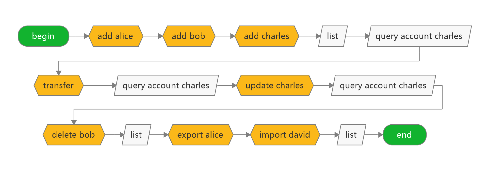

# qoscli keys 模块测试

## 测试准备

> 无

## 测试内容

#### 涉及到的写入命令 

| Command              | Alias | Has-Subcommand | Description               |
|:---------------------|:------|:---------------|:--------------------------|
| `qoscli keys add`    | -     | ✖              | 创建新密钥，或从种子导入              |
| `qoscli keys delete` | -     | ✖              | 删除给定的密钥                   |
| `qoscli keys update` | -     | ✖              | 更改用于保护私钥的密码               |
| `qoscli keys export` | -     | ✖              | 导出给定名称的密钥                 |
| `qoscli keys import` | -     | ✖              | 交互式命令，用于导入新的私钥、对其加密并保存到磁盘 |

#### 涉及到的查询命令 

| Command                | Alias              | Has-Subcommand | Description                 |
|:-----------------------|:-------------------|:---------------|:----------------------------|
| `qoscli keys list`     | -                  | ✖              | 列出所有密钥                      |
| `qoscli query account` | `qoscli q account` | ✖              | 按地址(address)或名称(name)查询帐户信息 |

#### 测试路径图



#### 测试路径

1. 查看开始时的本地密钥库状态 
2. 新增密钥`alice`(密码:`12345678`)到本地密钥库
3. 查看此时的本地密钥库状态
4. 新增密钥`bob`(密码:`12345678`)到本地密钥库
5. 查看此时的本地密钥库状态
6. 新增密钥`charles`(密码:`12345678`)到本地密钥库
7. 查看此时的本地密钥库状态
8. 查询转账之前账户`charles`的账户信息
9. 从账户`node`(密码:`12345678`)中向账户`charles`转入`100000QOS`,
   使本地账户`charles`上链
8. 查询转账之后账户`charles`的账户信息
9. 更新密钥`charles`的保护密码(原密码:`12345678`, 新密码:`00000000`)
10. 从账户`charles`(密码:`00000000`)中向账户`node`转回`50000QOS`，测试新的保护密码是否生效
11. 删除密钥`bob`
12. 查看此时的本地密钥库状态
13. 导出密钥`alice`
14. 将导出的密钥`alice`私钥重新导入为新密钥`david`
15. 查看此时的本地密钥库状态

## 测试过程

1. 查看开始时的本地密钥库状态 
```bash
$ ./qoscli keys list
NAME:	TYPE:	ADDRESS:						PUBKEY:
node	local	address1cmsnesa6s8r306u2avh0er7m0nqs3w5azmnypq	3/35IsiW8SdojySmhSCojJvCoL+Tw0VosfcANLcVJBg=
```

2. 新增密钥`alice`(密码:`12345678`)到本地密钥库
```bash
$ ./qoscli keys add alice
Enter a passphrase for your key:<输入密码>
Repeat the passphrase:<再次输入密码>
NAME:	TYPE:	ADDRESS:						PUBKEY:
alice	local	address1u43fghsym70qyhcyss72kyx7c2epzpzvcdumzf	VswqiqwF++dBoiORpFEbM0foKpL5nmvBHynnf7/DGEA=
**Important** write this seed phrase in a safe place.
It is the only way to recover your account if you ever forget your password.

more orchard orient delay cinnamon hospital narrow spirit scrap stand olive pair jump exercise chronic lady write left carry kite method diagram strike auction
```

3. 查看此时的本地密钥库状态
```bash
$ ./qoscli keys list
NAME:	TYPE:	ADDRESS:						PUBKEY:
alice	local	address1u43fghsym70qyhcyss72kyx7c2epzpzvcdumzf	VswqiqwF++dBoiORpFEbM0foKpL5nmvBHynnf7/DGEA=
node	local	address1cmsnesa6s8r306u2avh0er7m0nqs3w5azmnypq	3/35IsiW8SdojySmhSCojJvCoL+Tw0VosfcANLcVJBg=
```

4. 新增密钥`bob`(密码:`12345678`)到本地密钥库
```bash
$ ./qoscli keys add bob
Enter a passphrase for your key:<输入密码>
Repeat the passphrase:<再次输入密码>
NAME:	TYPE:	ADDRESS:						PUBKEY:
bob	local	address1mmxzqg4vl6hdr7pzjlxul4yt4ud2rs49v6nj7v	qNuUYL237MQVemeQa1CxUtmJXDw1WmCS3n3hiaiXIFg=
**Important** write this seed phrase in a safe place.
It is the only way to recover your account if you ever forget your password.

bean prosper earth rib early invite pause must clay start library deputy miss maid mom sentence helmet wisdom venture future hen rug toddler fiction
```

5. 查看此时的本地密钥库状态
```bash
$ ./qoscli keys list
NAME:	TYPE:	ADDRESS:						PUBKEY:
alice	local	address1u43fghsym70qyhcyss72kyx7c2epzpzvcdumzf	VswqiqwF++dBoiORpFEbM0foKpL5nmvBHynnf7/DGEA=
bob	local	address1mmxzqg4vl6hdr7pzjlxul4yt4ud2rs49v6nj7v	qNuUYL237MQVemeQa1CxUtmJXDw1WmCS3n3hiaiXIFg=
node	local	address1cmsnesa6s8r306u2avh0er7m0nqs3w5azmnypq	3/35IsiW8SdojySmhSCojJvCoL+Tw0VosfcANLcVJBg=
```

6. 新增密钥`charles`(密码:`12345678`)到本地密钥库
```bash
$ ./qoscli keys add charles
Enter a passphrase for your key:<输入密码>
Repeat the passphrase:<再次输入密码>
NAME:	TYPE:	ADDRESS:						PUBKEY:
charles	local	address1nucfykvrgd2ghslwz9p4ek6965qxghm9yz4uy5	qNDkrm241ozprKgAUOQoIAPCSQjxcVEjK4vnYCqRMt4=
**Important** write this seed phrase in a safe place.
It is the only way to recover your account if you ever forget your password.

devote remain gossip arrow famous inherit invest high next scare reflect radio street volume surprise scare invest maid vessel cattle choice lonely interest parade
```

7. 查看此时的本地密钥库状态
```bash
$ ./qoscli keys list
NAME:	TYPE:	ADDRESS:						PUBKEY:
alice	local	address1u43fghsym70qyhcyss72kyx7c2epzpzvcdumzf	VswqiqwF++dBoiORpFEbM0foKpL5nmvBHynnf7/DGEA=
bob	local	address1mmxzqg4vl6hdr7pzjlxul4yt4ud2rs49v6nj7v	qNuUYL237MQVemeQa1CxUtmJXDw1WmCS3n3hiaiXIFg=
charles	local	address1nucfykvrgd2ghslwz9p4ek6965qxghm9yz4uy5	qNDkrm241ozprKgAUOQoIAPCSQjxcVEjK4vnYCqRMt4=
node	local	address1cmsnesa6s8r306u2avh0er7m0nqs3w5azmnypq	3/35IsiW8SdojySmhSCojJvCoL+Tw0VosfcANLcVJBg=
```

8. 查询转账之前账户`charles`的账户信息
```bash
$ ./qoscli query account charles --indent
ERROR: account not exists
```

9. 从账户`node`(密码:`12345678`)中向账户`charles`转入`100000QOS`,
   使本地账户`charles`上链
```bash
$ ./qoscli tx transfer --senders node,100000QOS --receivers charles,100000QOS --indent
Password to sign with 'node':<输入密码>
{
  "check_tx": {
    "gasWanted": "100000",
    "gasUsed": "6808"
  },
  "deliver_tx": {
    "gasWanted": "100000",
    "gasUsed": "16460",
    "tags": [
      {
        "key": "c2VuZGVy",
        "value": "YWRkcmVzczFjbXNuZXNhNnM4cjMwNnUyYXZoMGVyN20wbnFzM3c1YXptbnlwcQ=="
      },
      {
        "key": "cmVjZWl2ZXI=",
        "value": "YWRkcmVzczFudWNmeWt2cmdkMmdoc2x3ejlwNGVrNjk2NXF4Z2htOXl6NHV5NQ=="
      }
    ]
  },
  "hash": "1E72B6D44E474100E2419284275CBE0570BB4BD3973AB51B35926C9A00C6E89E",
  "height": "50"
}
```

8. 查询转账之后账户`charles`的账户信息
```bash
$ ./qoscli query account charles --indent
{
  "type": "qos/types/QOSAccount",
  "value": {
    "base_account": {
      "account_address": "address1nucfykvrgd2ghslwz9p4ek6965qxghm9yz4uy5",
      "public_key": null,
      "nonce": "0"
    },
    "qos": "100000",
    "qscs": null
  }
}
```

9. 更新密钥`charles`的保护密码(原密码:`12345678`, 新密码:`00000000`)
```bash
$ ./qoscli keys update charles
Enter the current passphrase:<输入原密码>
Enter the new passphrase:<输入新密码>
Repeat the new passphrase:<再次输入新密码>
Password successfully updated!
```

10. 从账户`charles`(密码:`00000000`)中向账户`node`转回`50000QOS`，测试新的保护密码是否生效
```bash
$ ./qoscli tx transfer --senders charles,50000QOS --receivers node,50000QOS --indent
Password to sign with 'charles':<输入新密码>
{
  "check_tx": {
    "gasWanted": "100000",
    "gasUsed": "6526"
  },
  "deliver_tx": {
    "gasWanted": "100000",
    "gasUsed": "17610",
    "tags": [
      {
        "key": "c2VuZGVy",
        "value": "YWRkcmVzczFudWNmeWt2cmdkMmdoc2x3ejlwNGVrNjk2NXF4Z2htOXl6NHV5NQ=="
      },
      {
        "key": "cmVjZWl2ZXI=",
        "value": "YWRkcmVzczFjbXNuZXNhNnM4cjMwNnUyYXZoMGVyN20wbnFzM3c1YXptbnlwcQ=="
      }
    ]
  },
  "hash": "3CA83541EF9FE0EEFFF724585EF60E53ECCE8515DD689B910D372312AACFD066",
  "height": "82"
}
```

11. 删除密钥`bob`
```bash
$ ./qoscli keys delete bob
DANGER - enter password to permanently delete key:<输入密码>
Password deleted forever (uh oh!)
```

12. 查看此时的本地密钥库状态
```bash
$ ./qoscli keys list
NAME:	TYPE:	ADDRESS:						PUBKEY:
alice	local	address1u43fghsym70qyhcyss72kyx7c2epzpzvcdumzf	VswqiqwF++dBoiORpFEbM0foKpL5nmvBHynnf7/DGEA=
charles	local	address1nucfykvrgd2ghslwz9p4ek6965qxghm9yz4uy5	qNDkrm241ozprKgAUOQoIAPCSQjxcVEjK4vnYCqRMt4=
node	local	address1cmsnesa6s8r306u2avh0er7m0nqs3w5azmnypq	3/35IsiW8SdojySmhSCojJvCoL+Tw0VosfcANLcVJBg=
```

13. 导出密钥`alice`
```bash
$ ./qoscli keys export alice
Password to sign with 'alice':<输入密码>
**Important** Don't leak your private key information to others.
Please keep your private key safely, otherwise your account will be attacked.

{"Name":"alice","address":"address1u43fghsym70qyhcyss72kyx7c2epzpzvcdumzf","pubkey":{"type":"tendermint/PubKeyEd25519","value":"VswqiqwF++dBoiORpFEbM0foKpL5nmvBHynnf7/DGEA="},"privkey":{"type":"tendermint/PrivKeyEd25519","value":"ifTg5NuzMNWfQS8BfmS1ZsH+ruDspcKZ3cZMhdrzBHhWzCqKrAX750GiI5GkURszR+gqkvmea8EfKed/v8MYQA=="}}
```

14. 将导出的密钥`alice`私钥重新导入为新密钥`david`
```bash
$ ./qoscli keys import david
> Enter ed25519 private key: 
ifTg5NuzMNWfQS8BfmS1ZsH+ruDspcKZ3cZMhdrzBHhWzCqKrAX750GiI5GkURszR+gqkvmea8EfKed/v8MYQA==
> Enter a passphrase for your key:<输入密码>
> Repeat the passphrase:<再次输入密码>
```

15. 查看此时的本地密钥库状态
```bash
$ ./qoscli keys list
NAME:	TYPE:	ADDRESS:						PUBKEY:
alice	local	address1u43fghsym70qyhcyss72kyx7c2epzpzvcdumzf	VswqiqwF++dBoiORpFEbM0foKpL5nmvBHynnf7/DGEA=
charles	local	address1nucfykvrgd2ghslwz9p4ek6965qxghm9yz4uy5	qNDkrm241ozprKgAUOQoIAPCSQjxcVEjK4vnYCqRMt4=
david	import	address1u43fghsym70qyhcyss72kyx7c2epzpzvcdumzf	VswqiqwF++dBoiORpFEbM0foKpL5nmvBHynnf7/DGEA=
node	local	address1cmsnesa6s8r306u2avh0er7m0nqs3w5azmnypq	3/35IsiW8SdojySmhSCojJvCoL+Tw0VosfcANLcVJBg=
```
